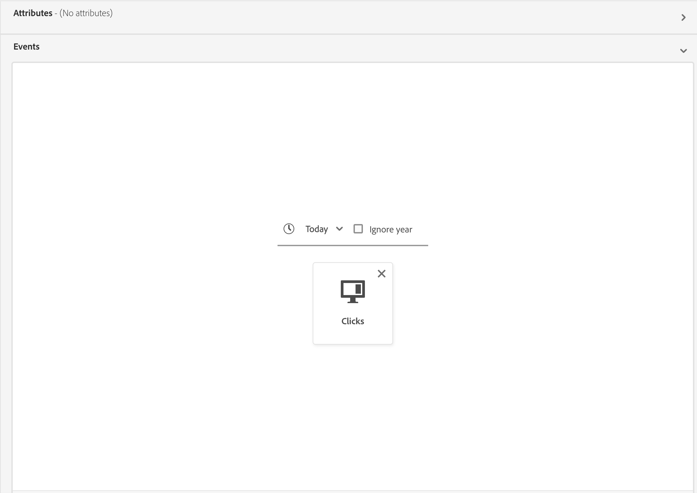
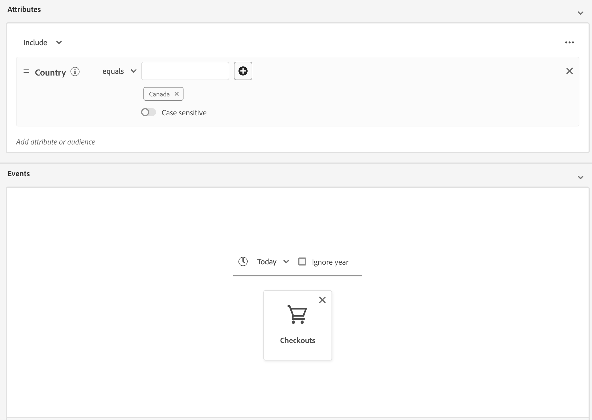
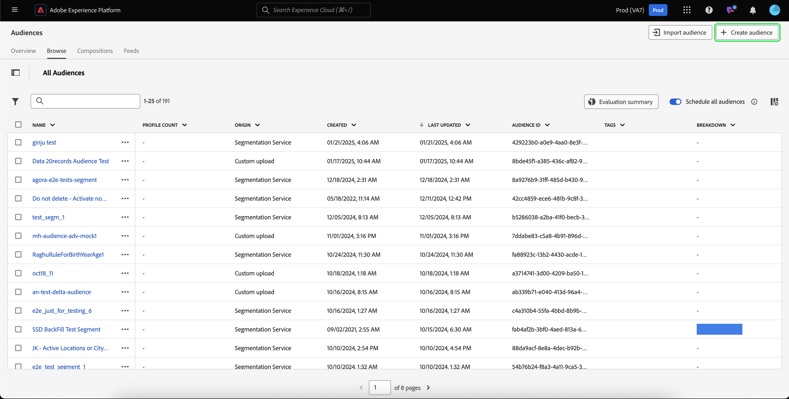
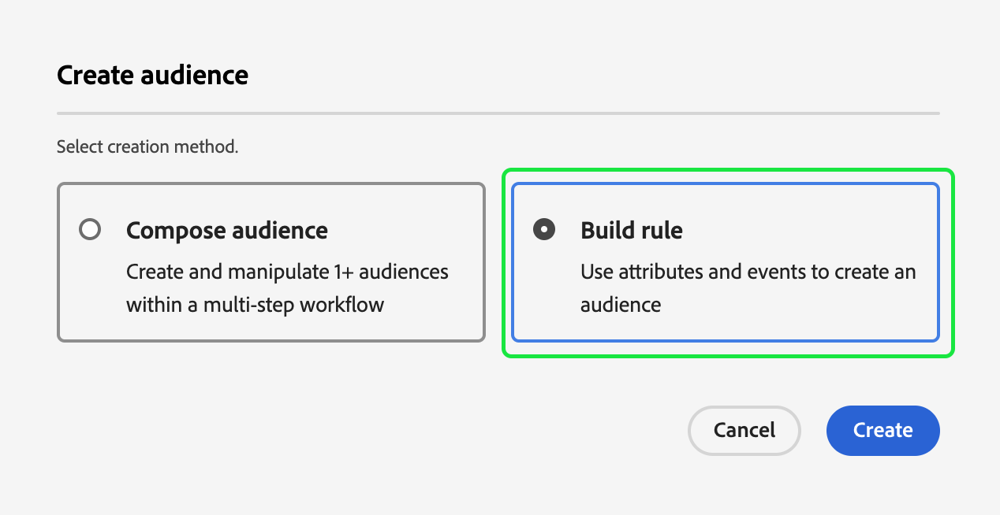
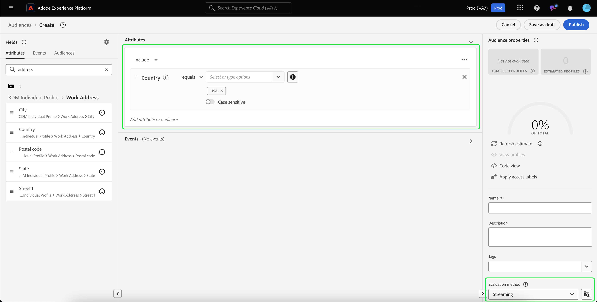
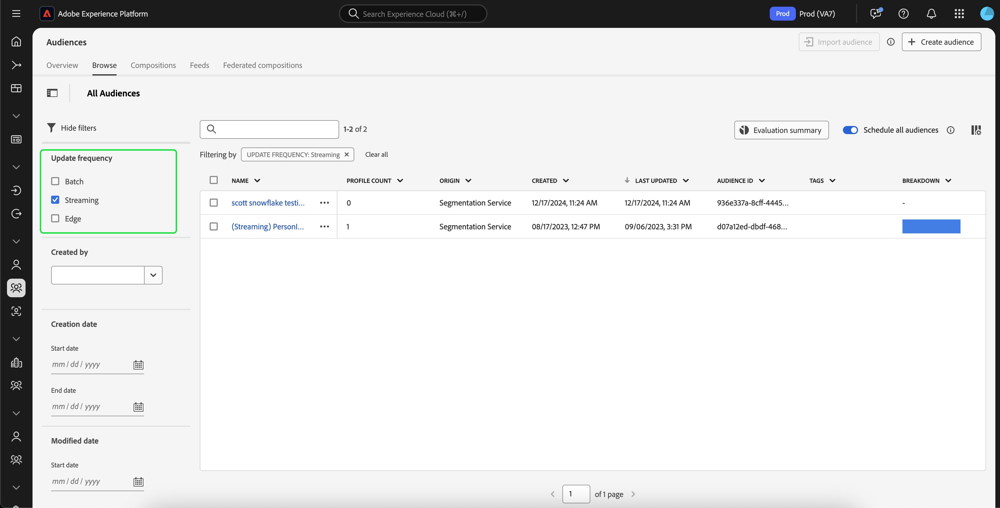

# Streaming segmentation guide

>[!BEGINSHADEBOX]

>[!NOTE]
>
>The streaming segmentation eligibility criteria have updated on May 20, 2025.

+++Eligibility updates

>[!IMPORTANT]
>
>All existing segment definitions that are currently evaluated using streaming or edge segmentation will continue to work as is, unless edited or updated.

## Ruleset {#ruleset}

Any **new or edited** segment definitions that match the following rulesets will **no longer** be evaluated using streaming or edge segmentation. Instead, they will be evaluated using batch segmentation.

- A single event with a time window longer than 24 hours
  - Activate an audience with all profiles that viewed a webpage in last 3 days.
- A single event with no time window
  - Activate an audience with all profiles that viewed a webpage.

## Time window {#time-window}

In order to evaluate an audience with streaming segmentation, it **must** be constrained within a 24 hour time window.

## Including batch data in streaming audiences {#include-batch-data}

>[!NOTE]
>
>To keep streaming segmentation accurate when using batch data, make sure that the batch data is **only** kept within the batch audience and is referenced within the streaming audience.

Prior to this update, you could create a streaming audience definition that combined both batch and streaming data sources. However, with the latest update, creating an audience with both batch and streaming data sources will be evaluated using batch segmentation.

If you need to evaluate a segment definition using streaming or edge segmentation that matches the updated ruleset, you need to explicitly create a batch and streaming ruleset and combine them using segment of segments. This batch ruleset **must** be based on a profile schema.

For example, let's say you have two audiences, with one audience housing profile schema data and the other housing experience event schema data:

| Audience | Schema | Source type | Query definition | Audience ID | 
| -------- | ------ | ----------- | ---------------- | ----------- |
| California Residents | Profile | Batch | Home address is in the state of California | `e3be6d7f-1727-401f-a41e-c296b45f607a` |
| Recent checkouts | Experience Event | Streaming | Has at least one checkout in the the last 24 hours | `9e1646bb-57ff-4309-ba59-17d6c5bab6a1` |

If you want to use the batch component in your streaming audience, you'll need to make a reference to the batch audience using segment of segments.

So, an example ruleset that would combine the two audiences together would look as follows:

```
inSegment("e3be6d7f-1727-401f-a41e-c296b45f607a") and 
CHAIN(xEvent, timestamp, [C0: WHAT(eventType.equals("commerce.checkouts", false)) 
WHEN(<= 24 hours before now)])
```

The resulting audience *will* be evaluated using streaming segmentation, since it leverages the batch audience's membership by referring to the batch audience component.

However, if you want to combine two audiences with event data, you **cannot** just combine the two events. You'll need to create both audiences, then create another audience that uses `inSegment` to refer to both of these audiences.

For example, let's say you have two audiences, with both audiences housing experience event schema data:

| Audience | Schema | Source type | Query definition | Audience ID | 
| -------- | ------ | ----------- | ---------------- | ----------- |
| Recent abandons | Experience event | Batch | Has at least one abandon event in the last 24 hours | `e3be6d7f-1727-401f-a41e-c296b45f607a` |
| Recent checkouts | Experience Event | Streaming | Has at least one checkout in the the last 24 hours | `9e1646bb-57ff-4309-ba59-17d6c5bab6a1` |

In this situation, you'd need to create a third audience as follows:

```
inSegment("e3be6d7f-1727-401f-a41e-c296b45f607a") and inSegment("9e1646bb-57ff-4309-ba59-17d6c5bab6a1")
```

>[!IMPORTANT]
>
>All existing segment definitions that match the rulesets will remain evaluated using streaming or edge segmentation until they are edited.
>
>Additionally, all existing segment definitions that currently meet the other streaming or edge segmentation evaluation criteria will remain evaluated with streaming or edge segmentation.

## Merge policy {#merge-policy}

Any **new or edited** segment definitions that qualify for streaming or edge segmentation **must** be on the "Active on Edge" merge policy.

If there is no active merge policy set, you'll need to [configure your merge policy](../../profile/merge-policies/ui-guide.md#configure) and set it to be active on edge.


+++

>[!ENDSHADEBOX]

Streaming segmentation is the ability to evaluate audiences in Adobe Experience Platform in near real-time while focusing on data richness.

With streaming segmentation, audience qualification now happens as streaming data lands into Experience Platform, alleviating the need to schedule and run segmentation jobs. This allows you to evaluate data as its passed into Experience Platform, letting audience membership be automatically kept up-to-date.

## Eligible rulesets {#rulesets}

>[!IMPORTANT]
>
>In order to use streaming segmentation, you **must** use a merge policy that is "Active on Edge". For more information on merge policies, please read the [merge policies overview](../../profile/merge-policies/overview.md).

A ruleset will be eligible for streaming segmentation if it meets any of the criteria outlined in the following table.

>[!NOTE]
>
>In order for streaming segmentation to work, you will need to enable scheduled segmentation for the organization. For details on enabling scheduled segmentation, please refer to [the Audience Portal overview](../ui/audience-portal.md#scheduled-segmentation).

| Query type | Details | Query | Example |
| ---------- | ------- | ----- | ------- |
| Single event within a time window of less than 24 hours | Any segment definition that refers to a single incoming event within a time window of less than 24 hours. | `CHAIN(xEvent, timestamp, [C0: WHAT(eventType.equals("commerce.checkouts", false)) WHEN(today)])` |  |
| Profile only | Any segment definition that refers to only a profile attribute. | `homeAddress.country.equals("Canada", false)` |  |
| Single event with a profile attribute within a relative time window of less than 24 hours | Any segment definition that refers to a single incoming event, with one or more profile attributes, and occurs within a relative time window of less than 24 hours. | `workAddress.country.equals("Canada", false) and CHAIN(xEvent, timestamp, [C0: WHAT(eventType.equals("commerce.checkouts", false)) WHEN(today)])` |  |
| Multiple events within a relative time window of 24 hours | Any segment definition that refers to multiple events **within the last 24 hours** and (optionally) has one or more profile attributes. | `workAddress.country.equals("US", false) and CHAIN(xEvent, timestamp, [C0: WHAT(eventType.equals("directMarketing.emailClicked", false)) WHEN(today), C1: WHAT(eventType.equals("commerce.checkouts", false)) WHEN(today)])` |  |

A segment definition will **not** be eligible for streaming segmentation in the following scenarios:

- The segment definition includes Adobe Audience Manager (AAM) segments or traits.
- The segment definition includes multiple entities (multi-entity queries).
- The segment definition includes a combination of a single event and an `inSegment` event.
  - For example, chaining the following in a single ruleset: `inSegment("e3be6d7f-1727-401f-a41e-c296b45f607a") and  CHAIN(xEvent, timestamp, [C0: WHAT(eventType.equals("commerce.checkouts", false))  WHEN(<= 24 hours before now)])`.
- The segment definition uses "Ignore year" as part of its time constraints.

Please note the following guidelines that apply to streaming segmentation queries:

| Query type | Guideline |
| ---------- | -------- |
| Single event ruleset | The lookback window is limited to **one day**. |
| Query with event history | <ul><li>The lookback window is limited to **one day**.</li><li>A strict time-ordering condition **must** exist between the events.</li><li>Queries with at least one negated event are supported. However, the entire event **cannot** be a negation.</li></ul>|

If a segment definition is modified so it no longer meets the criteria for streaming segmentation, the segment definition will automatically switch from "Streaming" to "Batch".

Additionally, segment unqualification, similarly to segment qualification, happens in real-time. As a result, if an audience no longer qualifies for a segment, it will be immediately unqualified. For example, if the segment definition asks for "All users who bought red shoes in the last three hours", after three hours, all the profiles that initially qualified for the segment definition will be unqualified.

### Combine audiences {#combine-audiences}

In order to combine data from both batch and streaming sources, you'll need to separate the batch and streaming components into separate audiences.

### Profile attribute and Experience Event {#profile-and-event}

For example, let's take the following two sample audiences into account:

| Audience | Schema | Source type | Query definition | Audience ID | 
| -------- | ------ | ----------- | ---------------- | ----------- |
| California Residents | Profile | Batch | Home address is in the state of California | `e3be6d7f-1727-401f-a41e-c296b45f607a` |
| Recent checkouts | Experience Event | Streaming | Has at least one checkout in the the last 24 hours | `9e1646bb-57ff-4309-ba59-17d6c5bab6a1` |

If you want to use the batch component in your streaming audience, you'll need to make a reference to the batch audience using segment of segments.

So, an example ruleset that would combine the two audiences together would look as follows:

```
inSegment("e3be6d7f-1727-401f-a41e-c296b45f607a") and 
CHAIN(xEvent, timestamp, [C0: WHAT(eventType.equals("commerce.checkouts", false)) 
WHEN(<= 24 hours before now)])
```

The resulting audience *will* be evaluated using streaming segmentation, since it leverages the batch audience's membership by referring to the batch audience component.

### Multiple Experience Events {#two-events}

If you want to combine multiple audiences with event data, you **cannot** just combine the events. You'll need to create an audience for each event, then create another audience that uses `inSegment` to refer to all of the audiences.

For example, let's say you have two audiences, with both audiences housing experience event schema data:

| Audience | Schema | Source type | Query definition | Audience ID | 
| -------- | ------ | ----------- | ---------------- | ----------- |
| Recent abandons | Experience event | Batch | Has at least one abandon event in the last 48 hours | `7deb246a-49b4-4687-95f9-6316df049948` |
| Recent checkouts | Experience Event | Streaming | Has at least one checkout in the the last 24 hours | `9e1646bb-57ff-4309-ba59-17d6c5bab6a1` |

In this situation, you'd need to create a third audience as follows:

```
inSegment("7deb246a-49b4-4687-95f9-6316df049948) and inSegment("9e1646bb-57ff-4309-ba59-17d6c5bab6a1")
```

## Create audience {#create-audience}

You can create an audience that is evaluated using streaming segmentation using either the Segmentation Service API or through Audience Portal in the UI.

A segment definition can be streaming-enabled if it matches one of the [eligible rulesets](#eligible-rulesets).

>[!BEGINTABS]

>[!TAB Segmentation Service API]

**API format**

```http
POST /segment/definitions
```

**Request**

+++ A sample request to create a segment definition that is enabled for streaming segmentation

```shell
curl -X POST https://platform.adobe.io/data/core/ups/segment/definitions
 -H 'Authorization: Bearer {ACCESS_TOKEN}' \
 -H 'Content-Type: application/json' \
 -H 'x-gw-ims-org-id: {ORG_ID}' \
 -H 'x-api-key: {API_KEY}' \
 -H 'x-sandbox-name: {SANDBOX_NAME}'
 -d '{
        "name": "People in the USA",
        "description: "An audience that looks for people who live in the USA",
        "expression": {
            "type": "PQL",
            "format": "pql/text",
            "value": "homeAddress.country = \"US\""
        },
        "evaluationInfo": {
            "batch": {
                "enabled": false
            },
            "continuous": {
                "enabled": true
            },
            "synchronous": {
                "enabled": false
            }
        },
        "schema": {
            "name": "_xdm.context.profile"
        }
     }'
```

+++

**Response**

A successful response returns HTTP status 200 with details of your newly created segment definition.

+++A sample response when creating a segment definition.

```json
{
    "id": "4afe34ae-8c98-4513-8a1d-67ccaa54bc05",
    "schema": {
        "name": "_xdm.context.profile"
    },
    "profileInstanceId": "ups",
    "imsOrgId": "{ORG_ID}",
    "sandbox": {
        "sandboxId": "28e74200-e3de-11e9-8f5d-7f27416c5f0d",
        "sandboxName": "prod",
        "type": "production",
        "default": true
    },
    "name": "People in the USA",
    "description": "An audience that looks for people who live in the USA",
    "expression": {
        "type": "PQL",
        "format": "pql/text",
        "value": "homeAddress.country = \"US\""
    },
    "evaluationInfo": {
        "batch": {
            "enabled": false
        },
        "continuous": {
            "enabled": true
        },
        "synchronous": {
            "enabled": false
        }
    },
    "dataGovernancePolicy": {
        "excludeOptOut": true
    },
    "creationTime": 0,
    "updateEpoch": 1579292094,
    "updateTime": 1579292094000
}
```

+++

More information about using this endpoint can be found in the [segment definition endpoint guide](../api/segment-definitions.md).

>[!TAB Audience Portal]

In Audience Portal, select **[!UICONTROL Create audience]**.



A popover appears. Select **[!UICONTROL Build rules]** to enter Segment Builder.



Within Segment Builder, create a segment definition that matches one of the [eligible rulesets](#eligible-rulesets). If the segment definition qualifies for streaming segmentation, you'll be able to select **[!UICONTROL Streaming]** as the **[!UICONTROL Evaluation method]**.



To learn more about creating segment definitions, please read the [Segment Builder guide](../ui/segment-builder.md)

>[!ENDTABS]

## Retrieve audiences {#retrieve-audiences}

You can retrieve all audiences that are evaluated using streaming segmentation using either the Segmentation Service API or through Audience Portal in the UI.

>[!BEGINTABS]

>[!TAB Segmentation Service API]

Retrieve a list of all segment definitions that are evaluated using streaming segmentation within your organization by making a GET request to the `/segment/definitions` endpoint.

**API format**

You must include the query parameter `evaluationInfo.synchronous.enabled=true` in the request path to retrieve segment definitions evaluated using streaming segmentation.

```http
GET /segment/definitions?evaluationInfo.continuous.enabled=true
```

**Request**

+++ A sample request to list all the streaming-enabled segment definitions

```shell
curl -X GET 'https://platform.adobe.io/data/core/ups/segment/definitions?evaluationInfo.continuous.enabled=true' \
  -H 'Authorization: Bearer {ACCESS_TOKEN}' \
  -H 'Content-Type: application/json' \
  -H 'x-api-key: {API_KEY}' \
  -H 'x-gw-ims-org-id: {ORG_ID}' \
  -H 'x-sandbox-name: {SANDBOX_NAME}'
```

+++

**Response**

A successful response returns HTTP status 200 with an array of segment definitions in your organization that are enabled for streaming segmentation. 

+++A sample response that contains a list of all the streaming-segmentation-enabled segment definitions in your organization

```json
{
    "segments": [
        {
            "id": "15063cb-2da8-4851-a2e2-bf59ddd2f004",
            "schema": {
                "name": "_xdm.context.profile"
            },
            "ttlInDays": 30,
            "imsOrgId": "{ORG_ID}",
            "sandbox": {
                "sandboxId": "",
                "sandboxName": "",
                "type": "production",
                "default": true
            },
            "name": " People who are NOT on their homepage ",
            "expression": {
                "type": "PQL",
                "format": "pql/text",
                "value": "select var1 from xEvent where var1._experience.analytics.endUser.firstWeb.webPageDetails.isHomePage = false"
            },
            "evaluationInfo": {
                "batch": {
                    "enabled": false
                },
                "continuous": {
                    "enabled": true
                },
                "synchronous": {
                    "enabled": false
                }
            },
            "creationTime": 1572029711000,
            "updateEpoch": 1572029712000,
            "updateTime": 1572029712000
        },
        {
            "id": "f15063cb-2da8-4851-a2e2-bf59ddd2f004",
            "schema": {
                "name": "_xdm.context.profile"
            },
            "ttlInDays": 30,
            "imsOrgId": "{ORG_ID}",
            "sandbox": {
                "sandboxId": "",
                "sandboxName": "",
                "type": "production",
                "default": true
            },
            "name": "Homepage_continuous",
            "description": "People who are on their homepage - continuous",
            "expression": {
                "type": "PQL",
                "format": "pql/text",
                "value": "select var1 from xEvent where var1._experience.analytics.endUser.firstWeb.webPageDetails.isHomePage = true"
            },
            "evaluationInfo": {
                "batch": {
                    "enabled": true
                },
                "continuous": {
                    "enabled": true
                },
                "synchronous": {
                    "enabled": false
                }
            },
            "creationTime": 1572021085000,
            "updateEpoch": 1572021086000,
            "updateTime": 1572021086000
        }
    ],
    "page": {
        "totalCount": 2,
        "totalPages": 1,
        "sortField": "creationTime",
        "sort": "desc",
        "pageSize": 2,
        "limit": 100
    },
    "link": {}
}
```

More detailed information about the segment definition returned can be found in the [segment definitions endpoint guide](../api/segment-definitions.md).

+++

>[!TAB Audience Portal]

You can retrieve all the audiences that are enabled for streaming segmentation within your organization by using filters in Audience Portal. Select the  icon to display the list of filters.


Within the available filters, go to **[!UICONTROL Update frequency]** and select "[!UICONTROL Streaming]". Using this filter displays all audiences in your organization that are evaluated using streaming segmentation.



To learn more about viewing audiences in Experience Platform, please read the [Audience Portal guide](../ui/audience-portal.md).

>[!ENDTABS]

## Audience details {#audience-details}

You can view details of a specific audience evaluated using streaming segmentation by selecting it within Audience Portal.

After selecting an audience on Audience Portal, the audience details page appears. This displays information about the audience, including a summary of the audience details, the amount of qualified profiles over time, as well as the destinations the audience has been activated to.


For streaming-enabled audiences, the **[!UICONTROL Profiles over time]** card is displayed, which shows the total qualified and the nwe audience updated metrics.

The **[!UICONTROL Total qualified]** metric represents the total number of qualified audiences, based on batch and streaming evaluations for this audience.

The **[!UICONTROL New audience updated]** metric is represented by a line graph that shows the change in audience size through streaming segmentation. You can adjust the dropdown to show the last 24 hours, last week, or last 30 days.


For more details on audience details, please read the [Audience Portal overview](../ui/audience-portal.md#audience-details).

## Next steps

This guide explains how streaming-enabled segment definitions work on Adobe Experience Platform and how to monitor streaming-enabled segment definitions. 

To learn more about using the Adobe Experience Platform user interface, please read the [Segmentation user guide](./overview.md).

For frequently asked questions about streaming segmentation, please read the [streaming segmentation section of the FAQ](../faq.md#streaming-segmentation).
