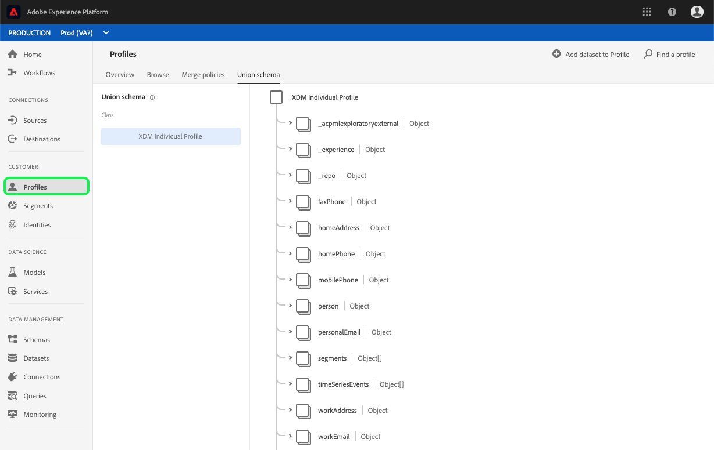
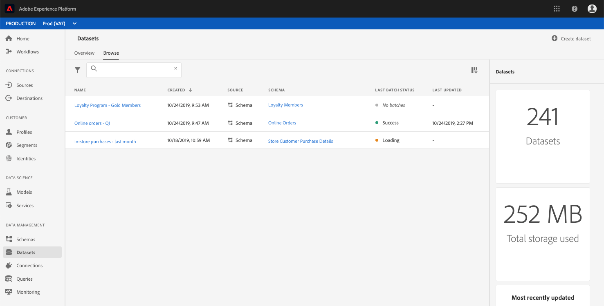
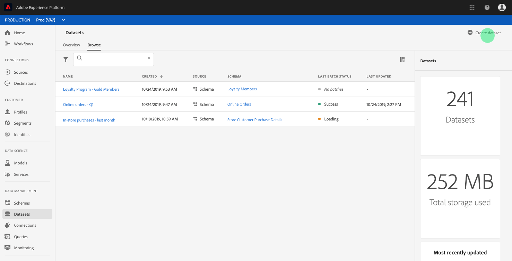
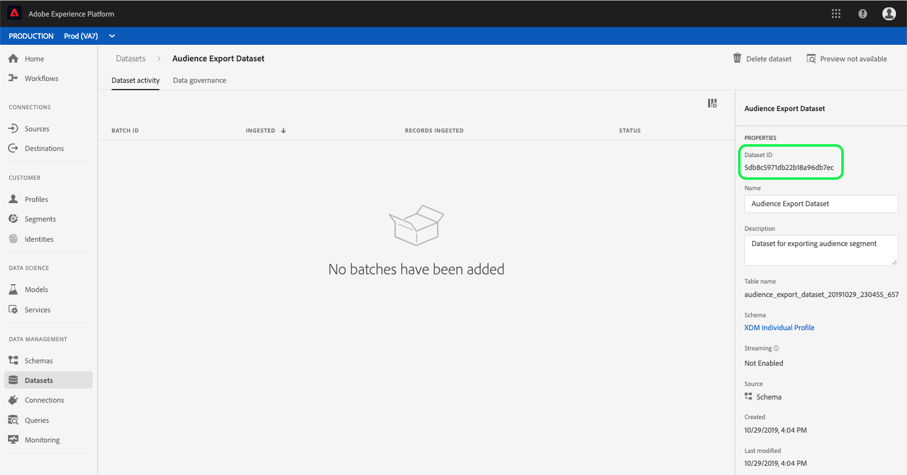

# Create a dataset for exporting an audience segment

[!DNL Adobe Experience Platform] allows you to easily segment customer profiles into audiences based on specific attributes. Once segments have been created, you can export that audience to a dataset where it can be accessed and acted upon. In order for the export to be successful, the dataset must be configured properly.

This tutorial walks through the steps required to create a dataset that can be used for exporting an audience segment using the [!DNL Experience Platform] UI.

This tutorial is directly related to the steps outlined in the tutorial for [evaluating and accessing segment results](./evaluate-a-segment.md). The evaluating a segment tutorial provides steps for creating a dataset using the [!DNL Catalog Service] API, whereas this tutorial outlines steps to create a dataset using the [!DNL Experience Platform] UI.

## Getting started

In order to export a segment, the dataset must be based on the [!DNL XDM Individual Profile Union Schema]. A union schema is a system-generated, read-only schema that aggregates the fields of all schemas that share the same class, in this case that is the [!DNL XDM Individual Profile] class. For more information on union view schemas, please see the [Real-time Customer Profile section of the Schema Registry developer guide](../../xdm/schema/composition.md#union).

To view union schemas in the UI, click **[!UICONTROL Profiles]** in the left-navigation, then click on the **[!UICONTROL Union schema]** tab as shown below.

## Datasets workspace

The datasets workspace within the [!DNL Experience Platform] UI allows you to view and manage all of the datasets that your IMS organization has made, as well as create new ones. 

To view the datasets workspace, click **[!UICONTROL Datasets]** in the left-hand navigation, then click on the **[!UICONTROL Browse]** tab. The datasets workspace contains a list of datasets, including columns showing name, created (date and time), source, schema, and last batch status, as well as the date and time the dataset was last updated. Depending on the width of each column, you may be required to scroll left or right to see all columns. 

>[!NOTE]
>
>Click on the filter icon next to the search bar to use filtering capabilities to view only those datasets enabled for [!DNL Real-time Customer Profile].

## Create a dataset

To create a dataset, click **[!UICONTROL Create Dataset]** in the top right corner of the **[!UICONTROL Datasets]** workspace. 

On the **[!UICONTROL Create Dataset]** screen, click **[!UICONTROL Create Dataset from Schema]** to continue.

## Select XDM Individual Profile Union Schema

To select the [!DNL XDM Individual Profile Union Schema] for use in your dataset, find the "[!UICONTROL XDM Individual Profile]" schema with a type of "[!UICONTROL Union]" on the **[!UICONTROL Select Schema]** screen.

Selected the radio button next to **[!UICONTROL XDM Individual Profile]**, then click **[!UICONTROL Next]** in the top-right corner.

## Configure dataset

On the **[!UICONTROL Configure Dataset]** screen, you will be required to give your dataset a name and may also provide a description of the dataset. 

**Notes on Dataset Names:**
- Dataset names should be short and descriptive so that the dataset can be easily found in the library later. 
- Dataset names must be unique, meaning it should also be specific enough that it will not be reused in the future. 
- It is best practice to provide additional information about the dataset using the description field, as it may help other users differentiate between datasets in the future.

Once the dataset has a name and description, click **[!UICONTROL Finish]**.

## Dataset activity

An empty dataset has now been created and you have been returned to the **[!UICONTROL Dataset Activity]** tab in the **[!UICONTROL Datasets]** workspace. You should see the name of the dataset in the top-left corner of the workspace, along with a notification that "No batches have been added." This is to be expected since you have not added any batches to this dataset yet. 

On the right-hand side of the Datasets workspace you will see the **[!UICONTROL Info]** tab containing information related to your new dataset such as dataset ID, name, description, table name, schema], streaming, and source. The **[!UICONTROL Info]** tab also includes information about when the dataset was created and its last modified date.

Please make note of the **[!UICONTROL Dataset ID]**, as this value is required to complete the audience segment export workflow.

## Next steps

Now that you have created a dataset based on the [!DNL XDM Individual Profile Union Schema], you can use the dataset ID to continue the [evaluating and accessing segment results](./evaluate-a-segment.md) tutorial.

At this time, please return to the evaluating segment results tutorial and pick up from the [generating profiles for audience members](./evaluate-a-segment.md#generate-profiles) step of the exporting a segment workflow. 
