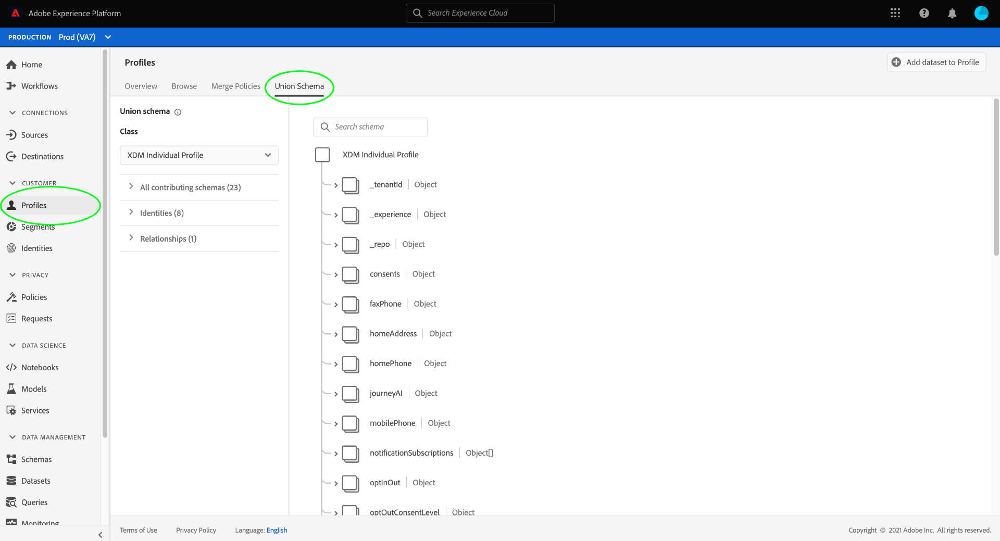
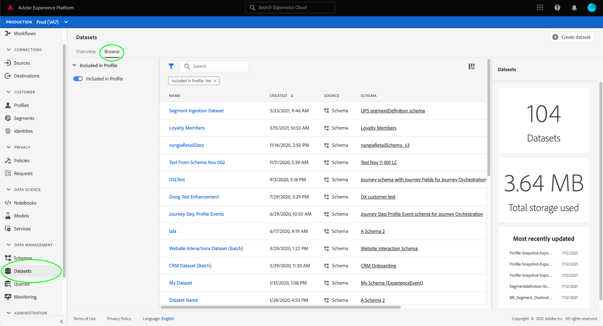
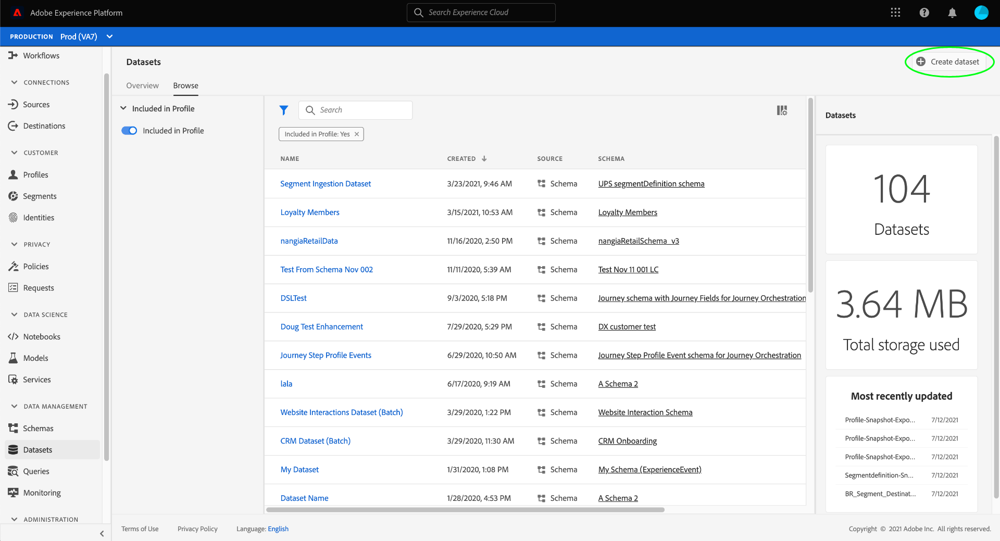
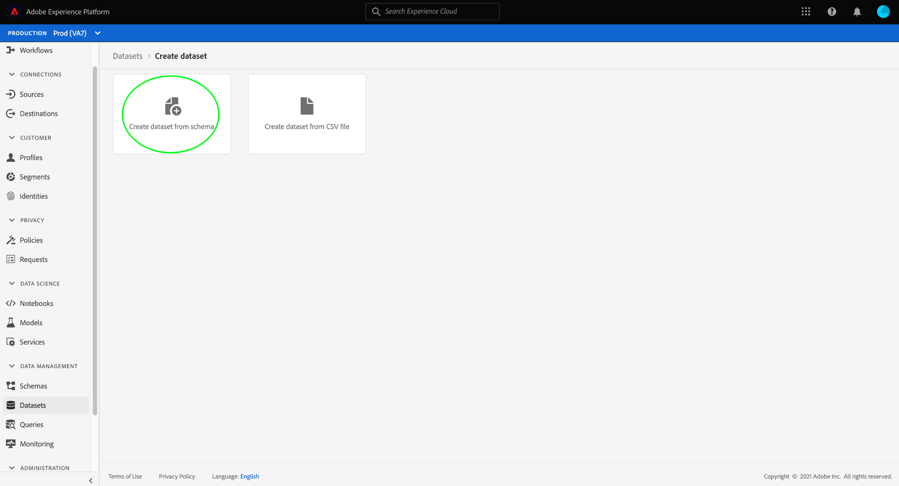
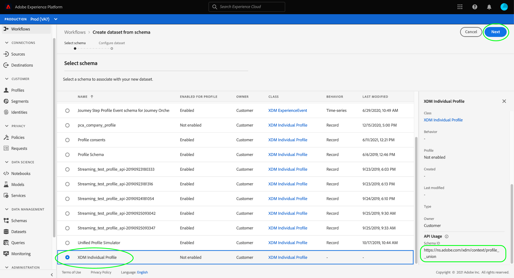
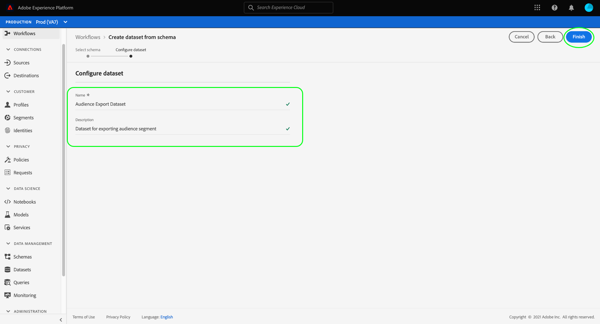
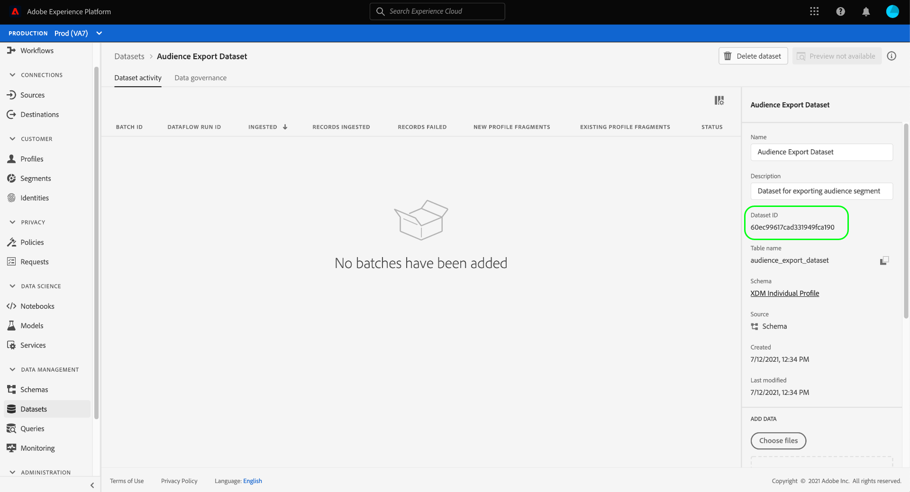

# Create a dataset for exporting an audience segment

[!DNL Adobe Experience Platform] allows you to segment customer profiles into audiences based on specific attributes. Once a segment is created, you can export that audience to a dataset where it can be accessed and acted upon. In order for the export to be successful, the dataset must be configured properly.

This tutorial walks through the steps required to create a dataset that can be used to export an audience segment using the [!DNL Experience Platform] UI.

This tutorial is directly related to the steps outlined in the tutorial on [evaluating and accessing segment results](./evaluate-a-segment.md). The segment evaluation tutorial provides steps for creating a dataset using the [!DNL Catalog Service] API, whereas this tutorial outlines steps to create a dataset using the [!DNL Experience Platform] UI.

## Getting started

In order to export a segment, the dataset must be based on the [!DNL XDM Individual Profile Union Schema]. A union schema is a system-generated, read-only schema that aggregates the fields of all schemas that share the same class. For more information on union schemas, refer to the guide on [the basics of schema composition](../../xdm/schema/composition.md#union).

To view union schemas in the UI, select **[!UICONTROL Profiles]** in the left-navigation, then select **[!UICONTROL Union Schema]** as shown below.

## Datasets workspace

The [!UICONTROL Datasets] workspace allows you to view and manage all datasets for your organization. 

Select **[!UICONTROL Datasets]** in the left navigation to access the workspace, then select **[!UICONTROL Browse]**. This tab displays a list of datasets and their details. Depending on the width of each column, you may be required to scroll left or right to see all columns. 

>[!NOTE]
>
>Select the filter icon next to the search bar to use filtering capabilities to view only those datasets enabled for [!DNL Real-Time Customer Profile].

## Create a dataset

To create a dataset, select **[!UICONTROL Create Dataset]**. 

On the next screen, select **[!UICONTROL Create Dataset from Schema]**.

## Select XDM Individual Profile Union Schema

To select the [!DNL XDM Individual Profile Union Schema] for use in your dataset, find the "[!UICONTROL XDM Individual Profile]" schema on the **[!UICONTROL Select Schema]** screen. Once you select the schema, you can confirm whether it's the union schema under **[!UICONTROL API Usage]** in the right rail. If the [!UICONTROL Schema] path ends with `_union`, it's a union schema.

>[!NOTE]
>
>Despite the fact that union schemas participate in Real-Time Customer Profile by definition, they are listed as "Not enabled" due to the fact that they are not enabled for Profile in same way as traditional schemas.

Select the radio button next to **[!UICONTROL XDM Individual Profile]**, then select **[!UICONTROL Next]**.

## Configure dataset

On the next screen, you must give your dataset a name. You can also add an optional description. 

**Notes on dataset names:**

* Dataset names should be short and descriptive so that the dataset can be easily found in the library later. 
* Dataset names must be unique, meaning they should also be specific enough that they will not be reused in the future. 
* It is best practice to provide additional information about the dataset using the description field, as it may help other users differentiate between datasets in the future.

Once the dataset has a name and description, select **[!UICONTROL Finish]**.

## Dataset activity

Once the dataset is created, you are brought the activity page for that dataset. You should see the name of the dataset in the top-left corner of the workspace, along with a notification that "No batches have been added." This is to be expected since you have not added any batches to this dataset yet. 

The right rail contains information related to your new dataset such as dataset ID, name, description, schema, and more. Please make note of the **[!UICONTROL Dataset ID]**, as this value is required to complete the audience segment export workflow.

## Next steps

Now that you have created a dataset based on the [!DNL XDM Individual Profile Union Schema], you can use the dataset ID to continue the [evaluating and accessing segment results](./evaluate-a-segment.md) tutorial.

At this time, please return to the evaluating segment results tutorial and pick up from the [generating profiles for audience members](./evaluate-a-segment.md#generate-profiles) step of the exporting a segment workflow.
