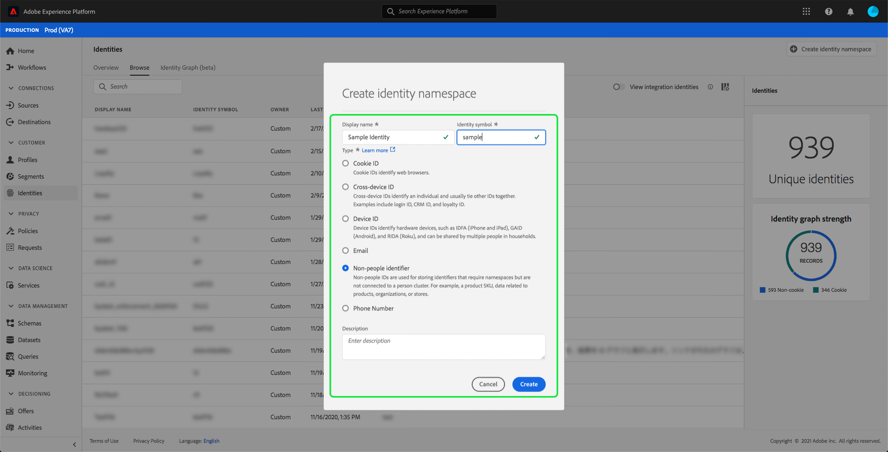
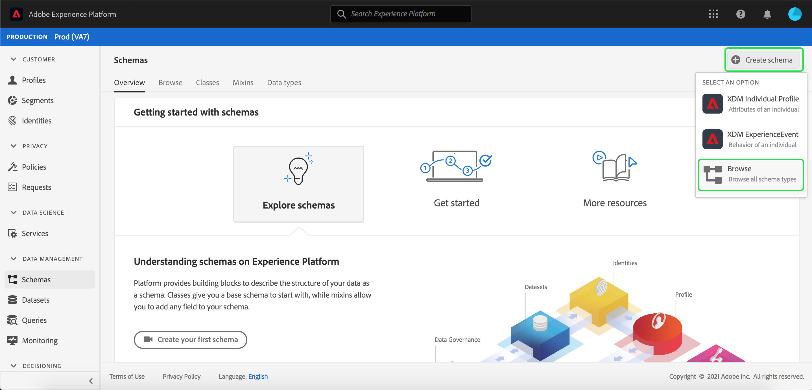
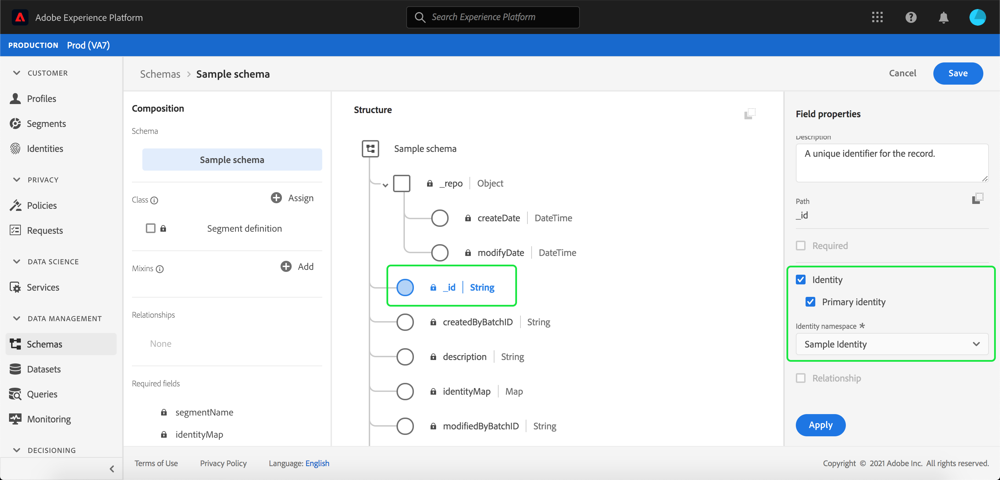
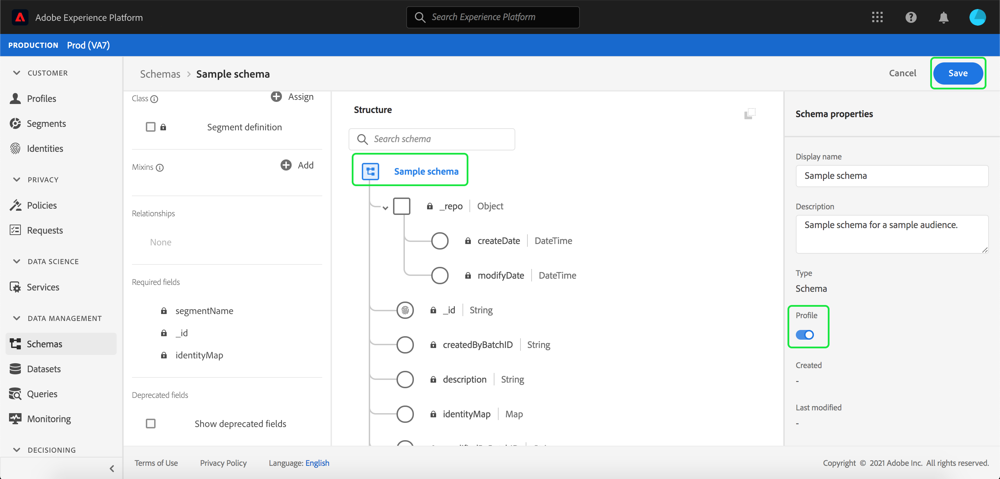
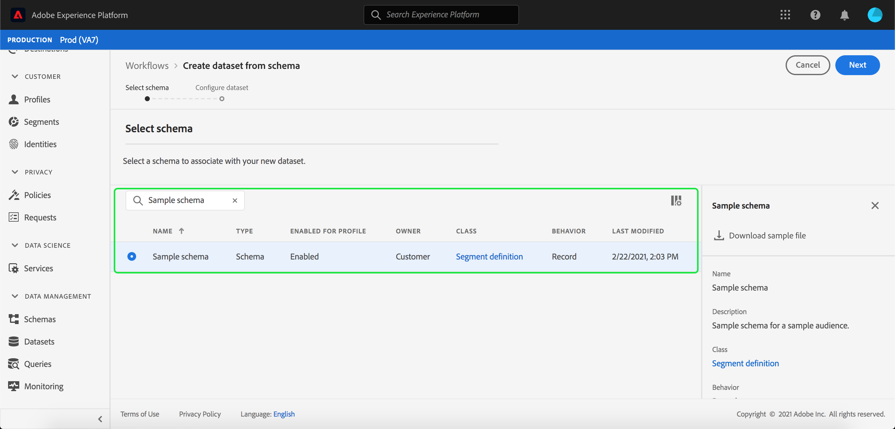
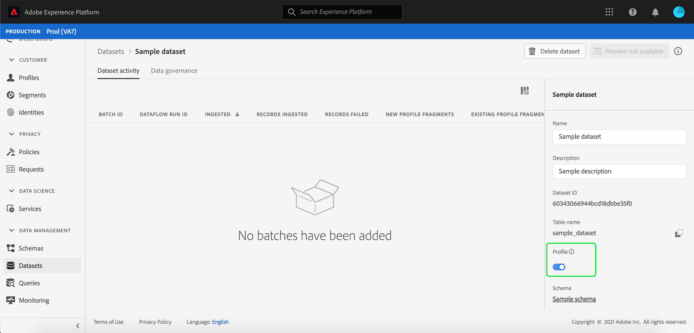
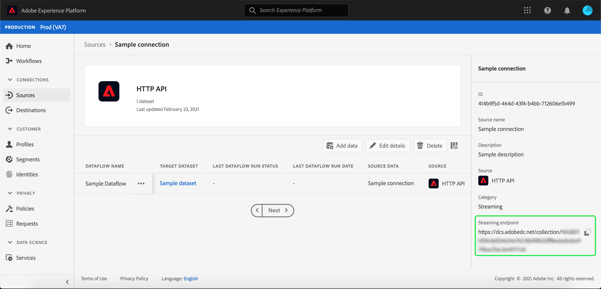
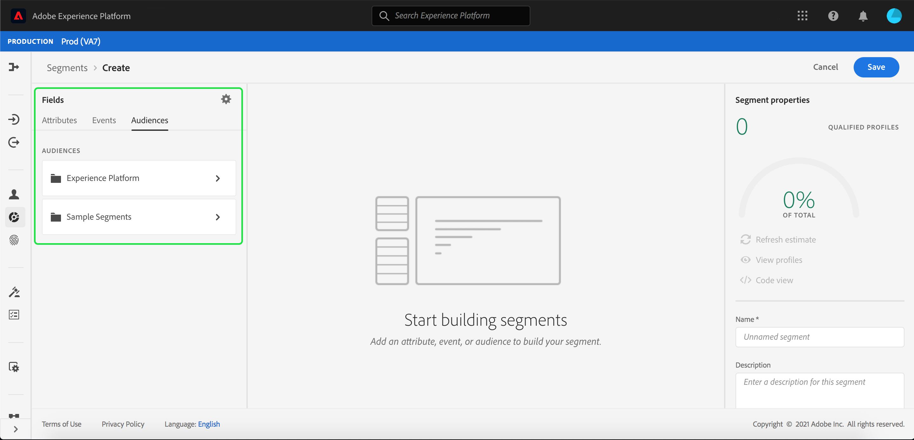
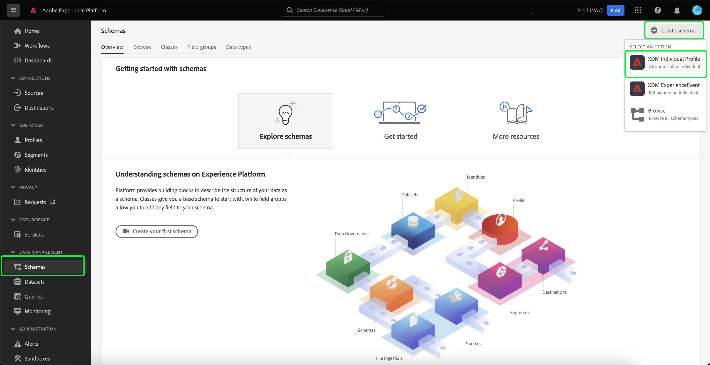
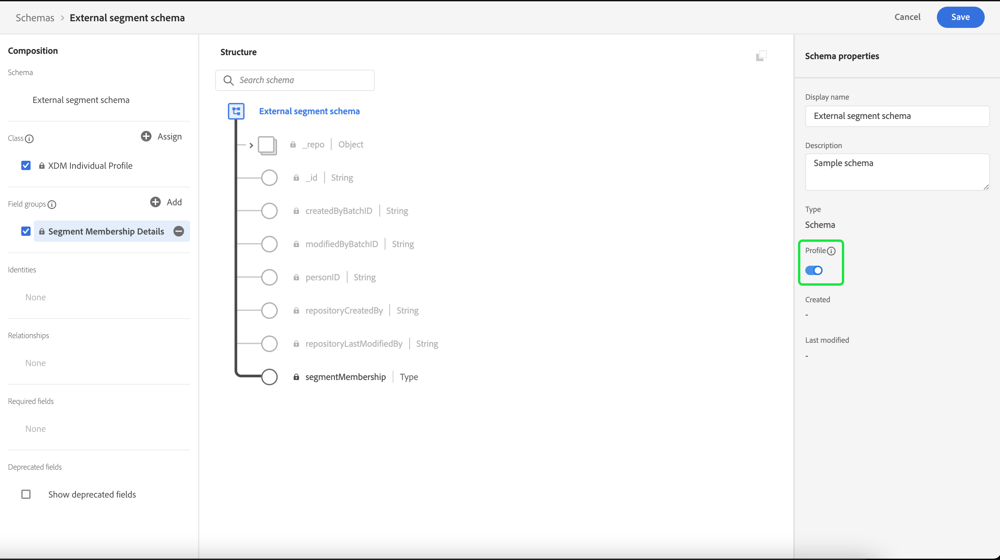

# Importing and using external audiences

Adobe Experience Platform supports the ability to import external audience, which can subsequently be used as components for a new segment definition. This document provides a tutorial for setting up Experience Platform to import and use external audiences.

## Getting started

This tutorial requires a working understanding of the various [!DNL Adobe Experience Platform] services involved in creating audience segments. Before beginning this tutorial, please review the documentation for the following services:

- [Segmentation Service](../home.md): Allows you to build audience segments from Real-Time Customer Profile data.
- [Real-Time Customer Profile](../../profile/home.md): Provides a unified, real-time consumer profile based on aggregated data from multiple sources.
- [Experience Data Model (XDM)](../../xdm/home.md): The standardized framework by which Platform organizes customer experience data. To best make use of Segmentation, please ensure your data is ingested as profiles and events according to the [best practices for data modeling](../../xdm/schema/best-practices.md).
- [Datasets](../../catalog/datasets/overview.md): The storage and management construct for data persistence in Experience Platform.
- [Streaming ingestion](../../ingestion/streaming-ingestion/overview.md): How Experience Platform ingests and stores data from client- and server-side devices in real time.

### Segment data vs segment metadata

Before you start importing and using external audiences, it is important to understand the difference between segment data and segment metadata.

Segment data refers to the profiles that meet the segment qualification criteria, and are therefore part of the audience.

Segment metadata is information about the segment itself, which includes the name, description, expression (if applicable), the creation date, the last modified date, and an ID. The ID links the segment metadata to the individual profiles that meet the segment qualification and are part of the resulting audience. 

| Segment data | Segment metadata |
| ------------ | ---------------- |
| Profiles that meet segment qualification | Information about the segment itself |

## Create an identity namespace for the external audience

The first step for using external audiences is creating an identity namespace. Identity namespaces allow Platform to associate where a segment originates from.

To create an identity namespace, follow the instructions in the [identity namespace guide](../../identity-service/namespaces.md#manage-namespaces). When creating your identity namespace, add the source details to the identity namespace, and mark its [!UICONTROL Type] as a **[!UICONTROL Non-people identifier]**.



## Create a schema for the segment metadata

After creating an identity namespace, you need to create a new schema for the segment you will create.

To begin composing a schema, first select **[!UICONTROL Schemas]** on the left navigation bar, followed by the **[!UICONTROL Create schema]** in the top right corner of the Schemas workspace. From here, select **[!UICONTROL Browse]** to see a full selection of the available Schema types.

 

Since you are creating a segment definition, which is a pre-defined class, select **[!UICONTROL Use existing class]**. Now, select the **[!UICONTROL Segment definition]** class, followed by **[!UICONTROL Assign class]**. 


Now that your schema has been created, you will need to specify which field will contain the segment ID. This field should be marked as the primary identity and assigned to the namespaces you previously created.



After marking the `_id` field as the primary identity, select the title of the schema, followed by the toggle labelled **[!UICONTROL Profile]**. Select **[!UICONTROL Enable]** to enable the schema for [!DNL Real-Time Customer Profile].



Now, this schema is enabled for Profile, with the primary identification assigned to the non-person identity namespace you created. As a result, this means that segment metadata imported into Platform using this schema will be ingested into Profile without being merged with other people-related Profile data.

## Create a dataset for the schema

After configuring the schema, you will need to create a dataset for the segment metadata. 

To create a dataset, follow the instructions in the [dataset user guide](../../catalog/datasets/user-guide.md#create). You should follow the **[!UICONTROL Create dataset from schema]** option, using the schema you previously created.



After creating the dataset, continue following the instructions in the [dataset user guide](../../catalog/datasets/user-guide.md#enable-profile) to enable this dataset for Real-Time Customer Profile.



## Set up and import audience data

With the dataset enabled, data can now be sent into Platform either through the UI or using the Experience Platform APIs. You can ingest this data either through a batch or streaming connection.

### Ingest data using a batch connection

To create a batch connection, you can follow the instructions in the generic [local file upload UI guide](../../sources/tutorials/ui/create/local-system/local-file-upload.md). For a full list of available sources that you can use ingest data with, please read the [sources overview](../../sources/home.md).

### Ingest data using a streaming connection

To create a streaming connection, you can follow the instructions in either the [API tutorial](../../sources/tutorials/api/create/streaming/http.md) or the [UI tutorial](../../sources/tutorials/ui/create/streaming/http.md).

Once you have created your streaming connection, you will have access to your unique streaming endpoint which you can send your data to. To learn how to send data to these endpoints, please read the [tutorial on streaming record data](../../ingestion/tutorials/streaming-record-data.md#ingest-data).



## Audience metadata structure

After creating a connection, you can now ingest your data to Platform.

A sample of the external audience payload's metadata can be seen below:

```json
{
    "header": {
        "schemaRef": {
            "id": "https://ns.adobe.com/{TENANT_ID}/schemas/{SCHEMA_ID}",
            "contentType": "application/vnd.adobe.xed-full+json;version=1"
        },
        "imsOrgId": "{ORG_ID}",
        "datasetId": "{DATASET_ID}",
        "source": {
            "name": "Sample External Audience"
        }
    },
    "body": {
        "xdmMeta": {
            "schemaRef": {
                "id": "https://ns.adobe.com/{TENANT_ID}/schemas/{SCHEMA_ID}",
                "contentType": "application/vnd.adobe.xed-full+json;version=1"
            }
        },
        "xdmEntity": {
            "_id": "{SEGMENT_ID}",
            "description": "Sample description",
            "identityMap": {
                "{IDENTITY_NAMESPACE}": [{
                    "id": "{}"
                }]
            },
            "segmentName" : "{SEGMENT_NAME}",
            "segmentStatus": "ACTIVE",
            "version": "1.0"
        }
    }
}
```

| Property | Description |
| -------- | ----------- |
| `schemaRef` | The schema **must** refer to the previously created schema for the segment metadata. |
| `datasetId` | The dataset ID **must** refer to the previously created dataset for the schema you just created. |
| `xdmEntity._id` | The ID **must** refer to the same segment ID you are using as your external audience. |
| `xdmEntity.identityMap` | This section **must** contain the identity label used when creating the previously created namespace. |
| `{IDENTITY_NAMESPACE}` | This is the label of the previously created identity namespace. So, for example, if you called your identity namespace "externalAudience", you would use that as the key of the array. |
| `segmentName` | The name of the segment that you want the external audience to be segmented by. |

## Building segments using imported audiences

Once the imported audiences have been set up, they can be used as part of the segmentation process. To find external audiences, go to the Segment Builder, and select **[!UICONTROL Audiences]** tab in the **[!UICONTROL Fields]** section.



## Next steps

Now that you can use external audiences in your segments, you can use the Segment Builder to create segments. To learn how to create segments, please read the [tutorial on creating segments](./create-a-segment.md).

## Appendix

In addition to using imported external audience metadata and using them for creating segments, you can also import external segment memberships to Platform.

### Set up an external segment membership destination schema

To begin composing a schema, first select **[!UICONTROL Schemas]** on the left navigation bar, followed by the **[!UICONTROL Create schema]** in the top right corner of the Schemas workspace. From here, select **[!UICONTROL XDM Individual Profile]**.



Now that the schema has been created, you will need to add the segment membership field group as part of the schema. To do this, select [!UICONTROL Segment Membership Details], followed by [!UICONTROL Add field groups].


Additionally, ensure the schema is marked for **[!UICONTROL Profile]**. In order to do this, you will need to mark a field as the primary identity.



### Set up the dataset

After creating your schema, you will need to create a dataset. 

To create a dataset, follow the instructions in the [dataset user guide](../../catalog/datasets/user-guide.md#create). You should follow the **[!UICONTROL Create dataset from schema]** option, using the schema you previously created.


After creating the dataset, continue following the instructions in the [dataset user guide](../../catalog/datasets/user-guide.md#enable-profile) to enable this dataset for Real-Time Customer Profile.


## Set up and import external audience membership data

With the dataset enabled, data can now be sent into Platform either through the UI or using the Experience Platform APIs. You can ingest this data either through a batch or streaming connection.

### Ingest data using a batch connection

To create a batch connection, you can follow the instructions in the generic [local file upload UI guide](../../sources/tutorials/ui/create/local-system/local-file-upload.md). For a full list of available sources that you can use ingest data with, please read the [sources overview](../../sources/home.md).

### Ingest data using a streaming connection

To create a streaming connection, you can follow the instructions in either the [API tutorial](../../sources/tutorials/api/create/streaming/http.md) or the [UI tutorial](../../sources/tutorials/ui/create/streaming/http.md).

Once you have created your streaming connection, you will have access to your unique streaming endpoint which you can send your data to. To learn how to send data to these endpoints, please read the [tutorial on streaming record data](../../ingestion/tutorials/streaming-record-data.md#ingest-data).


## Segment membership structure

After creating a connection, you can now ingest your data to Platform.

A sample of the external audience membership payload can be seen below:

```json
{
    "header": {
        "schemaRef": {
            "id": "https://ns.adobe.com/{TENANT_ID}/schemas/{SCHEMA_ID}",
            "contentType": "application/vnd.adobe.xed-full+json;version=1"
        },
        "imsOrgId": "{ORG_ID}",
        "datasetId": "{DATASET_ID}",
        "source": {
            "name": "Sample External Audience Membership"
        }
    },
    "body": {
        "xdmMeta": {
            "schemaRef": {
                "id": "https://ns.adobe.com/{TENANT_ID}/schemas/{SCHEMA_ID}",
                "contentType": "application/vnd.adobe.xed-full+json;version=1"
            }
        },
        "xdmEntity": {
            "_id": "{UNIQUE_ID}",
            "description": "Sample description",
            "{TENANT_NAME}": {
                "identities": {
                    "{SCHEMA_IDENTITY}": "sample-id"
                }
            },
            "personId" : "sample-name",
            "segmentMembership": {
                "{IDENTITY_NAMESPACE}": {
                    "{EXTERNAL_IDENTITY}": {
                        "status": "realized",
                        "lastQualificationTime": "2022-03-14T:00:00:00Z"
                    }
                }
            }
        }
    }
}
```

| Property | Description |
| -------- | ----------- |
| `schemaRef` | The schema **must** refer to the previously created schema for the segment membership data. |
| `datasetId` | The dataset ID **must** refer to the previously created dataset for the membership schema you just created. |
| `xdmEntity._id` | A suitable ID that is used to uniquely identify the record within the dataset. |
| `{TENANT_NAME}.identities` | This section is used to connect the custom identities' field group with the users you previously imported. |
| `segmentMembership.{IDENTITY_NAMESPACE}` | This is the label of the previously created custom identity namespace. So, for example, if you called your identity namespace "externalAudience", you would use that as the key of the array. |