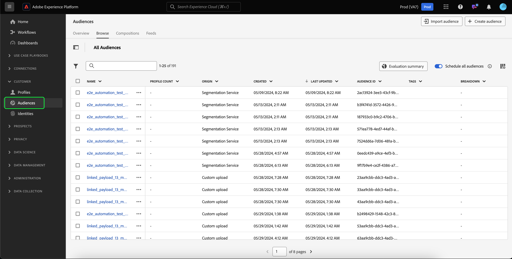
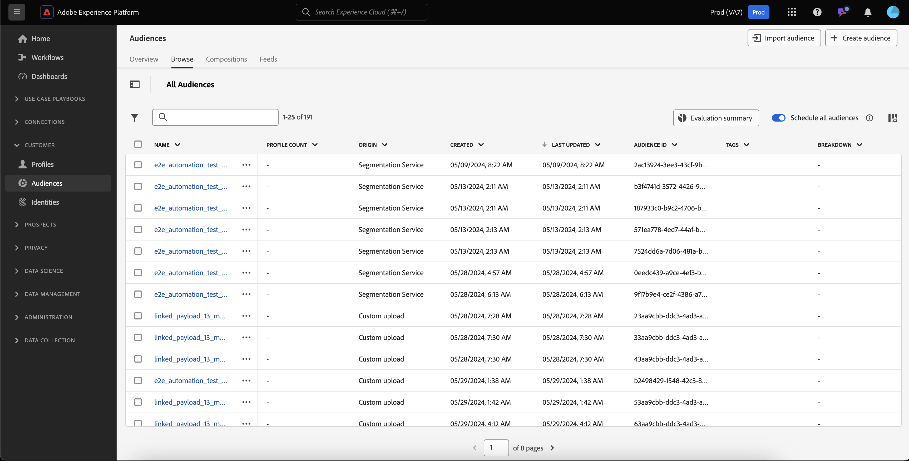
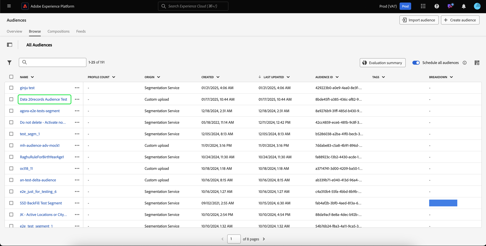
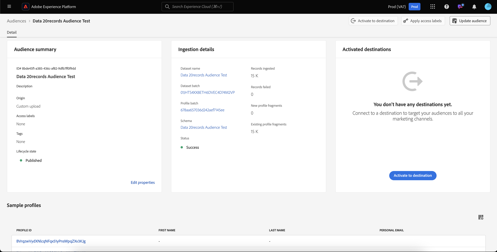
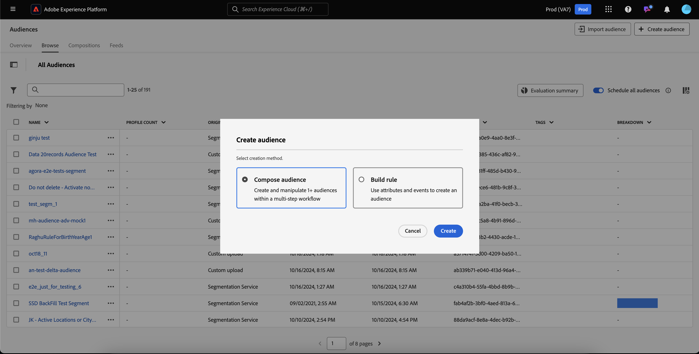
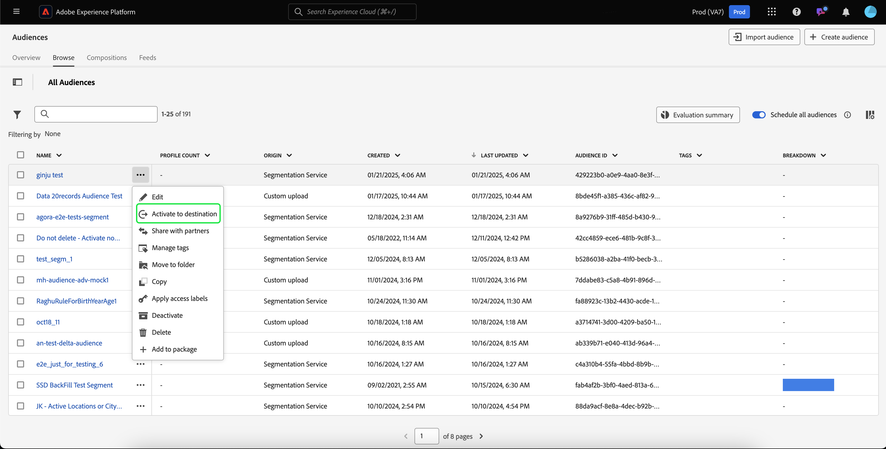

# People audiences guide

In Adobe Experience Platform, people-based audiences allow you to target specific groups of people for your marketing campaigns.

People audiences use customer profile data to target specific markets, letting you better target specific demographics that you want to advertise towards.

## Terminology {#terminology}

Before getting started with people audience, please review the differences between the different audience types:

- **Account audiences**: An account audience is an audience that is created using **account** profile data. Account profile data can be used to create audiences that target people within downstream accounts. For more information about account audiences, please read the [account audience overview](./account-audiences.md).
- **People audiences**: A people audience is an audience that is created using **customer** profile data. Customer profile data can be used to create audiences that targets your business' clientele. 
- **Prospect audiences**: A prospect audience is an audience that is created using **prospect** profile data. Prospect profile data can be used to create audiences from unauthenticated users. For more information about prospect audiences, please read the [prospect audience overview](./prospect-audiences.md).

## Access {#access}

To access people audiences, select **[!UICONTROL Audiences]** in the **[!UICONTROL Customers]** section.

The Audience Portal is displayed, showing a list of all people audiences for the organization.

This view lists information about the audience, including name, profile count, origin, lifecycle status, created date, and last updated date.

You can also use the search and filtering functionality to quickly search and sort for specific account audiences. More information about this feature can be found in the [Audience Portal overview](../ui/audience-portal.md#manage-audiences).

## Audience details {#details}

To view details about a specific people audience, select an audience on Audience Portal.

The audience details page is displayed. Information, including description, origin, and lifecycle state are displayed.

For more information about the audience details page, please read the [audience details section of the Audience Portal overview](../ui/audience-portal.md#audience-details).

## Create audience {#create}

You can create a people audience either using Audience Composer or Segment Builder. To get started with creating a people audience, select Create audience on the Audience Portal.

A popover appears, letting you choose between composing an audience or building rules.

For more detailed information about creating audiences, please read the [Audience Portal overview](../ui/audience-portal.md#create-audience).

## Activate audience {#activate}

After creating your people audience, you can activate this audience to other downstream services. 

Select the audience you want to activate, followed by **[!UICONTROL Activate to destination]**.

The [!UICONTROL Activate destination] page appears, with the list of available destinations depending on the update frequency of the audience. For more information on the activation process, please read the [activation overview](../../destinations/ui/activation-overview.md).

## Next steps

After reading this guide, you know how to create and manage your people audiences in Adobe Experience Platform. To learn about the different types of audiences, please read the [audience types overview](./overview.md).
