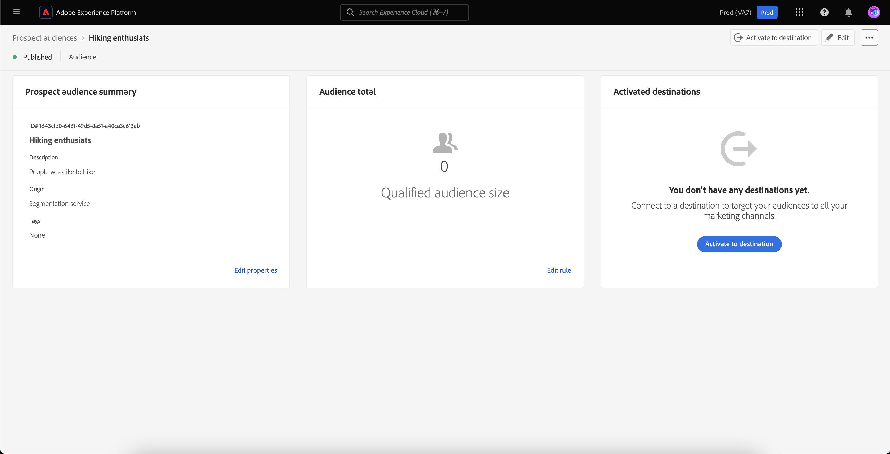

# Prospect audiences

Adobe Experience Platform allows you to bring the full ease and sophistication of the marketer-friendly segmentation experience to [prospect profiles](../../profile/ui/prospect-profile.md). You can drastically reduce the time spent assembling audiences by creating your own prospect audiences while responsibly using partner data.

## Browse {#browse}

To access prospect audiences, select **[!UICONTROL Audiences]** in the **[!UICONTROL Prospects]** section.

![The [!UICONTROL Audiences] button is highlighted within the [!UICONTROL Prospects] section.](../images/ui/prospect-audience/prospect-audiences.png)

The Browse page is displayed. A list of all the prospect audiences for the organization is displayed.

This view lists information about the audience including the name, profile count, origin, lifecycle status, created date, last updated date, and breakdown.

You can add additional fields to this display by selecting . These additional fields include update frequency and the last updated by.

More information about the browse page, including detailed information about the listed fields, can be found in the [browse section of the Segmentation UI guide](./overview.md#browse).

## Audience details {#details}

To view details about a specific prospect audience, select an audience on the [!UICONTROL Browse] page.

The prospect audience details page is displayed. Information, including the prospect audience summary, the audience total, and the activated destinations are displayed.

For more information about the audience details page, please read the [audience details section of the Segmentation UI guide](./overview.md).

## Create audience {#create}

To create a prospect audience, on the [!UICONTROL Browse] page, select **[!UICONTROL Create audience]**.

![The [!UICONTROL Create audience] button is highlighted on the prospect audience browse page.](../images/ui/prospect-audience/select-create-audience.png)

The Segment Builder appears. The prospect profile attributes appear on the left navigation bar. 

For more information on using the Segment Builder, please read the [Segment Builder UI guide](./segment-builder.md).

## Suggested use cases {#use-cases}

To learn how you can use the prospect audiences functionality in Experience Platform in combination with other Platform functionality, please read the following use case documentation:

- [Engage and acquire new customers through the prospecting functionality](../../rtcdp/partner-data/prospecting.md)

## Next steps

After reading this guide, you now know how to create and manage your prospect audiences in Adobe Experience Platform. To learn how to activate a prospect audience to other downstream services, please read the guide on [activating prospect audiences](../../destinations/ui/activate-prospect-audiences.md).
