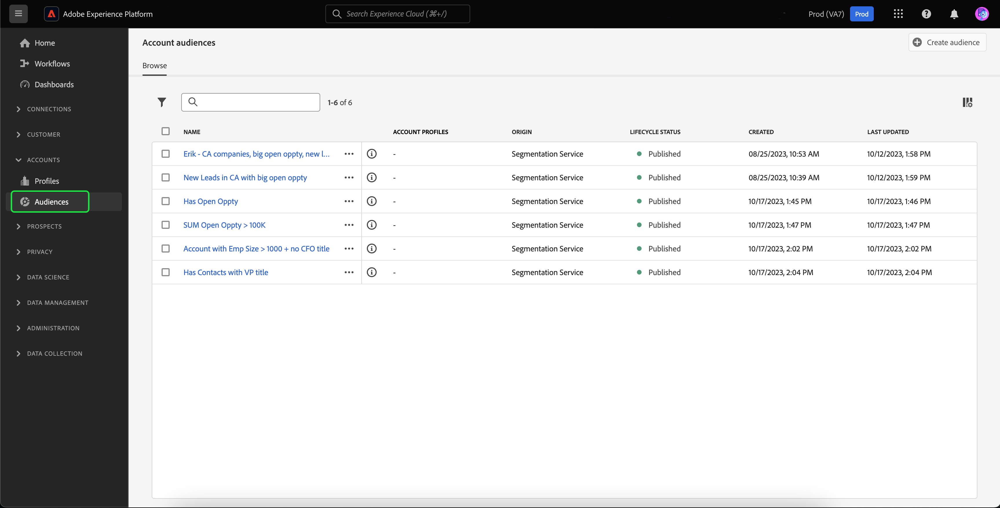
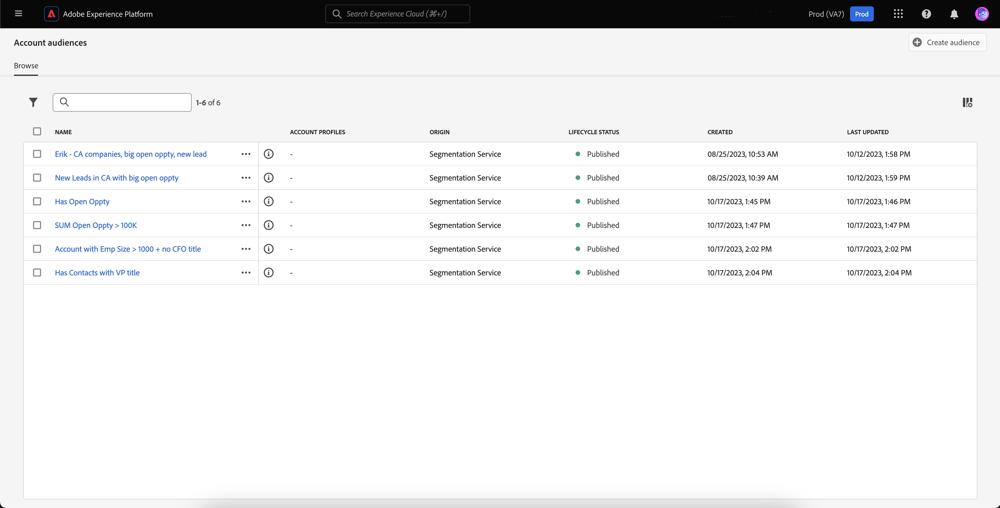
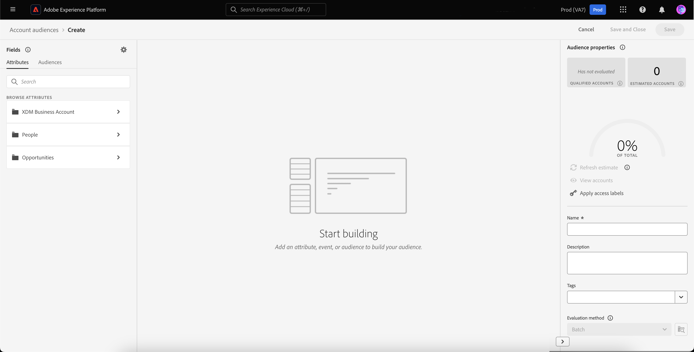
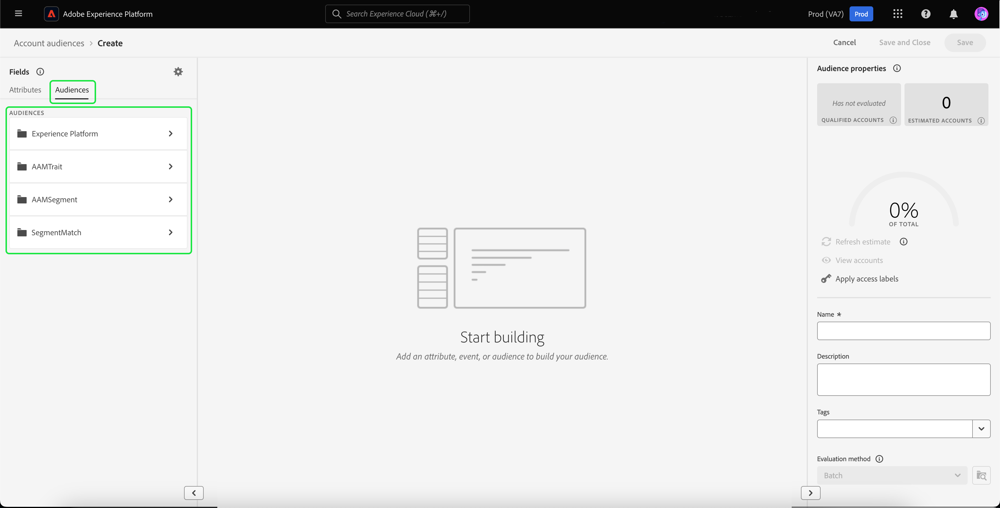

# Account audiences

>[!AVAILABILITY]
>
>Account audiences are only available in the [B2B Edition of Real-Time Customer Data Platform](../../rtcdp/overview.md#rtcdp-b2b) and the [B2P Edition of Real-Time Customer Data Platform](../../rtcdp/overview.md#rtcdp-b2p). 

With account segmentation, Adobe Experience Platform allows you to bring the full ease and sophistication of the marketing segmentation experience from people-based audiences to account-based audiences. 

Account audiences can be used as an input for account-based destinations, allowing you to target the people within those accounts in downstream services. For example, you can use account-based audiences to retrieve records of all the accounts that do **not** have contact information for any people with the title Chief Operating Officer (COO) or Chief Marketing Officer (CMO).

## Terminology {#terminology}

Before getting started with account audiences, please review the differences between the different audience types:

- **Account audiences**: An account audience is an audience that is created using **account** profile data. Account profile data can be used to create audiences that target people within downstream accounts. For more information about account profiles, please read the [account profile overview](../../rtcdp/accounts/account-profile-overview.md).
- **People audiences**: A people audience is an audience that is created using **customer** profile data. Customer profile data can be used to create audiences that targets your business' clientele. For more information on customer profiles, please read the [Real-Time Customer Profile overview](../../profile/home.md).
- **Prospect audiences**: A prospect audience is an audience that is created using **prospect** profile data. Prospect profile data can be used to create audiences from unauthenticated users. For more information about prospect profiles, please read the [prospect profile overview](../../profile/ui/prospect-profile.md).

## Access {#access}

To access account audiences, select **[!UICONTROL Audiences]** in the **[!UICONTROL Accounts]** section.

The [!UICONTROL Browse] page is displayed, showing a list of all the account audiences for the organization.

This view lists information about the audience, including name, profile count, origin, lifecycle status, created date, and last updated date.

You can also use the search and filtering functionality to quickly search and sort for specific account audiences. More information about this feature can be found in the [segmentation UI guide](./overview.md#manage-audiences).

## Create audience {#create}

>[!NOTE]
>
>Account audiences are evaluated using **batch** segmentation, and will be evaluated every 24 hours.

To create an account audience, select **[!UICONTROL Create audience]** on the [!UICONTROL Browse] page.

![The [!UICONTROL Create audience] button is highlighted on the account audience browse page.](../images/ui/account-audiences/select-create-audience.png)

The Segment Builder appears. The account attributes and audiences are displayed on the left navigation bar. Under the [!UICONTROL Attributes] tab, you can add both Platform-created and custom attributes.

When creating account audiences, please note that events are listed under **[!UICONTROL People]**, rather than being their own tab, since these attributes are associated with people.

![The location to find events, which is within the [!UICONTROL People] folder, is highlighted.](../images/ui/account-audiences/attributes.png)

Under the [!UICONTROL Audiences] tab, you can add previously created people-based audiences to build off of when creating your own account audience.

For more information on using the Segment Builder, please read the [Segment Builder UI guide](./segment-builder.md).

## Activate audience {#activate}

>[!NOTE]
>
>Only a limited number of destinations support account audiences. Please ensure that the destination you want to activate to supports account audiences before continuing this process.

After creating your account audience, you can activate the audience to other downstream services.

Select the audience you want to activate, followed by **[!UICONTROL Activate to destination]**.

![The [!UICONTROL Activate to destination] button is highlighted in the quick actions menu for the selected audience.](../images/ui/account-audiences/activate.png)

The [!UICONTROL Activate destination] page appears. For more information on the activation process, including supported destinations and details on field mappings, please read the [activate account audiences](/help/destinations/ui/activate-account-audiences.md) tutorial.

## Next steps {#next-steps}

After reading this guide, you now have a better understanding of how to create and use your account audiences in Adobe Experience Platform. To learn how to use other types of audiences in Platform, please read the [Segmentation Service UI guide](./overview.md).

## Appendix {#appendix}

The following section provides additional information about account audiences.

### Account segmentation validation {#validation}

>[!CONTEXTUALHELP]
>id="platform_audiences_account_constraint_eventLookbackWindow"
>title="Maximum lookback window error"
>abstract="The maximum lookback window for Experience Events is 30 days."

>[!CONTEXTUALHELP]
>id="platform_audiences_account_constraint_combinationMaxDepth"
>title="Maximum nested container depth error"
>abstract="The maximum depth of nested containers is **5**. This means that you **cannot** have more than five nested containers when creating your audience."

>[!CONTEXTUALHELP]
>id="platform_audiences_account_constraint_combinationMaxBreadth"
>title="Maximum rules amount error"
>abstract="The maximum number of rules within a single container is **5**. This means you that you **cannot** have more than five rules within a single container when creating your audience."

>[!CONTEXTUALHELP]
>id="platform_audiences_account_constraint_crossEntityMaxDepth"
>title="Maximum cross entity amount error"
>abstract="The maximum number of cross entities that can be used within a single audience is **5**. A cross entity is when you change between different entities within your audience. For example, going from an Account to a Person to a Marketing List."

>[!CONTEXTUALHELP]
>id="platform_audiences_account_constraint_allowCustomEntity"
>title="Custom entity error"
>abstract="Custom entities are **not** allowed."

>[!CONTEXTUALHELP]
>id="platform_audiences_account_constraint_b2bBuiltInEntities"
>title="Invalid B2B entity error"
>abstract="Only the following B2B entities are allowed to be used: `_xdm.context.account`, `_xdm.content.opportunity`, `_xdm.context.profile`, `_xdm.context.experienceevent`, `_xdm.context.account-person`, `_xdm.classes.opportunity-person`, `_xdm.classes.marketing-list-member`, `_xdm.classes.marketing-list`, `_xdm.context.campaign-member`, and `_xdm.classes.campaign`."

>[!CONTEXTUALHELP]
>id="platform_audiences_account_constraint_rhsMaxOptions"
>title="Maximum values error"
>abstract="The maximum number of values that can be checked for a single field is **50**."

>[!CONTEXTUALHELP]
>id="platform_audiences_account_constraint_allowInSegmentByReference"
>title="inSegment event error"
>abstract="inSegment events are **not** allowed."

>[!CONTEXTUALHELP]
>id="platform_audiences_account_constraint_allowInSegmentByValue"
>title="inSegment event error"
>abstract="inSegment events are **not** allowed."

>[!CONTEXTUALHELP]
>id="platform_audiences_account_constraint_allowSequentialEvents"
>title="Sequential events error"
>abstract="Sequential events are **not** allowed."

>[!CONTEXTUALHELP]
>id="platform_audiences_account_constraint_allowMaps"
>title="Map-type property error"
>abstract="Map-type properties are **not** allowed."

>[!CONTEXTUALHELP]
>id="platform_audiences_account_constraint_maxNestedAggregationDepth"
>title="Maximum nested entity depth error"
>abstract="The maximum depth of nested arrays is **5**."

>[!CONTEXTUALHELP]
>id="platform_audiences_account_constraint_maxObjectNestingLevel"
>title="Maximum nested object amount error"
>abstract="The maximum number of nested objects allowed is **10**."

>[!CONTEXTUALHELP]
>id="platform_audiences_account_constraint_generic"
>title="Constraint violation"
>abstract="The audience violates a constraint. Please read the linked document for more details."

When using account audiences, the audience **must** comply with the following constraints:

>[!NOTE]
>
>The following list shows the **default** constraints for account audiences. These values **may** change, depending on the settings implemented by your organization's administrator.

- The maximum lookback window for Experience Events is **30 days**.
- The maximum depth of nested containers is **5**.
  - This means that you **cannot** have more than five nested containers when creating your audience.
- The maximum number of rules within a single container is **5**.
  - This means that your audience **cannot** have more than five rules that compose your audience.
- The maximum number of cross entities that can be used is **5**.
  - A cross entity is when you change between different entities within your audience. For example, going from an Account to a Person to a Marketing List.
- Custom entities **cannot** be used.
- The maximum number of values that can be checked for a single field is **50**.
  - For example, if you have a field of "City Name", you can check that value against 50 city names.
- Account audiences **cannot** use `inSegment` events.
- Account audiences **cannot** use sequential events.
- Account audiences **cannot** use maps.
- The maximum depth of nested arrays is **5**.
- The maximum number of nested objects is **10**.
