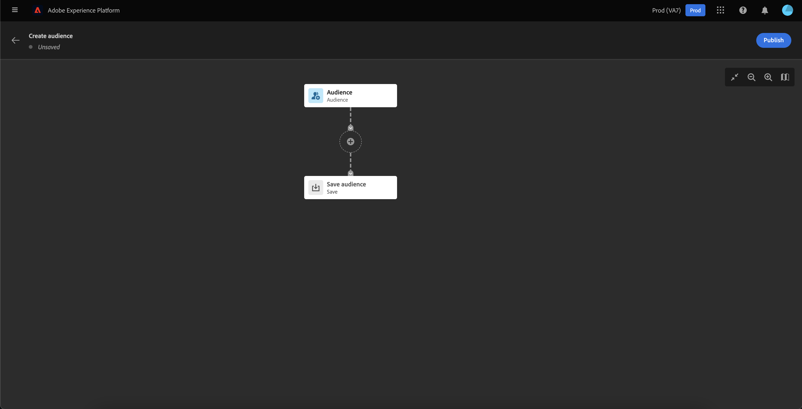
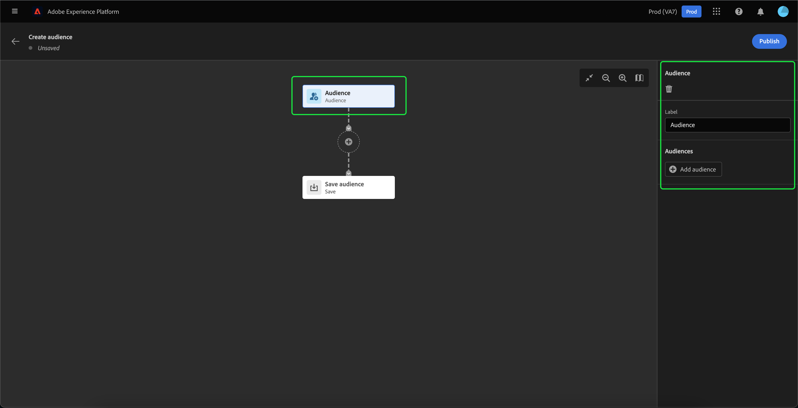
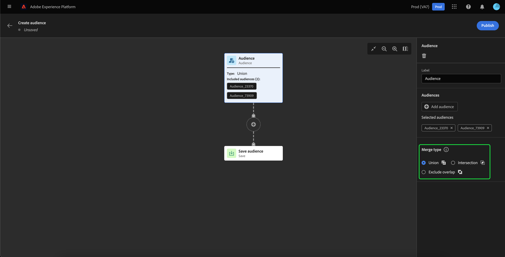
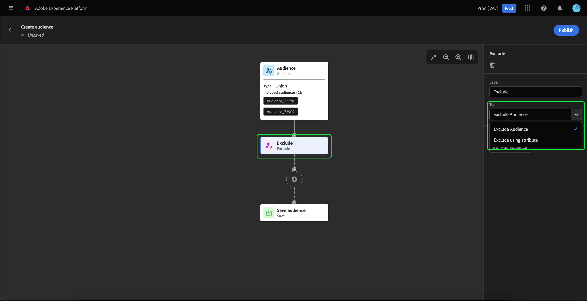
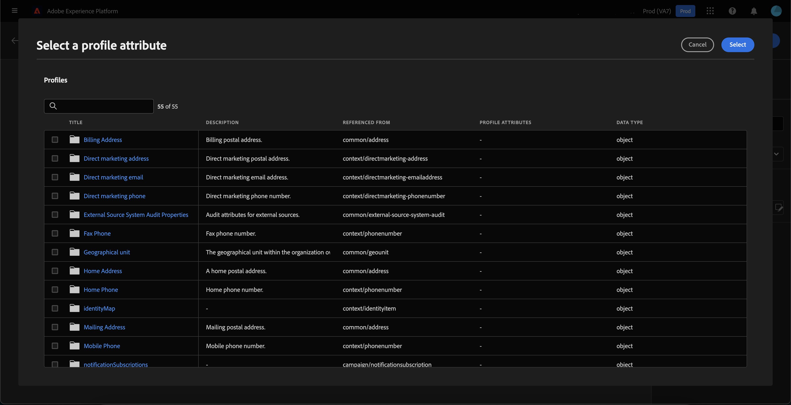
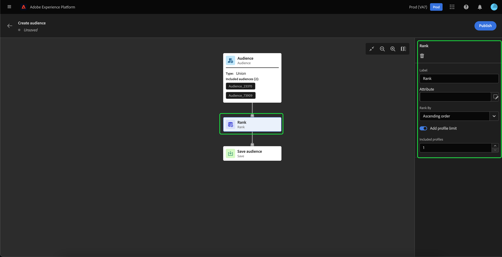
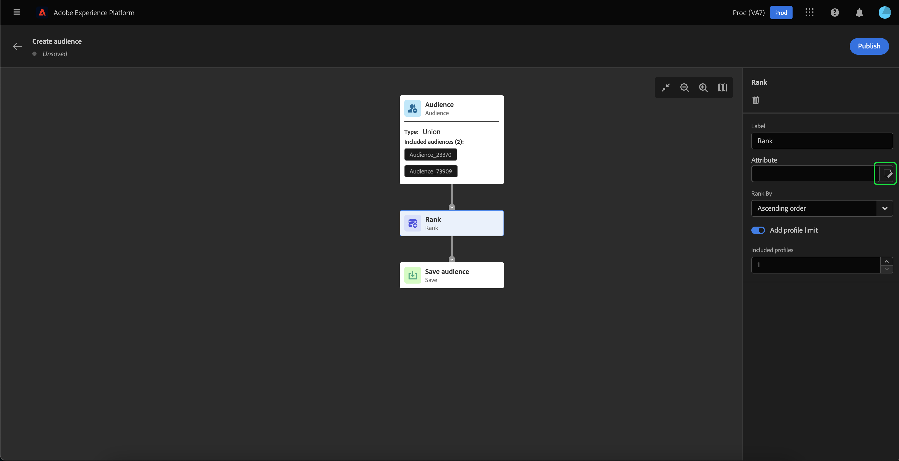
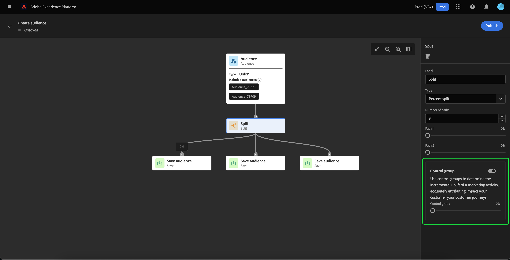
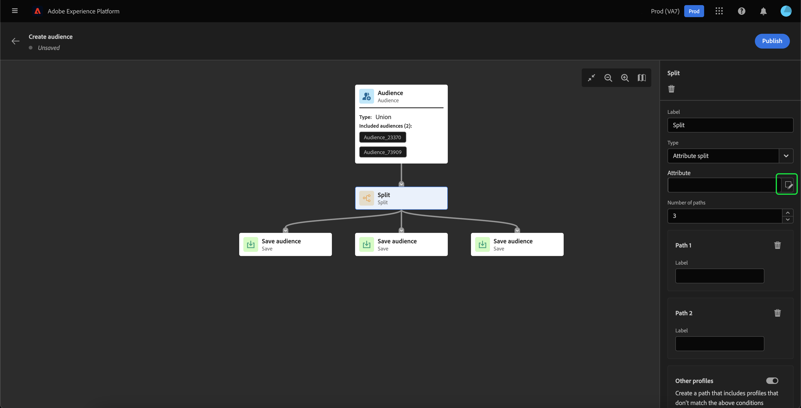

# Audience Builder UI guide

The Audience Builder provides a workspace to build and edit audiences, using blocks that are used to represent different actions.

The audience composition canvas is comprised of five different types of blocks: Audience, Exclude, Join, Rank, and Split.

## Audience {#audience-block}

The **Audience** block allows you to add the sub-audiences you want to compose your new larger audience. By default, an **Audience** block is included at the top of the composition canvas.

When you select the **Audience** block, the right rail displays details, including the label for the audience block and the option to add audiences to the block.

After selecting **[!UICONTROL Add Audience]**, a list of audiences appears. Select the audiences you want to add to your audience block, followed by **[!UICONTROL Add]** to add them to your audience block.

Your selected audiences now appear within the right rail, when the **Audience** block is selected. From here, you can change the merge type of the combined audiences.

| Merge type | Description |
| ---------- | ----------- |
| Union | The audiences are combined into one audience. This would be the equivalent of an OR operation. |
| Intersection | The audiences are combined, with only the audiences that are in **every** selected audience being added. This would be the equivalent of an AND operation. |
| Exclude overlap | The audiences are combined, with only the audience that are in **one** of the selected audience being added. This would be the equivalent of a XOR operation. |

## Exclude {#exclude-block}

The **Exclude** block allows you to exclude either specified sub-audiences or attributes from your new larger audience.

To add an **Exclude** block, select the **+** icon, followed by **Exclude**.

IMAGE TO BE MADE

The **Exclude** block is added. When this block is selected, details about the exclusion appear in the right rail. This includes the block's label and exclusion type. You can either exclude by audience or by attribute.

### Exclude by audience {#exclude-audience}

If you exclude by audience, you can select which audiences you want to exclude from the new audience by selecting **[!UICONTROL Add Audience]**.

IMAGE TO ADD

A list of audiences appears, where you can select the audiences you want to exclude from your new audience. Select **[!UICONTROL Add]** to add them to your exclude block.

### Exclude by attribute {#exclude-attribute}

If you exclude by attribute, you can select which attributes you want to exclude from your new audience by selecting the  icon within the **[!UICONTROL Exclusion rule]** section.

A list of profile attributes appears, where you can select the attribute type you want to exclude from your new audience. Select **[!UICONTROL Select]** to add them to your exclude block.

## Join {#join-block}

The **Join** block allows you to add in external audiences from datasets that have not yet been processed by Adobe Experience Platform.

To dd a **Join** block, select the **+** icon, followed by **Join**.

IMAGE TO ADD

When you select the block, details about the join are shown in the right rail, including the block's label and the option to add audiences to the enrichment dataset.

After selecting **Add Audience**, a list of audiences appears. Select the audiences you want to add to your join block, followed by **Add** to add them to your join block.

Your selected audiences now appear within the right rail, when the **Join** block is selected. 

IMAGE TO ADD

## Rank {#rank-block}

The **Rank** block allows you to rank and sort the audiences before your new audience is published. 

To add a **Rank** block, select the **+** icon, followed by **Rank**.

IMAGE TO ADD

When you select the block, details about the ranking are shown in the right rail, including the block's label, the attribute to rank by, the ranking order, as well as a toggle for limiting the number of profiles to rank.

To select which attribute to rank the audiences by, select the  icon.

A list of profile attributes appears, where you can select the attribute type you want to rank your new audience by. Select **Select** to add it to your rank block. Please note that the selected attribute can **only** be of type `int`.

After selecting the attribute to rank the audience by, you can select the order to rank it by. This is either in ascending (from lowest to highest) or descending (from highest to lowest) order.

Additionally, you can limit the number of audiences returned by enabling the **[!UICONTROL Add profile limit]** toggle. When this toggle is enabled, you can set the maximum number of audiences returned within the **[!UICONTROL Included profiles]** field.

IMAGE TO ADD

## Split {#split-block}

The **Split** block allows you to split your new audience into various sub-audiences. You can either split this audience based on percentage or by an attribute.

To add a **Split** block, select the **+** icon, followed by **Split**.

IMAGE TO ADD

### Split by percentage {#split-percentage}

When splitting by percentage, the audiences will be randomly split, based on the number of paths and percentages provided.

For example, you could have three paths, each with a differing percentage of profiles.

IMAGE TO ADD

Additionally, you can mark one of the split audiences to be the control group.

### Split by attribute {#split-attribute}

When splitting by attribute, the audiences will be split based on the provided attributes. To select the attribute to split by, select the **Split** block, followed by the  icon. 

A list of profile attributes appears, where you can select the attribute type you want to split your audiences by. Select **[!UICONTROL Select]** to add it to your split block. 

After selecting the attribute to split the audience by, you can choose which profiles will belong to which sub-audience by adding the values within the **Values** field.

IMAGE TO MARKUP

Additionally, you can enable the **Other profiles** toggle to create a sub-audience that comprises of all the non-selected profiles.

IMAGE TO MARKUP