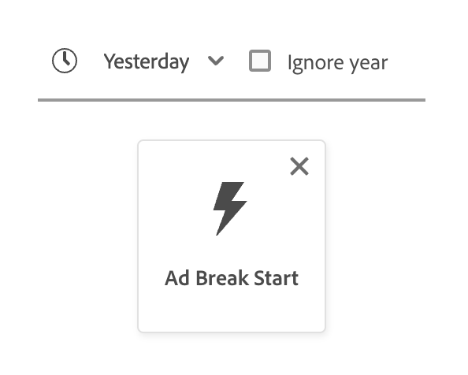
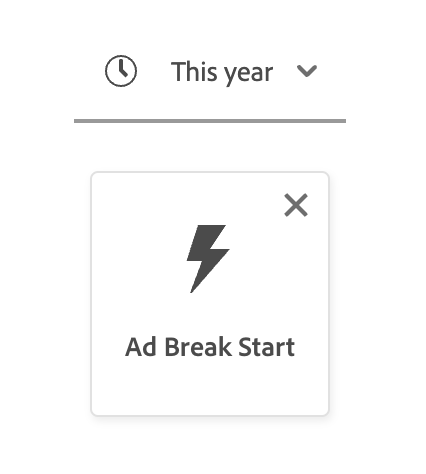
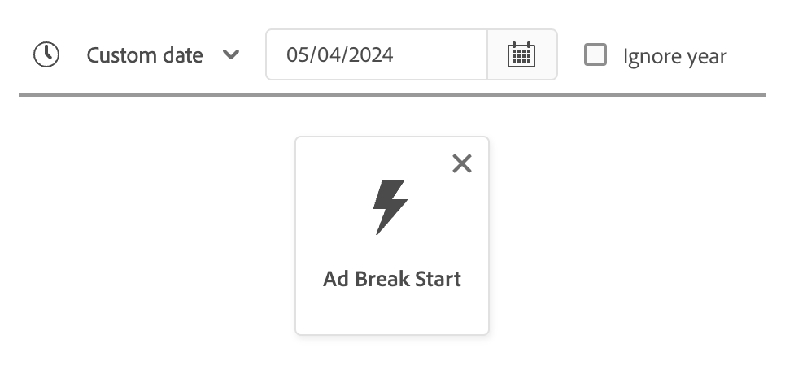
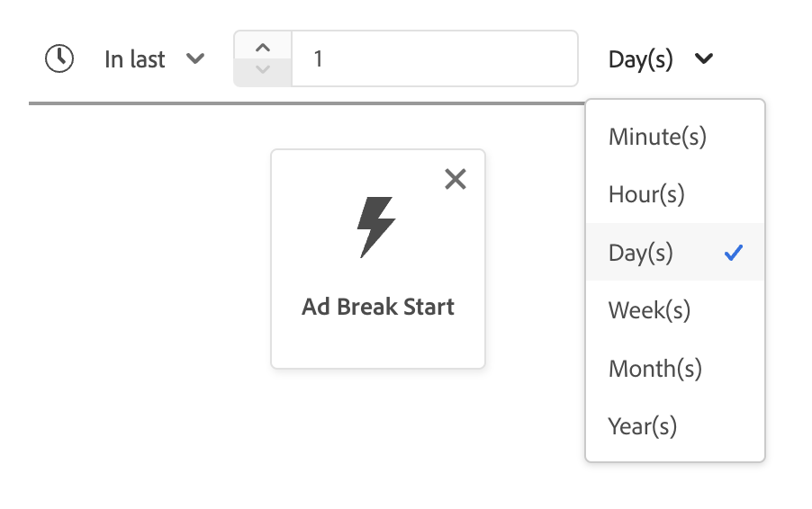
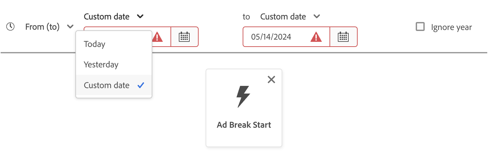
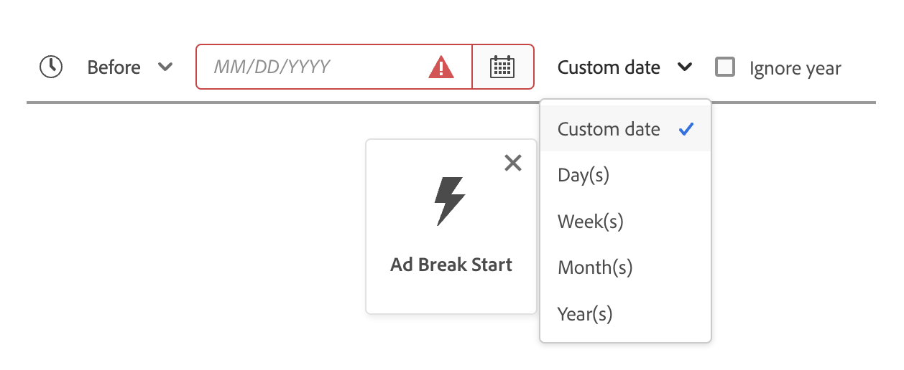
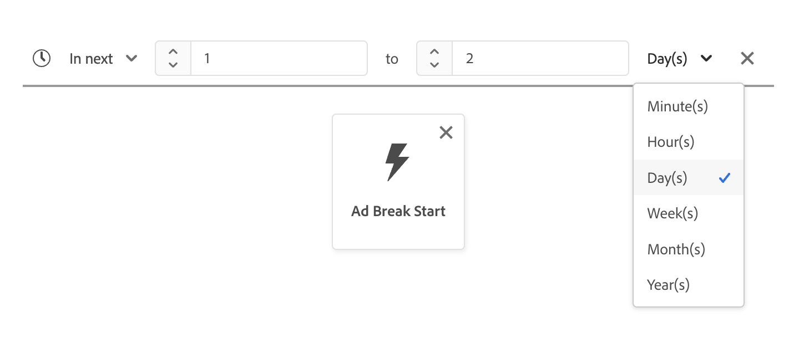
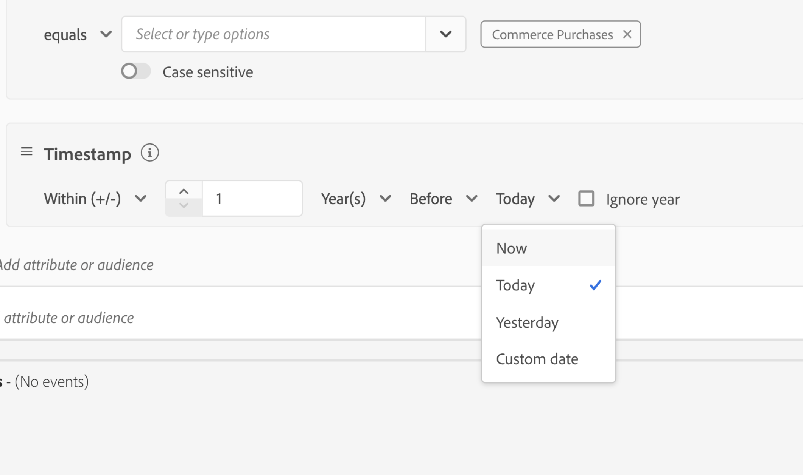

# Audience Builder UI Guide

>[!AVAILABILITY]
>
>The updated Audience Builder is currently in **closed beta**. The documentation and the functionality are subject to change.

Audience Builder provides a rich workspace that lets you interact with Profile data elements. The workspace provides intuitive controls for building and editing your audience's rules.

{width="1000" zoomable="yes"}

The Audience Builder UI is comprised of two sections: the **[!UICONTROL Audience Properties]** panel and the Audience Builder canvas.

## Audience properties {#audience-properties}

The **[!UICONTROL Audience Properties]** panel on the left-hand side of the workspace shows you estimates information for your audience and lets you provide details about your audience, including name, description, and evaluation method.

{width="1000" zoomable="yes"}

### Estimates {#estimates}

The audience estimates section shows both the **qualified** and **estimated** profiles.

**[!UICONTROL Qualified Profiles]** indicates the **actual** number of profiles that match the segment definition's rules. This number updates every 24 hours, after the segment evaluation job has ran.

The timestamp for qualified profiles indicates the most recent **batch** segment evaluation job and is **not** displayed for segment definitions evaluated using streaming or edge segmentation. If you edit the segment definition, the number of qualified profiles will remain the same until the next segment evaluation job is run. 

**[!UICONTROL Estimated Profiles]** indicates an **approximate range** of profiles, based off of the **sample job**. This means the sample data is projected on the larger profile set, resulting in an estimated number that may differ from the actual number of qualified profiles. The estimated profile sample has a 95% confidence interval.

When you make changes to the audience's rules, you can select the **[!UICONTROL Refresh estimate]** button to see an updated count of estimated profiles. However, this number is still based off of the previous sample job. The sample job is updated when there is a greater than 3% change in customer data or the last sample job is older than three days.

Selecting the information bubble gives the date and time the last sample job was run.

{width="400" zoomable="yes"}

>[!NOTE]
>
>Audience estimates are generated by using a sample size of that day's sample data. If there are less than 1 million entities in your Profile store, the full data set is used; for between 1 and 20 million entities, 1 million entities are used; and for over 20 million entities, 5% of the total entities are used. 
>
>Additionally, this estimate is based off of when the last profile sample job was run. This means that if you're using a relative date function such as "Today" or "This week", the estimate will base its calculations off of the last profile sample job run time. For example, if today is January 24th and the last profile sample job ran on January 22nd, the "Yesterday" relative date function will be based off of January 21st, and not January 23rd.
>
>More information about generating estimates for segment definitions can be found in the [estimate generation section](../tutorials/create-a-segment.md#estimate-and-preview-an-audience) of the segment definition creation tutorial.

### Properties {#properties}

You can also specify important information about your audience within the **[!UICONTROL Audience Properties]** panel. This includes your audience's name, description, access labels, tags, and evaluation type.

{width="400" zoomable="yes"}

To apply access labels to your audience, select **[!UICONTROL Apply access labels]**. 

{width="400" zoomable="yes"}

The **[!UICONTROL Apply access and data governance labels]** popover appears. This popover displays a list of available labels for your audience. For more detailed information about applying access and data governance labels, read the [permissions guide](/help/access-control/abac/ui/permissions.md). To learn more about the available access and data governance labels, read the [data usage labels glossary](/help/data-governance/labels/reference.md).

{width="1000" zoomable="yes"}

To apply tags to your audience, select the dropdown. A list of the available tags for your audience appears. You can select as many tags as you want to apply to the audience.

{width="400" zoomable="yes"}

To choose your evaluation method, select the the browse icon . 

The [!UICONTROL Evaluation method eligibility] popover appears. This popover displays the available evaluation methods, which are batch, streaming, and edge. The popover shows which evaluation methods are eligible and ineligible.

{width="500" zoomable="yes"}

>[!NOTE]
>
>Audience evaluation eligibility is determined by the parameters used in your audience's rules. For more information on the requirements for each evaluation method, read the [streaming segmentation](../methods/streaming-segmentation.md#query-types) or the [edge segmentation](../methods/edge-segmentation.md#query-types) overviews.

If you already know which evaluation method you want to use, you can select the desired evaluation method either using the dropdown list.

Once you've selected an evaluation method for your audience, you can still change the evaluation method of the audience. However, if you change the evaluation method from Edge or Streaming to Batch, you will **not** be able to change it back to Edge or Streaming. The change to the evaluation method will **only** take effect once you select **[!UICONTROL Save]** in the popover. Cancelling the dialog will **maintain** the original evaluation method.

If you select an invalid evaluation method, you will be prompted to either change your audience's rules or change the evaluation method.

{width="500" zoomable="yes"}

More information about the different audience evaluation methods can be found in the [segmentation overview](/help/segmentation/home.md#evaluate-audiences).

## Audience canvas {#audience-canvas}

The Audience Builder canvas provides three different types of views: **[!UICONTROL Rule view]**, **[!UICONTROL Code view]**, and **[!UICONTROL Profile view]**. 

- [Rule view](#rule-view): Lets you create the rules to define your audience.
- [Code view](#code-view): Lets you view the PQL that defines your audience. This view is only visible once you have defined a rule for your audience.
- [Profile view](#profile-view): Lets you view a sample of profiles that would qualify for you audience. This view is only visible once an estimate job has run.

## Rule view {#rule-view}

In the rule view canvas, you can add either **attributes** or **events** to the rule building canvas. Attributes let you add either Profile attributes that belong to the XDM Individual Profile class or other previously created audiences, while events let you add actions or events that take place using XDM ExperienceEvent data elements.

{width="1000" zoomable="yes"}

Within the rule view, you can use the undo and redo buttons to revert changes you didn't want to make or re-apply changes you wanted to make.

{width="1000" zoomable="yes"}

You can also adjust the settings of the visible fields by selecting .

The **[!UICONTROL Show full XDM schema]** setting determines if you see **all** fields, or only fields that contain data.

The **[!UICONTROL Show relation selectors]** setting determines if you use the standard relations for your organization or if the relation selectors are shown.

The **[!UICONTROL Use AI search suggestions]** setting determines if the AI-enabled search will be used for searching fields.

For **[!UICONTROL Data sources]**, you can filter to show attributes that come from the specified ingestion types. Supported values include **[!UICONTROL Show batch data]**, **[!UICONTROL Show streaming/edge data]**, and **[!UICONTROL Show fields with no ingested data]**.

For **[!UICONTROL Merge policy]**, you can choose which merge policy the fields belong to.

{width="400" zoomable="yes"}

### Attributes {#attributes}

The **[!UICONTROL Attributes]** section lets you browse [!DNL Profile] attributes belonging to the [!DNL XDM Individual Profile] class. 

{width="1000" zoomable="yes"}

You can select **[!UICONTROL Add field]** to add an attribute or audience to the rule building canvas or you can select **[!UICONTROL Add group]** to add a container to the canvas. More information about groups can be found in the [Groups section](#groups).

{width="1000" zoomable="yes"}

If you select **[!UICONTROL Add field]**, the Discovery Panel appears. This panel lets you search for the field you want to add. Type in the name of the field you're looking for and press enter.

{width="500" zoomable="yes"}

If you have **[!UICONTROL Use AI search suggestions]** enabled, the Discovery Panel will intelligently display AI-powered suggestions based on the searched field.

{width="500" zoomable="yes"}

If you do not have **[!UICONTROL Use AI search suggestions]** enabled, the Discovery Panel will display fields based off of the searched criterion.

{width="500" zoomable="yes"}

You can select  to add the searched field to your list of favorites, which lets you add that field to your audience more quickly for future references.

{width="500" zoomable="yes"}

You can select  to adjust the settings for the displayed fields.

For the **[!UICONTROL Field settings]**, you can either show only the fields that contain data or the full XDM schema.

For the **[!UICONTROL Field types]**, you can show **[!UICONTROL Attributes]** or **[!UICONTROL Audiences]**.

{width="250" zoomable="yes"}

Alternatively, you can view all the available fields for your audience by selecting **[!UICONTROL View All]** in the **[!UICONTROL Browse fields]** area.

{width="400" zoomable="yes"}

In the **[!UICONTROL Browse fields]** area, you can select between **[!UICONTROL Attributes]** or **[!UICONTROL Audiences]**.

{width="400" zoomable="yes"}

>[!BEGINTABS]

>[!TAB Attributes]

If you select **[!UICONTROL Attributes]**, a full list of the available XDM Individual Profile attributes appears. Additionally, you can see custom added attributes that belong to your sandbox.

{width="400" zoomable="yes"}

To add an attribute to the rule-building canvas, select the name of the attribute you want to add. You may need to navigate through the folder structure of the XDM schema in order to find the attribute.

After selecting the attribute, details of the attribute appear. This includes information such as the path of the attribute, sample values, description, and type. You can select [the star icon](/help/images/icons/star.png) to favorite the attribute or **[!UICONTROL Add field]** to add the attribute to your audience's rules.

{width="400" zoomable="yes"}

>[!NOTE]
>
>The samples values are only displayed if the field does **not** contain too many different values and if those field's values are commonly repeated. Additionally, this summary data is updated on a **daily** basis.

>[!TAB Audiences]

If you select **[!UICONTROL Audiences]**, a full list of previously created audiences for your sandbox and merge policy appears. 

{width="400" zoomable="yes"}

To add an audience to the rule-building canvas, select the name of the audience you want to add.

After selecting the audience, details of the audience appear. This includes the name and description of the audience. You can select the [the star icon](/help/images/icons/star.png) to favorite the audience or **[!UICONTROL Add field]** to add the audience your audience's rules.

{width="400" zoomable="yes"}

>[!ENDTABS]

After adding your attribute, you can select  to change the **condition type** or **delete** the condition.

{width="1000" zoomable="yes"}

+++ Attribute additional options

You can use the following condition types for your attributes:

| Condition type | Description |
| -------------- | ----------- |
| Compare to input | Compares the attribute value to the specified input value. This is the default option when choosing an attribute. |
| Compare to another attribute | Compares the attribute value to the value of another attribute. You can choose the attribute you want to compare using the Discovery Panel. |
| Has any value | Checks to see if the attribute has any value. This is equivalent to seeing if the attribute "exists". |
| Has no value | Checks to see if the attribute has no value. This is equivalent to seeing if the attribute "does not exist". |

If you select **[!UICONTROL Compare to input]**, you can choose one of the additional options:

- Allow multiple inputs
- Case sensitive

If you select **[!UICONTROL Allow multiple inputs]**, the **[!UICONTROL Multiple Inputs]** popover is displayed. On this popover, you can add the values to compare the attribute to.

{width="1000" zoomable="yes"}

You can either add the values on a line-by-line basis in the **[!UICONTROL Values]** box, or choose the values from the **[!UICONTROL Suggested values]** section.

The popover also provides the following available actions. If you select the , the inputs revert to the initial state. If you select the , the selected value moves down one line. If you select the , you can upload a CSV or TSV file that contain the values you want to compare against.

If you select **[!UICONTROL Case sensitive]**, the attribute's value **must** match the exact casing of specified input value.

+++

You can add additional attributes to the audience by selecting **[!UICONTROL Add field]**. If you add an additional attribute, you can choose if the audience requires **all** of the added attributes or if the audience requires **one** of the added attributes.

{width="1000" zoomable="yes"}

If you want to remove an attribute you've added, select .

{width="1000" zoomable="yes"}

#### Computed attributes {#computed-attributes}

Computed attributes are fields that are calculated from other attributes using aggregations or formulas. You can use computed attributes if you need aggregated data such as sums, counts, or averages across multiple events or if you are building frequently-used audiences that require complex calculations. 

For more information on computed attributes, including how to create them, what functions you can use within them, and how to manage them, read the [computed attributes overview](/help/profile/computed-attributes/overview.md).

### Events {#events}

The **[!UICONTROL Events]** section lets you add ExperienceEvents to your audience's rules. 

Select **[!UICONTROL Add event]** to choose from a list of ExperienceEvents that you can add to your audience.

{width="1000" zoomable="yes"}

After adding an event to your canvas, you can add additional events to the timeline. These events can be added before, after, above, or below the already selected event.

{width="1000" zoomable="yes"}

If you add an event **before**, the event must take place **before** the initial event. If you add an event **after**, the event must take place **after** the initial event.

You can add a time constraint at a canvas-level or event-level. Time constraints let you set specified temporal limitations for your events. For more information, read the [time constraints](#time-constraints) section.

You can edit settings related to the event by selecting the event, followed by the bubble that contains "Include" that appears. 

{width="1000" zoomable="yes"}

Once you've selected the bubble, you can choose if the event should be or should not be included as well as modify the count function. Count functions are used to look for the specified event and count the number of times they're done. 

| Count function | Description |
| -------------- | ----------- |
| At least | There must be **at least** the number of events specified. |
| At most | There must be **at most** the number of events specified. |
| Exactly | There must be **exactly** the number of events specified. |
| Between | There must be **between** the two number of events specified. |

You can select  for additional options for the event. Options include [**[!UICONTROL Add group]**](#groups), **[!UICONTROL Remove event type]**, **[!UICONTROL Aggregate]**, and [**[!UICONTROL Apply time rule]**](#time-constraints).

If you select **[!UICONTROL Remove event type]**, you remove the event from the audience.

If you select **[!UICONTROL Aggregate]**, you can add an aggregation function to the event. An aggregation is a calculation on a group of XDM attributes whose data type is a number (either a double or an integer). The four supported aggregation functions are count, sum, average, min, and max.

| Aggregation function | Description |
| -------------------- | ----------- |
| Count | A function that **counts** the number of the event that has occurred. |
| Sum | A function that **sums** the values of the specified attribute that occur within the event. |
| Average | A function that **averages** the values of the specified attribute that occur within the event. |
| Min | A function that finds the **minimum value** of the specified attribute that occurs within the event. |
| Max | A function that finds the **maximum value** of the specified attribute that occurs within the event. |

### Groups {#groups}

You can add groups of either attributes or events within Audience Builder. Groups let you control the order of execution through the use of nested queries.

When you add a group, it automatically appears as a child of the the first group. You can adjust the hierarchy by dragging and moving the containers.

By default, the group will **include** all the attributes, events, or audiences within the group. You can change this by selecting the dropdown at the top of the group.

{width="1000" zoomable="yes"}

When you select the dropdowns on the top of the group, you are presented with the following options:

| Option | Description |
| ------ | ----------- |
| **include** | The audience **must** contain the elements within the group. |
| **exclude** | The audience **must not** contain the elements within the group. |
| **all of** | **All** of the elements must be accounted for within the group. |
| **any of** | **At least one** of the elements must be accounted for within the group. |

You can also select additional options for the group by selecting the ellipses icon. Available options include **[!UICONTROL Add group]**, **[!UICONTROL Delete group]**, and **[!UICONTROL Name group]**.

If you select **[!UICONTROL Add group]**, you add another group as a child of the currently selected group. If you select **[!UICONTROL Delete group]**, the currently selected group will be removed. If you select **[!UICONTROL Name group]**, you can give a name to the currently selected group.

### Time constraints {#time-constraints}

Time constraints let you apply time restrictions on time-based attributes, events, and the sequence between the events.

The list of available time constraints are as follows:

+++ Available time constraints

>[!NOTE]
>
>All time constraints are based off of UTC.
>
>Additionally, if the [!UICONTROL Ignore year] checkbox is enabled, the year will **not** be compared as part of the segment definition evaluation.

| Time constraint | Description | Can enable ignore year | Example |
| --------------- | ----------- | ------------------- | ------- |
| Today | The attribute or event being compared **must** occur today. This is the default time constraint selected. | Yes | {width="100" zoomable="yes"} |
| Yesterday | The attribute or event being compared **must** occur yesterday. | Yes | {width="100" zoomable="yes"} |
| This month | The attribute or event being compared **must** occur this calendar month. | Yes | {width="100" zoomable="yes"} |
| This year | The attribute or event being compared **must** occur this calendar year. | No | {width="100" zoomable="yes"} |
| Custom date | The attribute or event being compared **must** occur on the date given. | Yes | {width="100" zoomable="yes"} |
| In last | The attribute or event being compared **must** occur within the last period of time chosen. This period of time is **inclusive** until the evaluation time. | No | {width="100" zoomable="yes"} |
| From (to) | The attribute or event being compared **must** occur within the two calendar dates chosen. This period of time is **inclusive** of both dates. | Yes, if custom date | {width="100" zoomable="yes"} |
| During | The attribute or event being compared **must** occur within the selected month or year. If a month is selected, you need to choose both the month and a year that the attribute or event took place in.  If a year is selected, you need to just choose the year that the attribute or event took place in. If you select a month, you can also enable the [!UICONTROL Ignore year] checkbox. | Yes | {width="100" zoomable="yes"} |
| Within (+/-) | The attribute or event being compared **must** occur within days, weeks, months, or years of the selected date. This period of time is **inclusive** of both dates. The selected date can be today, yesterday, or another custom date of your choosing. | Yes | {width="100" zoomable="yes"} |
| Before | The attribute or event being compared **must** occur before the selected date. The selected date can be a custom date of your choosing, or a selection between days, weeks, months, or years ago. | Yes | {width="100" zoomable="yes"} |
| After | The attribute or event being compared **must** occur after the selected date. The selected date can be a custom date of your choosing, or a selection between days, weeks, months, or years ago. | Yes | {width="100" zoomable="yes"} |
| Rolling range | The attribute or event being compared must occur between the two relative dates. The dates can be represented in seconds, minutes, hours, days, weeks, months, or years. | No | {width="100" zoomable="yes"} |
| In next | The attribute or event being compared must occur within the next period of time selected. The selected periods of time include minutes, hours, days, weeks, months, and years. | No | {width="100" zoomable="yes"} |
| Exists | The attribute exists. | No | {width="100" zoomable="yes"} |
| Does not exist | The attribute does not exist. | No | {width="100" zoomable="yes"} |
| Now | The attribute or event being compared **must** occur right when the audience is evaluated. This time constraint can only be used as a secondary-level option, within time constraints such as "Before" or "After". | Yes | {width="100" zoomable="yes"} |

>[!TIP]
>
>The difference between the "Today" time constraint and "Now" time constraint is subtle, but significant. 
>
>- Use the "Today" time constraint to check if the attribute or event being compared is happening at **midnight** of the current day. 
>- Use the "Now" time constraint to check if the attribute or event being compared is happening **right now**.
>
>However, there's one major exception - if you're using "Today" as a top-level time constraint, that means you're checking if the attribute or event occurred at **any** point today.

+++

#### Canvas-level constraint

You can add a canvas-level constraint by selecting  that appears above the timeline of events.

{width="1000" zoomable="yes"}

When you apply a time constraint on the canvas-level, this applies the time constraint to **all** events in the audience.

#### Event-level constraint

To apply an event-level constraint, select the event you want to apply the time constraint on, followed by , and **[!UICONTROL Apply time rule]**. This lets you select a time constraint within the **[!UICONTROL Event Rules]** container.

{width="1000" zoomable="yes"}

When you apply a time constraint on the event-level, this applies the time constraint on the **specified** event in the audience.

#### Between events constraint

To apply a time constraint between events, select  between the two events you want to apply the time constraint on.

{width="1000" zoomable="yes"}

When you apply a time constraint between the event, this applies the time constraint to the time **between** the events. 

The list of available time constraints for this operation differs from the main list of time constraints, and are as follows:

+++ Available time constraints

| Time constraint | Description |
| --------------- | ----------- |
| After | The latter event **must at least** take place after the prior event. |
| Within | The two events **must** take place during the time period listed within the time constraint. |

>[!NOTE]
>
>When using the "After" time constraint, the latter event can take place more than the amount of time listed within the time constraint. >
>For example, if you have a Page View event and a Checkout event, and you put the "After 1 hour" time constraint between these two events, a segment definition with a Checkout event 2 hours after the Page View event would qualify.
>
>Additionally, these two time constraints can be used in coordination with each other.
>
>For example, if you have a Page View event and a Checkout event, and you put both the "After 1 hour" and "Within 24 hours" time constraints, a segment definition with a Checkout event 12 hours after the Page View event would qualify, but a segment definition with a Checkout event 36 hours after the Page View event would not qualify.

+++

## Code view {#code-view}

Code view displays a code-based version of the audience created in Audience Builder. Once you've created your rule within the rule builder canvas, select **[!UICONTROL Code view]** to see your audience as PQL.

Code view provides a button that allows you to copy the value of the audience to use in API calls. To get the latest version of the audience, make sure you have saved your latest changes to the audience.

{width="1000" zoomable="yes"}

## Profile view {#profile-view}

Profile view displays a sampling of profiles that would qualify for the audience, based on its current rules. Once you've generated at least one estimate for the audience, select **[!UICONTROL Profile view]** to see the sample profiles.

A selection of profiles is displayed. This includes information such as ID, first name, last name and audience membership.

{width="1000" zoomable="yes"}

| Field | Description |
| ----- | ----------- |
| ID | The ID for the profile. You can select the ID and see the profile details page. For more information on profiles, read the [profile user guide](/help/profile/ui/user-guide.md#profile-detail). |
| First name | The first name of the profile's user. |
| Last name | The last name of the profile's user. |
| Audience membership | The number of audiences the profile belongs to. |
| Full name | The full name of the profile's user. |

## Audience validation {#audience-validation}

Audience Builder automatically analyzes and validates your audience definition to ensure you adhere to audience definition best practices. These best practices can be set into two categories: critical validation and performance optimization.

If an audience definition breaks a critical validation best practice, you will **not** be able to save your changes in order to keep your sandbox stable. If an audience definition breaks a performance optimization best practice, you will be able to save your changes, but it is *highly recommended* to update your audience definition to avoid performance issues.

| Validation check | Type | Threshold |
| ---------------- | ---- | --------- |
| Logical complexity | Critical validation | The audience definition is too complicated. |
| Sequential events | Critical validation | There are more than 6 sequential events within an audience definition. |
| Aggregated count | Performance optimization | There are more than 3 aggregation functions within an audience definition. |
| Nested data | Performance optimization | There are more than 2 levels of nested data (array or map data types) depth within an audience definition. |
| Audience size | Performance optimization | The audience qualification size is greater than 30% of the total number of profiles in the sandbox. |

For more information on how audience validation works, read the [audience validation guide](/help/segmentation/validation.md).

## Next steps {#next-steps}

Audience Builder provides a rich workflow letting you create audiences from Profile data. After reading this guide, you should now be able to:

- Create audiences using a combination of attributes, events, and existing audiences as building blocks.
- Use the rule builder canvas and containers to control the order in which rules are executed
- View estimates for your prospective audience, letting you adjust your audience's rules as necessary.

To learn more about [!DNL Segmentation Service], please continue reading the documentation and supplement your learning by watching the related videos. To learn more about the other parts of the [!DNL Segmentation Service] UI, please read the [[!DNL Segmentation Service] user guide](./overview.md).
