# Audience Composition UI guide

>[!NOTE]
>
>This guide explains how to create audiences using Audience Composition. To learn how to create audiences through segment definitions using the Segment Builder please read the [Segment Builder UI guide](./segment-builder.md).

Audience Composition provides a workspace to build and edit audiences, using blocks that are used to represent different actions.

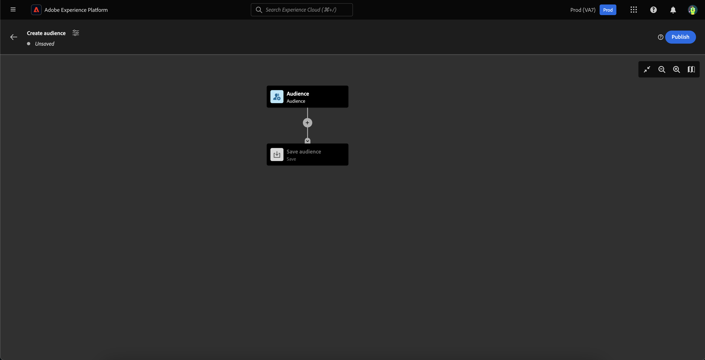

To change the details of the composition, including the title and description, select the  button.

The **[!UICONTROL Composition properties]** popover appears. You can insert details of your composition, including the title and description here. 

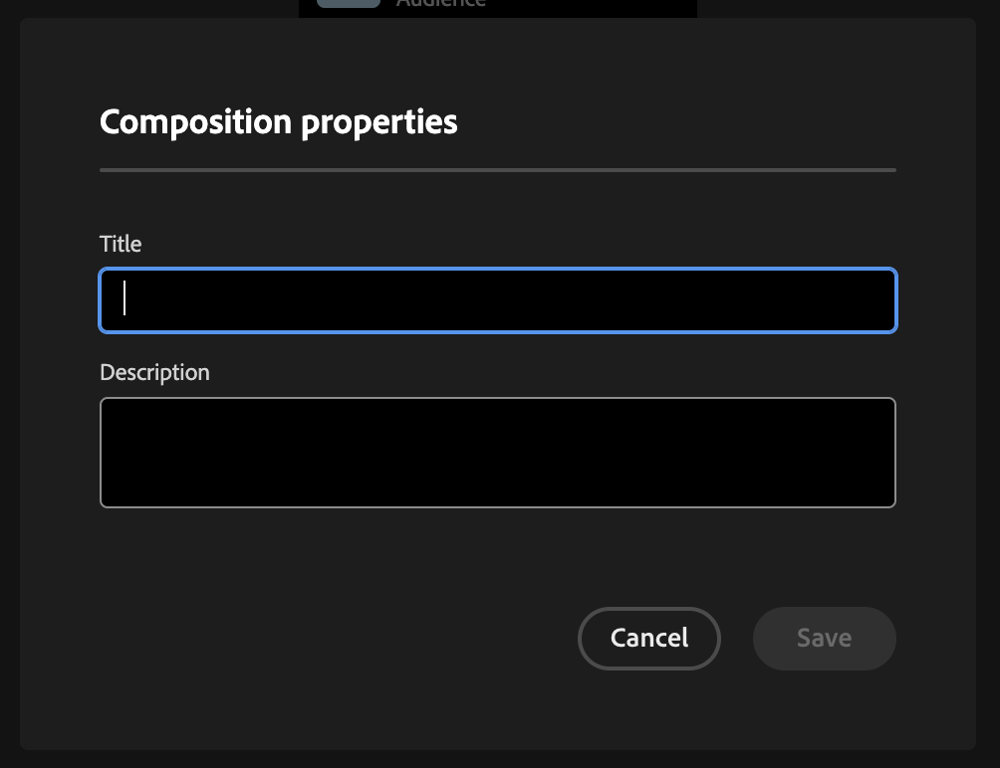

>[!NOTE]
>
>If you do **not** give your composition a title, it will have a title of "Composition" followed by the creation date and time by default.

After updating your composition's details, select **[!UICONTROL Save]** to confirm these updates. The audience composition canvas re-appears.

The audience composition canvas is comprised of four different types of blocks: **[[!UICONTROL Audience]](#audience-block)**, **[[!UICONTROL Exclude]](#exclude-block)**, **[[!UICONTROL Rank]](#rank-block)**, and **[[!UICONTROL Split]](#split-block)**.

## [!UICONTROL Audience] {#audience-block}

The **[!UICONTROL Audience]** block type allows you to add the sub-audiences that you want to compose your new larger audience. By default, an **[!UICONTROL Audience]** block is included at the top of the composition canvas.

When you select the **[!UICONTROL Audience]** block, the right rail displays controls for labeling the audience, adding audiences to the block, as well as building custom rules for the audience block.

>[!NOTE]
>
>You can either add audiences **or** create a custom rule. These two functionalities **cannot** be used together.

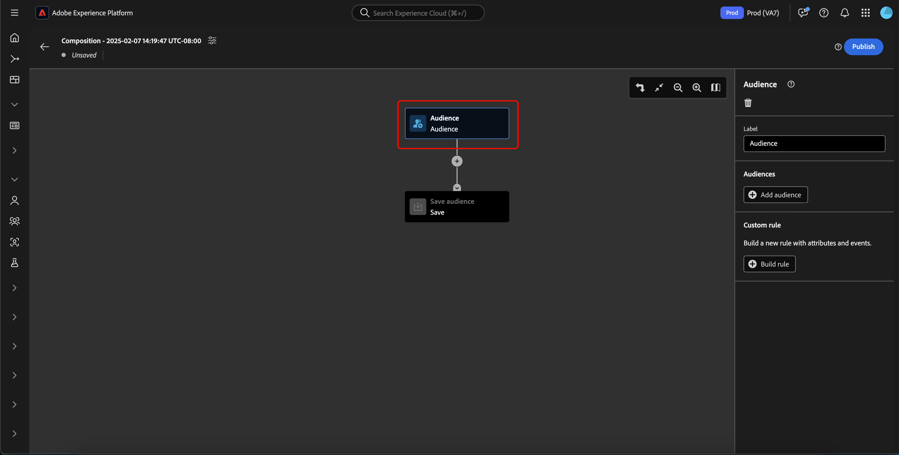

### [!UICONTROL Add audience] {#add-audience}

To add audiences to the Audience block. select **[!UICONTROL Add Audience]**.

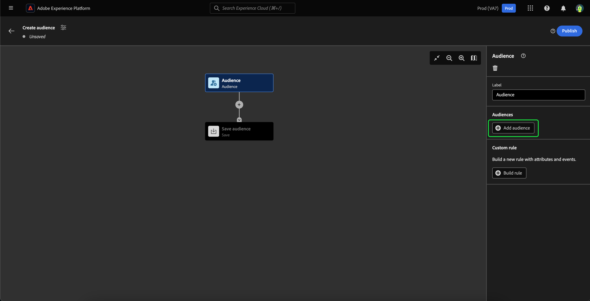

A list of audiences appears. Select the audiences you want to include, followed by **[!UICONTROL Add]** to append them to your audience block.

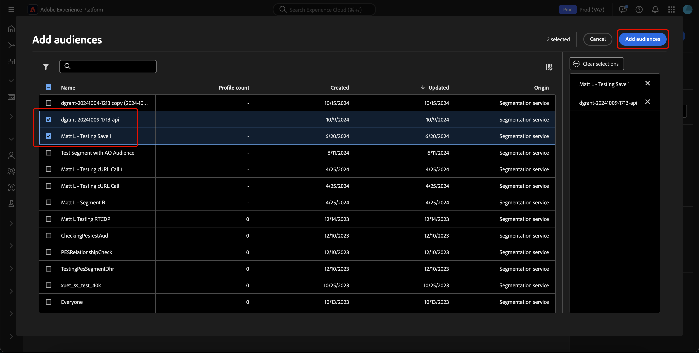

Your selected audiences now appear within the right rail when the **[!UICONTROL Audience]** block is selected. From here, you can change the merge type of the combined audiences.

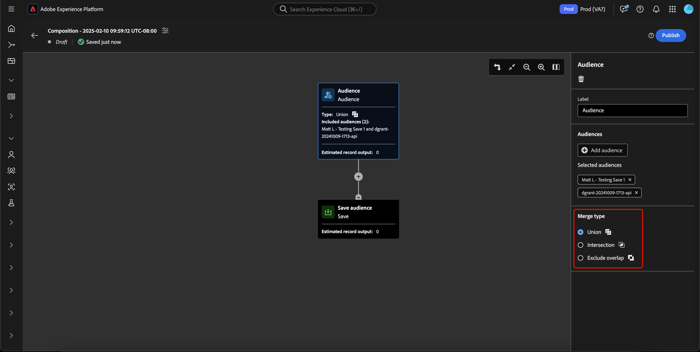

| Merge type | Description |
| ---------- | ----------- |
| [!UICONTROL Union] | The audiences are combined into one audience. This would be the equivalent of an OR operation. |
| [!UICONTROL Intersection] | The audiences are combined, with only the audiences that are shared in **all** of them being added. This would be the equivalent of an AND operation. |
| [!UICONTROL Exclude overlap] | The audiences are combined, with only the audiences that are shared in **one, but not all** of them being added. This would be the equivalent of a XOR operation. |

### [!UICONTROL Build rule] {#build-rule}

To add a custom rule to the Audience block, select **[!UICONTROL Build rule]**.

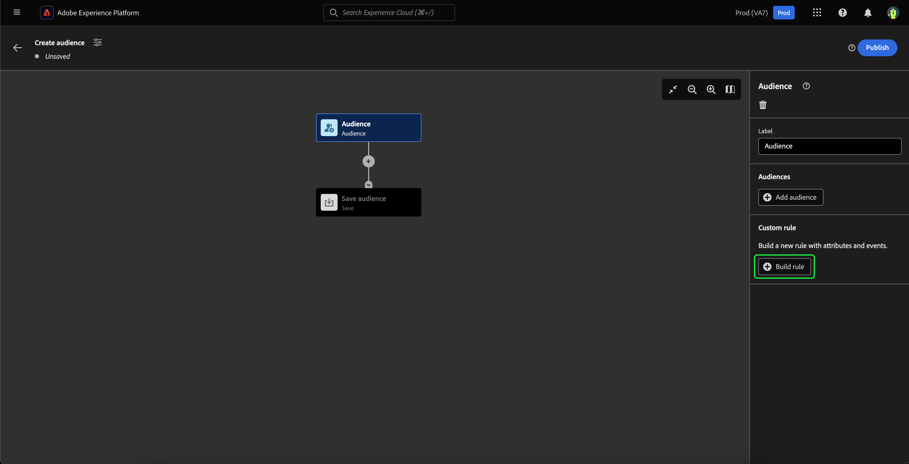

The Segment Builder appears. You can use the Segment Builder to create a custom rule for the audience to follow. More information about using the Segment Builder can be found in the [Segment Builder guide](./segment-builder.md).

After adding a custom rule, select **[!UICONTROL Save]** to add the rule to your audience.

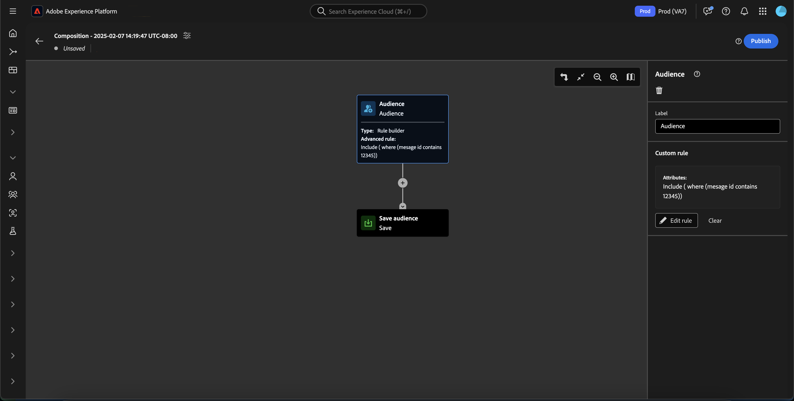

## [!UICONTROL Exclude] {#exclude-block}

The **[!UICONTROL Exclude]** block type allows you to exclude specified sub-audiences or attributes from your new larger audience.

To add an **[!UICONTROL Exclude]** block, select the **+** icon, followed by **[!UICONTROL Exclude]**.

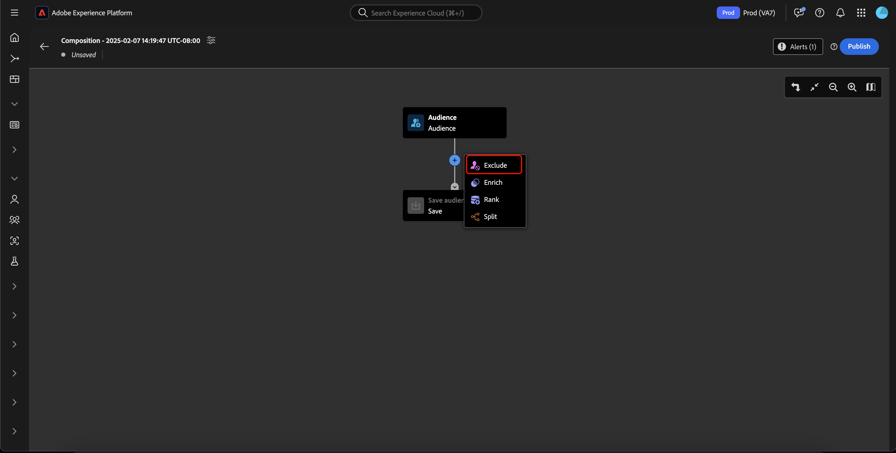

The **[!UICONTROL Exclude]** block is added. When this block is selected, details about the exclusion appear in the right rail. This includes the block's label and exclusion type. You can exclude [by audience](#exclude-audience) or [by attribute](#exclude-attribute).

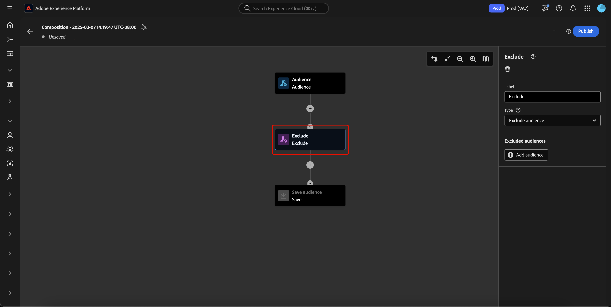

### Exclude by audience {#exclude-audience}

If you exclude by audience, you can select which audiences you want to exclude by selecting **[!UICONTROL Add Audience]**.

![The [!UICONTROL Add audience] button is selected, which lets you choose which audience you want to exclude.](../images/ui/audience-composition/add-excluded-audience.png)

A list of audiences appears. Select **[!UICONTROL Add]** to add the audiences you want to exclude to your exclude block.

### Exclude by attribute {#exclude-attribute}

If you exclude by attribute, you can select which attributes you want to exclude by selecting the  icon within the **[!UICONTROL Exclusion rule]** section.

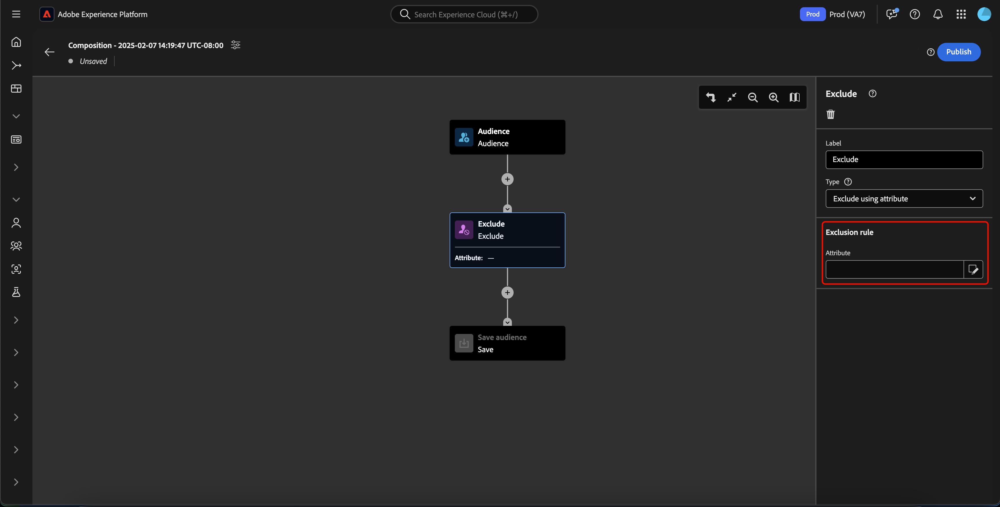

A list of profile attributes appears. Select the attribute type you want to exclude, followed by **[!UICONTROL Select]** to add them to your exclude block.

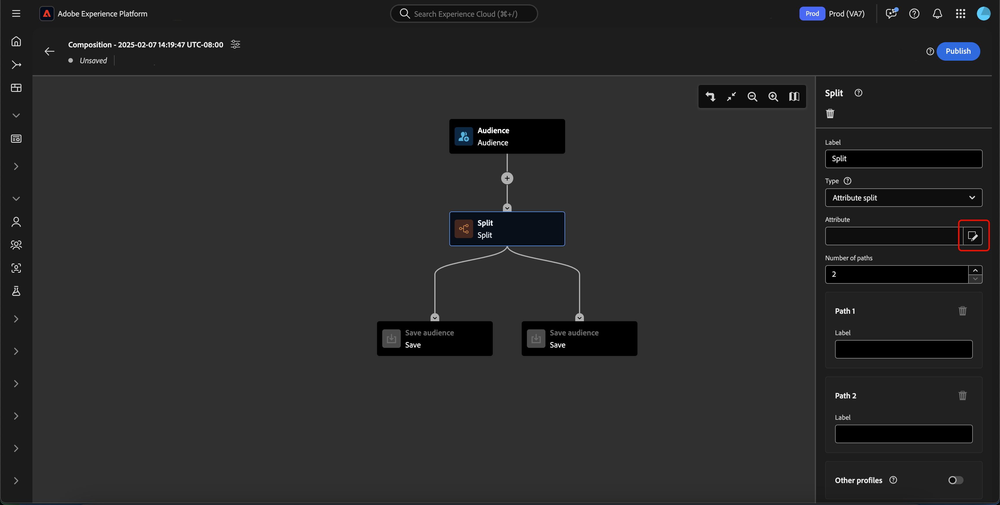

## [!UICONTROL Enrich] {#enrich-block}

>[!IMPORTANT]
>
>At this point in time, enrichment attributes can **only** be used in downstream Adobe Journey Optimizer scenarios.

The **[!UICONTROL Enrich]** block type allows you to enrich your audience with additional attributes from a dataset. You can use these attributes in personalization use cases.

To add an **[!UICONTROL Enrich]** block, select the **+** icon, followed by **[!UICONTROL Enrich]**.

![The [!UICONTROL Enrich] option is selected.](../images/ui/audience-composition/add-enrich-block.png)

The **[!UICONTROL Enrich]** block is added. When this block is selected, details about the enrichment appear in the right rail. This includes the block's label and the enrichment dataset.

To select the dataset to enrich the audience with, select the  icon. 

![The filter button is highlighted. Selecting this leads you to the [!UICONTROL Select dataset] popover.](../images/ui/audience-composition/enrich-select-dataset.png)

The **[!UICONTROL Select dataset]** popover appears. Select the dataset that you want to add for enrichment, followed by **[!UICONTROL Select]** to add the dataset for enrichment.

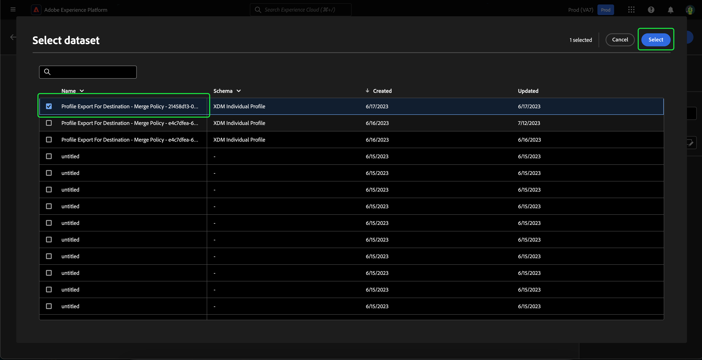

>[!IMPORTANT]
>
>The selected dataset **must** meet the following criteria:
>
>- The dataset **must** be of record type.
>   - The dataset **cannot** be of event type, be system-generated, or be marked for Profile.
>- The dataset **must** be 1 GB or smaller.

The **[!UICONTROL Enrichment criteria]** section now appears on the right rail. In this section, you can select the **[!UICONTROL Source join key]** and the **[!UICONTROL Enrichment dataset join key]**, which lets you link the enrichment dataset with the audience you're trying to create.

![The [!UICONTROL Enrichment criteria] area is highlighted.](../images/ui/audience-composition/enrichment-criteria.png)

To select the **[!UICONTROL Source join key]**, select the  icon. 

![The filter icon for the [!UICONTROL Source join key] is highlighted.](../images/ui/audience-composition/enrich-select-source-join-key.png)

The **[!UICONTROL Select a profile attribute]** popover appears. Select the profile attribute you want to use as the source join key, followed by **[!UICONTROL Select]** to choose that attribute as your source join key.

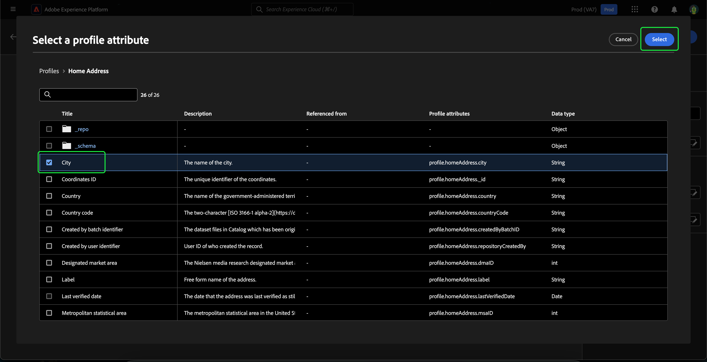

To select the **[!UICONTROL Enrichment dataset join key]**, select the  icon.

![The filter icon for the [!UICONTROL Enrichment dataset join key] is highlighted.](../images/ui/audience-composition/enrich-select-enrichment-dataset-join-key.png)

The **[!UICONTROL Enrichment attributes]** popover appears. Select the attribute you want to use as the enrichment dataset join key, followed by **[!UICONTROL Select]** to choose that attribute as your enrichment dataset join key.

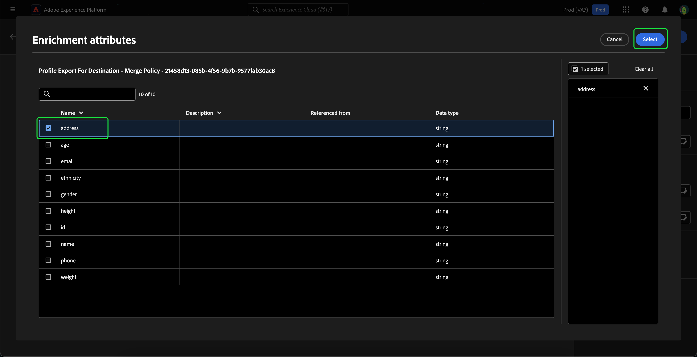

Now that you've added both of your join keys, the **[!UICONTROL Enrichment attributes]** section appears. You can now add the attribute you want to enhance your audience with. To add these attributes, select **[!UICONTROL Add attribute]**.

![The [!UICONTROL Add attribute] button is highlighted.](../images/ui/audience-composition/enrich-select-add-attribute.png)

The **[!UICONTROL Enrichment attributes]** popover appears. You can select the attributes from the dataset to enrich your audience with, followed by **[!UICONTROL Select]** to add the attributes to your audience.

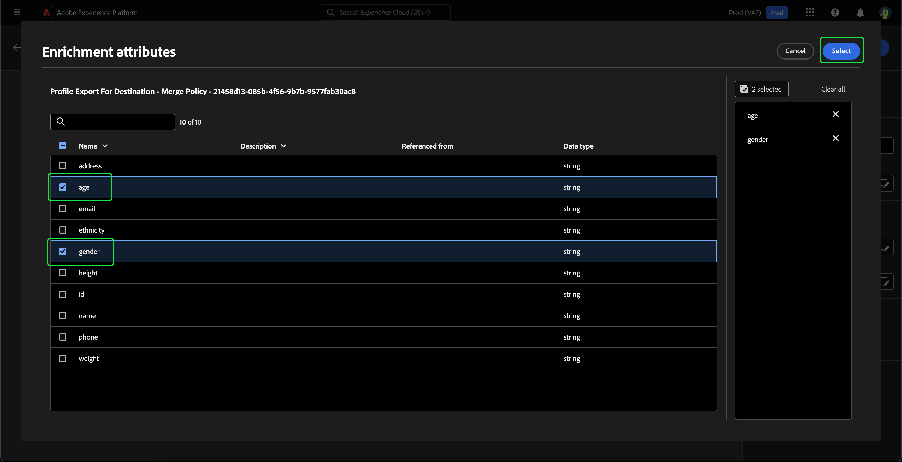

<!-- ## [!UICONTROL Join] {#join-block}

The **[!UICONTROL Join]** block type allows you to add in external audiences from datasets that have not yet been processed by Adobe Experience Platform.

To add a **[!UICONTROL Join]** block, select the **+** icon, followed by **[!UICONTROL Join]**.

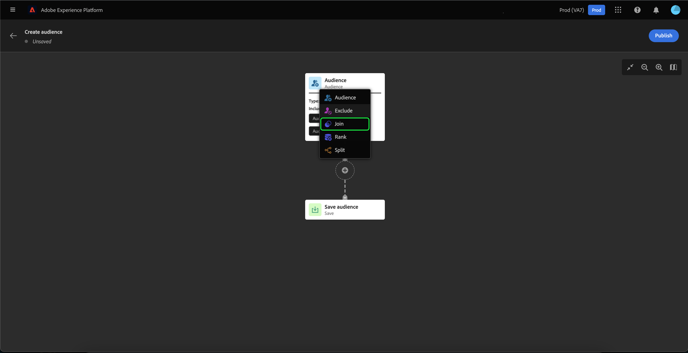

When you select the block, details about the join are shown in the right rail, including the block's label and the option to add audiences to the enrichment dataset.

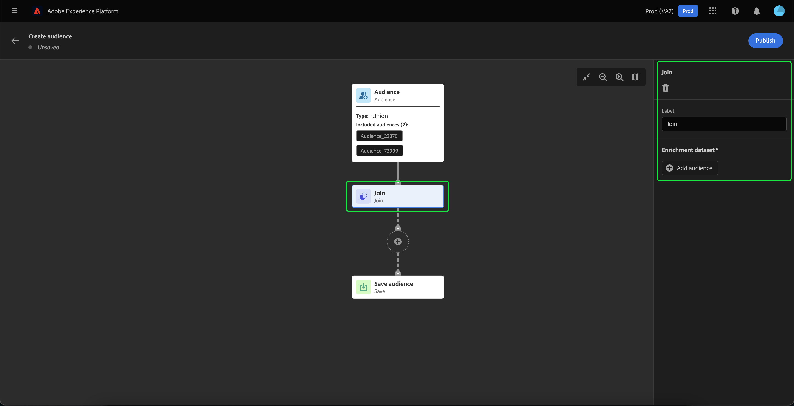

After selecting **[!UICONTROL Add Audience]**, a list of audiences appears. Select the audiences you want to include, followed by **[!UICONTROL Add]** to add them to your join block.

Your selected audiences now appear within the right rail when the **[!UICONTROL Join]** block is selected. 

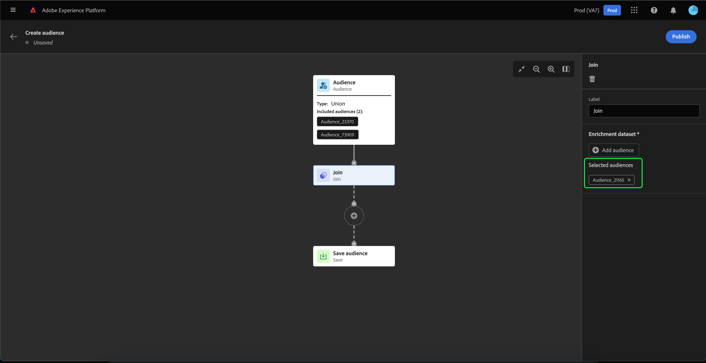 -->

## [!UICONTROL Rank] {#rank-block}

The **[!UICONTROL Rank]** block type allows you to rank and sort profiles based on a specified attribute and include these ranked profiles to your composition.

To add a **[!UICONTROL Rank]** block, select the **+** icon, followed by **[!UICONTROL Rank]**.

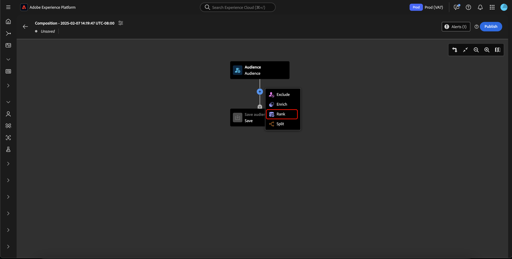

When you select the block, details about the ranking are shown in the right rail, including the block's label, the attribute to rank by, the ranking order, and a toggle for limiting the number of profiles to rank.

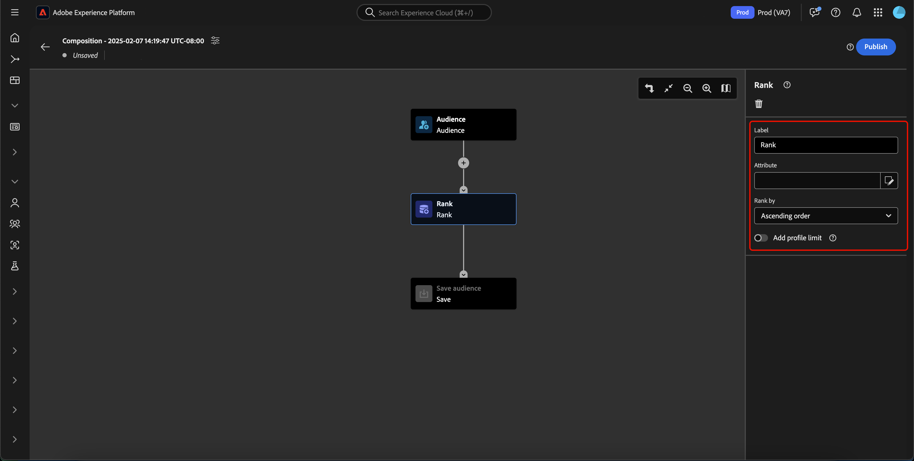

To select which attribute to rank the audiences by, select the  icon.

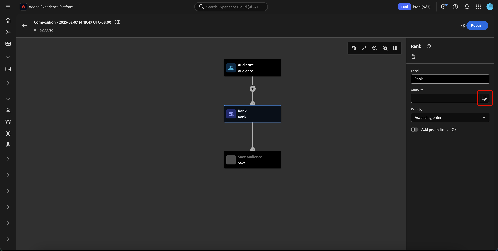

A list of profile attributes appears. On this popover, you can select the attribute type you want to rank your audience by. Select **[!UICONTROL Select]** to add it to your rank block. Please note that the selected attribute can **only** be numbers.

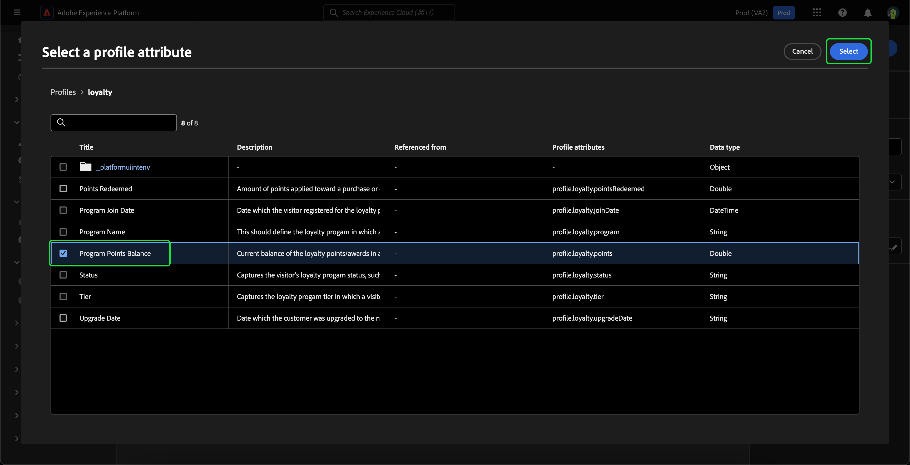

After selecting the attribute, you can select the order to rank it by. This is either in ascending (from lowest to highest) or descending (from highest to lowest) order.

Additionally, you can limit the number of audiences returned by enabling the **[!UICONTROL Add profile limit]** toggle. When this toggle is enabled, you can set the maximum number of audiences returned within the **[!UICONTROL Included profiles]** field.

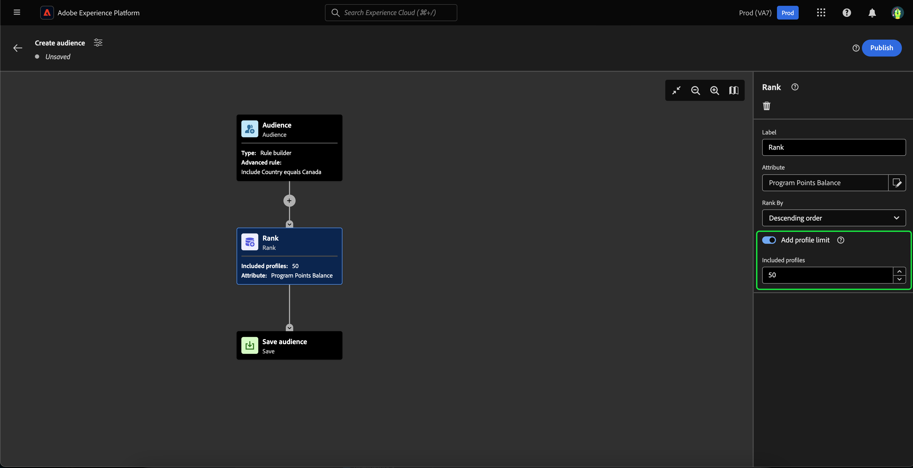

## [!UICONTROL Split] {#split-block}

The **[!UICONTROL Split]** block type allows you to split your new audience into various sub-audiences. You can either split this audience based on percentage or by an attribute.

To add a **[!UICONTROL Split]** block, select the **+** icon, followed by **[!UICONTROL Split]**.

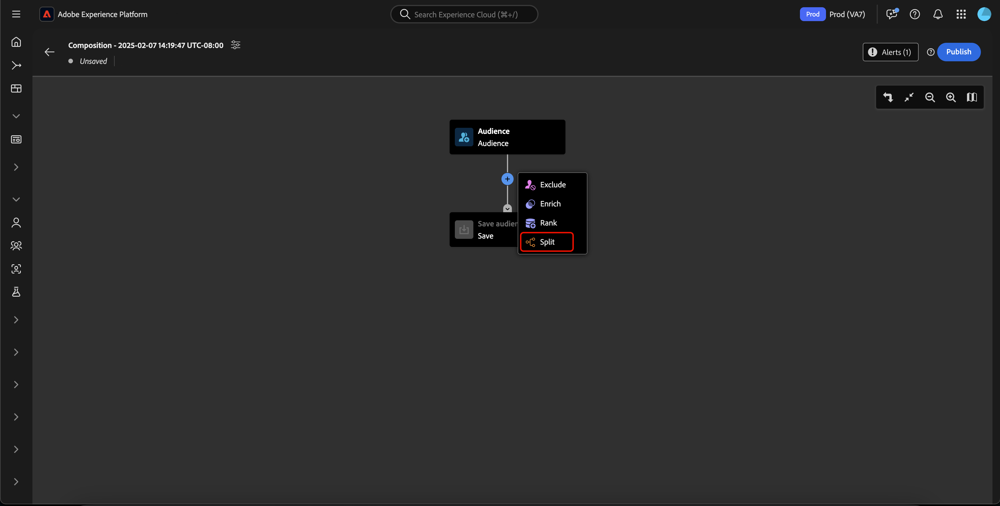

When splitting your audience, you can either split by percentage or split by attribute.

### Split by percentage {#split-percentage}

When splitting by percentage, the audiences will be randomly split, based on the number of paths and percentages provided.

For example, you could have three paths, each with a differing percentage of profiles.

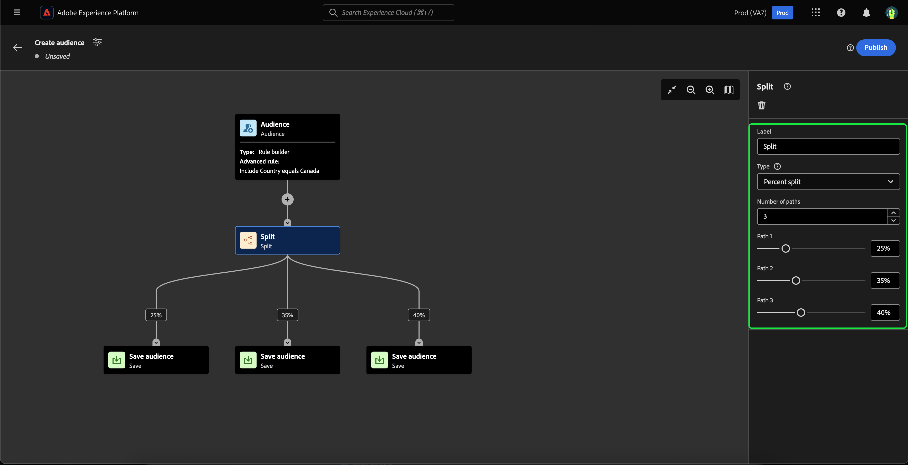

### Split by attribute {#split-attribute}

When splitting by attribute, the audiences will be split based on the provided attributes. To select the attribute to split by, select the **[!UICONTROL Split]** block, followed by the  icon. 

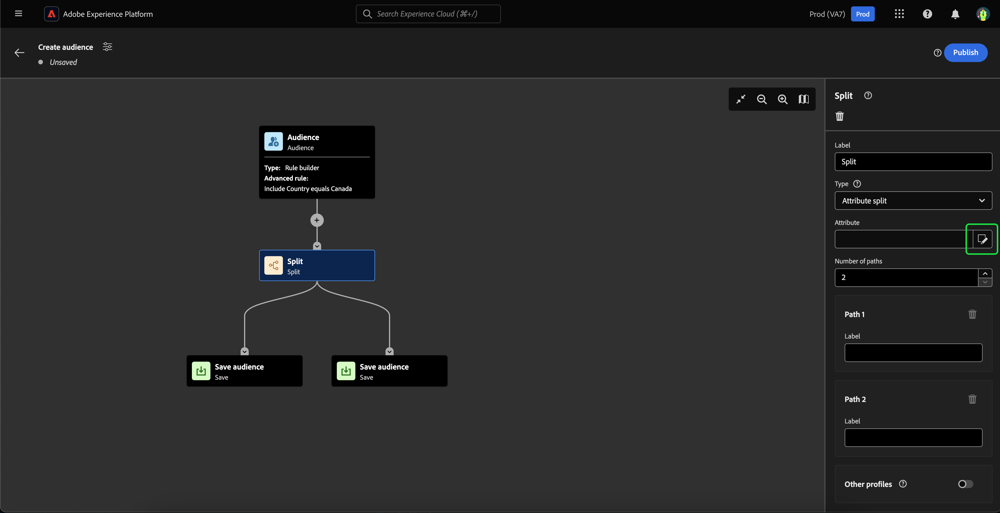

A list of profile attributes appears. Select the attribute type, followed by **[!UICONTROL Select]** to add it to your split block. 

After selecting the attribute, you can choose which profiles will belong to which sub-audience by adding the values within the **[!UICONTROL Values]** field.

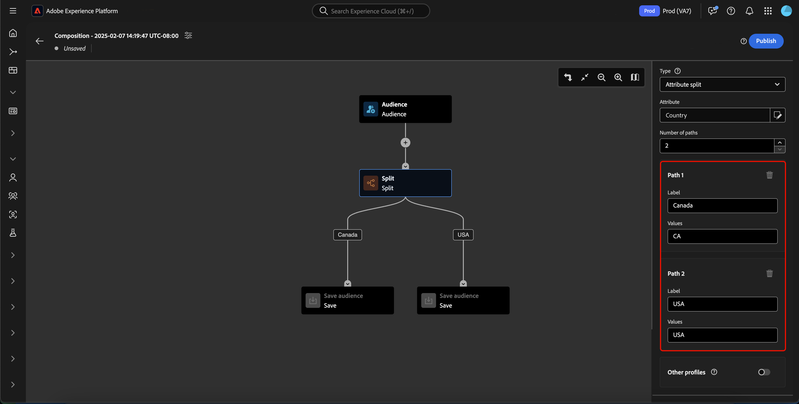

Additionally, you can enable the **[!UICONTROL Other profiles]** toggle to create a sub-audience that comprises of all the non-selected profiles.

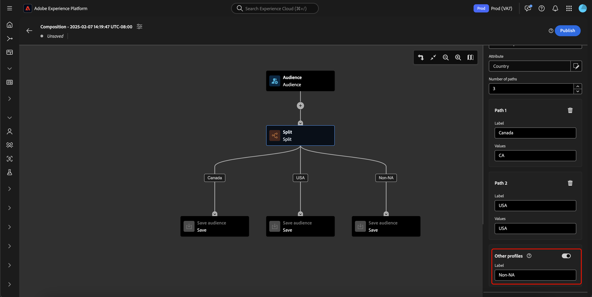

## Publishing your audience

After composing your audience, you can save and publish it by selecting **[!UICONTROL Publish]**. 

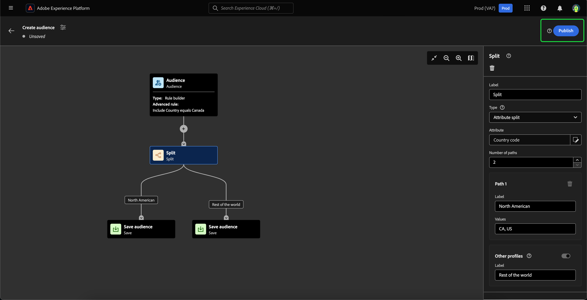

If there are any errors in creating the audience, an alert appears, letting you know how to resolve the issue.

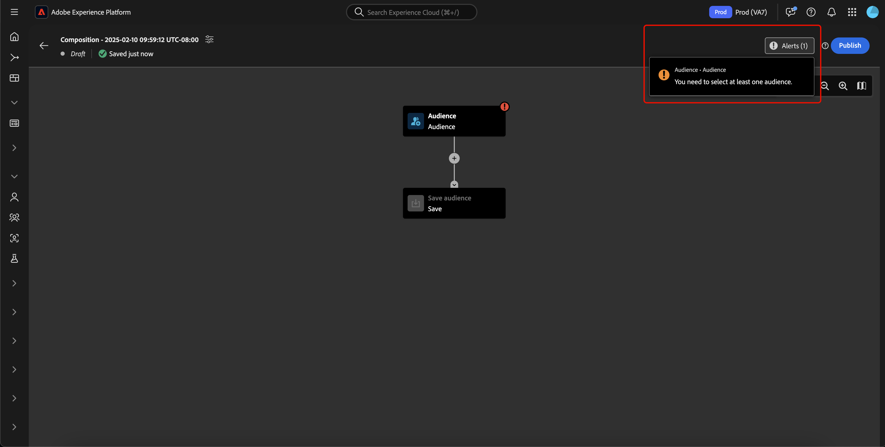

## Next steps

Audience Composition provides a rich workflow allowing you to create audiences from the different block types. To learn more about other parts of the Segmentation Service UI, please read the [Segmentation Service user guide](./overview.md).
