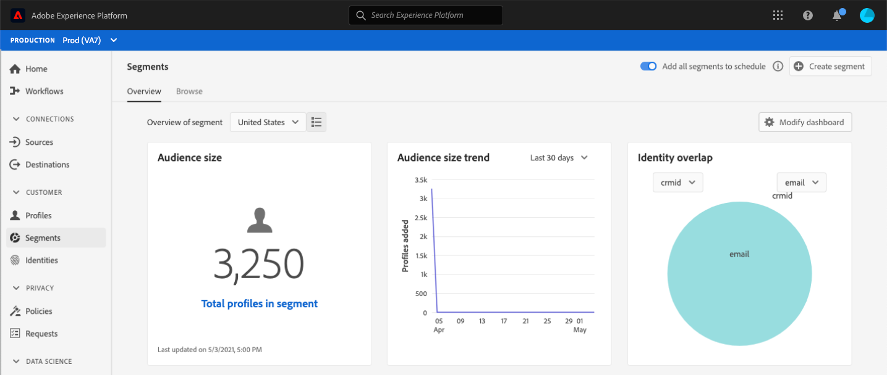

# [!UICONTROL Audiences] dashboard {#audience-dashboard}

The Adobe Experience Platform user interface (UI) provides a dashboard through which you can view important information about your audiences, as captured during a daily snapshot. 

For detailed instructions on how to access and interact with the audiences dashboard in the UI, as well as to learn more about the available metrics displayed in the dashboard, please visit the [audiences dashboard guide](../../dashboards/guides/audiences.md).  

For an overview of all of the dashboard features within the Experience Platform user interface, please begin by reading the [dashboards overview](../../dashboards/home.md).

