# Audience Portal overview

Audience Portal is a central hub, within Adobe Experience Platform, that allows you to view, manage, and create audiences.

Within Audience Portal, you can accomplish the following tasks:

>[!BEGINSHADEBOX]

- [View a list of your audiences](#list)
  - [Use quick actions on your audiences](#quick-actions)
  - [Customize the properties displayed in your list of audiences](#customize)
  - [Use filters, folders, and tags to organize your audiences](#manage-audiences)
- [View details about your audience](#audience-details)
  - [View a summary about your audience](#audience-summary)
- [Enable your audiences for scheduled segmentation](#scheduled-segmentation)
- [Create an audience](#create-audience)
  - [Use Segment Builder to create an audience](#segment-builder)
  - [Use Audience Composition to create an audience](#audience-composition)
  - [Use Federated Audience Composition to create an audience using data from your existing data warehouse](#fac)
  - [Use Data Distiller to create an audience](#data-distiller)
- [Import externally generated audiences](#import-audience)

>[!ENDSHADEBOX] 

To open Audience Portal, select the **[!UICONTROL Browse]** tab within the Segmentation section. 

## Audience list {#list}

>[!CONTEXTUALHELP]
>id="platform_segments_browse_churncolumnname"
>title="Churn"
>abstract="The churn represents the percentage of profiles that are changing within an audience compared to the last time the segment job ran."

>[!CONTEXTUALHELP]
>id="platform_segments_browse_evaluationmethodcolumnname"
>title="Evaluation method"
>abstract="Evaluation methods for audiences include batch, streaming, and edge."

By default, Audience Portal displays a list of all the audiences in your organization and sandbox including the profile count, origin, created date, last modified date, tags, and breakdown. 

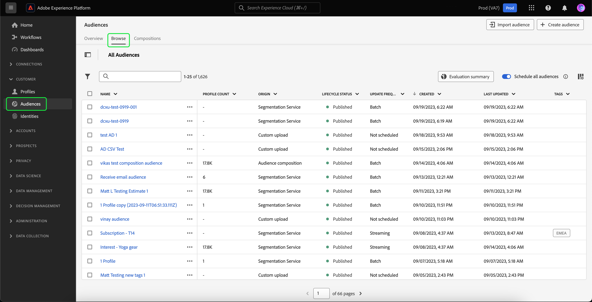

### Quick actions {#quick-actions}

Next to each audience is an ellipsis icon. Selecting this displays a list of available quick actions for the audience. This list of actions differs, based on the audience's origin.

![The quick actions list is shown for audiences with the origin of [!UICONTROL Audience composition].](../images/ui/audience-portal/browse-audience-composition-details.png)

| Action | Origins | Description |
| ------ | ------- | ----------- |
| [!UICONTROL Edit] | Segmentation Service | Opens the Segment Builder to edit your audience. Please note that if your audience was created through the API, you will **not** be able to edit it using Segment Builder. For more information on using the Segment Builder, please read the [Segment Builder UI guide](./segment-builder.md). |
| [!UICONTROL Open composition] | Audience composition | Opens the Audience composition to see your audience. For more information on Audience composition, please read the [audience composition UI guide](./audience-composition.md). |
| [!UICONTROL Activate to destination] | Segmentation Service | Activates the audience to a destination. For more detailed information on activating an audience to a destination, please read the [activation overview](../../destinations/ui/activation-overview.md). |
| [!UICONTROL Share with partners] | Audience composition, Custom upload, Segmentation Service | Shares your audience with other Experience Platform users. For more information on this feature, please read the [Segment Match overview](./segment-match/overview.md). |
| [!UICONTROL Manage tags] | Audience composition, Custom upload, Segmentation Service | Manages the user-defined tags that belong to the audience. For more information on this feature, please read the section on [filtering and tagging](#manage-audiences). |
| [!UICONTROL Move to folder] | Audience composition, Custom upload, Segmentation Service |  Manages which folder the audience belongs to. For more information on this feature, please read the section on [filtering and tagging](#manage-audiences). |
| [!UICONTROL Copy] | Segmentation Service | Duplicates the selected audience. More information about this function can be found in the [Segmentation FAQ](../faq.md#copy). |
| [!UICONTROL Apply access labels] | Audience composition, Custom upload, Segmentation Service | Manages the access labels that belong to the audience. For more information on access labels, please read the documentation on [managing labels](../../access-control/abac/ui/labels.md). |
| [!UICONTROL Publish] | Custom upload, Segmentation Service | Publishes the selected audience. For more information on lifecycle status management, please read the [lifecycle state section of the Segmentation FAQ](../faq.md#lifecycle-states). |
| [!UICONTROL Deactivate] | Custom upload, Segmentation Service | Deactivates the selected audience. Please note that in order to deactivate an audience, it **cannot** be activated in **any** destination (including non-Experience Platform destinations) or be part of **any** other audiences. For more information on lifecycle status management, please read the [lifecycle state section of the Segmentation FAQ](../faq.md#lifecycle-states). |
| [!UICONTROL Delete] | Audience composition, Custom upload, Segmentation Service | Deletes the selected audience. Audiences that are used in downstream destinations or are dependents in other audiences **cannot** be deleted. For more information on audience deletion, please read the [segmentation FAQ](../faq.md#lifecycle-states). |
| [!UICONTROL Add to package] | Audience composition, Custom upload, Segmentation Service | Moves the audience between sandboxes. For more information on this feature, please read the [sandbox tooling guide](../../sandboxes/ui/sandbox-tooling.md). |

>[!IMPORTANT]
>
>Before deleting your audience, please ensure that the audience is **not** used as a component in an account-based audience or used in Adobe Journey Optimizer.

On the top of the page are options to add all audiences to a schedule, import an audience, create a new audience, and view a summary of the audience evaluation. 

Toggling **[!UICONTROL Schedule all audiences]** will enable scheduled segmentation. More information on scheduled segmentation can be found in the [scheduled segmentation section of this user guide](#scheduled-segmentation).

Selecting **[!UICONTROL Import audience]** will let you import an externally generated audience. To learn more about importing audiences, please read the section on [importing an audience in the user guide](#import-audience).

Selecting **[!UICONTROL Create audience]** will let you create an audience. To learn more about creating audiences, please read the section on [creating an audience in the user guide](#create-audience).

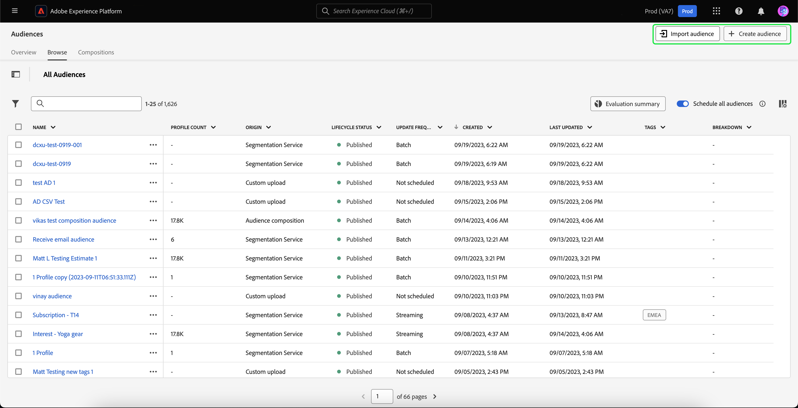

You can select **[!UICONTROL Evaluation summary]** to display a pie chart that shows a summary of the audience evaluations.

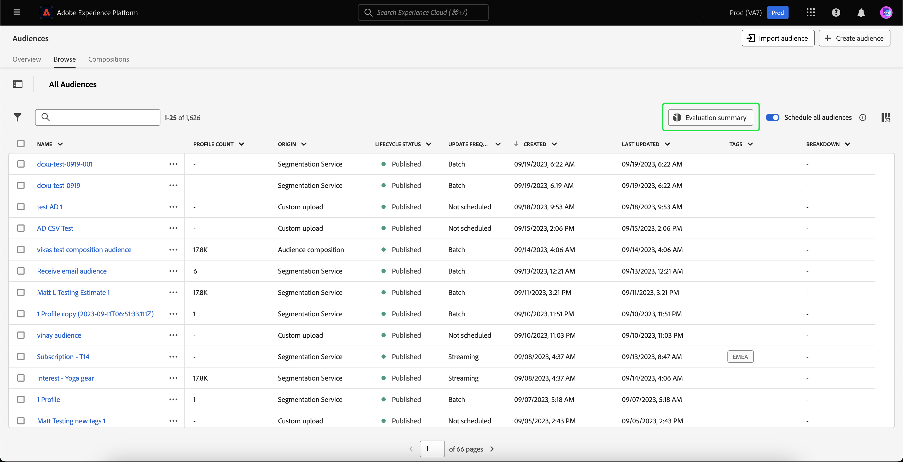

The pie chart appears, displaying a breakdown of the audiences by audience evaluation. The chart displays the total number of audiences in the middle, and the daily batch evaluation time in UTC at the bottom. If you hover over the different parts of the audience, it will display the number of audiences that belong to each update frequency type.

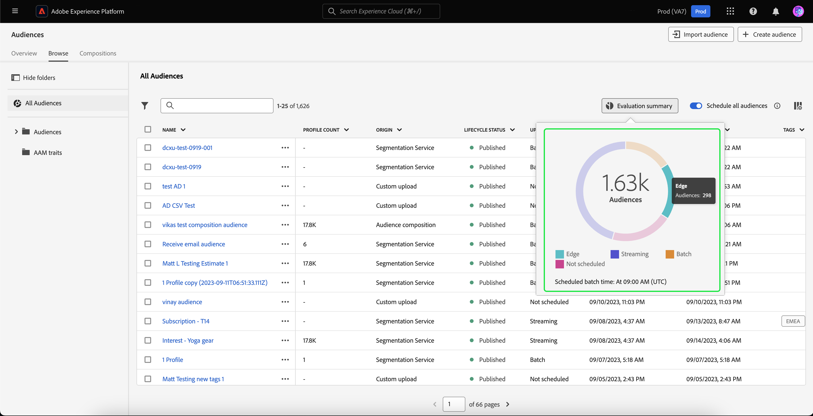

### Customize {#customize}

You can add additional fields to Audience Portal by selecting . These additional fields include lifecycle status, update frequency, last updated by, description, created by, and access labels.

| Field | Description | 
| ----- | ----------- |
| [!UICONTROL Name] | The name of the audience. |
| [!UICONTROL Profile count] | The total number of profiles that qualify for the audience. | 
| [!UICONTROL Origin] | The origin of the audience. This states where the audience comes from. Possible values include [Segmentation Service](#segment-builder), [Custom upload](#import-audience), [Audience composition](#audience-composition), [Audience Manager](https://experienceleague.adobe.com/en/docs/audience-manager/user-guide/aam-home), [Look-alike audience](../types/lookalike-audiences.md), [Federated Audience Composition](#fac), [Customer Journey Analytics](https://experienceleague.adobe.com/en/docs/analytics-platform/using/cja-overview/cja-overview), [Data Distiller](#data-distiller), [AJO B2B](https://experienceleague.adobe.com/en/docs/journey-optimizer-b2b/user/guide-overview), and [Real-Time CDP Collaboration](https://experienceleague.adobe.com/en/docs/real-time-cdp-collaboration/using/destinations/experience-platform#audience-portal). |
| [!UICONTROL Lifecycle status] | The status of the audience. Possible values for this field include `Draft`, `Inactive`, and `Published`. More information about lifecycle statuses, including what the different states mean and how to move audiences to different lifecycle states, read the [lifecycle status section of the Segmentation FAQ](../faq.md#lifecycle-status). |
| [!UICONTROL Update frequency] | A value that states how often the audience's data is updated. Possible values for this field include [!UICONTROL Batch], [!UICONTROL Streaming], [!UICONTROL Edge], and [!UICONTROL Not Scheduled]. |
| [!UICONTROL Last updated by] | The name of the person who last updated the audience. |
| [!UICONTROL Created] | The date and time, in UTC, that the audience was created. |
| [!UICONTROL Last updated] | The date and time, in UTC, that the audience was last updated. |
| [!UICONTROL Tags] | The user-defined tags that belong to the audience. More information about these tags can be found in the [section on tags](#tags). |
| [!UICONTROL Description] | The description of the audience. |
| [!UICONTROL Created by] | The name of the person who created the audience. |
| [!UICONTROL Access labels] | The access labels for the audience. Access labels allow you to categorize datasets and fields according to usage policies that apply to that data. These labels can be applied at any time, providing flexibility in how you choose to govern data. For more information on access labels, please read the documentation on [managing labels](../../access-control/abac/ui/labels.md). |
| [!UICONTROL Breakdown] | The profile status breakdown for the audience. A more detailed description of this profile status breakdown can be found below. |

If breakdown is selected, the display shows a bar graph outlining the percentage of profiles that belong to each of the following calculated profile statuses: [!UICONTROL Realized], [!UICONTROL Existing], and [!UICONTROL Exiting]. Additionally, the breakdown shown on the [!UICONTROL Browse] tab is the most accurate breakdown of the segment definition status. If this number differs with what is stated on the [!UICONTROL Overview] tab, you should use the numbers on the [!UICONTROL Browse] tab as the correct source of information, since the [!UICONTROL Overview] tab numbers only update once per day.

| Status | Description |
| ------ | ----------- |
| [!UICONTROL Realized] | The count of profiles that **qualified** for the audience in the last 24 hours since the last batch segment job ran. |
| [!UICONTROL Existing] | The count of profiles which **remained** in the audience in the last 24 hours since the last batch segment job ran. This field is **calculated** and does not show up in the [`segmentMembership` object](../../xdm/field-groups/profile/segmentation.md). |
| [!UICONTROL Exiting] | The count of profiles which **exited** the audience in the last 24 hours since the last batch segment job ran. |

After you select the fields you want to display, you can also re-size the width of the displayed columns. You can either do this by dragging the area between the columns or by selecting the  of the column you want to re-size, followed by **[!UICONTROL Resize column]**.

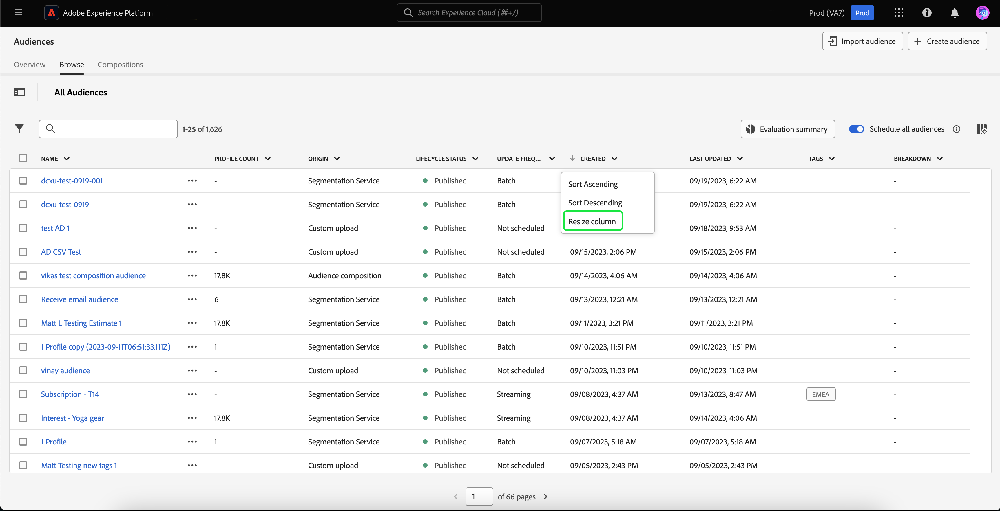

### Filtering, folders, and tagging {#manage-audiences}

To improve your work efficiency, you can search for existing audiences, add user-defined tags to audiences, put audiences in folders, and filter the displayed audiences.

#### Search {#searching}

You can search your existing audiences in up to 9 different languages with [!DNL Unified Search]. 

To use [!DNL Unified Search], add the term you want to search in the highlighted search bar.

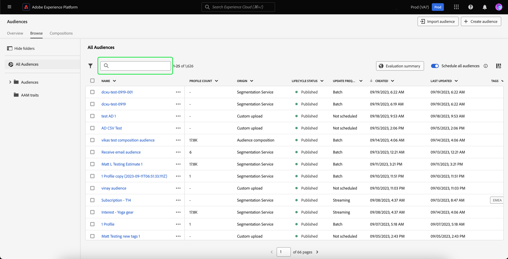

For more information about [!DNL Unified Search], including supported features, please read the [Unified Search documentation](https://experienceleague.adobe.com/docs/core-services/interface/services/search-experience-cloud.html).

#### Tags {#tags}

You can add user-defined tags to better describe, find, and manage your audiences.

To add a tag, select **[!UICONTROL Manage tags]** on the audience you want to tag.

![The [!UICONTROL Manage tags] button is selected for a specified audience.](../images/ui/audience-portal/browse-manage-tags.png)

The **[!UICONTROL Manage tags]** popover appears. On this popover, you can either select a categorized tag or an uncategorized tag.

| Tag type | Description |
| -------- | ----------- |
| Categorized | A tag that is created and managed by your organization's administrators. |
| Uncategorized | A tag that is created within the [!UICONTROL Manage tags] popover. Anyone can create or manage these types of tags. |

![The [!UICONTROL Manage tags] popover is displayed. The options to choose a categorized or uncategorized are highlighted.](../images/ui/audience-portal/create-tag.png)

After adding all the tags you want to attach to the audience, select **[!UICONTROL Save]**.

![On the [!UICONTROL Manage tags] popover, the added tags are highlighted.](../images/ui/audience-portal/created-tags.png)

For more information on creating and managing tags, please read the [Managing Tags guide](../../administrative-tags/ui/managing-tags.md).

#### Folders {#folders}

You can place audiences within folders for better audience management.

To create a folder to hold your audiences, select **[!UICONTROL Create folder]**.

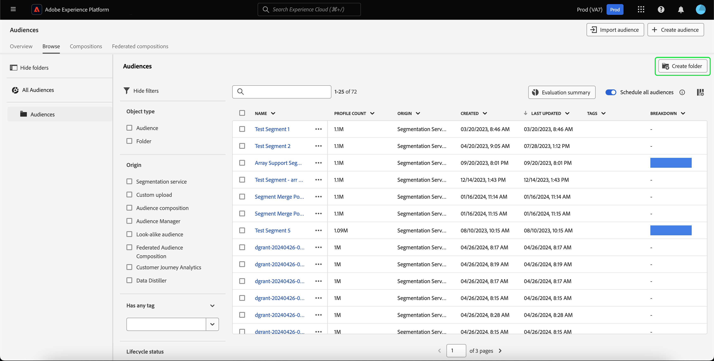

>[!NOTE]
>
>You can only create a folder if you're within another folder. This means you **cannot** create a folder if you have **[!UICONTROL All Audiences]** selected on the left navigation bar.

A popover appears, letting you name your newly created folder. Select **[!UICONTROL Save]** after naming your folder to finish creating the folder. Please note that names **must** be unique to the parent folder.

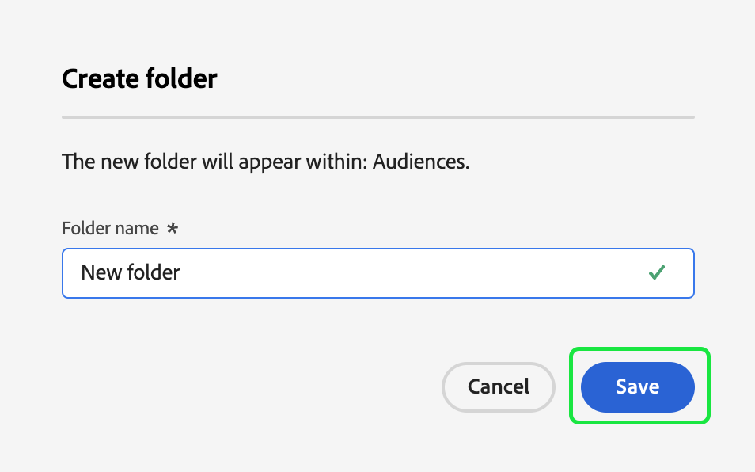

To move an audience into a folder, select **[!UICONTROL Move to folder]** on the audience you want to move.

![The [!UICONTROL Move to folder] button is selected for a specific audience.](../images/ui/audience-portal/browse-move-to-folder.png)

The **Move audience to folder** popover appears. Select the folder you want to move the audience to, then select **[!UICONTROL Save]**.

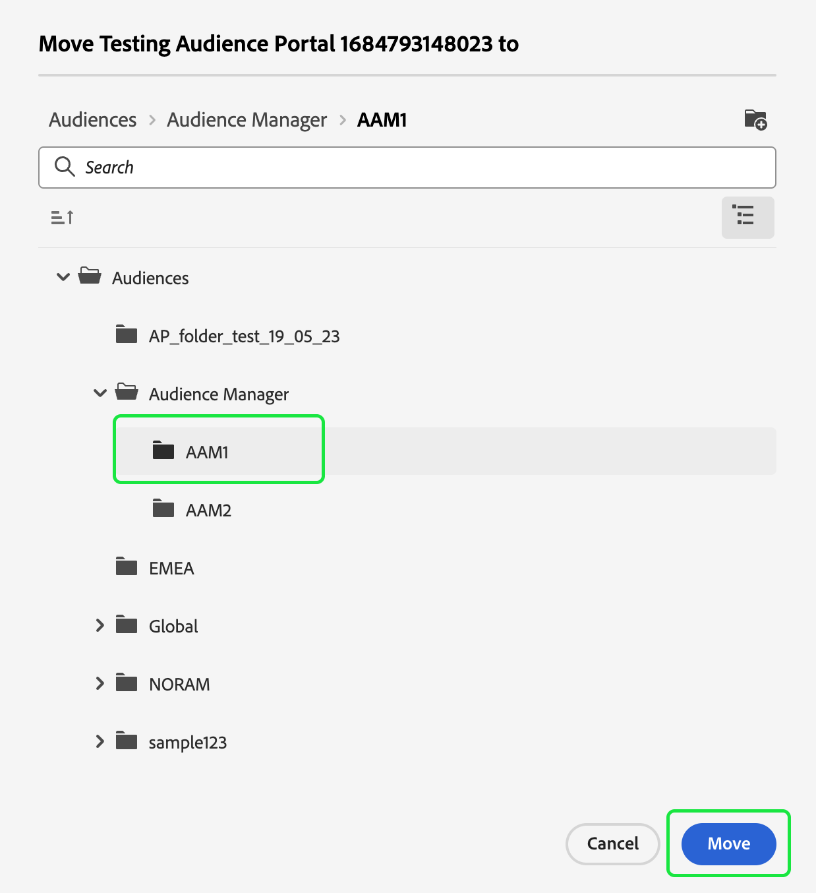

Once the audience is in a folder, you can choose to only display audiences that belong to a specific folder.

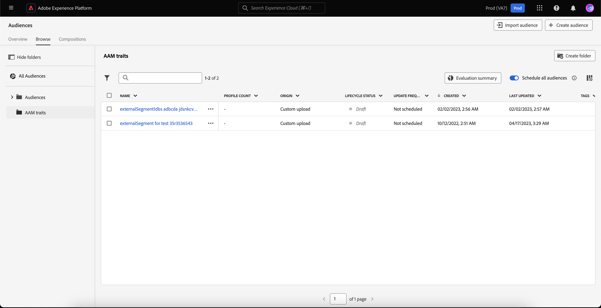

#### Filter {#filter}

You can also filter your audiences, based on a variety of settings.

To filter the available audiences, select the . 

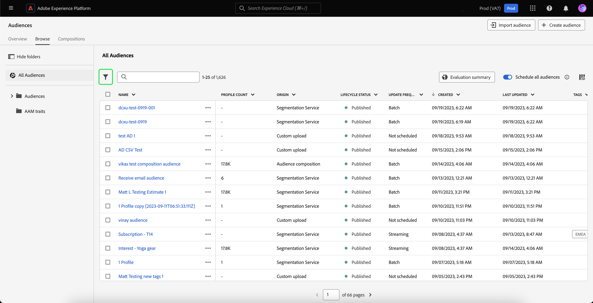

The list of available filters is displayed.

| Filter | Description |
| ------ | ----------- |
| [!UICONTROL Origin] | Lets you filter based on the origin of the audience. Possible values include [Segmentation Service](#segment-builder), [Custom upload](#import-audience), [Audience composition](#audience-composition), [Audience Manager](https://experienceleague.adobe.com/en/docs/audience-manager/user-guide/aam-home), [Look-alike audience](../types/lookalike-audiences.md), [Federated Audience Composition](#fac), [Customer Journey Analytics](https://experienceleague.adobe.com/en/docs/analytics-platform/using/cja-overview/cja-overview), [Data Distiller](#data-distiller), [AJO B2B](https://experienceleague.adobe.com/en/docs/journey-optimizer-b2b/user/guide-overview), and [Real-Time CDP Collaboration](https://experienceleague.adobe.com/en/docs/real-time-cdp-collaboration/using/destinations/experience-platform#audience-portal). |
| [!UICONTROL Has any tag] | Lets you filter by tags. You can select between **[!UICONTROL Has any tag]** and **[!UICONTROL Has all tags]**. When **[!UICONTROL Has any tag]** is selected, the filtered audiences will include **any** of the tags you've added. When **[!UICONTROL Has all tags]** is selected, the filtered audiences must include **all** of the tags you've added. |
| [!UICONTROL Lifecycle status] | Lets you filter based on the audience's lifecycle status. Available options include [!UICONTROL Deleted], [!UICONTROL Draft], [!UICONTROL Inactive], and [!UICONTROL Published]. |
| [!UICONTROL Update frequency] | Lets you filter based on the audience's update frequency (evaluation method). Available options include [!UICONTROL Batch], [!UICONTROL Streaming], and [!UICONTROL Edge] |
| [!UICONTROL Created by] | Lets you filter based on the person who created the audience. |
| [!UICONTROL Creation date] | Lets you filter based on the creation date of the audience. You can choose a date range to filter when the audience was created. |
| [!UICONTROL Modified date] | Lets you filter based on the last modified date of the audience. You can choose a date range to filter when the audience was last modified. |

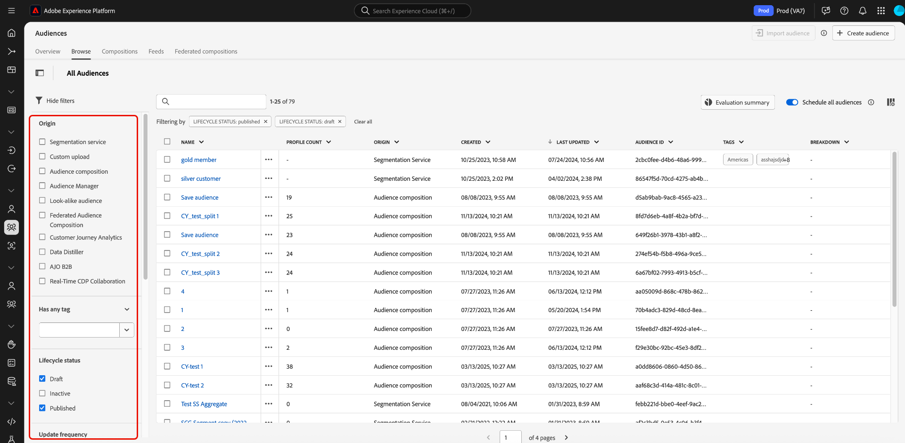

### Bulk actions {#bulk-actions}

Additionally, you can select up to 25 different audiences, and perform various actions on these audiences. These actions include [moving to a folder](#folders), [editing or applying a tag](#tags), [evaluating audiences](#flexible-audience-evaluation), [applying access labels](../../access-control/abac/ui/labels.md),and [deleting](#browse).

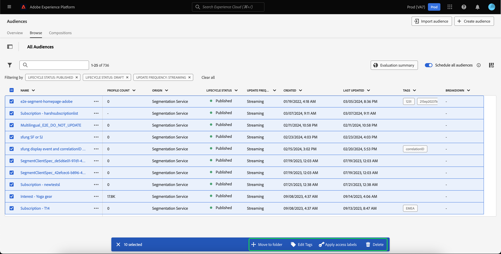

When you apply bulk actions to audiences, the following conditions apply:

- You **can** select audiences from different pages.
- You **cannot** delete an audience which is being used in a destination activation.
- If you select a filter, the selected audiences **will** reset.

#### Flexible audience evaluation {#flexible-audience-evaluation}

Flexible audience evaluation lets you run a segmentation job on demand. To learn more about flexible audience evaluation, read the [flexible audience evaluation guide](../methods/flexible-audience-evaluation.md).

## Audience details {#audience-details}

To see more details about a specific audience, select an audience's name within the **[!UICONTROL Browse]** tab.

The audience details page appears. On the top, there is a summary of the audience, information about the qualified audience size, as well as destinations the segment is activated for. 

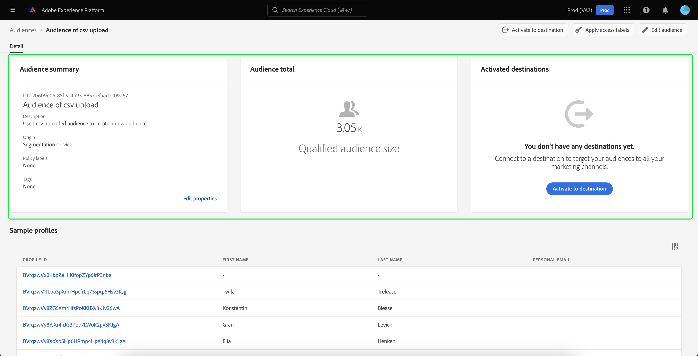

### Audience summary {#audience-summary}

The **[!UICONTROL Audience summary]** section provides information such as the ID, name, description, origin, and details of the attributes. 

Additionally, you are given the option to activate the audience to a destination, apply access labels, or edit/update the audience. 

Selecting **[!UICONTROL Activate to destination]** lets you activate the audience to a destination. For more detailed information on activating an audience to a destination, please read the [activation overview](../../destinations/ui/activation-overview.md).

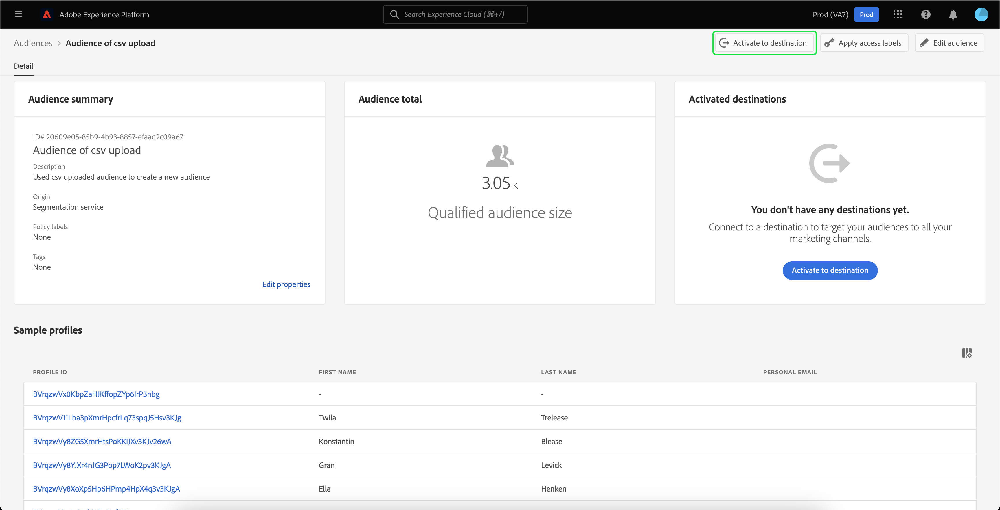

Selecting **[!UICONTROL Apply access labels]** lets you manage the access labels that belong to the audience. For more information on access labels, please read the documentation on [managing labels](../../access-control/abac/ui/labels.md).

>[!BEGINTABS]

>[!TAB Audience composition]

![The audience details page is shown, with the [!UICONTROL Open composition] button highlighted.](../images/ui/audience-portal/audience-details-open-composition.png)

Selecting **[!UICONTROL Open composition]** lets you view your audience in Audience Composition. For more information about Audience Composition, please read the [Audience Composition UI guide](./audience-composition.md).

>[!TAB Custom upload]

![The audience details page is shown, with the [!UICONTROL Update audience] button highlighted.](../images/ui/audience-portal/audience-details-update-audience.png)

Selecting **[!UICONTROL Update audience]** lets you re-upload an externally generated audience. For more information on importing an externally generated audience, please read the section on [importing an audience](#import-audience).

If your audience is within seven days of expiring, you can select **[!UICONTROL Refresh data expiration]** to re-ingest the last successful batch for the audience. 

![The [!UICONTROL Refresh data expiration] button is highlighted within the audience details page.](../images/ui/audience-portal/refresh-data-expiration.png)

This extends the data expiration by the number of days defined on the initial upload and uses the same audience metadata. If the data expiration was not previously defined, the data expiration is extended by 30 days. Once the button has been pressed, you cannot select it for another 20 minutes.

This button will **not** be selectable in the following situations:

- There are no successful batches for the audience
- The initial refresh failed
- The data expiration is greater than seven days
- The audience has already expired

>[!TAB Segmentation Service]

![The audience details page is shown, with the [!UICONTROL Edit audience] button highlighted.](../images/ui/audience-portal/audience-details-edit-audience.png)

Selecting **[!UICONTROL Edit audience]** lets you edit your audience in the Segment Builder. For more detailed information about using the [!DNL Segment Builder] workspace, please read the [[!DNL Segment Builder] user guide](./segment-builder.md).

>[!ENDTABS]

Selecting **[!UICONTROL Edit properties]** will let you edit the basic details of the audience, such as the name, description, and tags.

### Audience total {#audience-total}

For Experience-Platform-generated audiences and compositions, the **[!UICONTROL Audience total]** section shows the total number of profiles that qualify for the audience.

>[!NOTE]
>
>It may take up to 30 minutes for the audience total count to update after the export job is completed.

Estimates are generated by using a sample size of that day's sample data. If there are less than 1 million entities in your Profile store, the full data set is used; for between 1 and 20 million entities, 1 million entities are used; and for over 20 million entities, 5% of the total entities are used. More information about generating estimates can be found in the [estimate generation section](../tutorials/create-a-segment.md#estimate-and-preview-an-audience) of the audience creation tutorial.

### Ingestion details {#ingestion-details}

For audiences with an origin of **[!UICONTROL Custom upload]**, the **[!UICONTROL Ingestion details]** section shows both the profile total, as well as details of the dataset the externally generated audience was ingested into.

>[!NOTE]
>
>It may take up to 30 minutes following the export job for the profile count of the audience to be fully updated.

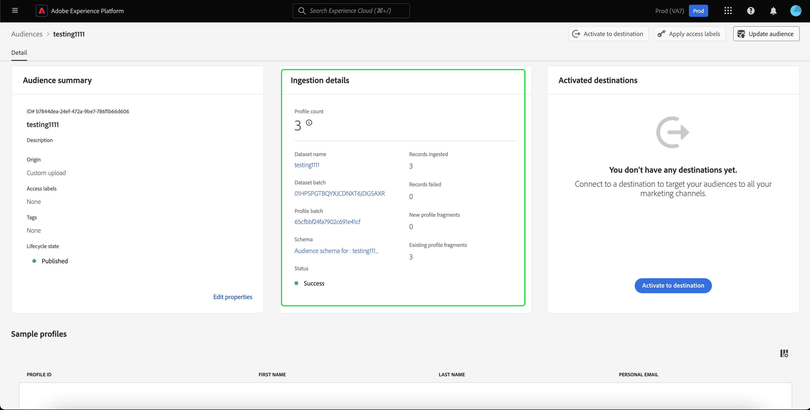

| Property | Description |
| -------- | ----------- |
| Profile count | The total number of profiles that qualify for the audience. |
| Dataset name | The name of the dataset that the audience was ingested into. You can select the dataset name for more information about the dataset. To learn more about datasets, read the [dataset UI guide](../../catalog/datasets/user-guide.md). |
| Dataset batch | The ID of the dataset that the audience was ingested into. You can select the ID of the batch for more information about the batch. To learn more about batches, read the [monitoring data ingestion guide](../../ingestion/quality/monitor-data-ingestion.md#viewing-batches). |
| Profile batch | The ID of the batch that created the profiles on Experience Platform. You can select the ID of the batch for more information about the batch. To learn more about batches, read the [monitoring data ingestion guide](../../ingestion/quality/monitor-data-ingestion.md#viewing-batches). |
| Schema | The name of the schema that the audience belongs to. You can select the name of the schema to view information about the schema's structure and apply data usage labels. For more information, read the [manage data usage labels for a schema guide](../../xdm/tutorials/labels.md). |
| Records ingested | The number of records ingested into the dataset. |
| Records failed | The number of records that were not able to be ingested into the dataset. |
| New profile fragments | The number of new profiles that were created. |
| Existing profile fragments | The number of existing profiles that were updated. |

>[!NOTE]
>
>Applying data usage labels to the schema is the best practice. You **cannot** apply a data usage label directly to the audience.

### Activated destinations {#activated-destinations}

The **[!UICONTROL Activated destinations]** section shows the destinations that this audience is activated for.

>[!NOTE]
>
> Destinations are a feature available with [!DNL Adobe Real-Time Customer Data Platform], and allow you to export data to external platforms. For more information on destinations, please read the [destinations overview](../../destinations/home.md). To learn how to activate a segment to a destination, see [activation overview](../../destinations/ui/activation-overview.md).

### Profile samples {#profile-samples}

Underneath is a sampling of profiles that qualify for the segment, detailing information including the [!DNL Profile] ID, first name, last name, and personal email. 

The way data sampling gets triggered depends on the method of ingestion.

For batch ingestion, the Profile store is automatically scanned every fifteen minutes to see if a new batch was successfully ingested since the last sampling job was run. If that is the case, the Profile store is subsequently scanned to see if there's been at least a 3% change in the number of records. If these conditions are met, a new sampling job is triggered.

For streaming ingestion, the Profile store is automatically scanned every hour to see if there's been at least a 3% change in the number of records. If this condition is met, a new sampling job is triggered.

The sample size of the scan depends on the overall number of entities in your Profile store. These sample sizes are represented in the following table:

| Entities in Profile store | Sample size |
| ------------------------- | ----------- |
| Less than 1 million | Full data set |
| 1 to 20 million | 1 million |
| Over 20 million | 5% of total |

More detailed information about each [!DNL Profile] can be seen by selecting the [!DNL Profile] ID. To learn more about a profile's details, please read the [[!DNL Real-Time Customer Profile] user guide](../../profile/ui/user-guide.md#profile-detail).

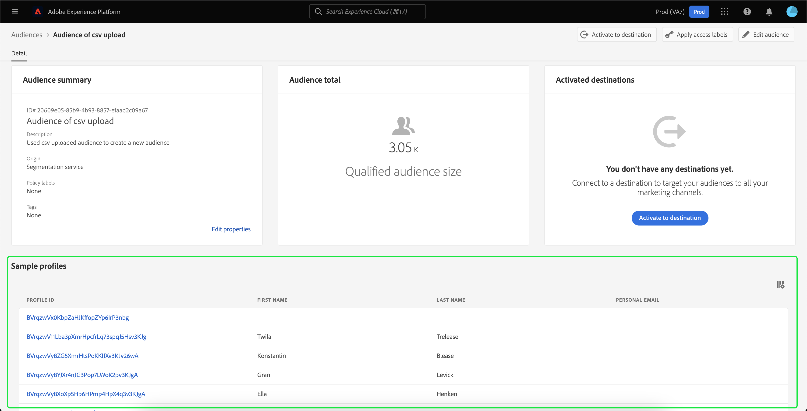

## Scheduled segmentation {#scheduled-segmentation}

>[!CONTEXTUALHELP]
>id="platform_segments_browse_addallsegmentstoschedule"
>title="Add all audiences to schedule"
>abstract="Enable to include all audiences evaluated using batch segmentation in the daily scheduled update. Disable to remove all audiences from the scheduled update."

Once audiences have been created, you can then evaluate them through on-demand or scheduled (continuous) evaluation. Evaluation means moving [!DNL Real-Time Customer Profile] data through segment jobs in order to produce corresponding audiences. Once created, the audiences are saved and stored so that they can be exported using [!DNL Experience Platform] APIs. 

On-demand evaluation involves using the API to perform evaluation and build audiences as needed, whereas scheduled evaluation (also known as 'scheduled segmentation') allows you to create a recurring schedule to evaluate audiences at a specific time (at a maximum, once daily).

### Enable scheduled segmentation {#enable-scheduled-segmentation}

Enabling your audiences for scheduled evaluation can be done using the UI or the API. In the UI, return to the **[!UICONTROL Browse]** tab within **[!UICONTROL Audiences]** and toggle on **[!UICONTROL Schedule all audiences]**. This will cause all audiences to be evaluated based on the schedule set by your organization.

>[!NOTE]
>
>Scheduled evaluation can be enabled for sandboxes with a maximum of five (5) merge policies for [!DNL XDM Individual Profile]. If your organization has more than five merge policies for [!DNL XDM Individual Profile] within a single sandbox environment, you will not be able to use scheduled evaluation.

Schedules can currently only be created using the API. For detailed steps on creating, editing, and working with schedules using the API, please follow the tutorial for evaluating and accessing segmentation results, specifically the section on [scheduled evaluation using the API](../tutorials/evaluate-a-segment.md#scheduled-evaluation).

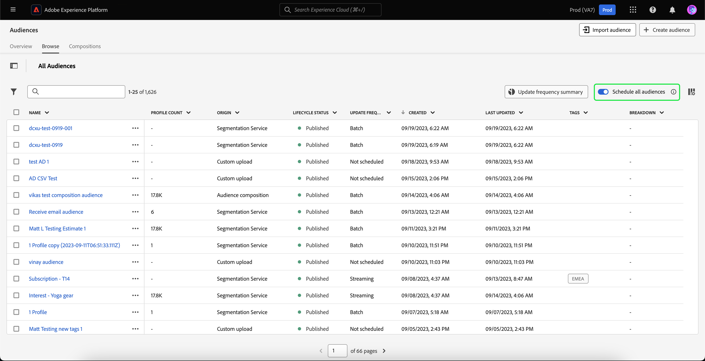

## Creating an audience {#create-audience}

You can select **[!UICONTROL Create audience]** to create an audience. 

A popover appears, letting you choose between composing an audience or building rules.

### Audience Composition {#audience-composition}

Selecting **[!UICONTROL Compose audiences]** takes you to Audience Composition. This workspace provides intuitive controls for building and editing audiences, such as drag-and-drop tiles used to represent different actions. To learn more about creating audiences, please read the [Audience Composition guide](./audience-composition.md).

### Segment Builder {#segment-builder}

Selecting **[!UICONTROL Build rule]** takes you to the Segment Builder. This workspace provides intuitive controls for building and editing segment definitions, such as drag-and-drop tiles used to represent data properties. To learn more about creating segment definitions, please read the [Segment Builder guide](./segment-builder.md)

### Federated Audience Composition {#fac}

You can use Adobe Federated Audience Composition to build new audiences from enterprise datasets without copying underlying data and store those audiences in Adobe Experience Platform Audience Portal. 

You can also enrich existing audiences in Adobe Experience Platform by utilizing composed audience data that has been federated from the enterprise data warehouse. Please read the guide on [Federated Audience Composition](https://experienceleague.adobe.com/en/docs/federated-audience-composition/using/home).

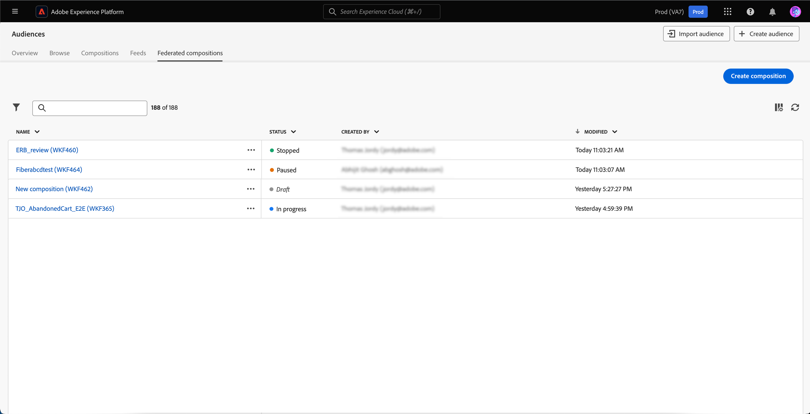

### Data Distiller {#data-distiller}

You can use Data Distiller's SQL extension to build audiences from the data lake. This data includes existing dimension entities such as customer attributes or product information.

More information about Data Distiller can be found in the [building audiences using SQL guide](../../query-service/data-distiller-audiences/overview.md).

## Importing an audience {#import-audience}

>[!CONTEXTUALHELP]
>id="platform_segmentation_importaudience_dataexpiration"
>title="Data expiration"
>abstract="The number of days that the audience membership will expire. This value can be set from 1 day to 90 days. Once the audience membership expires, evaluation will stop and all the profiles will exit the audience membership. You can refresh the expiration window when there are less than 7 days remaining in audience membership. However, once there are 0 days remaining, you will not be able to refresh the expiration window."

>[!IMPORTANT]
>
>In order to import an externally generated audience, you **must** have the following permissions: [!UICONTROL View segments], [!UICONTROL Manage segments], and [!UICONTROL Import audience]. For more information on these permission, read the [access control overview](../../access-control/home.md#permissions).

You can select **[!UICONTROL Import audience]** to import an externally generated audience.

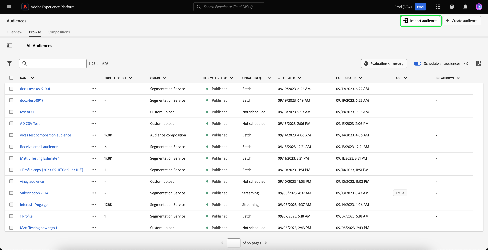

The **[!UICONTROL Import audience CSV]** workflow appears. You can select a CSV file to import as an externally generated audience.

![In the [!UICONTROL Import audience CSV] workflow, the [!UICONTROL Drag and drop files] box is highlighted, showing where you can upload your externally generated audience.](../images/ui/audience-portal/import-audience-csv.png)

>[!NOTE]
>
>The external generated audience **must** be in CSV format, have a **maximum** of 25 columns, and be less than 1GB.
>
>Additionally, you **cannot** use spaces or dashes in the first row or the associated columns of the CSV.
>
>For example, the first row's value can be "FirstName" or "First_Name", but it cannot be "First Name" or "First-Name".

After selecting the CSV file to import, a list of sample data is shown for this externally generated audience. After confirming that the sample data is correct, select **[!UICONTROL Next]**.

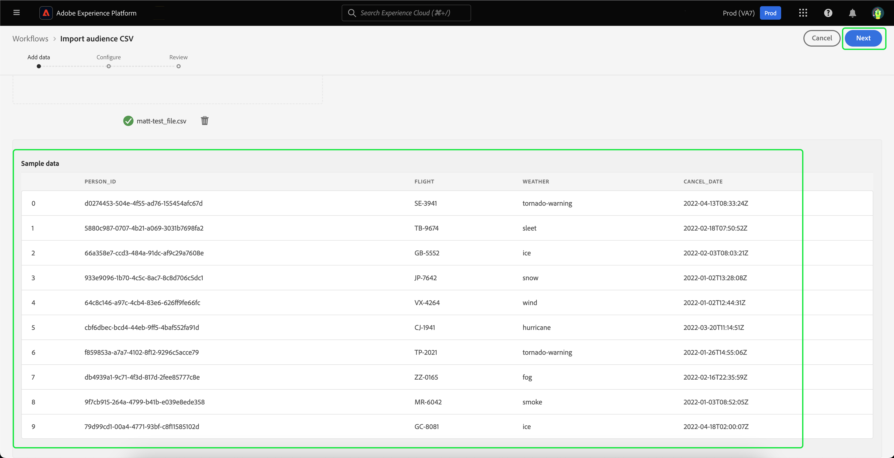

The **[!UICONTROL Audience details]** page appears. You can add information about your audience, including its name, description, primary identity, and identity namespace value. 

When importing the externally generated audience, you must select one of the columns to be the primary identity field and specify the namespace value. Please note that all the remaining fields will be considered **payload attributes**. These attributes are considered **non-durable**, as they will only be associated with this audience for purposes of personalization, and are **not** connected to the profile.

![The [!UICONTROL Audience details] page is displayed.](../images/ui/audience-portal/import-audience-audience-details.png)

You can also optionally add some extra details to your externally generated audience, including giving it an external ID, defining its merge policy, editing its column data type, or applying a custom data expiration.

+++ Custom external audience ID

>[!NOTE]
>
>If you use a custom external audience ID, it must adhere to the following guidelines:
>
> - It **must** start with a letter (a-z or A-Z), underscore (_), or a dollar sign ($).
> - All subsequent characters can be alphanumeric (a-z, A-Z, 0-9), underscores (_), or dollar signs ($).

+++

>[!NOTE]
>
>The custom data expiration sets the number of days that profiles will **remain** in the audience membership. After the data expiration is over, the profiles will exit the audience membership. This value can be set from 1 to 90 days.

After filling in your audience details, select **[!UICONTROL Next]**.

![The [!UICONTROL Next] button is highlighted on the [!UICONTROL Audience details] page.](../images/ui/audience-portal/import-audience-filled-details.png)

The **[!UICONTROL Review]** page is displayed. You can review the details of your newly imported externally generated audience.

![The [!UICONTROL Review] page is displayed, showing details of your newly imported externally generated audience.](../images/ui/audience-portal/import-audience-review-details.png)

After confirming the details are correct, select **[!UICONTROL Finish]** to import your externally generated audience into Adobe Experience Platform.

>[!IMPORTANT]
>
>By default, externally generated audiences have a data expiration of 30 days. The data expiration is reset if the audience is updated or modified in any way.
>
>Additionally, if your externally generated audience contains sensitive and/or healthcare-related information, you **must** apply the necessary data usage labels before activating it to any destination. Since variables from externally generated audiences are stored in the data lake rather than within Real-time Customer Profile, you should **not** include consent data within your CSV file. 
>
>For more information on applying data usage labels, please read the documentation on [managing labels](../../access-control/abac/ui/labels.md). To learn about data usage labels on Experience Platform in general, please read the [data usage labels overview](../../data-governance/labels/overview.md). To learn about how consent works in externally generated audiences, please read the [audiences FAQ](../faq.md#consent).

## Next steps

After reading this overview, you should be able to use Audience Portal to effectively manage, create, and import audiences into Adobe Experience Platform.

For more information on using the Segmentation Service UI, please read the [Segmentation Service UI overview](./overview.md).

To find out frequently asked questions about Audience Portal, please read the [frequently asked questions](../faq.md).
