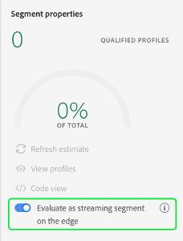

# Edge segmentation UI guide (beta)

>[!NOTE] 
>
>Edge segmentation is currently in beta. The documentation and the functionality are subject to change.

Edge segmentation is the ability to evaluate segments in Adobe Experience Platform instantaneously on the edge, enabling same page and next page personalization use cases. 

## Edge segmentation query types

A query can be evaluated with edge segmentation if it meets any of the following criteria:

| Query type | Details | Example |
| ---------- | ------- | ------- |
| Incoming hit | Any segment definition that refers to a single incoming event with no time restriction. |  |
| Incoming hit that refers to a profile | Any segment definition that refers to a single incoming event, with no time restriction, and one or more profile attributes. |  |
| Frequency query | Any segment definition that refers to an event happening at least a certain number of times. | |
| Frequency query that refers to a profile | Any segment definition that refers to an event happening at least a certain number of times and has one or more profile attributes. | |

If the query matches any of the above query types, you can enable it for edge segmentation by turning the **[!UICONTROL Evaluate as streaming segment on the edge]** toggle on.

The following query types are **not** currently supported for edge segmentation:

| Query type | Details |
| ---------- | ------- |
| Relative-time window | If a query refers to a time window, it cannot be evaluated using edge segmentation. |
| Negation | If a query contains a negation, it cannot be evaluated using edge segmentation. | 
| Multiple events | If a query contains more than one event, it cannot be evaluated using edge segmentation. |

## Next steps

This user guide explains how to evaluate segments with edge segmentation on Adobe Experience Platform. 

To learn more about using the Adobe Experience Platform user interface, please read the [Segmentation user guide](./overview.md). To learn how to perform similar actions and work with segments using the Adobe Experience Platform user interface, please visit the [edge segmentation API guide](../api/edge-segmentation.md).
