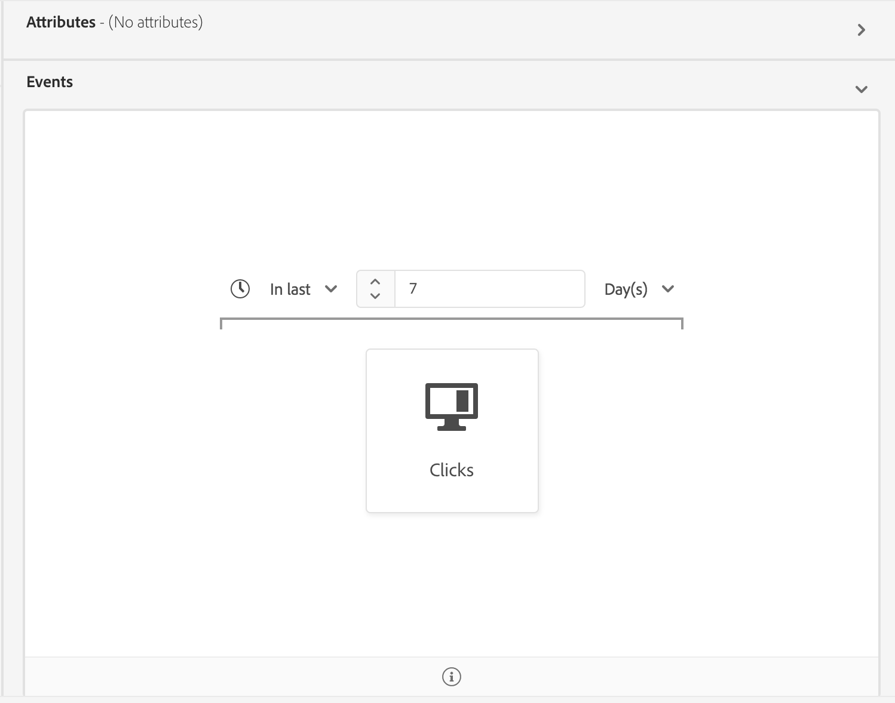

# Edge segmentation

Edge segmentation is the ability to do segmentation on Platform near instantaneously, allowing segments to quickly and efficiently be evaluated.

## Edge segmentation query types

A query can be evaluated with edge segmentation if it meets any of the following criteria:

| Query type | Details | Example |
| ---------- | ------- | ------- |
| Incoming hit | Any segment definition that refers to a single incoming event with no time restriction. |  |
| Incoming hit within a relative time window | Any segment definition that refers to a single incoming event. |  |
| Profile only | Any segment definition that refers to only a profile attribute. | |
| Incoming hit that refers to a profile | Any segment definition that refers to a single incoming event, with no time restriction, and one or more profile attributes. |  |
| Incoming hit that refers to a profile within a relative time window | Any segment definition that refers to a single incoming event and one or more profile attributes. |  |
| Multiple events that refer to a profile | Any segment definition that refers to multiple events **within the last 24 hours** and (optionally) has one or more profile attributes. |  |

If the query matches any of the above query types, you can enable it for edge segmentation by turning the **[!UICONTROL Evaluate as streaming segment on the edge]** toggle on.

## Next steps

This user guide explains how segment definitions evaluated with edge segmentation work on Adobe Experience Platform. 

To learn more about using the Adobe Experience Platform user interface, please read the [Segmentation user guide](./overview.md).