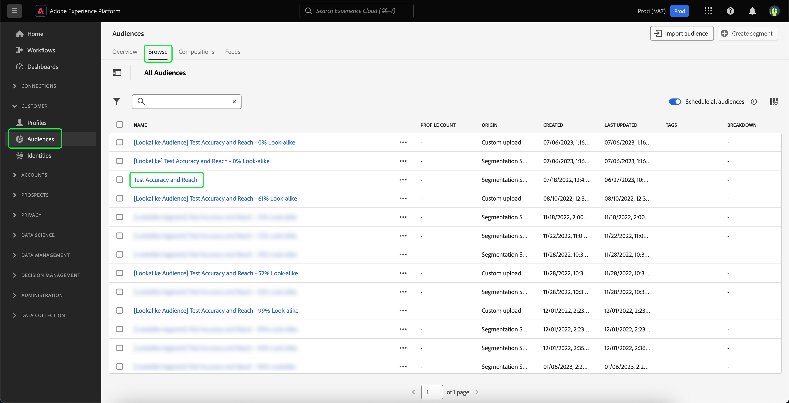

# Look-Alike Audiences guide

>[!IMPORTANT]
>
>Please note that look-alike insights and Look-Alike Audiences are in **limited availability**.

In Adobe Experience Platform, Look-Alike Audiences provide intelligent insights on each of your audiences, leveraging machine-learning-based insights to identify and target high-value customers with your marketing campaigns. 

With Look-Alike Audiences, you can create expanded audiences that target customers similar to your high-performing audiences or target customers similar to previously converted audiences.

## Terminology {#terminology}

Before getting started with Look-Alike Audiences, make sure to understand the following concepts:

- **Base audience**: The base audience is the audience that you want to find out more insights about. This is the audience that the look-alike model is **based** on. 
- **Look-alike model**: A look-alike model is a machine learning model that is trained on every eligible base audience without any customer input. Each look-alike model creates the influential factors and similarity graphs. A look-alike model does **not** get scored.
- **Look-Alike Audience**: A Look-Alike Audience is the audience that is created when a look-alike model with a selected similarity threshold is applied to the base audience. You can create multiple Look-Alike Audiences using the same look-alike model. The Look-Alike Audience is what gets scored.
- **Total addressable audience size**: The total addressable audience size is the total number of profiles in the past 30 days minus the base audience population in the past 30 days. For example, if a customer has 10 million profiles in the past 30 days, and the base audience has 1 million profiles in the past 30 days, the total addressable audience size is 9 million profiles.

## Look-alike model details {#details}

In Adobe Experience Platform, the look-alike model consumes three different types of data points:

- Audience membership over the past 30 days
- Experience events over the past 30 days that have been ingested in the Real-Time Customer Profile
- Profile attributes over the past 30 days that have been ingested in the Real-Time Customer Profile 

All of these data points are turned into key value pairs which are fed into the look-alike model. Only the key value pairs with a significant percentage of profiles matching will be kept.

At this time, the look-alike model is run every 24 hours, creating and re-creating the influential factors and similarity graphs for the base audiences. Scoring for the Look-Alike Audiences is also run frequently.

## Entitlements {#entitlements}

The following entitlements apply for usage of Look-Alike Audiences:

- Real-Time CDP Prime customers are entitled to **5** active Look-Alike Audiences in production sandboxes
- Real-Time CDP Ultimate customers are entitled to **20** active Look-Alike Audiences in production sandboxes
- Development sandboxes are limited to **5** Look-Alike Audiences for all Real-Time CDP customers

Add-on packs, which will be available at a later date, increase the entitlements for production sandboxes by 20 Look-Alike Audiences per pack.

To confirm if you have access to Look-Alike Audiences, please contact your Adobe representative.

## View look-alike insights {#view}

>[!CONTEXTUALHELP]
>id="platform_audiences_lookAlike_notEligible"
>title="Not eligible"
>abstract="This audience is currently not eligible for look-alike insights since it may have less than the minimum number of profiles required for training or the profile export has not yet been triggered."

>[!CONTEXTUALHELP]
>id="platform_audiences_lookAlike_processing"
>title="Processing"
>abstract="This audience is currently being processed. The model may take up to 24 hours to finish processing. Please check again later."

>[!CONTEXTUALHELP]
>id="platform_audiences_lookAlike_error"
>title="Error"
>abstract="There was an error processing this model. Please delete and re-build this model or try again later."

Look-alike insights is built-in with the audience details page. To look at the look-alike insights for an audience, select **[!UICONTROL Audiences]** in the left navigation bar, followed by **[!UICONTROL Browse]**, and the audience you want to view the insights for.

The audience details page appears. Select **[!UICONTROL Look-alike insights]** tab to view the audience's look-alike insights. The **[!UICONTROL Look-alike insights]** page is displayed. This page has three main elements - the similarity and reach graph, the Look-Alike Audiences, and the influential factors.

### Similarity and reach {#similarity-and-reach}

>[!CONTEXTUALHELP]
>id="platform_audiences_lookAlike_similarityAndReach"
>title="Similarity and reach"
>abstract="The similarity and reach graph plots the expected reach of a Look-Alike Audience consisting of profiles above a given similarity score. You can hover over a specific point in the graph to display the similarity percentage and the expected profile count for the currently highlighted point."

The similarity and reach section displays a graph that plots the expected reach of a Look-Alike Audience consisting of profiles above a given similarity score. The similarity score represents the **distance** of similarity between the base audience's profile and the look-alike insight's profile.

On this graph, the x-axis measures the similarity percentage between a profile and members of the selected audience. The similarity score ranges from 0% to 100%, with a higher similarity score indicating that a profile is closer, in terms of influential factor values, to members of the selected audience.

The y-axis shows the expected count of profiles with the similarity percentage that corresponds with the matching value of the x-axis. This expected count of profiles ranges from 0 to the total addressable audience size or 25 million profiles, whichever is lower. This axis is measured on a **logarithmic scale** to improve the readability of the graph. 

Please note that the graph is **cumulative** from right to left. This means that at any point in the graph, the value of the y-axis is the number of profiles that have a similarity **above** the similarity threshold. For example, if the x-axis is at 60% and the y-axis is 10 million, this means that there are 10 million profiles which have a similarity at or above 60% to the base audience.

You can hover over a specific point in the graph to display the similarity percentage and the expected profile count for the currently highlighted point.

### Look-Alike Audiences {#list}

The Look-Alike Audiences section displays a list of all the Look-Alike Audiences that have been previously created for the selected base audience.

### Influential factors {#influential-factors}

>[!CONTEXTUALHELP]
>id="platform_audiences_lookAlike_influentialFactors"
>title="Influential factors"
>abstract="Influential factors are attributes, events and audience memberships that are important in explaining similarity of a profile to members of the base audience. Data usage labels and policies can be used to exclude certain data from being considered as influential factors in look-alike models."
>additional-url="https://experienceleague.adobe.com/docs/experience-platform/segmentation/ui/lookalike-audiences.html?lang=en#exclude" text="Exclude data"

The influential factors section displays the top 100 factors that influence the look-alike model for the selected base audience. These influential factors are the profile attributes, the experience events, and the audience memberships that are the most important in explaining similarities in the base audience. Understanding the top influential factors lets you better personalize your marketing content for this audience and any Look-Alike Audience you create from it. Please note that not all the influential factors that affect the look-alike model will be displayed.

For influential factors that are numeric, the key value pairs may be put into buckets, depending on the number of different values that key has. For example, if you have a key of `income`, there most likely would be many unique values. As a result, the key value pairs will be placed into buckets tha could look like `income=[0 -> 30000]`, `income=[30000 -> 50000]`, and `income=[50000 -> 100000]`.

These buckets are regularly re-computed to ensure the data is kept up-to-date.

>[!NOTE]
>
>The influential factors are sorted in order of importance and are independent of each other.

| Field | Description | 
| ----- | ----------- |
| Type | The type of data that the influential factor is derived from. This can be a profile attribute, an experience event, or an audience membership. |
| Key | The name of the data field. For keys of the audience membership type, this value represents the **namespace** of the audience where the data comes from. Possible values include `ups` (Segmentation Service) and `AO` (Audience Orchestration). For keys of other types, this value represents the XDM field path. For example, if the company Luma has a custom field called income, the key would be `_luma.income` |
| Value | The value varies depending on the influential factor that it represents. For profile attributes or experience events, this field represents the value or value range of the data field that indicates the similarity to the members of the base audience. The value range is written in the form `[A -> B]`, where `A` represents the lower range while `B` represents the higher range. For audience memberships, this field is the name of the audience. |
| Importance | The relative level of importance of the influential factor. This can be high, medium, or low. |

## Create a Look-Alike Audience {#create}

>[!IMPORTANT]
>
>You **cannot** use a Look-Alike Audience as the base audience for another Look-Alike Audience. That is to say, you **cannot** create chained Look-Alike Audiences.

To create a Look-Alike Audience, you'll need to select the audience you want to base the Look-Alike Audience off of. To access your list of available audiences, select **[!UICONTROL Audiences]** in the left navigation bar, followed by **[!UICONTROL Browse]**. The list of audiences appears. On this page, you can select the audience you want to use as your base audience.

On the audience details page, select **[!UICONTROL Create look-alike audience]** to begin the process of creating a Look-Alike Audience.

![The [!UICONTROL Create look-alike audience] button is highlighted.](../images/ui/lookalike-audiences/create-look-alike-audience.png)

The **[!UICONTROL Create a look-alike audience]** popover appears. On this page, you can set the similarity percentage for the Look-Alike Audience.

![The [!UICONTROL Create a look-alike audience] popover is displayed.](../images/ui/lookalike-audiences/create-audience.png)

You can set this similarity percentage in three different ways:

- Move the slider to set the similarity percentage
- Enter the similarity percentage in the numeric entry box next to the slider
- Hover over the graph and select the desired location to set the similarity percentage

You can also update details about the Look-Alike Audience, including its name and description. By default, the Look-Alike Audience's name will be generated based on the base audience's name and the similarity percentage previously specified.

![The basic information is highlighted within the [!UICONTROL Create a look-alike audience] popover.](../images/ui/lookalike-audiences/basic-info.png)

Select **[!UICONTROL Create]** to finish creating your Look-Alike Audience.

![The create button is highlighted within the [!UICONTROL Create a look-alike audience] popover.](../images/ui/lookalike-audiences/create-audience.png)

The newly created Look-Alike Audience can be accessed in the **[!UICONTROL Look-alike audiences]** section of the audience details page, and is also available in the Audience Portal and for other downstream usages. Please note that it will take some time for the Look-Alike Audience to be scored. Until it is scored, the profile count will be appear to be 0.

## View Look-Alike Audience details {#view-details}

To view details of a Look-Alike Audience, select the Look-Alike Audience in the **[!UICONTROL Look-Alike Audiences]** section of the base audience.

The audience details page appears. For more information on this page, please read the [audience details section of the Segmentation Service UI guide](./overview.md#audience-details).

## Exclude data fields from look-alike modeling {#exclude}

Look-Alike Audiences can be configured to exclude data fields that are restricted for the "Data Science" marketing action by applying the relevant data usage labels and policies. Data that is labeled as restricted from use for data science will be removed from consideration when training a Look-Alike Audience model and when generating a Look-Alike Audience from the trained model. 

The standard "C9" label can be used to label data that should not be used for data science and can be enforced by enabling the standard "Restrict data science" policy. You can also create additional policies to restrict data with other labels, including sensitive labels, from usage for data science. For more information on managing data usage policies, please read the [data usage policies UI guide](../../data-governance/policies/user-guide.md). For more information on managing data usage labels, please read the [data usage labels UI guide](../../data-governance/labels/user-guide.md).

By default, the modeling process for Look-Alike Audiences will exclude **any** field, dataset, or audience based on the enabled privacy policy for your organization. If the base audience has no contract labels, the modeling process will exclude **any** field, dataset, or audience based on the enabled privacy policy for your organization. 

Please note that **you** are responsible for ensuring that data, including sensitive data, is labeled appropriately and that data usage policies have been defined and enabled to comply with legal and regulatory obligations under which you operate. You should also be aware that data fields or segment memberships that are **not** directly correlated with data fields typically associated with sensitive or protected data types can be a source of potential bias. **You** are responsible in analyzing your data to identify, label, and apply the appropriate data usage policies to your data, including any data fields that may proxy for sensitive or protected data types and should be excluded from modeling.

## Next steps

After reading this guide, you have learned how to view look-alike insights and create Look-Alike Audiences based on these insights. For more information on audiences in the Adobe Experience Platform UI, please read the [Segmentation Service UI guide](./overview.md).
