# Segmentation Service UI guide

[!DNL Adobe Experience Platform Segmentation Service] provides a user interface for creating and managing segment definitions. 

## Getting started

Working with segment definitions requires an understanding of the various [!DNL Experience Platform] services involved with segmentation. Before reading this user guide, please review the documentation for the following services:

- [[!DNL Segmentation Service]](../home.md): [!DNL Segmentation Service] allows you to divide data stored in [!DNL Experience Platform] that relates to individuals (such as customers, prospects, users, or organizations) into smaller groups.
- [[!DNL Real-Time Customer Profile]](../../profile/home.md): Provides a unified, real-time consumer profile based on aggregated data from multiple sources.
- [[!DNL Adobe Experience Platform Identity Service]](../../identity-service/home.md): Enables the creation of customer profiles by bridging identities from disparate data sources being ingested into [!DNL Platform].
- [[!DNL Experience Data Model (XDM)]](../../xdm/home.md): The standardized framework by which [!DNL Platform] organizes customer experience data. To best make use of Segmentation, please ensure your data is ingested as profiles and events according to the [best practices for data modeling](../../xdm/schema/best-practices.md).

It is also important to know two key terms that are used through this document and understand the difference between them:
- **Segment definition**: The rule set used to describe key characteristics or behaviors of a target audience.
- **Audience**: The resulting set of profiles that meet the criteria of a segment definition. This can either be created through Adobe Experience Platform (Platform-generated audience) or from an external source (externally generated audience).

## Overview

In the Experience Platform UI, select **[!UICONTROL Segments]** in the left navigation to open the **[!UICONTROL Overview]** tab displaying the [!UICONTROL Segments] dashboard. 

>[!NOTE]
>
>If your organization is new to Platform and does not yet have active Profile datasets or merge policies created, the [!UICONTROL Segments] dashboard is not visible. Instead, the [!UICONTROL Overview] tab displays links and documentation to help you get started with segments.

### [!UICONTROL Segments] dashboard {#segments-dashboard}

The **[!UICONTROL Segments]** dashboard outlines key metrics related to your organization's segment data. 

To learn more, visit the [segment dashboard guide](../../dashboards/guides/audiences.md).

## Browse {#browse}

>[!CONTEXTUALHELP]
>id="platform_segments_browse_churncolumnname"
>title="Churn"
>abstract="The churn represents the percentage of profiles that are changing within a segment definition compared to the last time the segment job ran."

>[!CONTEXTUALHELP]
>id="platform_segments_browse_evaluationmethodcolumnname"
>title="Evaluation method"
>abstract="Evaluation methods for segments include batch, streaming, and edge."

>[!CONTEXTUALHELP]
>id="platform_segments_browse_addallsegmentstoschedule"
>title="Add all segments to schedule"
>abstract="Enable to include all batch evaluation segments in the daily scheduled update. Disable to remove all segments from the scheduled update."

Select the **[!UICONTROL Browse]** tab to see a list of all the segment definitions for your organization. 

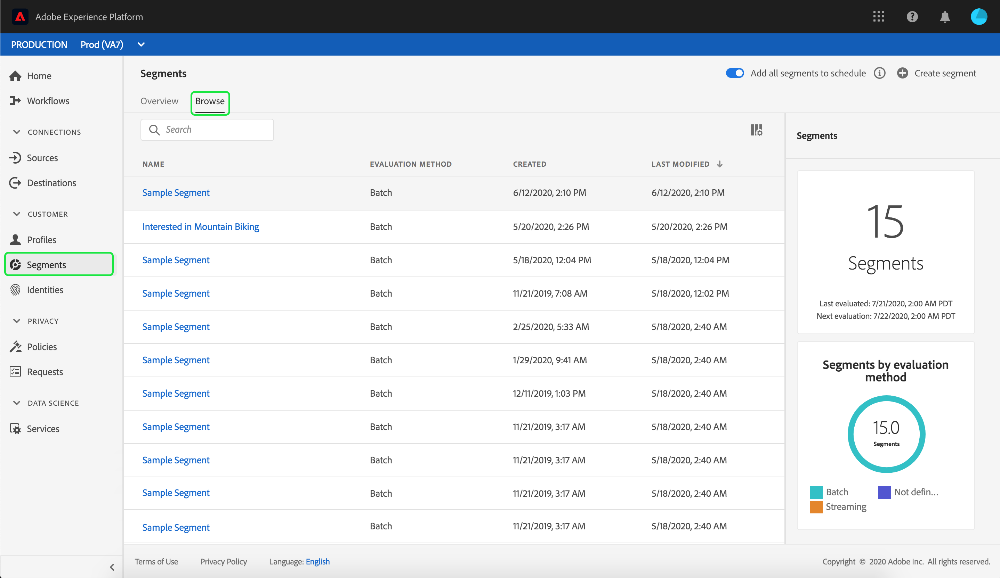

This view lists information about the segment definition including the profile count, created date, and last modified date. 

You can add additional fields to this display by selecting . These additional fields include breakdown, evaluation method, and job ID.

If breakdown is selected, the display shows a bar graph outlining the percentage of profiles that belong to each of the following calculated profile statuses: [!UICONTROL Realized], [!UICONTROL Existing], and [!UICONTROL Exiting]. Additionally, the breakdown shown on the [!UICONTROL Browse] tab is the most accurate breakdown of the segment status. If this number differs with what is stated on the [!UICONTROL Overview] tab, you should use the numbers on the [!UICONTROL Browse] tab as the correct source of information, since the [!UICONTROL Overview] tab numbers only update once per day.

| Status | Description |
| ------ | ----------- |
| [!UICONTROL Realized] | The count of profiles that **qualified** for the segment in the last 24 hours since the last batch segment job ran. |
| [!UICONTROL Existing] | The count of profiles which **remained** in the segment in the last 24 hours since the last batch segment job ran. |
| [!UICONTROL Exiting] | The count of profiles which **exited** the segment in the last 24 hours since the last batch segment job ran. |

The evaluation method can either be streaming, batch, or edge. Streaming segments are constantly evaluated as data enters the system. Batch segments are evaluated according to a set schedule. Edge segments are evaluated in real-time, which allow for same page and next page personalization use cases.

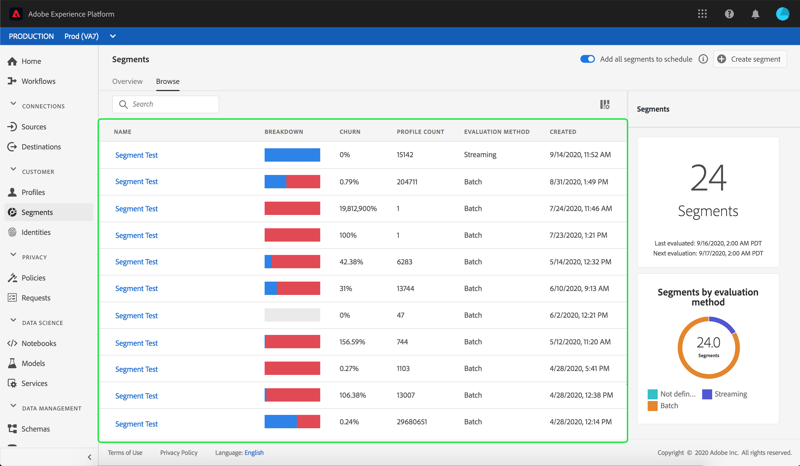

On the top of the page are options to add all segments to a schedule and to create a new segment. 

Toggling **[!UICONTROL Add all segments to schedule]** will enable scheduled segmentation. More information on scheduled segmentation can be found in the [scheduled segmentation section of this user guide](#scheduled-segmentation).

Selecting **[!UICONTROL Create segment]** will take you to the Segment Builder. To learn more about creating segments, please read the section on [creating a segment in the user guide](#create-segment).

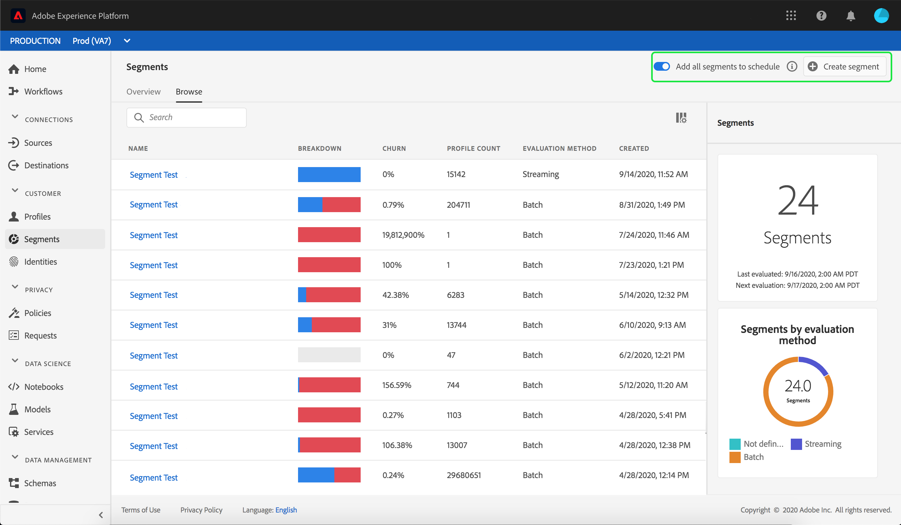

The right sidebar contains information about all the segments within the organization, listing the total number of segments, the last evaluation date, the next evaluation date, as well as a breakdown of the segments by evaluation method.

Selecting the segment definition's row provides a summary of the segment definition, including options to either edit or delete the segment, activate the segment to a destination, the qualified audience for the segment, the total audience size, in addition to the segment's name, description, evaluation method, created date, and last modified date.

>[!NOTE]
>
> You will **not** be able to delete a segment that is used in a destination activation.

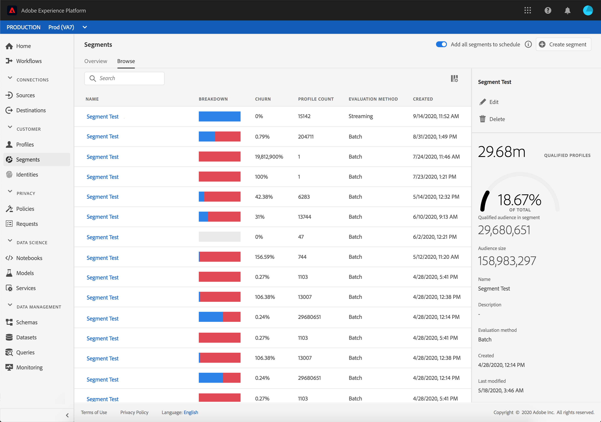

## Segment definition details {#segment-details}

To see more details about a specific segment definition, select a segment's name within the **[!UICONTROL Browse]** tab.

The segment details page appears. On the top, there is a summary of the segment definition, information about the qualified audience size, as well as destinations the segment is activated for. 

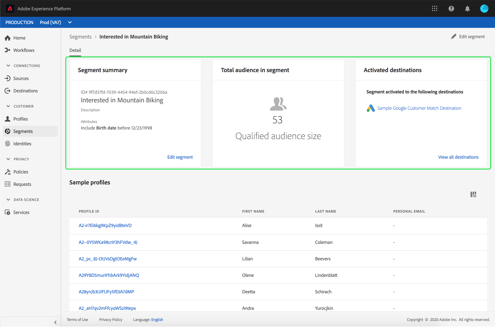

### Segment summary {#segment-summary}

The **[!UICONTROL Segment summary]** section provides information such as the ID, name, description, and details of the attributes. 

Additionally, you are given the option to either activate the segment to a destination or edit the segment. Selecting **[!UICONTROL Activate to destination]** will let you activate the segment to a destination. For more detailed information on activating a segment to a destination, please read the [activation overview](../../destinations/ui/activation-overview.md).

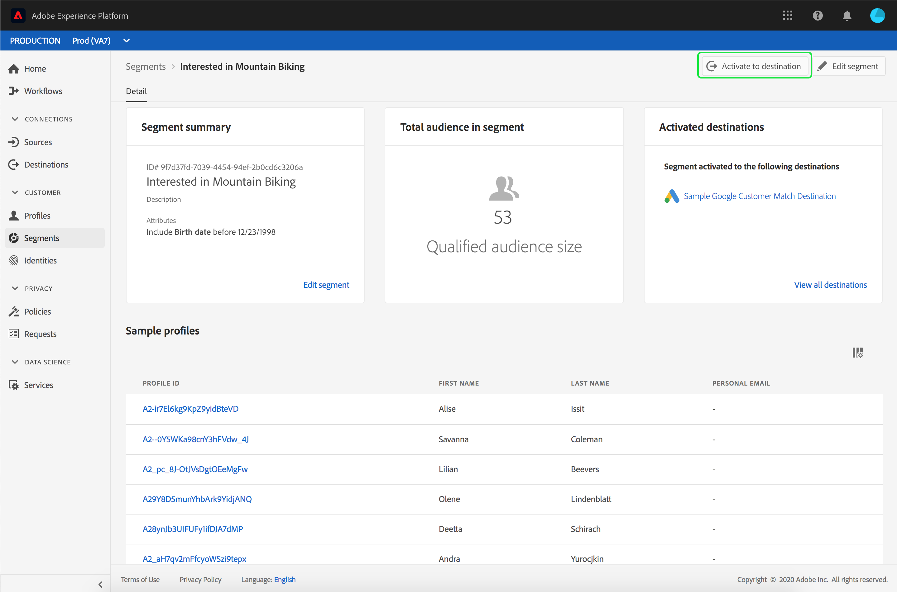

Selecting **[!UICONTROL Edit segment]** will bring you to the [!DNL Segment Builder]. For more detailed information about using the [!DNL Segment Builder] workspace, please read the [[!DNL Segment Builder] user guide](./segment-builder.md).

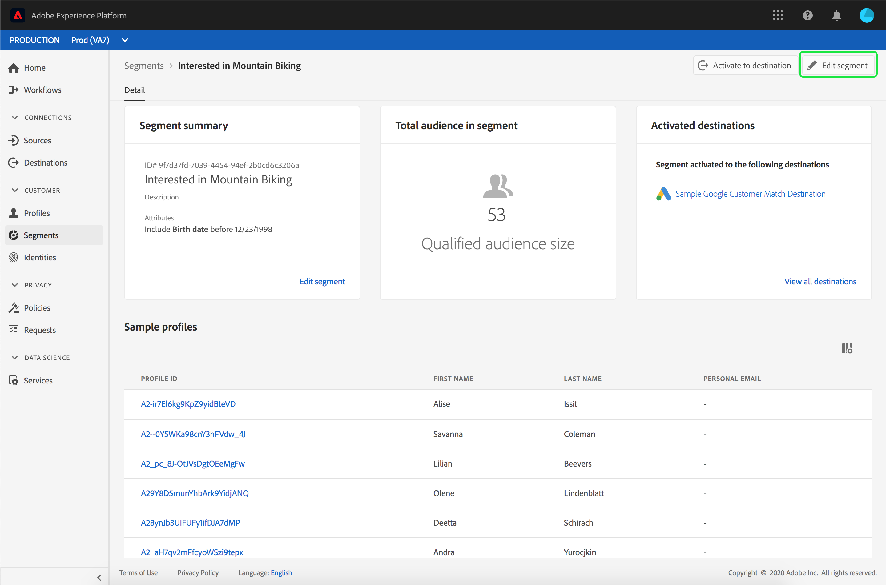

### Total audience in segment

The **[!UICONTROL Total audience in segment]** section shows the total number of profiles that qualify for the segment.

Estimates are generated by using a sample size of that day's sample data. If there are less than 1 million entities in your profile store, the full data set is used; for between 1 and 20 million entities, 1 million entities are used; and for over 20 million entities, 5% of the total entities are used. More information about generating segment estimates can be found in the [estimate generation section](../tutorials/create-a-segment.md#estimate-and-preview-an-audience) of the segment creation tutorial.

### Activated destinations

The **[!UICONTROL Activated destinations]** section shows the destinations that this segment is activated for.

>[!NOTE]
>
> Destinations are a feature available with [!DNL Adobe Real-Time Customer Data Platform], and allow you to export data to external platforms. For more information on destinations, please read the [destinations overview](../../destinations/home.md). To learn how to activate a segment to a destination, see [activation overview](../../destinations/ui/activation-overview.md).

### Profile samples

Underneath is a sampling of profiles that qualify for the segment, detailing information including the [!DNL Profile] ID, first name, last name, and personal email. 

The way data sampling gets triggered depends on the method of ingestion.

For batch ingestion, the profile store is automatically scanned every fifteen minutes to see if a new batch was successfully ingested since the last sampling job was run. If that is the case, the profile store is subsequently scanned to see if there's been at least a 5% change in the number of records. If these conditions are met, a new sampling job is triggered.

For streaming ingestion, the profile store is automatically scanned every hour to see if there's been at least a 5% change in the number of records. If this condition is met, a new sampling job is triggered.

The sample size of the scan depends on the overall number of entities in your profile store. These sample sizes are represented in the following table:

| Entities in profile store | Sample size |
| ------------------------- | ----------- |
| Less than 1 million | Full data set |
| 1 to 20 million | 1 million |
| Over 20 million | 5% of total |

More detailed information about each [!DNL Profile] can be seen by selecting the [!DNL Profile] ID. To learn more about a profile's details, please read the [[!DNL Real-Time Customer Profile] user guide](../../profile/ui/user-guide.md#profile-detail).

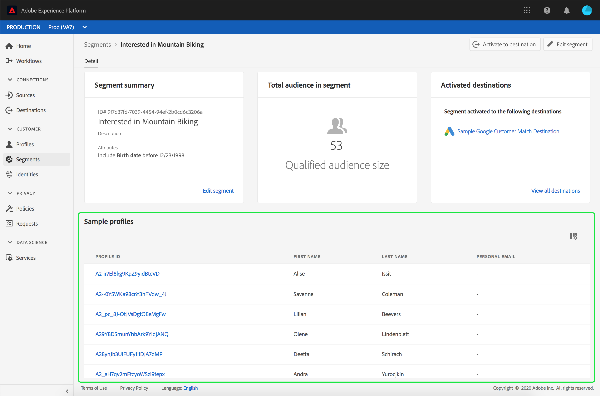

## Creating a segment {#create-segment}

Selecting **[!UICONTROL Create segment]** in the top-right corner opens the [!DNL Segment Builder] workspace, where you can begin creating a segment definition.

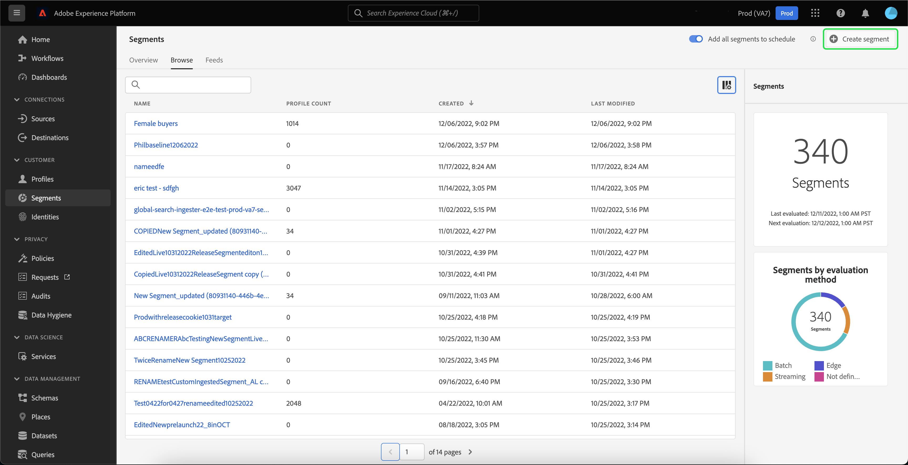

### [!DNL Segment Builder] workspace 

[!DNL Segment Builder] provides a rich workspace that allows you to interact with [!DNL Profile] data elements. The workspace provides intuitive controls for building and editing rules, such as drag-and-drop tiles used to represent data properties. 

For more detailed information about using the [!DNL Segment Builder] workspace, please read the [[!DNL Segment Builder] user guide](./segment-builder.md).

## Scheduled segmentation {#scheduled-segmentation}

Once segment definitions have been created, you can then evaluate them through on-demand or scheduled (continuous) evaluation. Evaluation means moving [!DNL Real-Time Customer Profile] data through segment definitions in order to produce corresponding audiences. Once created, the audiences are saved and stored so that they can be exported using [!DNL Experience Platform] APIs. 

On-demand evaluation involves using the API to perform evaluation and build audiences as needed, whereas scheduled evaluation (also known as 'scheduled segmentation') allows you to create a recurring schedule to evaluate segment definitions at a specific time (at a maximum, once daily).

### Enable scheduled segmentation {#enable-scheduled-segmentation}

Enabling your segment definitions for scheduled evaluation can be done using the UI or the API. In the UI, return to the **[!UICONTROL Browse]** tab within **[!UICONTROL Segments]** and toggle on **[!UICONTROL Add all segments to schedule]**. This will cause all segments to be evaluated based on the schedule set by your organization.

>[!NOTE]
>
>Scheduled evaluation can be enabled for sandboxes with a maximum of five (5) merge policies for [!DNL XDM Individual Profile]. If your organization has more than five merge policies for [!DNL XDM Individual Profile] within a single sandbox environment, you will not be able to use scheduled evaluation.

Schedules can currently only be created using the API. For detailed steps on creating, editing, and working with schedules using the API, please follow the tutorial for evaluating and accessing segment results, specifically the section on [scheduled evaluation using the API](../tutorials/evaluate-a-segment.md#scheduled-evaluation).

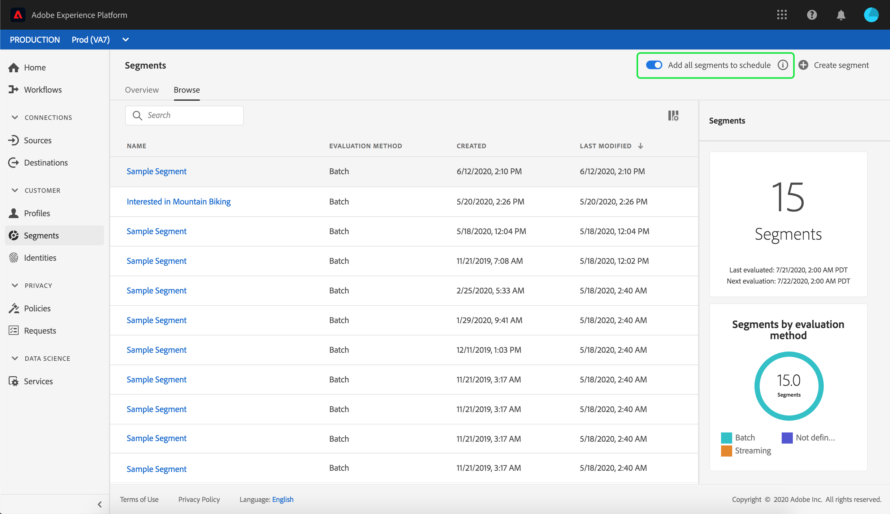

## Audiences {#audiences}

>[!IMPORTANT]
>
>The audiences functionality is currently in limited beta and is not available to all users. The documentation and the functionality are subject to change.

Select the **[!UICONTROL Audiences]** tab to see a list of all the audiences for your organization.

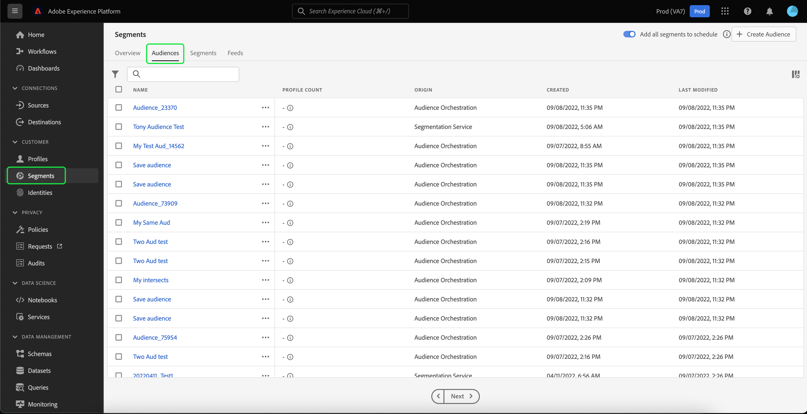

By default, this view lists information about the audiences including the name, profile count, origin, created date, and last modified date.

You can select the  icon to change which fields are displayed.

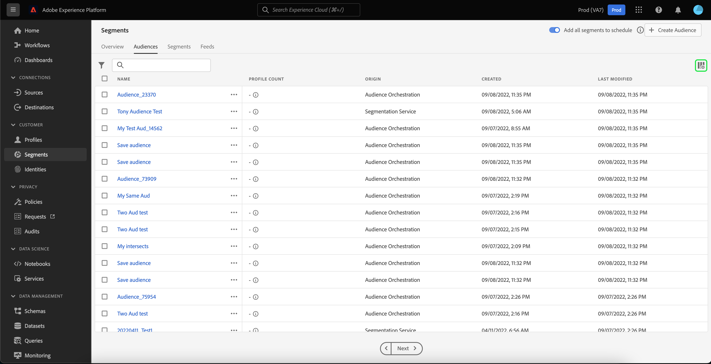

A popover appears, listing all the fields that can be displayed within the table.

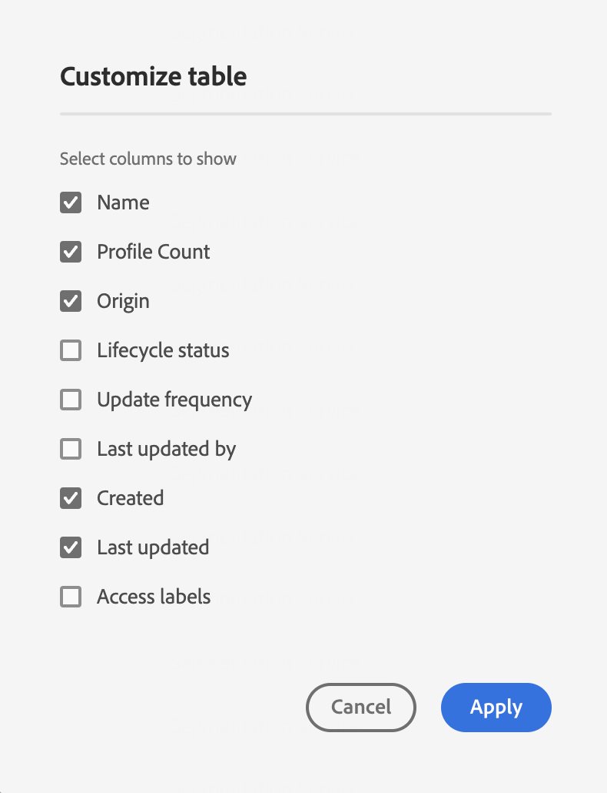

| Field | Description |
| ----- | ----------- | 
| [!UICONTROL Name] | The name of the audience. |
| [!UICONTROL Profile count] | The total number of profiles that qualify for the audience. |
| [!UICONTROL Origin] | The origin of the audience. If this audience was Platform-generated, it will have an origin of Segmentation Service. |
| [!UICONTROL Lifecycle status] | The status of the audience. Possible values for this field include `Draft`, `Published`, and `Archived`.  |
| [!UICONTROL Update frequency] | A value that states how often the audience's data is updated. Possible values for this field include `On Demand`, `Scheduled`, and `Continuous`. |
| [!UICONTROL Last updated by] | The name of the person who last updated the audience. |
| [!UICONTROL Created] | The time and date the audience was created. | 
| [!UICONTROL Last updated] | The time and date the audience was last created. |
| [!UICONTROL Access labels] | The access labels for the audience. Access labels allow you to categorize datasets and fields according to usage policies that apply to that data. These labels can be applied at any time, providing flexibility in how you choose to govern data. For more information on access labels, please read the documentation on [managing labels](../../access-control/abac/ui/labels.md). |

You can select **[!UICONTROL Create Audience]** to create an audience. 

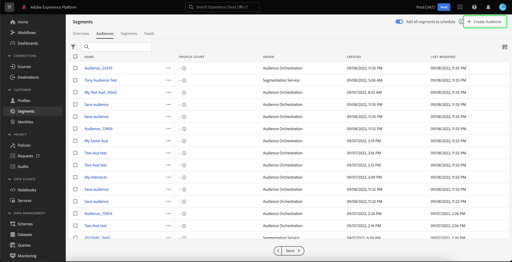

A popover appears, letting you choose between composing an audience or building rules.

Selecting **[!UICONTROL Compose Audiences]** takes you to the Audience Builder. To learn more about creating audiences, please read the [Audience Builder guide](./audience-builder.md).

Selecting **[!UICONTROL Build Rule]** takes you to the Segment Builder. To learn more about creating segments, please read the [Segment Builder guide](./segment-builder.md)

## Audience details {#audience-details}

To see more details about a specific audience, select an audience's name within the [!UICONTROL Audiences] tab.

The audience details page appears. This page differs in details depending on whether the audience was generated with Adobe Experience Platform or from an external source such as Audience Orchestration.

### Platform-generated audience

For more information on Platform-generated audiences, please read the [segment summary section](#segment-summary). 

### Externally generated audience

On the top of the audience details page, there is a summary of the audience and details about the dataset the audience is saved in.

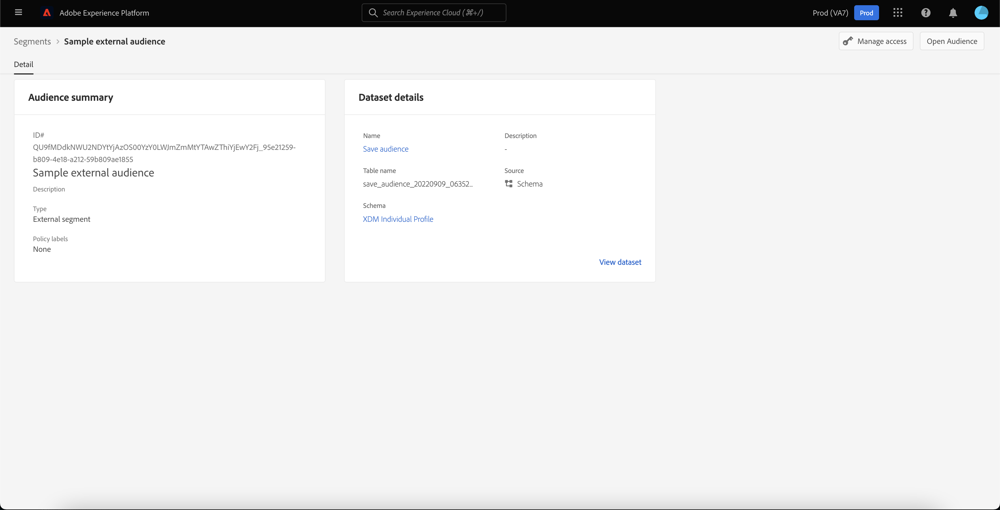

The **[!UICONTROL Audience summary]** section provides information such as the ID, name, description, and details of the attributes.

The **[!UICONTROL Dataset details]** section provides information such as the name, description, table name, source, and schema. You can select **[!UICONTROL View dataset]** to see more information about the dataset.

| Field | Description |
| ----- | ----------- |
| [!UICONTROL Name] | The name of the dataset. |
| [!UICONTROL Description] | The description of the dataset. |
| [!UICONTROL Table name] | The table name of the dataset. |
| [!UICONTROL Source] | The source of the dataset. For externally generated audiences, this value will be **Schema**. |
| [!UICONTROL Schema] | The type of XDM schema that the dataset corresponds to. |

To learn more about datasets, please read the [dataset overview](../../catalog/datasets/overview.md).

## Streaming segmentation {#streaming-segmentation}

Streaming segmentation is the ability to do segmentation on [!DNL Platform] in near real-time, while focusing on data richness. With streaming segmentation, segment qualification now happens as data lands into [!DNL Platform], alleviating the need to schedule and run segmentation jobs.

More information about streaming segmentation can be found in the [streaming segmentation user guide](./streaming-segmentation.md).

>[!NOTE]
>
>In order for streaming segmentation to work, you will need to enable scheduled segmentation for the organization. For details on enabling scheduled segmentation, please refer to [the streaming segmentation section in this user guide](#scheduled-segmentation).

## Edge segmentation {#edge-segmentation}

Edge segmentation is the ability to evaluate segments in Platform instantaneously on the edge, enabling same page and next page personalization use cases. 

More information about edge segmentation can be found in the [edge segmentation UI guide](./edge-segmentation.md)

## Policy violations

>[!NOTE]
>
>Policy violations only apply if you are creating a segment that has been assigned to a destination.

Once you are done creating your segment, the segment will be analyzed by Adobe Experience Platform Data Governance to ensure there are no policy violations within the segment. See the [Data Governance overview](../../data-governance/home.md) for more information.

## Next steps and additional resources {#next-steps}

The [!DNL Segmentation Service] UI provides a rich workflow allowing you to isolate marketable audiences from [!DNL Real-Time Customer Profile] data.
  
To learn more about [!DNL Segmentation Service], please continue reading the documentation. To learn how to use the [!DNL Segmentation Service] API, please read the [[!DNL Segmentation Service] developer guide](../api/overview.md).
