# Segmentation Service UI guide

[!DNL Adobe Experience Platform Segmentation Service] provides a user interface for creating and managing audiences and segment definitions. 

## Getting started

Working with audiences and segment definitions requires an understanding of the various [!DNL Experience Platform] services involved with segmentation. Before reading this user guide, please review the documentation for the following services:

- [[!DNL Segmentation Service]](../home.md): [!DNL Segmentation Service] allows you to segment data stored in [!DNL Experience Platform] that relates to individuals (such as customers, prospects, users, or organizations) into smaller groups.
- [[!DNL Real-Time Customer Profile]](../../profile/home.md): Provides a unified, real-time consumer profile based on aggregated data from multiple sources.
- [[!DNL Adobe Experience Platform Identity Service]](../../identity-service/home.md): Enables the creation of customer profiles by bridging identities from disparate data sources being ingested into [!DNL Platform].
- [[!DNL Experience Data Model (XDM)]](../../xdm/home.md): The standardized framework by which [!DNL Platform] organizes customer experience data. To best make use of Segmentation, please ensure your data is ingested as profiles and events according to the [best practices for data modeling](../../xdm/schema/best-practices.md).

You should also understand two key terms that are used through this document and understand the difference between them:

- **Audience**: A set of people who share similar behaviors and/or characteristics. This collection of people can either be generated by Adobe Experience Platform using segment definitions or audience composition (Platform-generated audience) or from external sources such as custom uploads (externally generated audience).
- **Segment definition**: The rules Adobe Experience Platform uses to describe key characteristics or behavior of a target audience.
- **Segment**: The act of separating Profiles into audiences.

## Overview

In the Experience Platform UI, select **[!UICONTROL Audiences]** in the left navigation to open the **[!UICONTROL Overview]** tab displaying the [!UICONTROL Audiences] dashboard. 

>[!NOTE]
>
>If your organization is new to Platform and does not yet have active Profile datasets or merge policies created, the [!UICONTROL Audiences] dashboard is not visible. Instead, the [!UICONTROL Overview] tab displays links and documentation to help you get started with audiences.

### [!UICONTROL Audiences] dashboard {#segments-dashboard}

The **[!UICONTROL Audiences]** dashboard outlines key metrics related to your organization's audience data. 

To learn more, visit the [audiences dashboard guide](../../dashboards/guides/segments.md).

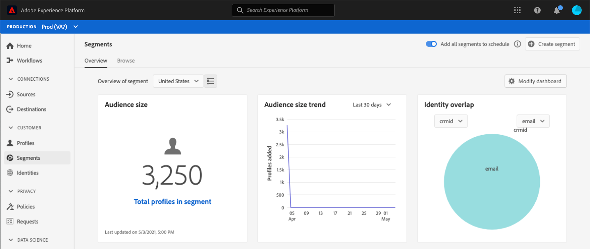

## Browse {#browse}

>[!CONTEXTUALHELP]
>id="platform_segments_browse_churncolumnname"
>title="Churn"
>abstract="The churn represents the percentage of profiles that are changing within an audience compared to the last time the segment job ran."

>[!CONTEXTUALHELP]
>id="platform_segments_browse_evaluationmethodcolumnname"
>title="Evaluation method"
>abstract="Evaluation methods for audiences include batch, streaming, and edge."

>[!CONTEXTUALHELP]
>id="platform_segments_browse_addallsegmentstoschedule"
>title="Add all audiences to schedule"
>abstract="Enable to include all audiences evaluated using batch segmentation in the daily scheduled update. Disable to remove all audiences from the scheduled update."

Select the **[!UICONTROL Browse]** tab to see a list of all the audiences for your organization. 

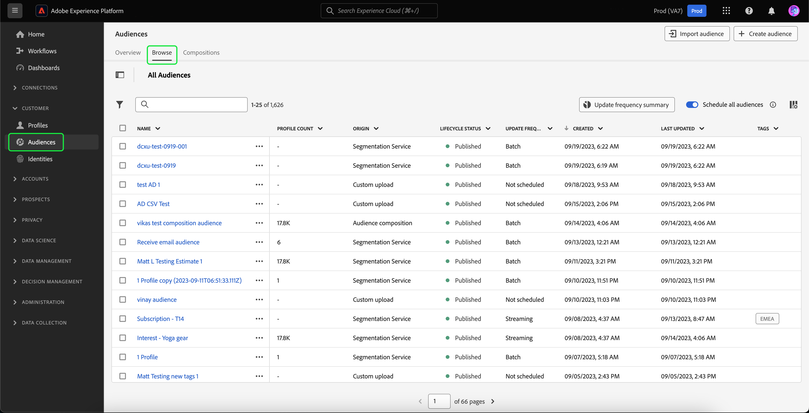

This view lists information about the audiences including the profile count, origin, created date, last modified date, tags, and breakdown. 

You can add additional fields to this display by selecting . These additional fields include lifecycle status, update frequency, last updated by, description, created by, and access labels.

| Field | Description | 
| ----- | ----------- |
| [!UICONTROL Name] | The name of the audience. |
| [!UICONTROL Profile count] | The total number of profiles that qualify for the audience. | 
| [!UICONTROL Origin] | The origin of the audience. This states where the audience comes from. Possible values include Segmentation Service, Custom upload, Audience composition, and Audience Manager. |
| [!UICONTROL Created] | The date and time, in UTC, that the audience was created. |
| [!UICONTROL Last updated] | The date and time, in UTC, that the audience was last updated. |
| [!UICONTROL Tags] | The user-defined tags that belong to the audience. More information about these tags can be found in the [section on tags](#tags). |
| [!UICONTROL Breakdown] | The profile status breakdown for the audience. A more detailed description of this profile status breakdown can be found below. |
| [!UICONTROL Lifecycle status] | The status of the audience. Possible values for this field include `Draft`, `Published`, and `Archived`. |
| [!UICONTROL Update frequency] | A value that states how often the audience's data is updated. Possible values for this field include `On Demand`, `Scheduled`, and `Continuous`. |
| [!UICONTROL Last updated by] | The name of the person who last updated the audience. |
| [!UICONTROL Description] | The description of the audience. |
| [!UICONTROL Created by] | The name of the person who created the audience. |
| [!UICONTROL Access labels] | The access labels for the audience. Access labels allow you to categorize datasets and fields according to usage policies that apply to that data. These labels can be applied at any time, providing flexibility in how you choose to govern data. For more information on access labels, please read the documentation on [managing labels](../../access-control/abac/ui/labels.md). |

If breakdown is selected, the display shows a bar graph outlining the percentage of profiles that belong to each of the following calculated profile statuses: [!UICONTROL Realized], [!UICONTROL Existing], and [!UICONTROL Exiting]. Additionally, the breakdown shown on the [!UICONTROL Browse] tab is the most accurate breakdown of the segment definition status. If this number differs with what is stated on the [!UICONTROL Overview] tab, you should use the numbers on the [!UICONTROL Browse] tab as the correct source of information, since the [!UICONTROL Overview] tab numbers only update once per day.

| Status | Description |
| ------ | ----------- |
| [!UICONTROL Realized] | The count of profiles that **qualified** for the segment in the last 24 hours since the last batch segment job ran. |
| [!UICONTROL Existing] | The count of profiles which **remained** in the segment in the last 24 hours since the last batch segment job ran. |
| [!UICONTROL Exiting] | The count of profiles which **exited** the segment in the last 24 hours since the last batch segment job ran. |

Next to each audience is an ellipsis icon. Selecting this displays a list of available quick actions for the audience. This list of actions differs, based on the audience's origin.

![The quick actions list is shown for audiences with the origin of [!UICONTROL Audience composition].](../images/ui/overview/browse-audience-composition-details.png)

| Action | Origins | Description |
| ------ | ------- | ----------- |
| Edit | Segmentation Service | Lets you open Segment Builder to edit your audience. For more information on using the Segment Builder, please read the [Segment Builder UI guide](./segment-builder.md). |
| Open composition | Audience composition | Lets you open Audience composition to see your audience. For more information on Audience composition, please read the [audience composition UI guide](./audience-composition.md). |
| Activate to destination | Segmentation Service | Lets you activate the audience to a destination. For more detailed information on activating an audience to a destination, please read the [activation overview](../../destinations/ui/activation-overview.md). |
| Share with partners | Audience composition, Custom upload, Segmentation Service | Lets you share your audience with other Platform users. For more information on this feature, please read the [Segment Match overview](./segment-match/overview.md). |
| Manage tags | Audience composition, Custom upload, Segmentation Service | Lets you manage the user-defined tags that belong to the audience. For more information on this feature, please read the section on [filtering and tagging](#manage-audiences). |
| Move to folder | Audience composition, Custom upload, Segmentation Service |  Lets you manage which folder the audience belongs to. For more information on this feature, please read the section on [filtering and tagging](#manage-audiences). |
| Copy | Audience composition, Custom upload, Segmentation Service |  Duplicates the selected audience. |
| Apply access labels | Audience composition, Custom upload, Segmentation Service |  Lets you manage the access labels that belong to the audience. For more information on access labels, please read the documentation on [managing labels](../../access-control/abac/ui/labels.md). |
| Archive | Custom upload | Archives the selected audience. |
| Delete | Audience composition, Custom upload, Segmentation Service |  Deletes the selected audience. |

On the top of the page are options to add all audiences to a schedule, import an audience, and create a new audience. 

Toggling **[!UICONTROL Schedule all audiences]** will enable scheduled segmentation. More information on scheduled segmentation can be found in the [scheduled segmentation section of this user guide](#scheduled-segmentation).

Selecting **[!UICONTROL Import audience]** will let you import an externally generate audience. To learn more importing audiences, please read the section on [importing an audience in the user guide](#import-audience).

Selecting **[!UICONTROL Create audience]** will let you create an audience. To learn more about creating audiences, please read the section on [creating an audience in the user guide](#create-audience).

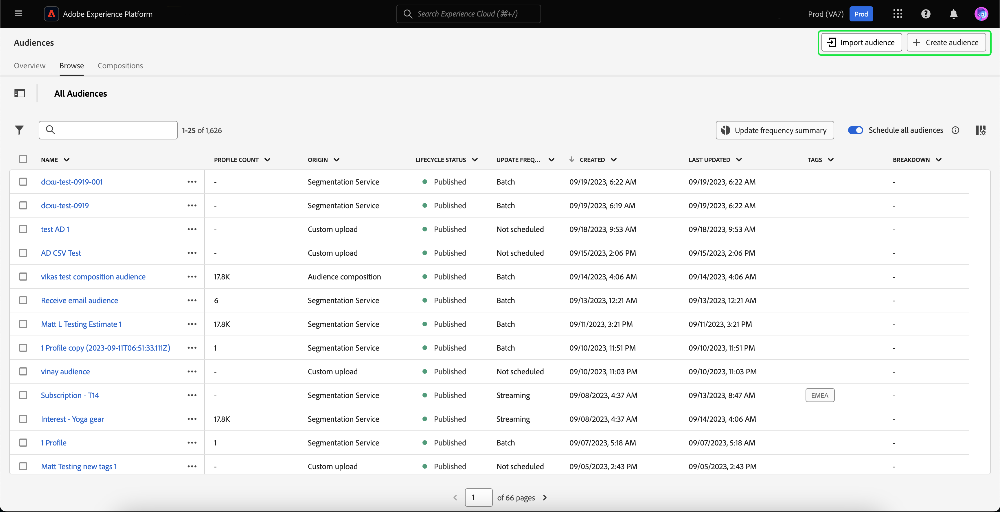

>[!NOTE]
>
> You will **not** be able to delete an audience that is used in a destination activation.

### Filtering and tagging {#manage-audiences}

To improve your work efficiency, you can add user-defined tags to audiences, put audiences in folders, and filter the displayed audiences.

**Tags** {#tags}

You can add user-defined tags to better describe, find, and manage your audiences.

To add a tag, select **[!UICONTROL Manage tags]** on the audience you want to tag.

![The [!UICONTROL Manage tags] button is selected for a specified audience.](../images/ui/overview/browse-manage-tags.png)

The **[!UICONTROL Manage tags]** popover appears. On this popover, you can either select an already defined tag or create your own tag to attach to the audience.

![The [!UICONTROL Manage tags] popover is displayed. The options to choose an already existing tag or to create a new tag are highlighted.](../images/ui/overview/create-tag.png)

After adding all the tags you want to attach to the audience, select **[!UICONTROL Save]**.

![On the [!UICONTROL Manage tags] popover, the added tags are highlighted.](../images/ui/overview/created-tags.png)

**Folders** {#folders}

You can place audiences within folders for better audience management.

To move an audience into a folder, select **[!UICONTROL Move to folder]** on the audience you want to move.

![The [!UICONTROL Move to folder] button is selected for a specific audience.](../images/ui/overview/browse-move-to-folder.png)

The **Move audience to folder** popover appears. Select the folder you want to move the audience to, then select **[!UICONTROL Save]**.

Once the audience is in a folder, you can choose to only display audiences that belong to a specific folder.

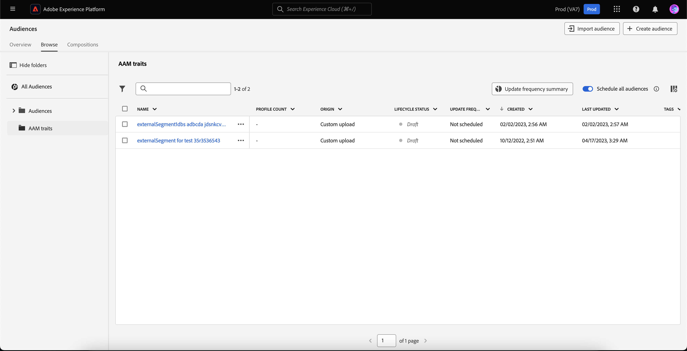

**Filter** {#filter}

You can also filter your audiences, based on a variety of settings.

To filter the available audiences, select the . 

The list of available filters is displayed.

| Filter | Description |
| ------ | ----------- |
| [!UICONTROL Origin] | Lets you filter based on the origin of the audience. Available options include Segmentation service, Custom upload, Audience composition, and Audience Manager. |
| [!UICONTROL Has any tag] | Lets you filter by tags. You can select between **[!UICONTROL Has any tag]** and **[!UICONTROL Has all tags]**. When **[!UICONTROL Has any tag]** is selected, the filtered audiences will include **any** of the tags you've added. When **[!UICONTROL Has all tags]** is selected, the filtered audiences must include **all** of the tags you've added. |
| [!UICONTROL Lifecycle status] | Lets you filter based on the audience's lifecycle status. Available options include [!UICONTROL Active], [!UICONTROL Archived], [!UICONTROL Deleted], [!UICONTROL Draft], [!UICONTROL Inactive], and [!UICONTROL Published]. |
| [!UICONTROL Update frequency] | Lets you filter based on the audience's update frequency. Available options include [!UICONTROL Scheduled], [!UICONTROL Continuous], and [!UICONTROL On Demand]. |
| [!UICONTROL Created by] | Lets you filter based on the person who created the audience. |
| [!UICONTROL Creation date] | Lets you filter based on the creation date of the audience. You can choose a date range to filter when the audience was created. |
| [!UICONTROL Modified date] | Lets you filter based on the last modified date of the audience. You can choose a date range to filter when the audience was last modified. |

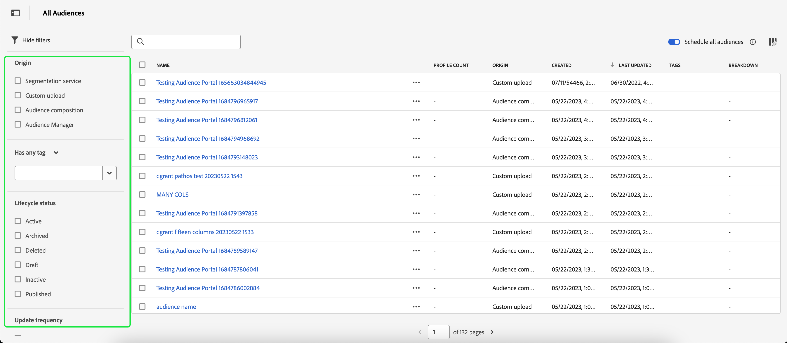

### Audience details {#audience-details}

To see more details about a specific audience, select an audience's name within the **[!UICONTROL Browse]** tab.

The audience details page appears. On the top, there is a summary of the audience, information about the qualified audience size, as well as destinations the segment is activated for. 

**Audience summary** {#segment-summary}

The **[!UICONTROL Audience summary]** section provides information such as the ID, name, description, origin, and details of the attributes. 

Additionally, you are given the option to activate the audience to a destination, apply access labels, or edit/update the audience. 

Selecting **[!UICONTROL Activate to destination]** lets you activate the audience to a destination. For more detailed information on activating an audience to a destination, please read the [activation overview](../../destinations/ui/activation-overview.md).

Selecting **[!UICONTROL Apply access labels]** lets you manage the access labels that belong to the audience. For more information on access labels, please read the documentation on [managing labels](../../access-control/abac/ui/labels.md).

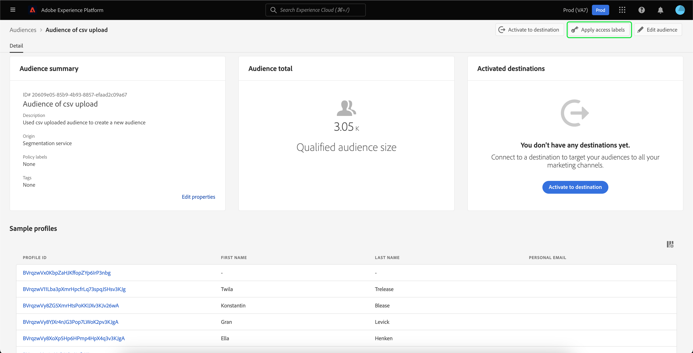

>[!BEGINTABS]

>[!TAB Audience composition]

![The audience details page is shown, with the [!UICONTROL Open composition] button highlighted.](../images/ui/overview/audience-details-open-composition.png)

Selecting **[!UICONTROL Open composition]** lets you view your audience in Audience Composition. For more information about Audience Composition, please read the [Audience Composition UI guide](./audience-composition.md).

>[!TAB Custom upload]

![The audience details page is shown, with the [!UICONTROL Update audience] button highlighted.](../images/ui/overview/audience-details-update-audience.png)

Selecting **[!UICONTROL Update audience]** lets you re-upload an externally generated audience. For more information on importing an externally generated audience, please read the section on [importing an audience](#import-audience).

>[!TAB Segmentation Service]

![The audience details page is shown, with the [!UICONTROL Edit audience] button highlighted.](../images/ui/overview/audience-details-edit-audience.png)

Selecting **[!UICONTROL Edit audience]** lets you edit your audience in the Segment Builder. For more detailed information about using the [!DNL Segment Builder] workspace, please read the [[!DNL Segment Builder] user guide](./segment-builder.md).

>[!ENDTABS]

Selecting **[!UICONTROL Edit properties]** will let you edit the basic details of the audience, such as the name, description, and tags.

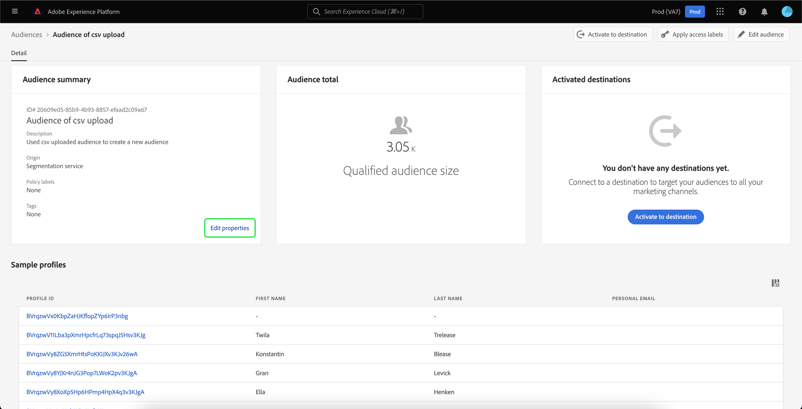

**Audience total** {#audience-total}

The **[!UICONTROL Audience total]** section shows the total number of profiles that qualify for the audience.

Estimates are generated by using a sample size of that day's sample data. If there are less than 1 million entities in your profile store, the full data set is used; for between 1 and 20 million entities, 1 million entities are used; and for over 20 million entities, 5% of the total entities are used. More information about generating estimates can be found in the [estimate generation section](../tutorials/create-a-segment.md#estimate-and-preview-an-audience) of the audience creation tutorial.

**Activated destinations** {#activated-destinations}

The **[!UICONTROL Activated destinations]** section shows the destinations that this audience is activated for.

>[!NOTE]
>
> Destinations are a feature available with [!DNL Adobe Real-Time Customer Data Platform], and allow you to export data to external platforms. For more information on destinations, please read the [destinations overview](../../destinations/home.md). To learn how to activate a segment to a destination, see [activation overview](../../destinations/ui/activation-overview.md).

**Profile samples** {#profile-samples}

Underneath is a sampling of profiles that qualify for the segment, detailing information including the [!DNL Profile] ID, first name, last name, and personal email. 

The way data sampling gets triggered depends on the method of ingestion.

For batch ingestion, the profile store is automatically scanned every fifteen minutes to see if a new batch was successfully ingested since the last sampling job was run. If that is the case, the profile store is subsequently scanned to see if there's been at least a 5% change in the number of records. If these conditions are met, a new sampling job is triggered.

For streaming ingestion, the profile store is automatically scanned every hour to see if there's been at least a 5% change in the number of records. If this condition is met, a new sampling job is triggered.

The sample size of the scan depends on the overall number of entities in your profile store. These sample sizes are represented in the following table:

| Entities in profile store | Sample size |
| ------------------------- | ----------- |
| Less than 1 million | Full data set |
| 1 to 20 million | 1 million |
| Over 20 million | 5% of total |

More detailed information about each [!DNL Profile] can be seen by selecting the [!DNL Profile] ID. To learn more about a profile's details, please read the [[!DNL Real-Time Customer Profile] user guide](../../profile/ui/user-guide.md#profile-detail).

### Creating an audience {#create-audience}

You can select **[!UICONTROL Create audience]** to create an audience. 

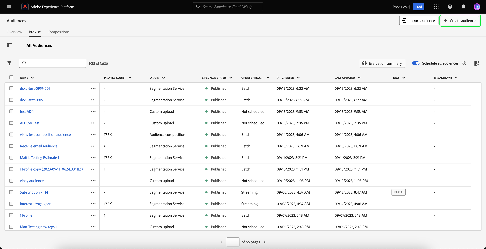

A popover appears, letting you choose between composing an audience or building rules.

**Audience Composition** {#audience-composition}

Selecting **[!UICONTROL Compose audiences]** takes you to Audience Composition. This workspace provides intuitive controls for building and editing audiences, such as drag-and-drop tiles used to represent different actions. To learn more about creating audiences, please read the [Audience Composition guide](./audience-composition.md).

**Segment Builder** {#segment-builder}

Selecting **[!UICONTROL Build rule]** takes you to the Segment Builder. This workspace provides intuitive controls for building and editing segment definitions, such as drag-and-drop tiles used to represent data properties. To learn more about creating segment definitions, please read the [Segment Builder guide](./segment-builder.md)

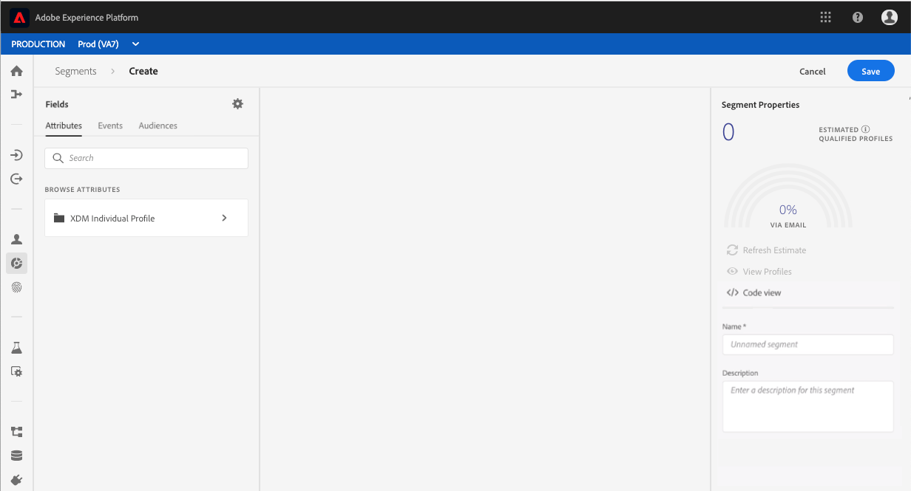

### Importing an audience {#import-audience}

You can select **[!UICONTROL Import audience]** to import an externally generated audience.

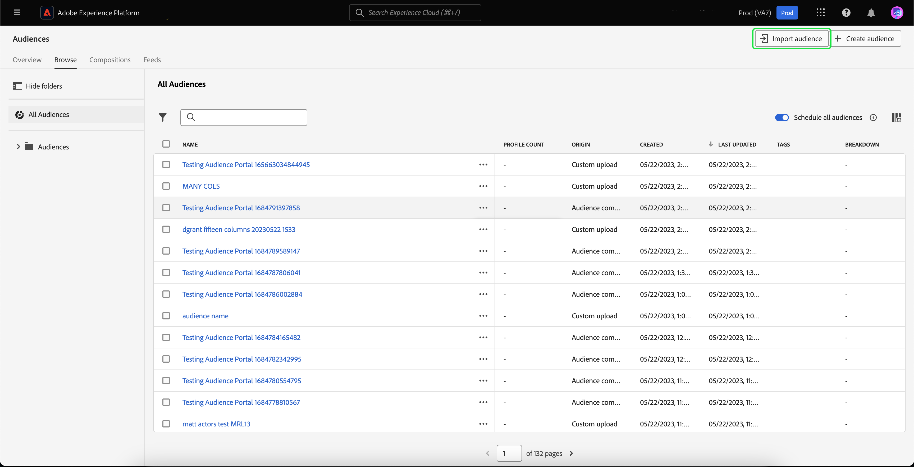

The **[!UICONTROL Import audience CSV]** workflow appears. You can select a CSV file to import as an externally generated audience.

![In the [!UICONTROL Import audience CSV] workflow, the [!UICONTROL Drag and drop files] box is highlighted, showing where you can upload your externally generated audience.](../images/ui/overview/import-audience-csv.png)

>[!NOTE]
>
>The external generated audience **must** be in CSV format and less than 1GB.

After selecting the CSV file to import, a list of sample data is shown for this externally generated audience. After confirming that the sample data is correct, select **[!UICONTROL Next]**.

The **[!UICONTROL Audience details]** page appears. You can add information about your audience, including its name, description, primary identity, and identity namespace value. 

![The [!UICONTROL Audience details] page is displayed.](../images/ui/overview/import-audience-audience-details.png)

After filling in your audience details, select **[!UICONTROL Next]**.

![The [!UICONTROL Next] button is highlighted on the [!UICONTROL Audience details] page.](../images/ui/overview/import-audience-filled-details.png)

The **[!UICONTROL Review]** page is displayed. You can review the details of your newly imported externally generated audience.

![The [!UICONTROL Review] page is displayed, showing details of your newly imported externally generated audience.](../images/ui/overview/import-audience-review-details.png)

After confirming the details are correct, select **[!UICONTROL Finish]** to import your externally generated audience into Adobe Experience Platform.

## Scheduled segmentation {#scheduled-segmentation}

Once audiences have been created, you can then evaluate them through on-demand or scheduled (continuous) evaluation. Evaluation means moving [!DNL Real-Time Customer Profile] data through segment jobs in order to produce corresponding audiences. Once created, the audiences are saved and stored so that they can be exported using [!DNL Experience Platform] APIs. 

On-demand evaluation involves using the API to perform evaluation and build audiences as needed, whereas scheduled evaluation (also known as 'scheduled segmentation') allows you to create a recurring schedule to evaluate audiences at a specific time (at a maximum, once daily).

### Enable scheduled segmentation {#enable-scheduled-segmentation}

Enabling your audiences for scheduled evaluation can be done using the UI or the API. In the UI, return to the **[!UICONTROL Browse]** tab within **[!UICONTROL Audiences]** and toggle on **[!UICONTROL Schedule all audiences]**. This will cause all audiences to be evaluated based on the schedule set by your organization.

>[!NOTE]
>
>Scheduled evaluation can be enabled for sandboxes with a maximum of five (5) merge policies for [!DNL XDM Individual Profile]. If your organization has more than five merge policies for [!DNL XDM Individual Profile] within a single sandbox environment, you will not be able to use scheduled evaluation.

Schedules can currently only be created using the API. For detailed steps on creating, editing, and working with schedules using the API, please follow the tutorial for evaluating and accessing segmentation results, specifically the section on [scheduled evaluation using the API](../tutorials/evaluate-a-segment.md#scheduled-evaluation).

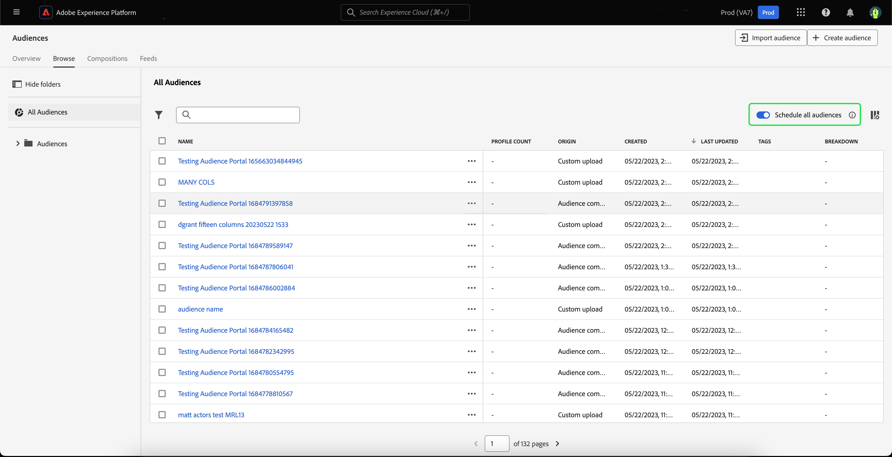

## Compositions {#compositions}

Select the **[!UICONTROL Compositions]** tab to see a list of all the audiences generated through Audience Composition for your organization.

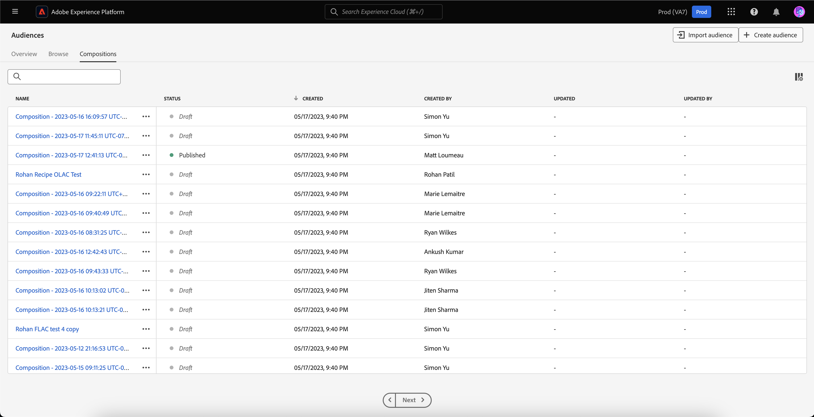

By default, this view lists information about the audiences including the name, status, created date, created by, last updated date, and last updated by.

You can select the  icon to change which fields are displayed.

A popover appears, listing all the fields that can be displayed within the table.

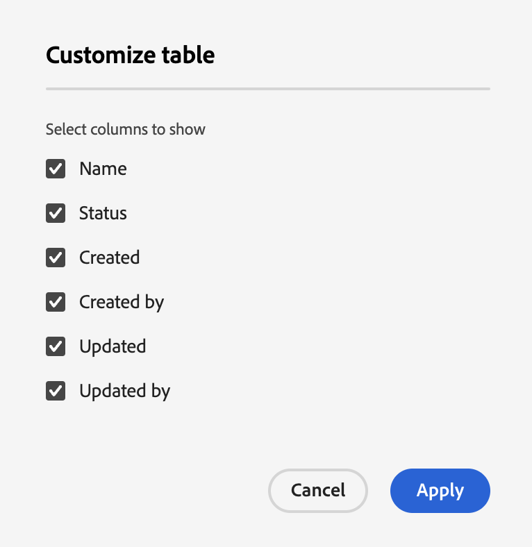

| Field | Description |
| ----- | ----------- | 
| [!UICONTROL Name] | The name of the audience. |
| [!UICONTROL Status] | The status of the audience. Possible values for this field include `Draft`, `Published`, and `Archived`.  |
| [!UICONTROL Created] | The time and date the audience was created. | 
| [!UICONTROL Created by] | The name of the person who created the audience. |
| [!UICONTROL Updated] | The time and date the audience was last updated. |
| [!UICONTROL Updated by] | The name of the person who last updated the audience. |

To see how the audience is composed, select an audience's name within the [!UICONTROL Audiences] tab.

The Audience Composition page appears with the building blocks that compose your audience. For more details about how to use Audience Composition, please read the [Audience Composition UI guide](./audience-composition.md).

## Streaming segmentation {#streaming-segmentation}

Streaming segmentation is the ability to do segmentation on [!DNL Platform] in near real-time, while focusing on data richness. With streaming segmentation, qualification for segmentation now happens as data lands into [!DNL Platform], alleviating the need to schedule and run segmentation jobs.

More information about streaming segmentation can be found in the [streaming segmentation user guide](./streaming-segmentation.md).

>[!NOTE]
>
>In order for streaming segmentation to work, you will need to enable scheduled segmentation for the organization. For details on enabling scheduled segmentation, please refer to [the streaming segmentation section in this user guide](#scheduled-segmentation).

## Edge segmentation {#edge-segmentation}

Edge segmentation is the ability to evaluate audiences in Platform instantaneously on the edge, enabling same page and next page personalization use cases. 

More information about edge segmentation can be found in the [edge segmentation UI guide](./edge-segmentation.md)

## Policy violations

>[!NOTE]
>
>Policy violations only apply if you are creating an audience that has been assigned to a destination.

Once you are done creating your audience, the audience will be analyzed by Adobe Experience Platform Data Governance to ensure there are no policy violations within the audience. See the [Data Governance overview](../../data-governance/home.md) for more information.

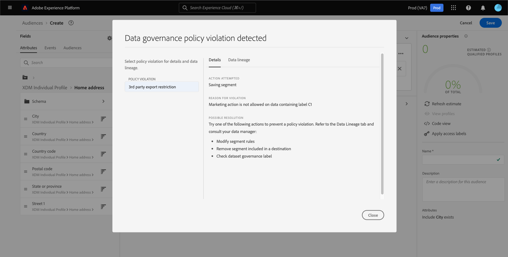

## Next steps and additional resources {#next-steps}

The [!DNL Segmentation Service] UI provides a rich workflow allowing you to create marketable audiences from [!DNL Real-Time Customer Profile] data.
  
To learn more about [!DNL Segmentation Service], please continue reading the documentation. To learn how to use the [!DNL Segmentation Service] API, please read the [[!DNL Segmentation Service] developer guide](../api/overview.md).
