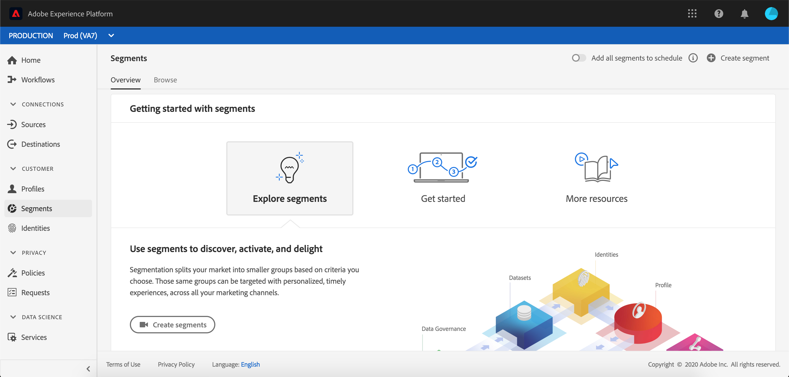
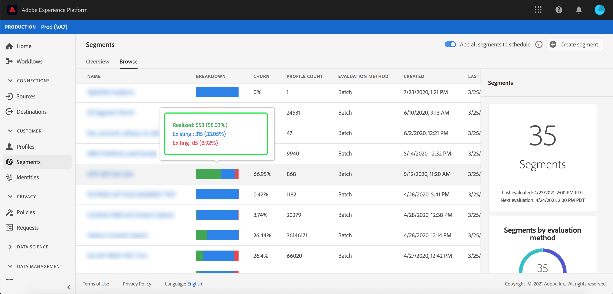
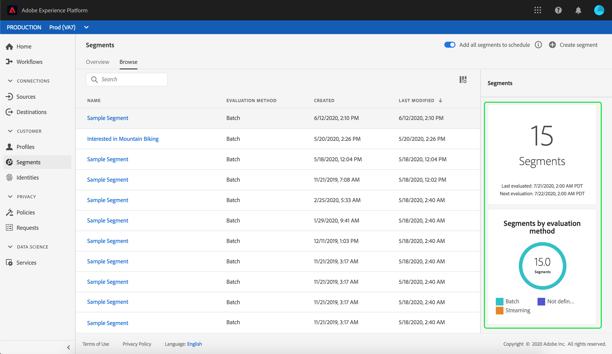

# Segmentation Service user guide

[!DNL Adobe Experience Platform Segmentation Service] provides a user interface for creating and managing segment definitions. 

## Getting started

Working with segment definitions requires an understanding of the various [!DNL Experience Platform] services involved with segmentation. Before reading this user guide, please review the documentation for the following services:

- [[!DNL Segmentation Service]](../home.md): [!DNL Segmentation Service] allows you to divide data stored in [!DNL Experience Platform] that relates to individuals (such as customers, prospects, users, or organizations) into smaller groups.
- [[!DNL Real-time Customer Profile]](../../profile/home.md): Provides a unified, real-time consumer profile based on aggregated data from multiple sources.
- [[!DNL Adobe Experience Platform Identity Service]](../../identity-service/home.md): Enables the creation of customer profiles by bridging identities from disparate data sources being ingested into [!DNL Platform].
- [[!DNL Experience Data Model (XDM)]](../../xdm/home.md): The standardized framework by which [!DNL Platform] organizes customer experience data.

It is also important to know two key terms that are used through this document and understand the difference between them:
- **Segment definition**: The rule set used to describe key characteristics or behaviors of a target audience.
- **Audience**: The resulting set of profiles that meet the criteria of a segment definition.

## Overview

In the [[!DNL Experience Platform] UI](http://platform.adobe.com/), select **[!UICONTROL Segments]** in the left navigation to open the **[!UICONTROL Overview]** tab. This tab provides links to documentation and videos to help you understand and begin working with segments.

## Browse

Select the **[!UICONTROL Browse]** tab to see a list of all the segment definitions for your IMS Organization. 

This view lists information about the segment definition including the breakdown, churn, profile count, evaluation method, created date, and last modified date.

The breakdown shows a bar graph outlining the percentage of profiles that belong to each of the following statuses: [!UICONTROL Entered], [!UICONTROL Realized], and [!UICONTROL Exiting]. 

| Status | Description |
| ------ | ----------- |
| Entered | A new profile within the segment. |
| Realized | An existing profile which has remained within the segment. |
| Exiting | An existing profile which is leaving the segment. |

The churn represents the percentage of profiles that are changing within a segment definition compared to the last time the segment job ran, while the profile count represents the total number of profiles that qualify for the segment.

The evaluation method can either be streaming or batch. Streaming segments are constantly evaluated as data enters the system. Batch segments are evaluated according to a set schedule. 

On the top of the page are options to add all segments to a schedule and to create a new segment. 

Toggling **[!UICONTROL Add all segments to schedule]** will enable scheduled segmentation. More information on scheduled segmentation can be found in the [scheduled segmentation section of this user guide](#scheduled-segmentation).

Selecting **[!UICONTROL Create segment]** will take you to the Segment Builder. To learn more about creating segments, please read the section on [creating a segment in the user guide](#create-segment).

The right sidebar contains information about all the segments within the IMS organization, listing the total number of segments, the last evaluation date, the next evaluation date, as well as a breakdown of the segments by evaluation method.

Selecting the segment definition's row provides a summary of the segment definition, including options to either edit or delete the segment, the qualified audience for the segment, the total audience size, in addition to the segment's name, description, evaluation method, created date, and last modified date.

## Segment definition details {#segment-details}

To see more details about a specific segment definition, select a segment's name within the **[!UICONTROL Browse]** tab.

The segment details page appears. On the top, there is a summary of the segment definition, information about the qualified audience size, as well as destinations the segment is activated for. 

### Segment summary

The **[!UICONTROL Segment summary]** section provides information such as the ID, name, description, and details of the attributes. 

Additionally, you are given the option to edit the segment. Selecting **[!UICONTROL Edit segment]** will bring you to the [!DNL Segment Builder]. For more detailed information about using the [!DNL Segment Builder] workspace, please read the [[!DNL Segment Builder] user guide](./segment-builder.md).

### Total audience in segment

The **[!UICONTROL Total audience in segment]** section shows the total number of profiles that qualify for the segment.

Estimates are generated by using a sample size of that day's sample data. If there are less than 1 million entities in your profile store, the full data set is used; for between 1 and 20 million entities, 1 million entities are used; and for over 20 million entities, 5% of the total entities are used. More information about generating segment estimates can be found in the [estimate generation section](../tutorials/create-a-segment.md#estimate-and-preview-an-audience) of the segment creation tutorial.

### Activated destinations

The **[!UICONTROL Activated destinations]** section shows the destinations that this segment is activated for.

>[!NOTE]
>
> Destinations are a feature available with [!DNL Real-time Customer Data Platform], and allow you to export data to external platforms. For more information on destinations, please read the [destinations overview](../../destinations/home.md). To learn how to activate a segment to a destination, please read the [guide on activating segments to a destination](../../destinations/ui/activate-destinations.md).

### Profile samples

Underneath is a sampling of profiles that qualify for the segment, detailing information including the [!DNL Profile] ID, first name, last name, and personal email. 

The way data sampling gets triggered depends on the method of ingestion.

For batch ingestion, the profile store is automatically scanned every fifteen minutes to see if a new batch was successfully ingested since the last sampling job was run. If that is the case, the profile store is subsequently scanned to see if there's been at least a 5% change in the number of records. If these conditions are met, a new sampling job is triggered.

For streaming ingestion, the profile store is automatically scanned every hour to see if there's been at least a 5% change in the number of records. If this condition is met, a new sampling job is triggered.

The sample size of the scan depends on the overall number of entities in your profile store. These sample sizes are represented in the following table:

| Entities in profile store | Sample size |
| ------------------------- | ----------- |
| Less than 1 million | Full data set |
| 1 to 20 million | 1 million |
| Over 20 million | 5% of total |

More detailed information about each [!DNL Profile] can be seen by selecting the [!DNL Profile] ID. To learn more about a profile's details, please read the [[!DNL Real-time Customer Profile] user guide](../../profile/ui/user-guide.md#profile-detail).

## Creating a segment {#create-segment}

Selecting **[!UICONTROL Create segment]** in the top-right corner opens the [!DNL Segment Builder] workspace, where you can begin creating a segment definition.

### [!DNL Segment Builder] workspace 

[!DNL Segment Builder] provides a rich workspace that allows you to interact with [!DNL Profile] data elements. The workspace provides intuitive controls for building and editing rules, such as drag-and-drop tiles used to represent data properties. 

For more detailed information about using the [!DNL Segment Builder] workspace, please read the [[!DNL Segment Builder] user guide](./segment-builder.md).

## Scheduled segmentation {#scheduled-segmentation}

Once segment definitions have been created, you can then evaluate them through on-demand or scheduled (continuous) evaluation. Evaluation means moving [!DNL Real-time Customer Profile] data through segment definitions in order to produce corresponding audiences. Once created, the audiences are saved and stored so that they can be exported using [!DNL Experience Platform] APIs. 

On-demand evaluation involves using the API to perform evaluation and build audiences as needed, whereas scheduled evaluation (also known as 'scheduled segmentation') allows you to create a recurring schedule to evaluate segment definitions at a specific time (at a maximum, once daily).

### Enable scheduled segmentation {#enable-scheduled-segmentation}

Enabling your segment definitions for scheduled evaluation can be done using the UI or the API. In the UI, return to the **[!UICONTROL Browse]** tab within **[!UICONTROL Segments]** and toggle on **[!UICONTROL Add all segments to schedule]**. This will cause all segments to be evaluated based on the schedule set by your organization.

>[!NOTE]
>
>Scheduled evaluation can be enabled for sandboxes with a maximum of five (5) merge policies for [!DNL XDM Individual Profile]. If your organization has more than five merge policies for [!DNL XDM Individual Profile] within a single sandbox environment, you will not be able to use scheduled evaluation.

Schedules can currently only be created using the API. For detailed steps on creating, editing, and working with schedules using the API, please follow the tutorial for evaluating and accessing segment results, specifically the section on [scheduled evaluation using the API](../tutorials/evaluate-a-segment.md#scheduled-evaluation).

## Streaming segmentation {#streaming-segmentation}

Streaming segmentation is the ability to do segmentation on [!DNL Platform] in near real-time, while focusing on data richness. With streaming segmentation, segment qualification now happens as data lands into [!DNL Platform], alleviating the need to schedule and run segmentation jobs.

More information about streaming segmentation can be found in the [streaming segmentation user guide](./streaming-segmentation.md).

>[!NOTE]
>
>In order for streaming segmentation to work, you will need to enable scheduled segmentation for the organization. For details on enabling scheduled segmentation, please refer to [the streaming segmentation section in this user guide](#scheduled-segmentation).

## Policy violations

>[!NOTE]
>
>Policy violations only apply if you are creating a segment that has been assigned to a destination.

Once you are done creating your segment, the segment will be analyzed by Adobe Experience Platform Data Governance to ensure there are no policy violations within the segment. See the [[!DNL Data Governance] overview](../../data-governance/home.md) for more information.

## Next steps and additional resources {#next-steps}

The [!DNL Segmentation Service] UI provides a rich workflow allowing you to isolate marketable audiences from [!DNL Real-time Customer Profile] data.
  
To learn more about [!DNL Segmentation Service], please continue reading the documentation. To learn how to use the [!DNL Segmentation Service] API, please read the [[!DNL Segmentation Service] developer guide](../api/overview.md).
