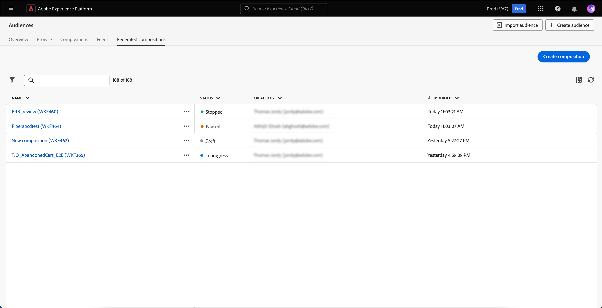

# Segmentation Service UI guide

[!DNL Adobe Experience Platform Segmentation Service] provides a user interface for creating and managing audiences and segment definitions. 

## Getting started

Working with audiences and segment definitions requires an understanding of the various [!DNL Experience Platform] services involved with segmentation. Before reading this user guide, please review the documentation for the following services:

- [[!DNL Segmentation Service]](../home.md): [!DNL Segmentation Service] allows you to segment data stored in [!DNL Experience Platform] that relates to individuals (such as customers, prospects, users, or organizations) into smaller groups.
- [[!DNL Real-Time Customer Profile]](../../profile/home.md): Provides a unified, real-time consumer profile based on aggregated data from multiple sources.
- [[!DNL Adobe Experience Platform Identity Service]](../../identity-service/home.md): Enables the creation of customer profiles by bridging identities from disparate data sources being ingested into [!DNL Experience Platform].
- [[!DNL Experience Data Model (XDM)]](../../xdm/home.md): The standardized framework by which [!DNL Experience Platform] organizes customer experience data. To best make use of Segmentation, please ensure your data is ingested as profiles and events according to the [best practices for data modeling](../../xdm/schema/best-practices.md).

You should also understand the following key terms that are used through this document and understand the difference between them:

- **Audience**: A collection of people who share similar behaviors and/or characteristics. This collection of people can either be generated by Adobe Experience Platform using segment definitions (Experience-Platform-generated audience), audience composition, or from external sources such as custom uploads (externally generated audience).
- **Segment definition**: The rules Adobe Experience Platform uses to describe key characteristics or behavior of a target audience.
- **Segment**: The act of separating Profiles into audiences.

## Overview

In the Experience Platform UI, select **[!UICONTROL Audiences]** in the left navigation to open the **[!UICONTROL Overview]** tab displaying the [!UICONTROL Audiences] dashboard. 

>[!NOTE]
>
>If your organization is new to Experience Platform and does not yet have active Profile datasets or merge policies created, the [!UICONTROL Audiences] dashboard is not visible. Instead, the [!UICONTROL Overview] tab displays links and documentation to help you get started with audiences.

### [!UICONTROL Audiences] dashboard {#segments-dashboard}

The **[!UICONTROL Audiences]** dashboard outlines key metrics related to your organization's audience data. 

To learn more, visit the [audiences dashboard guide](../../dashboards/guides/audiences.md).

## Browse {#browse}

Select the **[!UICONTROL Browse]** tab to see the Audience Portal. Audience Portal provides a list of all the audiences that belong to your organization and sandbox, and includes details such as the profile count, origin, created date, last modified date, tags, and breakdown. 

In addition, Audience Portal lets you create new audiences using Segment Builder or Audience Composition, as well as import externally generated audiences into Experience Platform.

For more information about Audience Portal, please read the [Audience Portal overview](./audience-portal.md).

## Compositions {#compositions}

Select the **[!UICONTROL Compositions]** tab to see a list of all the audiences generated through Audience Composition for your organization.

By default, this view lists information about the audiences including the name, status, created date, created by, last updated date, and last updated by.

Next to each audience is an ellipsis icon. Selecting this displays a list of available quick actions for the audience.

| Action | Description |
| ------ | ----------- |
| Duplicate | Copies the selected audience. |
| Manage access | Manages the access labels that belong to the audience. For more information on access labels, please read the documentation on [managing labels](../../access-control/abac/ui/labels.md). |
| Delete | Deletes the selected audience. Audiences that are used in downstream destinations or are dependents in other audiences **cannot** be deleted. For more information on audience deletion, please read the [segmentation FAQ](../faq.md#lifecycle-states). |

You can select the  icon to change which fields are displayed.

A popover appears, listing all the fields that can be displayed within the table.

| Field | Description |
| ----- | ----------- | 
| [!UICONTROL Name] | The name of the audience. |
| [!UICONTROL Status] | The status of the audience. Possible values for this field include `Draft`, `Inactive`, and `Published`.  |
| [!UICONTROL Created] | The time and date the audience was created. | 
| [!UICONTROL Created by] | The name of the person who created the audience. |
| [!UICONTROL Updated] | The time and date the audience was last updated. |
| [!UICONTROL Updated by] | The name of the person who last updated the audience. |

To see how the audience is composed, select an audience's name within the [!UICONTROL Audiences] tab.

The Audience Composition page appears with the building blocks that compose your audience. For more details about how to use Audience Composition, please read the [Audience Composition UI guide](./audience-composition.md).

## Federated Audience Composition {#fac}

In addition to audience compositions and segment definitions, you can use Adobe Federated Audience Composition to build new audiences from enterprise datasets without copying underlying data and store those audiences in Adobe Experience Platform Audience Portal. You can also enrich existing audiences in Adobe Experience Platform by utilizing composed audience data that has been federated from the enterprise data warehouse. Please read the guide on [Federated Audience Composition](https://experienceleague.adobe.com/en/docs/federated-audience-composition/using/home).

## Streaming segmentation {#streaming-segmentation}

Streaming segmentation is the ability to do segmentation on [!DNL Experience Platform] in near real-time, while focusing on data richness. With streaming segmentation, qualification for segmentation now happens as data lands into [!DNL Experience Platform], alleviating the need to schedule and run segmentation jobs.

More information about streaming segmentation can be found in the [streaming segmentation user guide](../methods/streaming-segmentation.md).

>[!NOTE]
>
>In order for streaming segmentation to work, you will need to enable scheduled segmentation for the organization. For details on enabling scheduled segmentation, please refer to [the streaming segmentation section in this user guide](#scheduled-segmentation).

## Edge segmentation {#edge-segmentation}

Edge segmentation is the ability to evaluate audiences in Experience Platform instantaneously on the edge, enabling same page and next page personalization use cases. 

More information about edge segmentation can be found in the [edge segmentation UI guide](../methods/edge-segmentation.md)

## Policy violations

>[!NOTE]
>
>Policy violations only apply if you are creating an audience that has been assigned to a destination.

Once you are done creating your audience, the audience will be analyzed by Adobe Experience Platform Data Governance to ensure there are no policy violations within the audience. See the [Data Governance overview](../../data-governance/home.md) for more information.

## Next steps and additional resources {#next-steps}

The [!DNL Segmentation Service] UI provides a rich workflow allowing you to create marketable audiences from [!DNL Real-Time Customer Profile] data.
  
To learn more about [!DNL Segmentation Service], please continue reading the documentation. To learn how to use the [!DNL Segmentation Service] API, please read the [[!DNL Segmentation Service] developer guide](../api/overview.md).
