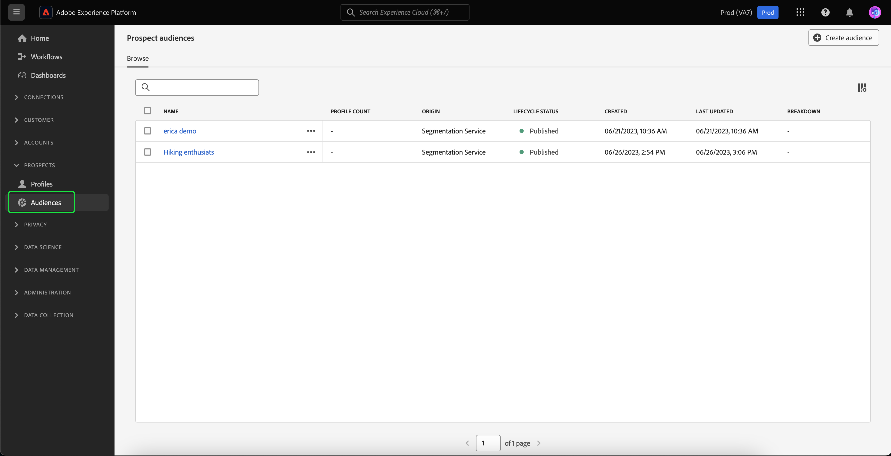
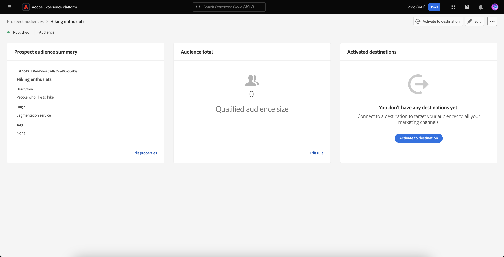
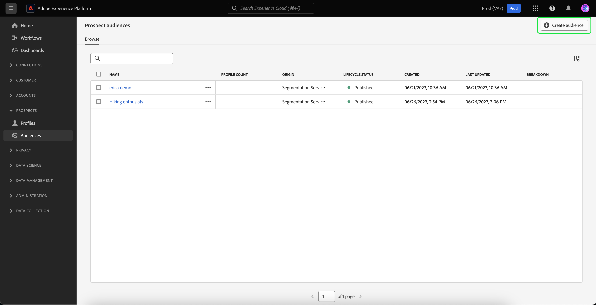

# Prospect audiences

>[!IMPORTANT]
>
>Prospect audiences is currently in **beta** and is **not** available to all users.

Prospect audiences are used to segment your prospect profiles, allowing you to market towards people who haven't engaged with your product at this point in time.

## Browse 

To access prospect audiences, select **[!UICONTROL Audiences]** in the **[!UICONTROL Prospects]** section.

The Browse page is displayed. A list of all the prospect audiences for the organization is displayed.

This view lists information about the audience including the name, profile count, origin, lifecycle status, created date, last updated date, and breakdown.

You can add additional fields to this display by selecting . These additional fields include update frequency and the last updated by.

More information about the browse page, including detailed information about the listed fields, can be found in the [browse section of the Segmentation UI guide](./overview.md#browse).

## Audience details

To view details about a specific prospect audience, select an audience on the Browse page.

The prospect audience details page is displayed. Information, including the prospect audience summary, the audience total, and the activated destinations are displayed.

For more information about the audience details page, please read the [audience details section of the Segmentation UI guide](./overview.md).

## Create audience

To create a prospect audience, on the Browse page, select **Create audience**.

The Segment Builder appears. The prospect profile attributes appear on the left navigation bar. 

For more information on using the Segment Builder, please read the [Segment Builder UI guide](./segment-builder.md).

## Next steps

After reading this guide, you now know how to create and manage your prospect audiences in Adobe Experience Platform. To learn how to activate a prospect audience to other downstream services, please read the ??? guide.
