# [!DNL Segment Builder] UI guide

>[!NOTE]
>
>This guide explains how to create audiences through **segment definitions** using the Segment Builder. To learn how to create audiences using Audience Composition, please read the [Audience Composition UI guide](./audience-composition.md).

[!DNL Segment Builder] provides a rich workspace that allows you to interact with [!DNL Profile] data elements. The workspace provides intuitive controls for building and editing rules, such as drag-and-drop tiles used to represent data properties. 

## Segment definition building blocks {#building-blocks}

>[!CONTEXTUALHELP]
>id="platform_segments_createsegment_segmentbuilder_fields"
>title="Fields"
>abstract="The three field types that make up a segment definition are attributes, events, and audiences. Attributes let you use Profile attributes that belong to the XDM Individual Profile class, events let you create an audience based on actions or events that take place using XDM ExperienceEvent data elements, and audiences let you use imported audiences from external sources."

>[!CONTEXTUALHELP]
>id="platform_segmentation_segmentbuilder_showfullxdmschema"
>title="Show full XDM schema"
>abstract="By default, only fields that contain data are displayed. Enable this option to show all the fields in the XDM schema."

>[!CONTEXTUALHELP]
>id="platform_segmentation_segmentbuilder_showdeprecatedfields"
>title="Show deprecated fields"
>abstract="By default, deprecated XDM fields are not dispalyed. Enable this option to show deprecated XDM fields."

The basic building blocks of segment definitions are attributes and events. In addition, the attributes and events contained in existing audiences can be used as components for new definitions. 

>[!CONTEXTUALHELP]
>id="platform_segments_createsegment_segmentbuilder_summarydata"
>title="Summary data"
>abstract="Summary data only appears for profile attributes and does <b>not</b> appear for either event or audience attributes.  Summary data for profile attributes may not appear under the following circumstances: <ol><li>Some of the values of the attribute are more than 100 characters long.</li><li>There are more than 3000 unique values for the attribute.</li></ol>"

>[!NOTE]
>
>If you select the information bubble of an attribute, you can view the distribution of values, also known as the summary data, of the field. These are **only** available in the attributes tab, and are not available for use in the events or audiences tab.
>
>Summary data will appear if the attribute meets the following criteria: All the values of the attribute are 100 characters or fewer and there are 3000 or fewer unique values for the attribute.
>
>However, an attribute will **not** have summary data if it is multi-entity data linked to the profile through a relationship. For example, if you have a custom schema called `Vehicle`, the **properties** within the `Vehicle` schema will **not** have summary data.

You can see these building blocks in the **[!UICONTROL Fields]** section on the left side of the [!DNL Segment Builder] workspace. **[!UICONTROL Fields]** contains a tab for each of the main building blocks: "[!UICONTROL Attributes]", "[!UICONTROL Events]", and "[!UICONTROL Audiences]".

### Attributes

The **[!UICONTROL Attributes]** tab allows you to browse [!DNL Profile] attributes belonging to the [!DNL XDM Individual Profile] class. Each folder can be expanded to reveal additional attributes, where each attribute is a tile that can be dragged onto the rule builder canvas in the center of the workspace. The [rule builder canvas](#rule-builder-canvas) is discussed in more detail later in this guide.

  

### Events

The **[!UICONTROL Events]** tab allows you to create an audience based on events or actions that took place using [!DNL XDM ExperienceEvent] data elements. You can also find Event Types on the **[!UICONTROL Events]** tab, which are a collection of commonly used events to enable you to create your segment definitions more quickly.

In addition to being able to browse for [!DNL ExperienceEvent] elements, you can also search for Event Types. Event Types use the same coding logic as [!DNL ExperienceEvents], without requiring you to search through the [!DNL XDM ExperienceEvent] class looking for the correct event. For example, using the search bar to search "cart" returns the Event Types "[!UICONTROL AddCart]" and "[!UICONTROL RemoveCart]", which are two very commonly used cart actions when building segment definitions. 

Any type of component can be searched for by typing its name in the search bar, which uses [Lucene's search syntax](https://docs.microsoft.com/en-us/azure/search/query-lucene-syntax). The search results begin to populate as entire words are entered. For example, to build a rule based on the XDM field `ExperienceEvent.commerce.productViews`, start typing "product views" in the search field. Once the word "product" has been typed, search results begin to appear. Each result includes the object hierarchy to which it belongs. 

>[!NOTE]
>
>Custom schema fields defined by your organization may take up to 24 hours to appear and become available for use in building rules. 

You can then easily drag and drop [!DNL ExperienceEvents] and "[!UICONTROL Event Types]" into your segment definition.
  
  

By default, only populated schema fields from your data store are shown. This includes "[!UICONTROL Event Types]". If the "[!UICONTROL Event Types]" list is not visible, or you are only able to select "[!UICONTROL Any]" as an "[!UICONTROL Event Type]", select the **gear icon** next to **[!UICONTROL Fields]**, then select **[!UICONTROL Show full XDM schema]** under **[!UICONTROL Available Fields]**. Select the **gear icon** again to return to the **[!UICONTROL Fields]** tab and you should now be able to view multiple "[!UICONTROL Event Types]" and schema fields, regardless of whether they contain data or not.

#### Adobe Analytics report suite datasets

You can use data from either a single or multiple Adobe Analytics report suites as events within segmentation. 

When using data from a single Analytics report suite, Experience Platform will automatically add descriptors and friendly names to eVars, making it easier to find those fields within [!DNL Segment Builder].

When using data from multiple Analytics report suites, Experience Platform **cannot** automatically add descriptors or friendly names to eVars. As a result, before using the data from Analytics report suites, you must map to XDM fields. More information about mapping Analytics variables to XDM can be found in the [Adobe Analytics source connection guide](../../sources/tutorials/ui/create/adobe-applications/analytics.md#mapping).

For example, consider a situation where you had two report suites with the following variables:

| Field | Report Suite Schema A | Report Suite Schema B |
| ----- | --------------------- | --------------------- |
| eVar1 | Referring Domain | Logged in Y/N |
| eVar2 | Page Name | Member Loyalty ID | 
| eVar3 | URL | Page Name |
| eVar4 | Search Terms | Product Name |
| event1 | Clicks | Page Views |
| event2 | Page Views | Cart Additions |
| event3 | Cart Additions | Checkouts |
| event4 | Purchases | Purchases |

In this case, you could map the two report suites with the following schema:

>[!NOTE]
>
>While the generic eVar values still get populated, you should **not** use them in your segment definitions (if possible), since the values could mean different things than what they were originally in their reports.

Once the report suites have been mapped, you can use these newly mapped fields within your Profile-related workflows and segmentation.

| Scenario | Union Schema experience | Segmentation generic variable | Segmentation mapped variable |
| -------- | ----------------------- | ----------------------------- | ---------------------------- |
| Single report suite | Friendly name descriptor is included with generic variables.   **Example:** Page Name (eVar2) | <ul><li>Friendly name descriptor included with generic variables</li><li>Queries use data from the specific dataset, since it is the only one</li></ul> | Queries can use Adobe Analytics data and potentially other sources. |
| Multiple report suites | No friendly name descriptors are included with generic variables.   **Example:** eVar2 | <ul><li>Any field with multiple descriptors appear as generic. This means that no friendly names appear in the UI.</li><li>Queries can use data from any datasets that contain the eVar, which may result in mixed or incorrect results.</li></ul> | Queries use correctly combined results from multiple datasets. |
 
### Audiences

>[!CONTEXTUALHELP]
>id="platform_segmentation_segmentBuilder_b2b_decomposition"
>title="Complex evaluation"
>abstract="The following expression is too complicated to be expressed as a single audience. In order to use both B2B-rules and people-based-events in the same segment definition, please follow the steps below.<ol><li>Create a segment definition that only refers to the people-based-events, and save it as its own segment definition.</li><li>In a new segment definition, import the previously created segment definition while referring to the B2B-rules.</li></ol>"

>[!CONTEXTUALHELP]
>id="platform_segmentation_segmentbuilder_externalaudiences"
>title="External audiences"
>abstract="Audiences imported through the Audiences tab are now automatically surfaced through Audience Portal. This includes audiences ingested from Audience Manager, Customer Journey Analytics, Segment Match, and other custom integrations.  By the end of September 2025, audiences will be retrieved exclusively through Unified Search, and the previous workflow will no longer supported. Segment Match remains available only for a small number of designated customers while we transition the service. Access for new Segment Match customers can still be enabled on request before the service is fully retired.  For ongoing data collaboration use cases, Adobe recommends moving to Collaboration, which is the long-term supported solution."
>additional-url="https://experienceleague.adobe.com/en/docs/experience-platform/segmentation/ui/audience-portal#list" text="Audience Portal"

>[!NOTE]
>
>For audiences created within Experience Platform, only audiences that have the **same** merge policy will be displayed.

The **[!UICONTROL Audiences]** tab lists all audiences imported from external sources, such as Adobe Audience Manager or Customer Journey Analytics, as well as audiences created within [!DNL Experience Platform].

On the **[!UICONTROL Audiences]** tab, you can see all of the available sources as a group of folders. As you select the folders, available sub-folders and audiences can be seen. Additionally, you can select the folder icon (as shown in the far-right image) in order to view the folder structure (a check mark denotes the folder you are currently in) and easily navigate back through folders by selecting the name of a folder in the tree.

You can hover over the &#9432; next to an audience to view information about the audience including its ID, description, and the folder hierarchy to locate the audience.

## Rule builder canvas {#rule-builder-canvas}

>[!IMPORTANT]
>
>As of the June 2024 release, the "This month" and the "This year" time constraints represent "month-to-date" and "year-to-date" respectively. For example, if you created an audience on July 18th looking for "all customers whose birthday occurs this month", the audience would get all customers whose birthdays occurred from July 1st to July 31st. On August 1st, this audience would get all customers whose birthday occurs from August 1st to August 31st.
>
>Previously, "This month" and "this year" represented 30 days and 365 days respectively, which failed to account for months with 31 days and leap years.
>
>In order to update your audiences' logic, please re-save your previously created audiences.

A segment definition is a collection of rules used to describe key characteristics or behavior of a target audience. These rules are created using the rule builder canvas, located in the center of [!DNL Segment Builder].

To add a new rule to your segment definition, drag a tile from the **[!UICONTROL Fields]** tab and drop it onto the rule builder canvas. You will then be presented with context-specific options according to the type of data being added. Available data types include: strings, dates, [!DNL ExperienceEvents], "[!UICONTROL Event Types]", and audiences. 

>[!IMPORTANT]
>
>The latest changes to Adobe Experience Platform have updated the usage of the `OR` and `AND` logical operators between events. These updates will not affect existing segment definitions. However, all subsequent updates to existing segment definitions and newly created segment definitions will be affected by these changes. Please read the [time constants update](./segment-refactoring.md) for more information.

When selecting a value for the attribute, you will see a list of enum values that the attribute can be.

If selecting a value from this list of enums, the value will be outlined with a solid border. However, for fields that use `meta:enum` (soft) enums, you can also select a value which is **not** from the list of enums. If you create your own value, it will be outlined with a dotted border, along with a warning that this value is not in the enum list.

If you are creating multiple values, you can add all of them at once by using the bulk upload. Select the  to show the **[!UICONTROL Add values in bulk]** popover.

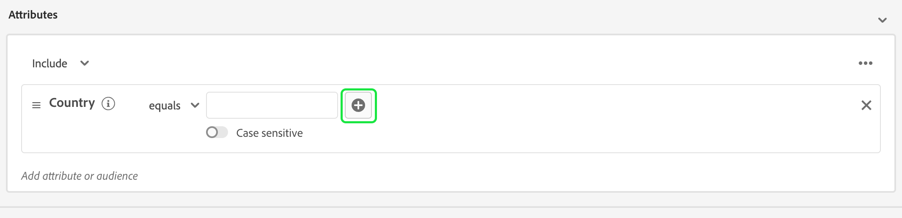

On the **[!UICONTROL Add values in bulk]** popover, you can upload a CSV or TSV file.

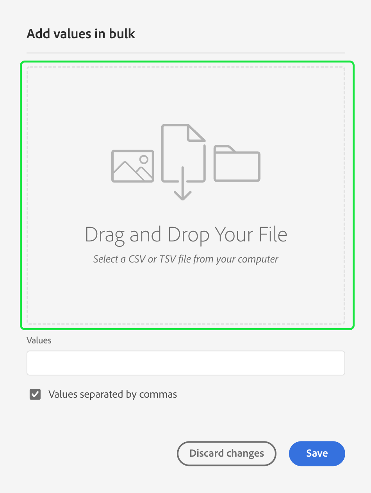

Alternatively, you can manually add comma separated values.

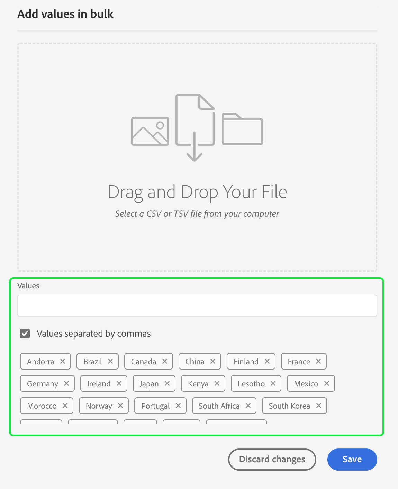

Please note that there is a maximum of 250 values allowed. If you exceed this amount, you will need to remove some values before adding more.

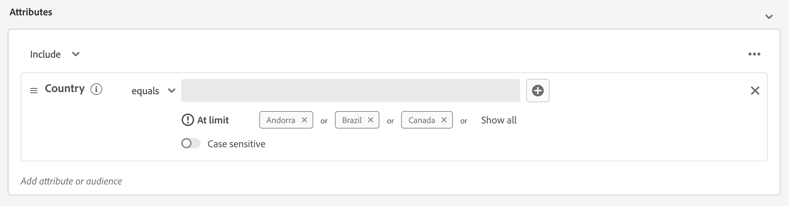

### Query validation {#query-validation}

>[!CONTEXTUALHELP]
>id="platform_segmentation_segmentbuilder_cnfcomplexitycheck"
>title="Logic complexity"
>abstract=""

>[!CONTEXTUALHELP]
>id="platform_segmentation_segmentbuilder_chaincountcheck"
>title="Event sequence limit"
>abstract=""

>[!CONTEXTUALHELP]
>id="platform_segmentation_segmentbuilder_rewritescheck"
>title="Query efficiency alert"
>abstract=""

>[!CONTEXTUALHELP]
>id="platform_segmentation_segmentbuilder_countaggregationcheck"
>title="Count filter warning"
>abstract=""

>[!CONTEXTUALHELP]
>id="platform_segmentation_segmentbuilder_arraydepthcheck"
>title="Nested data warning"
>abstract=""

When adding your building blocks to your rule builder canvas, keep the following query best practices in mind:

- The audience can have a maximum of 50 building blocks
- The audience can have a maximum of 6 event sequences
- The audience can have a maximum of 3 aggregation functions
- The maximum array depth is 2 levels deep
- The audience's query can touch a maximum of 30% of the profile store

If these best practices are not followed, Segment Builder will automatically flag these issues to avoid performance issues with the audience.

Additionally, Segment Builder automatically analyzes your query to ensure it's written in a way that will execute efficiently. If the query is written in an inefficient matter, Segment Builder will automatically notify you to re-write your audience query.

### Adding audiences

>[!CONTEXTUALHELP]
>id="platform_segmentation_segmentbuilder_addaudiences"
>title="Search updates"
>abstract="The existing search system has been updated to use Unified Search. Unified Search allows you to more easily and robustly search your audiences for segment membership."

You can drag and drop an audience from the **[!UICONTROL Audience]** tab onto the rule builder canvas to reference audience membership in the new segment definition. This allows you to include or exclude audience membership as an attribute in the new segment definition rules.

For [!DNL Experience Platform] audiences created using [!DNL Segment Builder], you are given the option to convert the audience into the set of rules that were used in the segment definition for that audience. This conversion makes a copy of the rule logic, that can then be modified without affecting the original segment definition. Make sure that you have saved any recent changes to your segment definition before converting it to rule logic.

>[!NOTE]
>
>When adding an audience from an external source, only the audience membership is referenced. You cannot convert the audience to rules, and therefore the rules used to create the original audience cannot be modified in the new segment definition.

If any conflicts arise when convert audiences to rules, [!DNL Segment Builder] will attempt to preserve the existing options to the best of its ability.  

### Code view

Alternatively, you can view a code-based version of a rule created in the [!DNL Segment Builder]. Once you have created your rule within the rule builder canvas, you can select **[!UICONTROL Code view]** to see your segment definition as PQL.

Code view provides a button that allows you to copy the value of the segment definition to use in API calls. To get the latest version of the segment definition, make sure you have saved your latest changes to the segment definition.

### Aggregation functions

An aggregation in [!DNL Segment Builder] is a calculation on a group of XDM attributes whose data type is a number (either a double or an integer). The four supported aggregation functions within Segment Builder are SUM, AVERAGE, MIN, and MAX.

To create an aggregation function, select an event from the left rail, and insert it into the [!UICONTROL Events] container.

After placing the event within the Events container, select the ellipses icon (...), followed by **[!UICONTROL Aggregate]**.

The aggregation is now added. You can now select the aggregation function, choose what attribute to aggregate, the equality function, as well as the value. For the example below, this segment definition would qualify any profile that has a sum of purchased values that is greater than $100, even if each individual purchase is less than $100.

### Count functions {#count-functions}

Count functions in Segment Builder are used to look for specified events and count the number of times they're done. The supported count functions in Segment Builder are "At least", "At most", "Exactly", "Between", and "All".

To create a count function, select an event from the left rail and insert it into the [!UICONTROL Events] container.

After placing the event within the Events container, select the [!UICONTROL At least 1] button. 

The count function is now added. You can now select the count function and the value of the function. The example below would be to include any event that has at least one click.

### Time constraints {#time-constraints}

Time constraints let you apply time restrictions on time-based attributes, events, and the sequence between the events.

>[!IMPORTANT]
>
>If you created a segment definition with the "This month" or "This year" time constraints prior to June 2024, you will need to re-save your segment definitions. Prior to June 2024, "This month" was based off of 30 days and "This year" was based off of 365 days.

>[!NOTE]
>
>Both the [ignore year time constraint](./ignore-year.md) and [rule-level time constraints](./segment-refactoring.md) were previously refactored, with more information available in the linked overviews.

The list of available time constraints are as follows:

+++ Available time constraints

>[!NOTE]
>
>All time constraints are based off of UTC.
>
>Additionally, if the [!UICONTROL Ignore year] checkbox is enabled, the year will **not** be compared as part of the segment definition evaluation.

| Time constraint | Description | Can enable ignore year | Example |
| --------------- | ----------- | ------------------- | ------- |
| Today | The attribute or event being compared **must** occur today. | Yes | 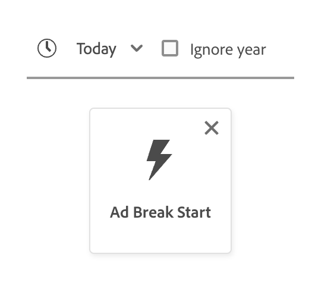{width="100" zoomable="yes"} |
| Yesterday | The attribute or event being compared **must** occur yesterday. | Yes | 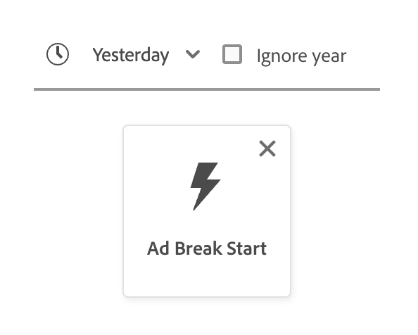{width="100" zoomable="yes"} |
| This month | The attribute or event being compared **must** occur this calendar month. | Yes | 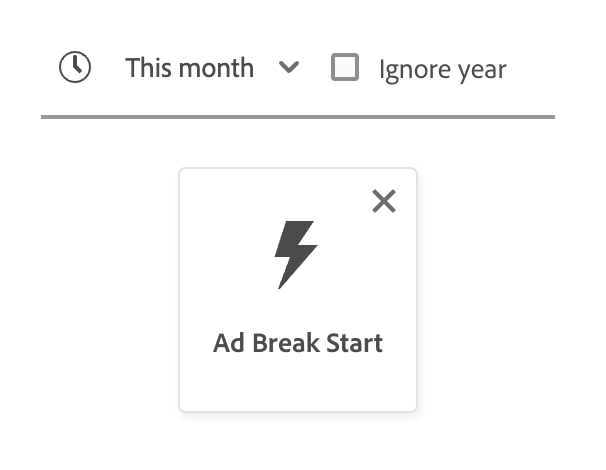{width="100" zoomable="yes"} |
| This year | The attribute or event being compared **must** occur this calendar year. | No | 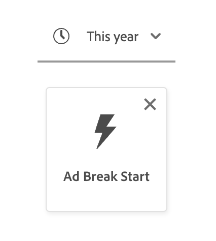{width="100" zoomable="yes"} |
| Custom date | The attribute or event being compared **must** occur on the date given. | Yes | 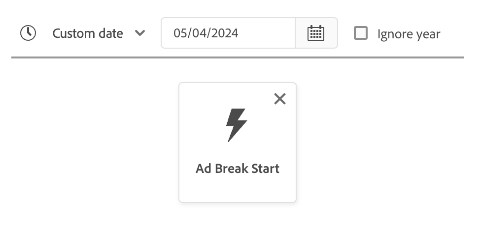{width="100" zoomable="yes"} |
| In last | The attribute or event being compared **must** occur within the last period of time chosen. This period of time is **inclusive** until the evaluation time. | No | 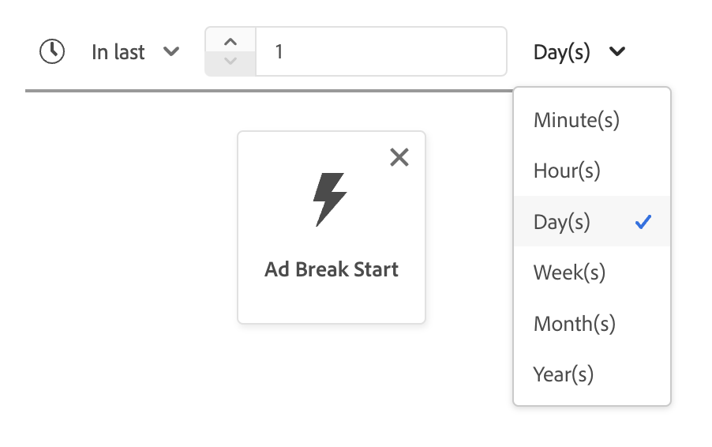{width="100" zoomable="yes"} |
| From (to) | The attribute or event being compared **must** occur within the two calendar dates chosen. This period of time is **inclusive** of both dates. | Yes, if custom date | 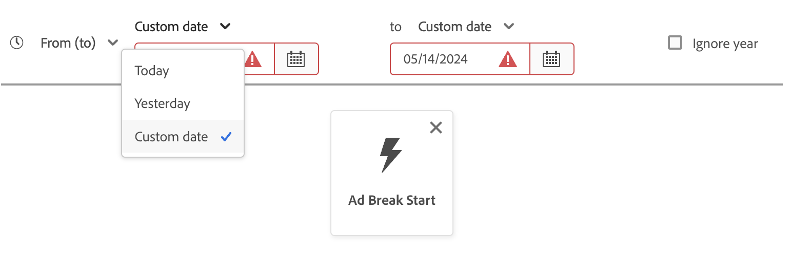{width="100" zoomable="yes"} |
| During | The attribute or event being compared **must** occur within the selected month or year. If a month is selected, you need to choose both the month and a year that the attribute or event took place in.  If a year is selected, you need to just choose the year that the attribute or event took place in. If you select a month, you can also enable the [!UICONTROL Ignore year] checkbox. | Yes | 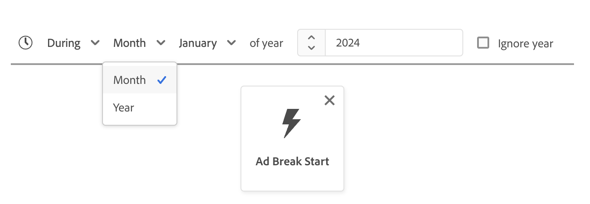{width="100" zoomable="yes"} |
| Within (+/-) | The attribute or event being compared **must** occur within days, weeks, months, or years of the selected date. This period of time is **inclusive** of both dates. The selected date can be today, yesterday, or another custom date of your choosing. | Yes | 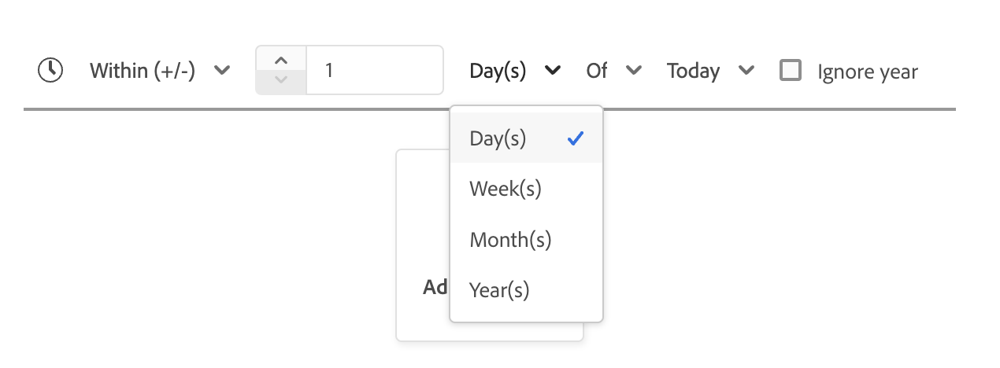{width="100" zoomable="yes"} |
| Before | The attribute or event being compared **must** occur before the selected date. The selected date can be a custom date of your choosing, or a selection between days, weeks, months, or years ago. | Yes | 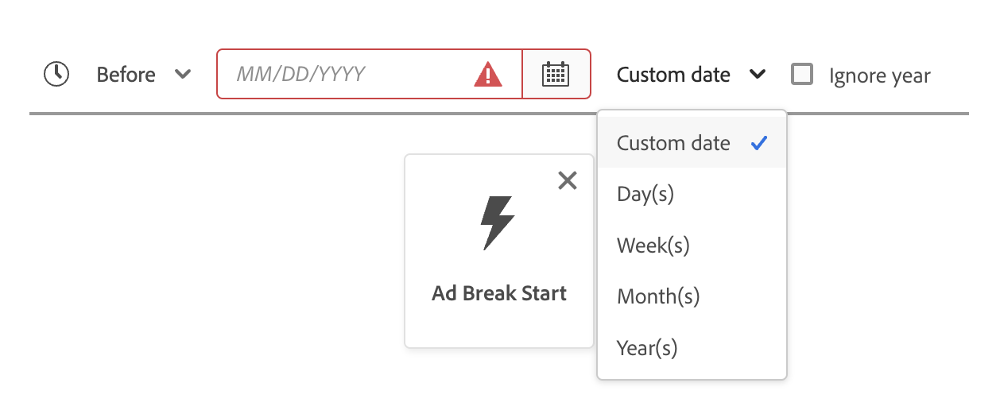{width="100" zoomable="yes"} |
| After | The attribute or event being compared **must** occur after the selected date. The selected date can be a custom date of your choosing, or a selection between days, weeks, months, or years ago. | Yes | 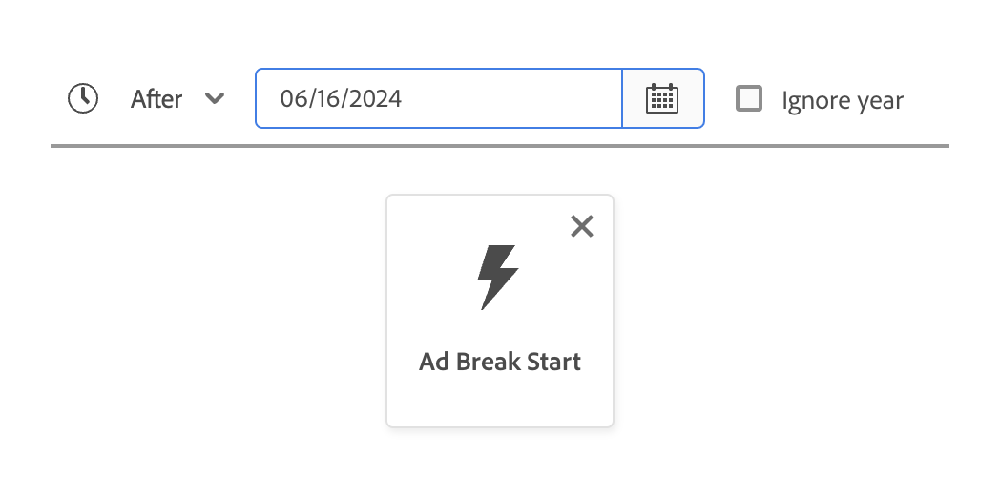{width="100" zoomable="yes"} |
| Rolling range | The attribute or event being compared must occur between the two relative dates. The dates can be represented in seconds, minutes, hours, days, weeks, months, or years. | No | 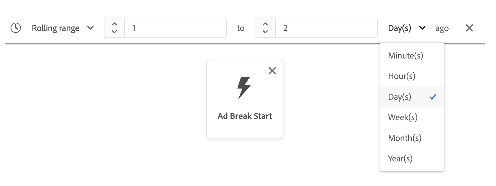{width="100" zoomable="yes"} |
| In next | The attribute or event being compared must occur within the next period of time selected. The selected periods of time include minutes, hours, days, weeks, months, and years. | No | 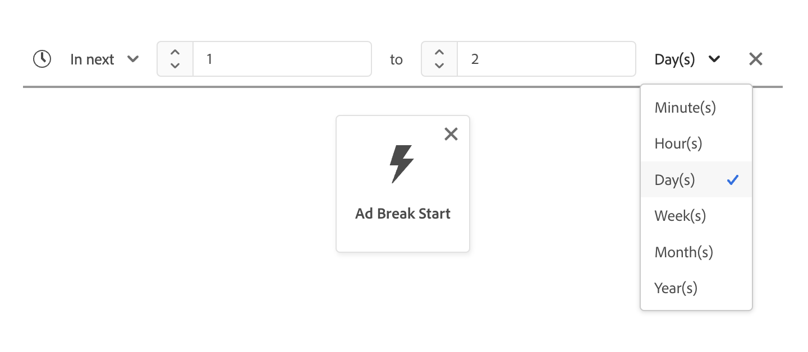{width="100" zoomable="yes"} |
| Exists | The attribute exists. | No | 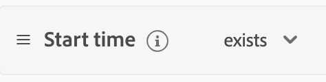{width="100" zoomable="yes"} |
| Does not exist | The attribute does not exist. | No | 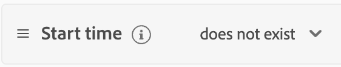{width="100" zoomable="yes"} |

+++

When you're applying a time constraint on an event, you can either apply it on the canvas-level, the card-level, or between events.

#### Canvas-level constraint

To apply a canvas-level time constraint, select the clock icon that appears above the timeline of events.

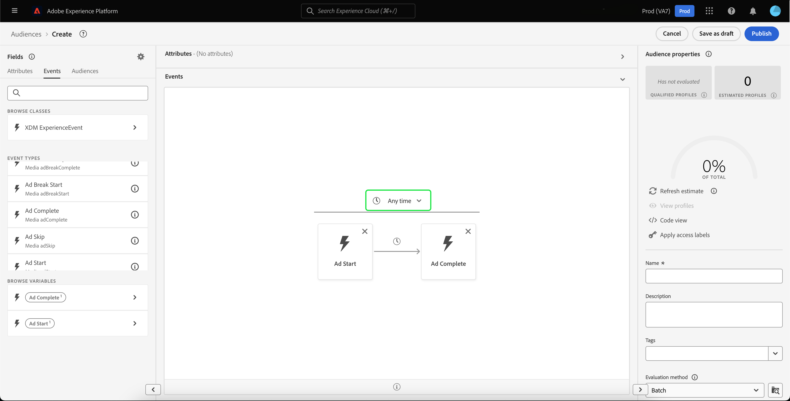

When you apply a time constraint on the canvas-level, this applies the time constraint to **all** events in the audience.

#### Card-level constraint

To apply a card-level constraint, select the card you want to apply the time constraint on, followed by the ellipses icon, and **[!UICONTROL Apply time rule]**. This lets you select a time constraint within the **[!UICONTROL Event Rules]** container.

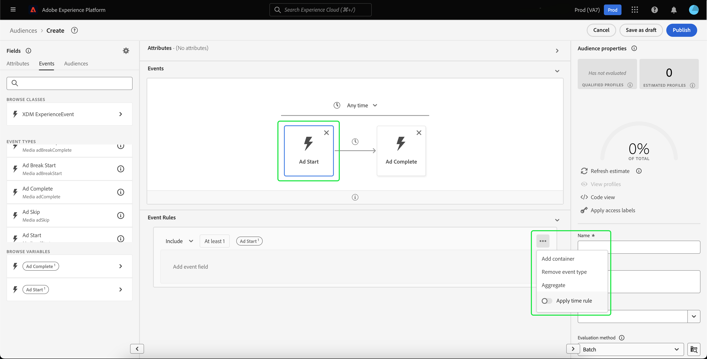

When you apply a time constraint on the card-level, this applies the time constraint on the **specified** event in the audience.

#### Between events constraint

To apply a time constraint between events, select the clock icon between the two events you want to apply the time constraint on.

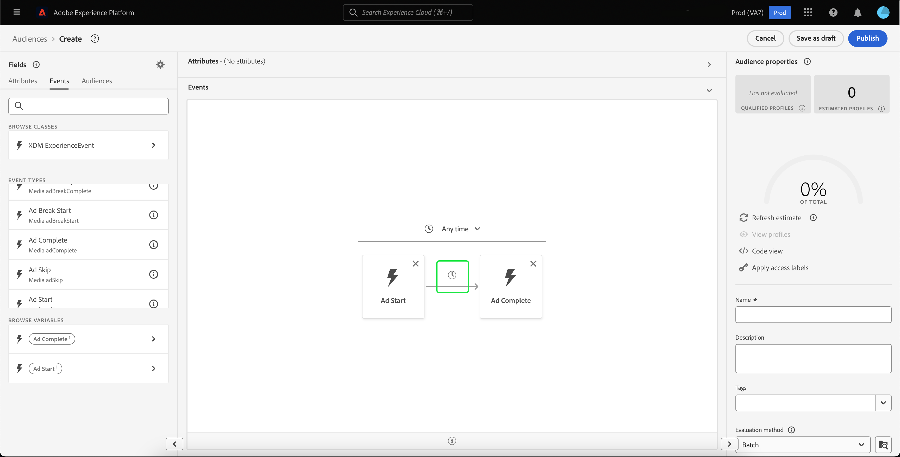

When you apply a time constraint between the event, this applies the time constraint to the time **between** the events. 

The list of available time constraints for this operation differs from the main list of time constraints, and are as follows:

+++ Available time constraints

| Time constraint | Description |
| --------------- | ----------- |
| After | The latter event **must at least** take place after the prior event. |
| Within | The two events **must** take place during the time period listed within the time constraint. | 

>[!NOTE]
>
>When using the "After" time constraint, the latter event can take place more than the amount of time listed within the time constraint. >
>For example, if you have a Page View event and a Checkout event, and you put the "After 1 hour" time constraint between these two events, a segment definition with a Checkout event 2 hours after the Page View event would qualify.
>
>Additionally, these two time constraints can be used in coordination with each other.
>
>For example, if you have a Page View event and a Checkout event, and you put both the "After 1 hour" and "Within 24 hours" time constraints, a segment definition with a Checkout event 12 hours after the Page View event would qualify, but a segment definition with a Checkout event 36 hours after the Page View event would not qualify.

+++

## Containers {#containers}

Segment rules are evaluated in the order they are listed. Containers allow control over the order of execution through the use of nested queries.

Once you have added at least one tile to the rule builder canvas, you can begin to add containers. To create a new container, select the ellipses (...) in the top-right corner of the tile, then select **[!UICONTROL Add container]**. 

A new container appears as the child of the first container, but you can adjust the hierarchy by dragging and moving the containers. The default behavior of a container is to "[!UICONTROL Include]" the attribute, event, or audience provided. You can set the rule to "[!UICONTROL Exclude]" profiles that match the container criteria by selecting **[!UICONTROL Include]** in the top-left corner of the tile and selecting "[!UICONTROL Exclude]".

A child container can also be extracted and added inline to the parent container by selecting "unwrap container" on the child container. Select the ellipses (...) in the top-right corner of the child container to access this option.

Once you select **[!UICONTROL Unwrap container]** the child container is removed and the criteria appear inline. 

>[!NOTE]
>
>When unwrapping containers, be careful that the logic continues to meet the desired segment definition.

## Merge policies

>[!CONTEXTUALHELP]
>id="platform_segmentation_createSegment_segmentBuilder_mergePolicies"
>title="Merge policies"
>abstract="A merge policy enables the merging of different datasets to form your profile. Experience Platform has provided a default merge policy, or you can create a new default merge policy in Profiles. Choose a merge policy that matches your marketing purpose for this audience."

[!DNL Experience Platform] enables you to bring data together from multiple sources and combine it in order to see a complete view of each of your individual customers. When bringing this data together, merge policies are the rules that [!DNL Experience Platform] uses to determine how data will be prioritized and what data will be combined to create a profile. 

You can select a merge policy that matches your marketing purpose for this audience or use the default merge policy provided by [!DNL Experience Platform]. You can create multiple merge policies unique to your organization, including creating your own default merge policy. For step-by-step instructions on creating merge policies for your organization, please begin by reading the [merge policies overview](../../profile/merge-policies/overview.md). 

To select a merge policy for your segment definition, select the gear icon on the **[!UICONTROL Fields]** tab, then use the **[!UICONTROL Merge Policy]** dropdown menu to select the merge policy that you wish to use.

## Audience properties {#audience-properties}

>[!CONTEXTUALHELP]
>id="platform_segments_createsegment_segmentbuilder_segmentproperties"
>title="Audience properties"
>abstract="The audience properties section displays an estimate of the size of the resulting audience, displaying the number of qualified profiles in comparison to the total number of profiles. This allows you to adjust your audience as necessary before building the audience itself."

>[!CONTEXTUALHELP]
>id="platform_segments_createsegment_segmentbuilder_refreshestimate"
>title="Refresh estimates"
>abstract="You can refresh the estimates of your segment definition to immediately see a preview of how many profiles would qualify for the proposed segment definition. Audience estimates are generated by using a sample size of that day's sample data."
>additional-url="https://experienceleague.adobe.com/docs/experience-platform/segmentation/tutorials/create-a-segment.html#estimate-and-preview-an-audience" text="Estimate and preview an audience"

>[!CONTEXTUALHELP]
>id="platform_segments_createsegment_segmentbuilder_qualifiedprofiles"
>title="Qualified profiles"
>abstract="Qualified profiles indicates the actual number of profiles that match the audience's rules. This number updates every 24 hours, after the segment evaluation job has ran."

>[!CONTEXTUALHELP]
>id="platform_segments_createsegment_segmentbuilder_estimatedprofiles"
>title="Estimated profiles"
>abstract="Estimated profiles indicates an approximate number of profiles, based off of the sample job, that would qualify for the audience's rules."

When building a segment definition, the **[!UICONTROL Audience properties]** section on the right-hand side of the workspace displays an estimate of the size of the resulting segment definition, allowing you to adjust your segment definition as needed before building the audience itself.

**[!UICONTROL Qualified Profiles]** indicates the **actual** number of profiles that match the segment definition's rules. This number updates every 24 hours, after the segment evaluation job has ran.

The timestamp for qualified profiles indicates the most recent **batch** segment evaluation job and is **not** displayed for segment definitions evaluated using streaming or edge segmentation. If you edit the segment definition, the number of qualified profiles will remain the same until the next segment evaluation job is run. 

**[!UICONTROL Estimated Profiles]** indicates an **approximate range** of profiles, based off of the **sample job**. This means the sample data is projected on the larger profile set, resulting in an estimated number that may differ from the actual number of qualified profiles. The estimated profile sample has a 95% confidence interval.

When you make changes to the audience's rules, you can select the **[!UICONTROL Refresh estimate]** button to see an updated count of estimated profiles. However, this number is still based off of the previous sample job. The sample job is updated when there is a greater than 3% change in customer data or the last sample job is older than three days.

Selecting the information bubble gives the date and time the last sample job was run.

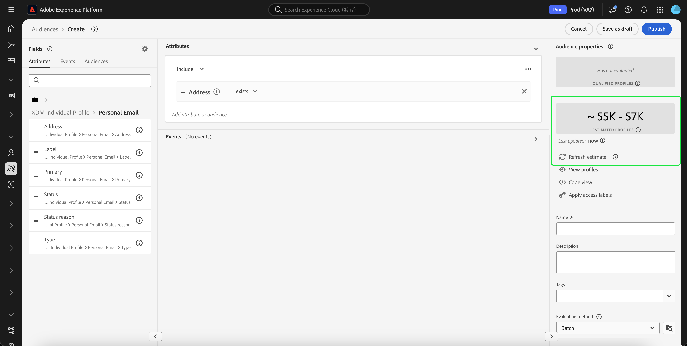

The **[!UICONTROL Audience properties]** section is also where you can specify important information about your audience, including its name, description, and evaluation type. Names are used to identify your segment definition among those defined by your organization and should therefore be descriptive, concise, and unique. 

As you continue to build your audience, you can view a paginated preview of the audience by selecting **[!UICONTROL View Profiles]**.

>[!NOTE]
>
>Audience estimates are generated by using a sample size of that day's sample data. If there are less than 1 million entities in your Profile store, the full data set is used; for between 1 and 20 million entities, 1 million entities are used; and for over 20 million entities, 5% of the total entities are used. 
>
>Additionally, this estimate is based off of when the last profile sample job was run. This means that if you're using a relative date function such as "Today" or "This week", the estimate will base its calculations off of the last profile sample job run time. For example, if today is January 24th and the last profile sample job ran on January 22nd, the "Yesterday" relative date function will be based off of January 21st, and not January 23rd.
>
>More information about generating estimates for segment definitions can be found in the [estimate generation section](../tutorials/create-a-segment.md#estimate-and-preview-an-audience) of the segment definition creation tutorial.

You can also select your evaluation method. If you know what evaluation method you want to use, you can select the desired evaluation method either using the dropdown list. If you want to know what evaluation types this segment definition qualifies for, you can select the browse icon  to see a list of the available segment definition evaluation methods.

The [!UICONTROL Evaluation method eligibility] popover appears. This popover displays the available evaluation methods, which are batch, streaming, and edge. The popover shows which evaluation methods are eligible and ineligible. Depending on the parameters you used in your segment definition, it may not qualify for certain evaluation methods. For more information on the requirements for each evaluation method, please read the [streaming segmentation](../methods/streaming-segmentation.md#query-types) or the [edge segmentation](../methods/edge-segmentation.md#query-types) overviews.

You can also change the evaluation method of the segment definition after you've finished creating it. If you change the evaluation method from Edge or Streaming to Batch, you will **not** be able to change it back to Edge or Streaming. The change to the evaluation method will **only** take effect once you select **[!UICONTROL Save]** in the popover. Cancelling the dialog will **maintain** the original evaluation method.

If you select an invalid evaluation method, you will be prompted to either change your segment definition rules or change the evaluation method. 

More information about the different segment definition evaluation methods can be found in the [segmentation overview](../home.md#evaluate-segments).

## Next steps {#next-steps}

Segment Builder provides a rich workflow allowing you to isolate marketable audiences from [!DNL Real-Time Customer Profile] data. After reading this guide you should now be able to:

- Create segment definitions using a combination of attributes, events, and existing audiences as building blocks.  
- Use the rule builder canvas and containers to control the order in which segment rules are executed.
- View estimates of your prospective audience, allowing you to adjust your segment definitions as required.
- Enable all segment definitions for scheduled segmentation.
- Enable specified segment definitions for streaming segmentation.
  
To learn more about [!DNL Segmentation Service], please continue reading the documentation and supplement your learning by watching the related videos. To learn more about the other parts of the [!DNL Segmentation Service] UI, please read the [[!DNL Segmentation Service] user guide](./overview.md).
