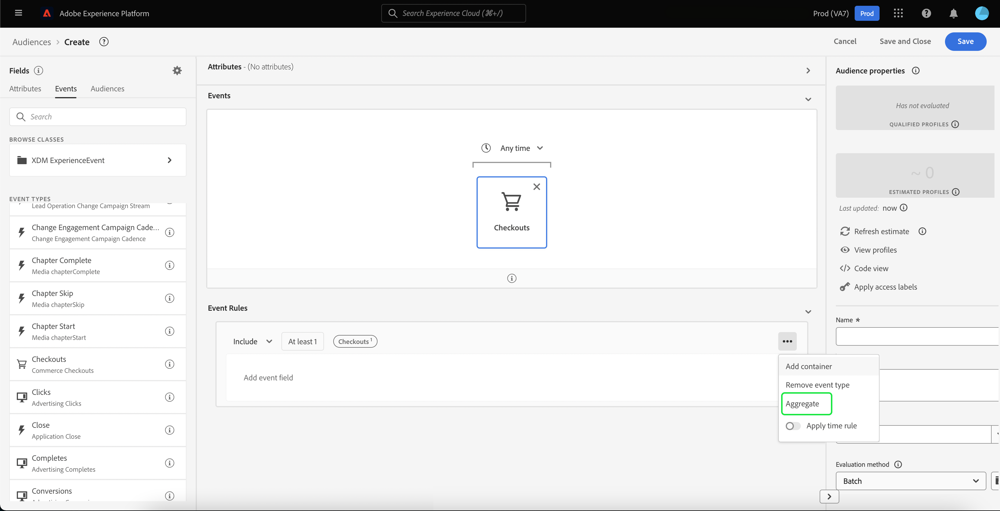

# [!DNL Segment Builder] UI guide

[!DNL Segment Builder] provides a rich workspace that allows you to interact with [!DNL Profile] data elements. The workspace provides intuitive controls for building and editing rules, such as drag-and-drop tiles used to represent data properties. 

## Segment definition building blocks

The basic building blocks of segment definitions are attributes and events. In addition, the attributes and events contained in existing audiences can also be used as components for new definitions. 

You can see these building blocks in the **[!UICONTROL Fields]** section on the left side of the [!DNL Segment Builder] workspace. **[!UICONTROL Fields]** contains a tab for each of the main building blocks: "[!UICONTROL Attributes]", "[!UICONTROL Events]", and "[!UICONTROL Audiences]".

### Attributes

The **[!UICONTROL Attributes]** tab allows you to browse [!DNL Profile] attributes belonging to the [!DNL XDM Individual Profile] class. Each folder can be expanded to reveal additional attributes, where each attribute is a tile that can be dragged onto the rule builder canvas in the center of the workspace. The [rule builder canvas](#rule-builder-canvas) is discussed in more detail later in this guide.

  

### Events

The **[!UICONTROL Events]** tab allows you to create an audience based on events or actions that took place using [!DNL XDM ExperienceEvent] data elements. You can also find Event Types on the **[!UICONTROL Events]** tab, which are a collection of commonly used events to enable you to create your segments more quickly.

In addition to being able to browse for [!DNL ExperienceEvent] elements, you can also search for Event Types. Event Types use the same coding logic as [!DNL ExperienceEvents], without requiring you to search through the [!DNL XDM ExperienceEvent] class looking for the correct event. For example, using the search bar to search "cart" returns the Event Types "[!UICONTROL AddCart]" and "[!UICONTROL RemoveCart]", which are two very commonly used cart actions when building segment definitions. 

Any type of component can be searched for by typing its name in the search bar, which uses [Lucene's search syntax](https://docs.microsoft.com/en-us/azure/search/query-lucene-syntax). The search results begin to populate as entire words are entered. For example, to build a rule based on the XDM field `ExperienceEvent.commerce.productViews`, start typing “product views” in the search field. Once the word "product" has been typed, search results begin to appear. Each result includes the object hierarchy to which it belongs. 

>[!NOTE]
>
>Custom schema fields defined by your organization may take up to 24 hours to appear and become available for use in building rules. 

You can then easily drag and drop [!DNL ExperienceEvents] and "[!UICONTROL Event Types]" into your segment definition.
  
  

By default, only populated schema fields from your data store are shown. This includes "[!UICONTROL Event Types]". If the "[!UICONTROL Event Types]" list is not visible, or you are only able to select "[!UICONTROL Any]" as an "[!UICONTROL Event Type]", select the **gear icon** next to **[!UICONTROL Fields]**, then select **[!UICONTROL Show full XDM schema]** under **[!UICONTROL Available Fields]**. Select the **gear icon** again to return to the **[!UICONTROL Fields]** tab and you should now be able to view multiple "[!UICONTROL Event Types]" and schema fields, regardless of whether they contain data or not.

### Audiences

The **[!UICONTROL Audiences]** tab lists all audiences imported from external sources, such as Adobe Audience Manager, as well as audiences created within [!DNL Experience Platform].

On the **[!UICONTROL Audiences]** tab, you can see all of the available sources as a group of folders. As you select the folders, available sub-folders and audiences can be seen. Additionally, you can select the folder icon (as shown in the far-right image) in order to view the folder structure (a check mark denotes the folder you are currently in) and easily navigate back through folders by selecting the name of a folder in the tree.

You can hover over the &#9432; next to an audience to view information about the audience including its ID, description, and the folder hierarchy to locate the audience.

You can also search for audiences using the search bar, which utilizes [Lucene's search syntax](https://docs.microsoft.com/en-us/azure/search/query-lucene-syntax). On the **[!UICONTROL Audiences]** tab, selecting a top-level folder causes the search bar to appear, allowing you to search within that folder. Search results only begin to populate once entire words are entered. For example, to find an audience named `Online Shoppers`, start typing "Online" in the search bar. Once the word "Online" has been typed in full, search results containing the word "Online" appear.

## Rule builder canvas {#rule-builder-canvas}

A segment definition is a collection of rules used to describe key characteristics or behavior of a target audience. These rules are created using the rule builder canvas, located in the center of [!DNL Segment Builder].

To add a new rule to your segment definition, drag a tile from the **[!UICONTROL Fields]** tab and drop it onto the rule builder canvas. You will then be presented with context-specific options according to the type of data being added. Available data types include: strings, dates, [!DNL ExperienceEvents], "[!UICONTROL Event Types]", and audiences. 

>[!IMPORTANT]
>
>The latest changes to Adobe Experience Platform have updated the usage of the `OR` and `AND` logical operators between events. These updates will not affect existing segments. However, all subsequent updates to existing segments and new segment creations will be affected by these changes. Please read the [time constants update](./segment-refactoring.md) for more information.

### Adding audiences

You can drag and drop an audience from the **[!UICONTROL Audience]** tab onto the rule builder canvas to reference audience membership in the new segment definition. This allows you to include or exclude audience membership as an attribute in the new segment rule.

For [!DNL Platform] audiences created using [!DNL Segment Builder], you are given the option to convert the audience into the set of rules that were used in the segment definition for that audience. This conversion makes a copy of the rule logic, that can then be modified without affecting the original segment definition. Make sure that you have saved any recent changes to your segment definition before converting it to rule logic.

>[!NOTE]
>
>When adding an audience from an external source, only the audience membership is referenced. You cannot convert the audience to rules, and therefore the rules used to create the original audience cannot be modified in the new segment definition.

If any conflicts arise when convert audiences to rules, [!DNL Segment Builder] will attempt to preserve the existing options to the best of its ability.  

### Code view

Alternatively, you can view a code-based version of a rule created in the [!DNL Segment Builder]. Once you have created your rule within the rule builder canvas, you can select **[!UICONTROL Code view]** to see your segment as PQL.

Code view provides a button that allows you to copy the value of the segment to use in API calls. To get the latest version of the segment, make sure you have saved your latest changes to the segment.

### Aggregation functions

An aggregation in [!DNL Segment Builder] is a calculation on a group of XDM attributes whose data type is a number (either a double or an integer). The four supported aggregation functions within Segment Builder are SUM, AVERAGE, MIN, and MAX.

To create an aggregation function, select an event from the left rail, and insert it into the [!UICONTROL Events] container.

After placing the event within the Events container, select the ellipses icon (...), followed by **[!UICONTROL Aggregate]**.

The aggregation is now added. You can now select the aggregation function, choose what attribute to aggregate, the equality function, as well as the value. For the example below, this segment would qualify any profile that has a sum of purchased values that is greater than $100, even if each individual purchase is less than $100.

### Count functions

Count functions in Segment Builder are used to look for specified events and count the number of times they're done. The supported count functions in Segment Builder are "At least", "At most", "Exactly", "Between", and "All".

To create a count function, select an event from the left rail and insert it into the [!UICONTROL Events] container.

After placing the event within the Events container, select the [!UICONTROL At least 1] button. 

The count function is now added. You can now select the count function and the value of the function. The example below would be to include any event that has at least one click.

## Containers

Segment rules are evaluated in the order they are listed. Containers allow control over the order of execution through the use of nested queries.

Once you have added at least one tile to the rule builder canvas, you can begin to add containers. To create a new container, select the ellipses (...) in the top-right corner of the tile, then select **[!UICONTROL Add container]**. 

A new container appears as the child of the first container, but you can adjust the hierarchy by dragging and moving the containers. The default behavior of a container is to "[!UICONTROL Include]" the attribute, event, or audience provided. You can set the rule to "[!UICONTROL Exclude]" profiles that match the container criteria by selecting **[!UICONTROL Include]** in the top-left corner of the tile and selecting "[!UICONTROL Exclude]".

A child container can also be extracted and added inline to the parent container by selecting "unwrap container" on the child container. Select the ellipses (...) in the top-right corner of the child container to access this option.

Once you select **[!UICONTROL Unwrap container]** the child container is removed and the criteria appear inline. 

>[!NOTE]
>
>When unwrapping containers, be careful that the logic continues to meet the desired segment definition.

## Merge policies

[!DNL Experience Platform] enables you to bring data together from multiple sources and combine it in order to see a complete view of each of your individual customers. When bringing this data together, merge policies are the rules that [!DNL Platform] uses to determine how data will be prioritized and what data will be combined to create a profile. 

You can select a merge policy that matches your marketing purpose for this audience or use the default merge policy provided by [!DNL Platform]. You can create multiple merge policies unique to your organization, including creating your own default merge policy. For step-by-step instructions on creating merge policies for your organization, please see the tutorial on [working with merge policies using the UI](../../profile/ui/merge-policies.md). 

To select a merge policy for your segment definition, select the gear icon on the **[!UICONTROL Fields]** tab, then use the **[!UICONTROL Merge Policy]** dropdown menu to select the merge policy that you wish to use.

## Segment properties 

When building a segment definition, the **[!UICONTROL Segment Properties]** section on the right-hand side of the workspace displays an estimate of the size of the resulting segment, allowing you to adjust your segment definition as needed before building the audience itself.

The **[!UICONTROL Segment Properties]** section is also where you can specify important information about your segment definition, including its name and description. Segment definition names are used to identify your segment among those defined by your organization and should therefore be descriptive, concise, and unique. 

As you continue to build your segment definition, you can view a paginated preview of the audience by selecting **[!UICONTROL View Profiles]**.

>[!NOTE]
>
>Audience estimates are generated by using a sample size of that day's sample data. If there are less than 1 million entities in your profile store, the full data set is used; for between 1 and 20 million entities, 1 million entities are used; and for over 20 million entities, 5% of the total entities are used. More information about generating segment estimates can be found in the [estimate generation section](../tutorials/create-a-segment.md#estimate-and-preview-an-audience) of the segment creation tutorial.

## Next steps {#next-steps}

Segment Builder provides a rich workflow allowing you to isolate marketable audiences from [!DNL Real-time Customer Profile] data. After reading this guide you should now be able to:

- Create segment definitions using a combination of attributes, events, and existing audiences as building blocks.  
- Use the rule builder canvas and containers to control the order in which segment rules are executed.
- View estimates of your prospective audience, allowing you to adjust your segment definitions as required.
- Enable all segment definitions for scheduled segmentation.
- Enable specified segment definitions for streaming segmentation.
  
To learn more about [!DNL Segmentation Service], please continue reading the documentation and supplement your learning by watching the related videos. To learn more about the other parts of the [!DNL Segmentation Service] UI, please read the [[!DNL Segmentation Service] user guide](./overview.md)
