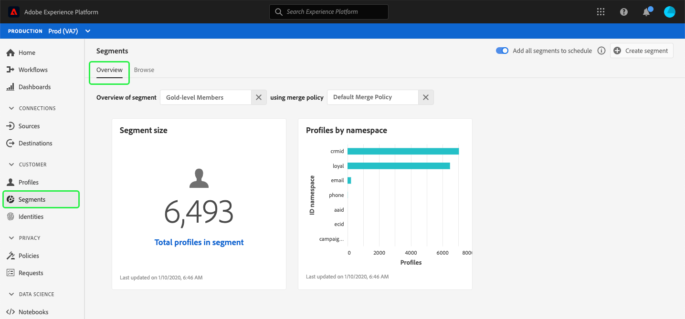

# (Beta) [!UICONTROL Segments] dashboard {#segment-dashboard}

>[!IMPORTANT]
>
>Dashboard functionality is currently in beta and is not available to all users. The documentation and the functionality are subject to change.

The Adobe Experience Platform user interface (UI) provides a dashboard through which you can view important information about your segments, as captured during a daily snapshot. 

For detailed instructions on how to access and interact with the segments dashboard in the UI, as well as to learn more about the available metrics displayed in the dashboard, please visit the [segments dashboard guide](../../dashboards/guides/segments.md).  

For an overview of all of the dashboard features within the Experience Platform user interface, please begin by reading the [dashboards overview](../../dashboards/home.md).

