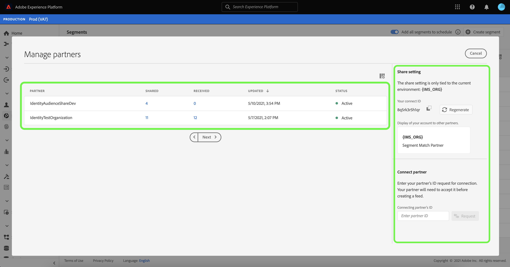
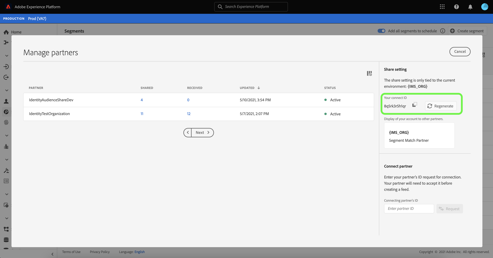
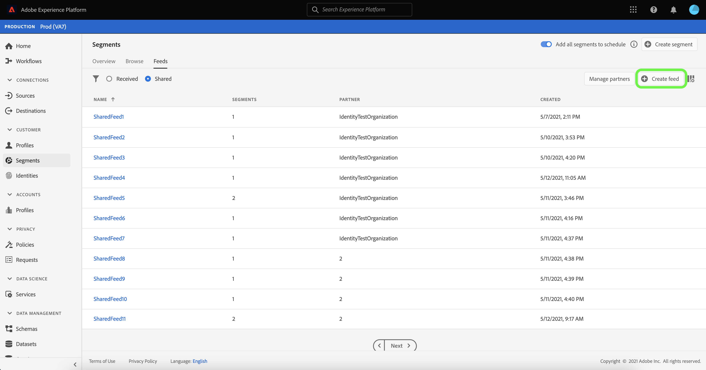
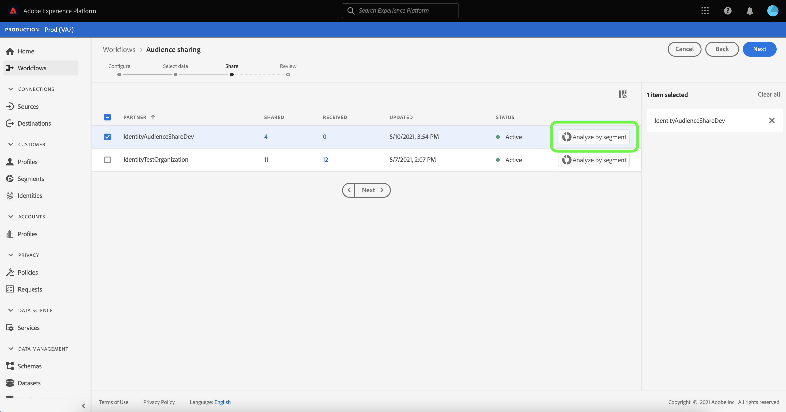
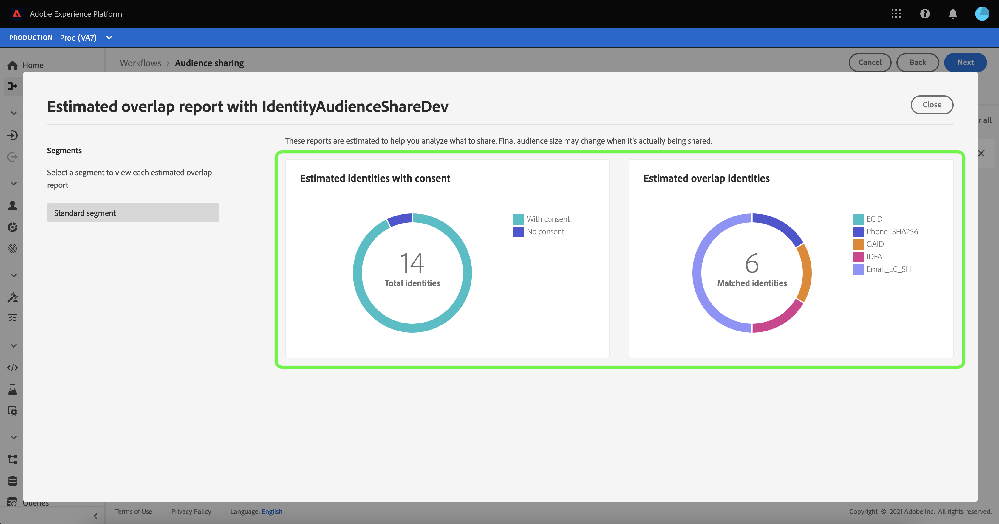
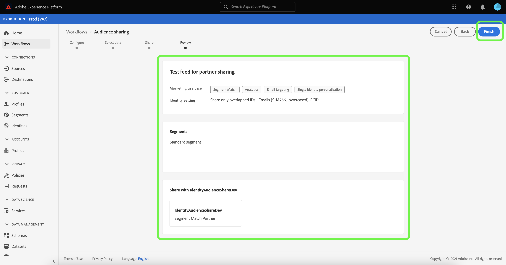
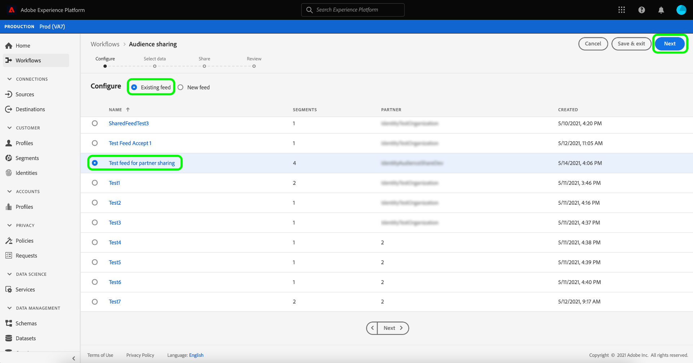
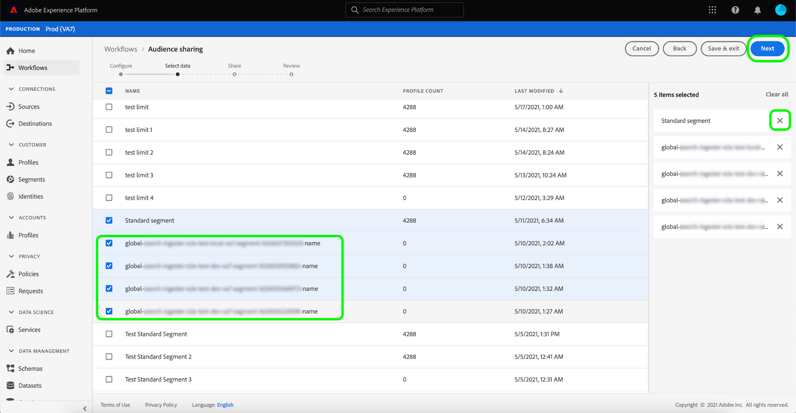

# [!DNL Segment Match] overview

Adobe Experience Platform Segment Match is a segment-sharing service that allows for two or more Platform users to exchange segment data in a secure, governed, and privacy-friendly manner. [!DNL Segment Match] uses Platform privacy standards and personal identifiers such as hashed emails, hashed phone numbers, and device identifiers like IDFAs and GAIDs.

With [!DNL Segment Match] you can:

* Manage the identity overlap process.
* View pre-share estimates.
* Apply data usage labels to control whether data can be shared with partners.
* Maintain shared audience lifecycle management after publishing a feed and continue a dynamic exchange of data through abilities to add, delete, and unshare.

[!DNL Segment Match] uses an identity overlap process to ensure that segment sharing is done in a secure and privacy-focused manner. An **overlapped identity** is an identity that has a match in both your segment and your selected partner's segment. Prior to sharing a segment between a sender and a receiver, the identity overlap process checks for an overlap in namespaces and consent checks between the sender and receiver(s). Both overlap checks must pass in order for a segment to be shared.

The following sections provide more information about [!DNL Segment Match], including details on setup and its end-to-end workflow.

## Setup

The following sections outline how to to set up and configure [!DNL Segment Match]:

### Set up identity data and namespaces {#namespaces}

The first step to getting started with [!DNL Segment Match] is to make sure you're ingesting data against the supported identity namespaces.

Identity namespaces are a component of [Adobe Experience Platform Identity Service](../../../identity-service/home.md). Each customer identity contains an associated namespace that indicates the identity's context. For example, a namespace can distinguish a value of "name@email.com" as an email address or "443522" as a numeric CRM ID.

A fully qualified identity includes an ID value and a namespace. When matching record data across profile fragments (such as when [!DNL Real-Time Customer Profile] merges Profile data), both the identity value and the namespace must match.

In the context of [!DNL Segment Match], namespaces are used in the overlap process when sharing data.

The list of supported namespaces are as follows:

| Namespace | Description |
| --------- | ----------- |
| Emails (SHA256, lowercased) | A namespace for pre-hashed email address. Values provided in this namespace are converted to lowercase before hashing with SHA256. Leading and trailing spaces need to be trimmed before an email address is normalized. This setting cannot be changed retroactively. Platform offers two methods of supporting hashing upon data collection, through [`setCustomerIDs`](https://experienceleague.adobe.com/docs/id-service/using/reference/hashing-support.html?lang=en#hashing-support) and through [data prep](../../../data-prep/functions.md#hashing). |
| Phone (SHA256_E.164)| A namespace that represents raw phone numbers that need to be hashed using both SHA256 and E.164 format. |
| ECID | A namespace that represents an Experience Cloud ID (ECID) value. This namespace can also be referred to by the following aliases: "Adobe Marketing Cloud ID", "Adobe Experience Cloud ID", "Adobe Experience Platform ID". See the [ECID overview](../../../identity-service/ecid.md) for more information. |
| Apple IDFA (ID for Advertisers) | A namespace that represents Apple ID for Advertisers. See the following document on [interest-based ads](https://support.apple.com/en-us/HT202074) for more information. |
| Google Ad ID | A namespace that represents a Google Advertising ID. See the following document on [Google Advertising ID](https://support.google.com/googleplay/android-developer/answer/6048248?hl=en) for more information. |

### Set up consent configuration

You must provide a consent configuration and set its default value to either `opt-in` or `opt-out` for a consent check.

The opt-in and opt-out consent check determines whether you can operate with the consent to share user data by default. If the consent configuration default is set to `opt-out`, then user data can be shared, unless a user explicitly opts out. If the default is set to `opt-in`, then user data cannot be shared, unless a user explicitly opts in.

The default consent configuration for [!DNL Segment Match] is set to `opt-out`. To enforce an opt-in model for your data, please send an email request to your Adobe Account Manager.

For more information on the `share` attribute used to set data-sharing consent value, see the the following documentation on [privacy and consents field group](../../../xdm/field-groups/profile/consents.md). For information on the specific field group used to capture consumer consent for collection and use of data related to privacy, personalization and marketing preferences, see the following [Consent for Privacy, Personalization and Marketing Preferences GitHub example](https://github.com/adobe/xdm/blob/master/docs/reference/datatypes/consent/consent-preferences.schema.md).

### Configure data usage labels

The last prerequisite you must establish is to configure a new data usage label to prevent data sharing. Through data usage labels, you can manage what data is allowed to be shared through [!DNL Segment Match].

Data usage labels allow you to categorize datasets and fields according to usage policies that apply to that data. Labels can be applied at any time, providing flexibility in how you choose to govern data. Best practices encourage labeling data as soon as it is ingested into Experience Platform, or as soon as data becomes available for use in Platform.

[!DNL Segment Match] uses the C11 label, a contract label specific to [!DNL Segment Match] that you can manually add to any datasets or attributes to ensure that they are excluded from the [!DNL Segment Match] partner-sharing process. The C11 label denotes data that should not be used in [!DNL Segment Match] processes. After you have determined which datasets and/or fields you want to exclude from [!DNL Segment Match] and added the C11 label accordingly, the label is automatically enforced by the [!DNL Segment Match] workflow. [!DNL Segment Match] automatically enables the [!UICONTROL Restrict data sharing] core policy. For specific instructions on how to apply data usage labels to datasets, see the tutorial on [managing data usage labels in the UI](../../../data-governance/labels/user-guide.md).

For a list of data usage labels and their definitions, see the [data usage labels glossary](../../../data-governance/labels/reference.md). For information on data usage policies, see the [data usage policies overview](../../../data-governance/policies/overview.md).

### Understanding [!DNL Segment Match] permissions

There are two permissions associated with [!DNL Segment Match]:

| Permission | Description |
| --- | --- |
| Manage Audience Share Connections | This permission allows you to complete the partner handshake process, which connects two IMS Organizations to enable [!DNL Segment Match] flows. |
| Manage Audience Shares | This permission allows you to create, edit, and publish feeds (the package of data used for [!DNL Segment Match]) with active partners (partners who have been connected by the admin user with **[!UICONTROL Audience Share Connections]** access). |

See the [access control overview](../../../access-control/home.md) for more information on access control and permissions.

## [!DNL Segment Match] end-to-end workflow

Once you have set up your identity data and namespaces, consent configuration, and data usage label, you can start working with [!DNL Segment Match] and its features.

### Manage partner

In the Platform UI, select **[!UICONTROL Segments]** from the left-navigation and then select **[!UICONTROL Feeds]** from the top header.

The [!UICONTROL Feeds] page contains a list of feeds received from partners as well as feeds you have shared. To view a list of existing partners or establish a connection with a new partner, select **[!UICONTROL Manage partners]**.

A connection between two partners is a "two-way handshake" that acts as a self-service method for users to connect their Platform organizations together at a sandbox level. The connection is required to inform Platform that an agreement has been established and that Platform can facilitate share services between you and your partner(s).

>[!NOTE]
>
>The "two-way handshake" between you and your partner is strictly a connection. No data is exchanged during this process.

You can view a list of connections with existing partners in the main interface of the [!UICONTROL Manage partners] screen. On the right-rail is the [!UICONTROL Share setting] panel, which provides you with the option to generate a new [!UICONTROL connect ID] as well as an input box where you can enter a partner's [!UICONTROL connect ID].

To create a new [!UICONTROL connect ID], select **[!UICONTROL Regenerate]** under [!UICONTROL Share setting] and then select the copy icon beside the newly generated ID.

To connect a partner using their [!UICONTROL connect ID], enter their unique ID value in the input box under [!UICONTROL Connect partner] and then select **[!UICONTROL Request]**.

### Create feed {#create-feed}

>[!CONTEXTUALHELP]
>id="platform_segment_match_marketing"
>title="Restricted marketing use cases"
>abstract="Restricted marketing use cases help provide guidance to your partners to ensure shared segments are properly used per your data governance restrictions."
>text="Learn more in documentation"

A **feed** is a grouping of data (segments), the rules for how that data can be exposed or used, and the configurations that determine how your data is matched against your partners' data. A feed can be managed independently and exchanged with other Platform users through [!DNL Segment Match].

To create a new feed, select **[!UICONTROL Create feed]** from the [!UICONTROL Feeds] dashboard.

The basic set up of a feed includes a name, a description, and configurations regarding marketing use cases and identity settings. Provide a name and a description for your feed and then apply the marketing use cases that you want your data to be excluded from. You can select more than one use case from a list that includes:

* [!UICONTROL Analytics]
* [!UICONTROL Combine with PII]
* [!UICONTROL Cross-site targeting]
* [!UICONTROL Data Science]
* [!UICONTROL Email targeting]
* [!UICONTROL Export to third party]
* [!UICONTROL Onsite advertising]
* [!UICONTROL Onsite personalization]
* [!UICONTROL Segment Match]
* [!UICONTROL Single identity personalization]

Finally, select the appropriate identity namespaces for your feed. For information on the specific namespaces supported by [!DNL Segment Match], see the [identity data and namespaces table](#namespaces). When you are finished, select **[!UICONTROL Next]**.

Once you have established the settings of your feed, select the segments you want to share from your list of first-party segments. You can select more than one segment from the list and you can use the right-rail to manage your list of selected segments. Once you are finished, select **[!UICONTROL Next]**.

The [!UICONTROL Share] page appears, providing you with an interface to select the partners you want to share your feed with. During this step, you can also view the pre-share overlap estimates report and see the number of overlapping identities by namespace between you and your partner, the number of overlapped identities that have consent to share data.

Select **[!UICONTROL Analyze by segment]** to see the estimates report.

The overlap estimates report allows you to manage overlap and consent checks per partner and per segment prior to sharing your feed.

| Metrics | Description |
| ------- | ----------- |
| Estimated identities with consent | The total number of overlapped identities that meet the consent requirements configured for your organization. |
| Estimated overlapped identities | The number of identities that qualify for the selected segment and also have a match with the selected partner. These identities are displayed by namespace and do not represent individual Profile identities. The overlap estimates are based on Profile sketches. |

When you are finished, select **[!UICONTROL Close]**.

Once you have selected your partners and viewed your overlap estimates report, select **[!UICONTROL Next]** to proceed.

The [!UICONTROL Review] step appears, allowing you to review your new feed before it is shared and published. This step includes details on the identity setting that you applied, as well as information on the marketing use cases, segments, and partners that you selected.

Select **[!UICONTROL Finish]** to proceed.

### Update feed

To add or remove segments, select **[!UICONTROL Create feed]** from the [!UICONTROL Feeds] page and then select **[!UICONTROL Existing feed]**. In the list of existing feed that appears, select the feed that you want to update, and then select **[!UICONTROL Next]**.

The list of segments appears. From here, you can add new segments to your feed and you can use the right-rail to remove any segments that you no longer need. Once you have finished managing the segments in your feed, select **[!UICONTROL Next]** and then follow the steps outlined above to complete the updated feed.

>[!NOTE]
>
>When you add or remove a segment from a shared feed, the receiving partner must confirm the change by re-enabling the [!DNL Profile] toggle in their list of received feeds.

### Accept an incoming feed

To view an incoming feed, select **[!UICONTROL Received]** from the header of the [!UICONTROL Feeds] page and then select the feed you want to view from list. To accept the feed, select **[!UICONTROL Enable for profile]** and allow for a few moments for the status to update from [!UICONTROL Pending] to [!UICONTROL Enabled].

Once you accept a shared feed, you can start using the shared data to build new segments.

## Next steps

By reading this document, you have gained an understanding of [!DNL Segment Match], its capabilities, and its end-to-end workflow. See the following documents, to learn more about other Platform services:

* [[!DNL Segmentation Service]](../../home.md)
* [[!DNL Identity Service]](../../../identity-service/home.md)
* [[!DNL Real-Time Customer Profile] overview](../../../profile/home.md)
