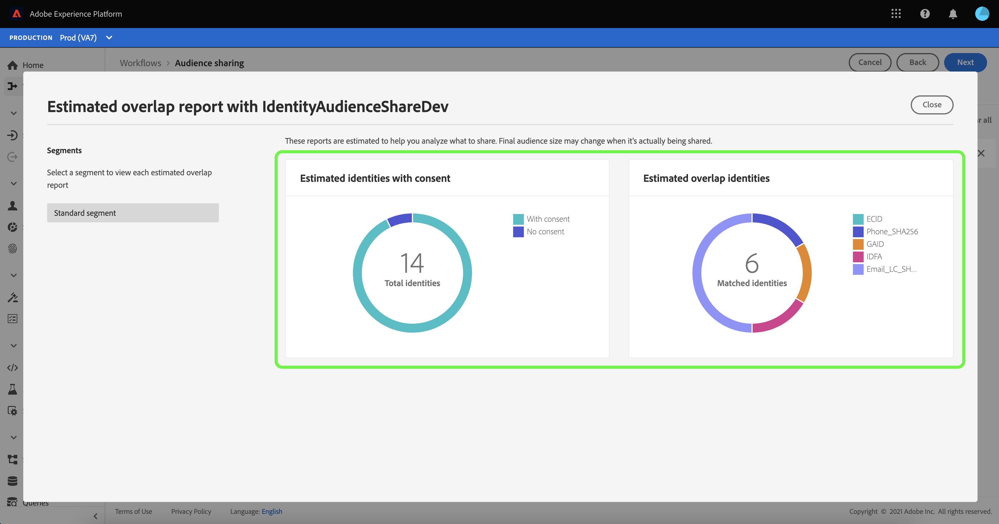

# [!DNL Segment Match] frequently asked questions

This guide provides answers to privacy and legal questions often asked about Adobe Experience Platform Segment Match.

## What data is shared during the estimate overlaps and how can Adobe ensure me that these metrics are obtained securely? 

No customer or segment data is moved across sandboxes to obtain these overlap estimate metrics. The customer-selected, pre-hashed applicable identities in any given sandbox are added to a probabilistic data structure in which the IDs themselves are represented in a hashed format. 

This is a one-way process, meaning the original pre-hashed identifiers are not exposed and cannot be reverse-engineered. 

These data structures have unique properties that allow engineering to perform union and intersection operations between them, even if the information encoded is severely compressed or hashed. These operations allow [!DNL Segment Match] to get the estimated intersection of two data structures composed of IDs from two different sandboxes without having to compare the actual values. Since [!DNL Segment Match] only uses the data structures, the IDs never leave their respective organizations' Profile storages for estimation purposes. This allows Adobe to meet customers' privacy and security requirements while offering highly accurate estimate tools to guide data collaboration agreements.  

## What is the process behind designating which identities receive the shared segment IDs?

[!DNL Segment Match] provides customers with an option to configure which namespaces to use in the service. This selection is applied to both the estimation process described in the previous question and the data transfer process, should the customer decide to publish the feed to a partner sandbox.  

The data transfer process between the encrypted identities of two different organizations is performed in a neutral compute environment. The data transfer job is owned by Adobe, and the organizations involved in the partnership do not have access to this environment, nor do they get access to any logs that may be an outcome from the data transfer job. 

Only segment membership is ingested into a receiver organization's overlapping Profile fragments and no additional identity is transferred from the sender organization to the receiver organization. No plain text personally identifiable information (PII) is read by the data transfer job because [!DNL Segment Match] allows overlaps only on SHA256 encrypted namespaces (email/phone) whenever data is PII. Results are never stored in the compute environment.
