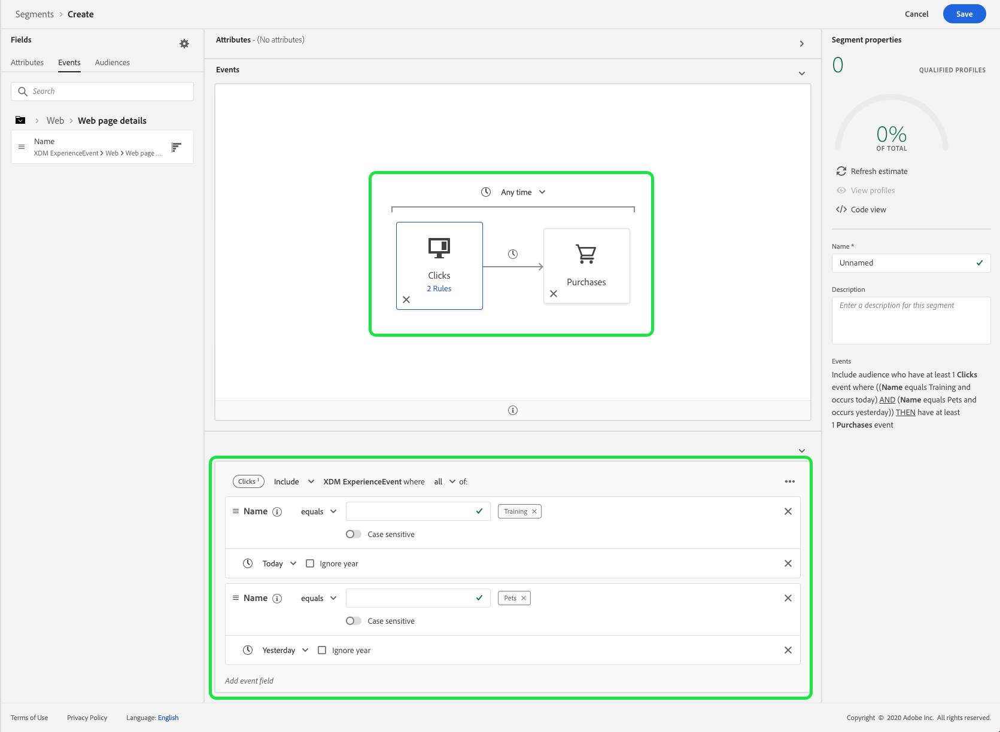
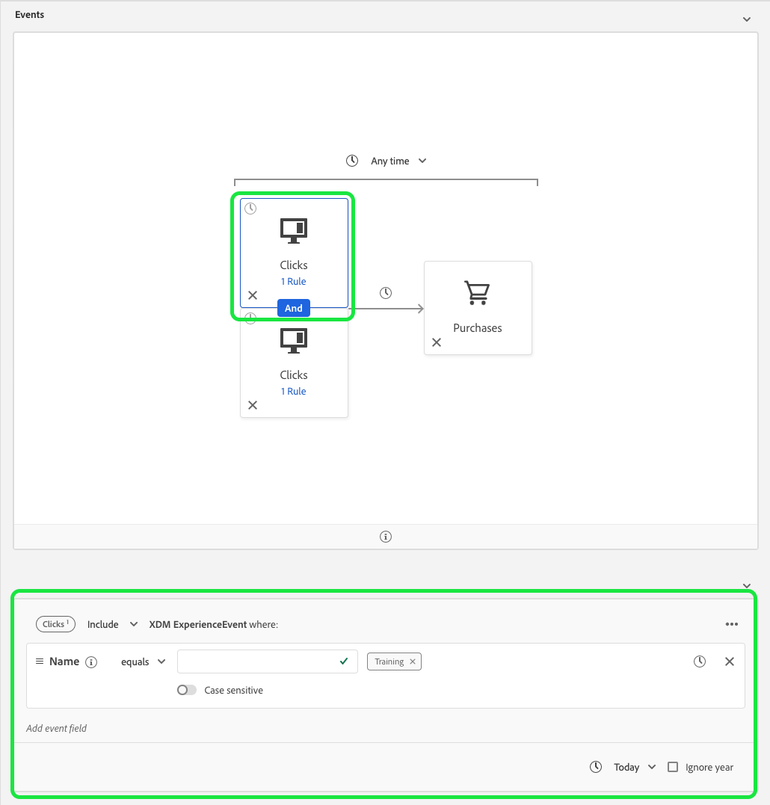
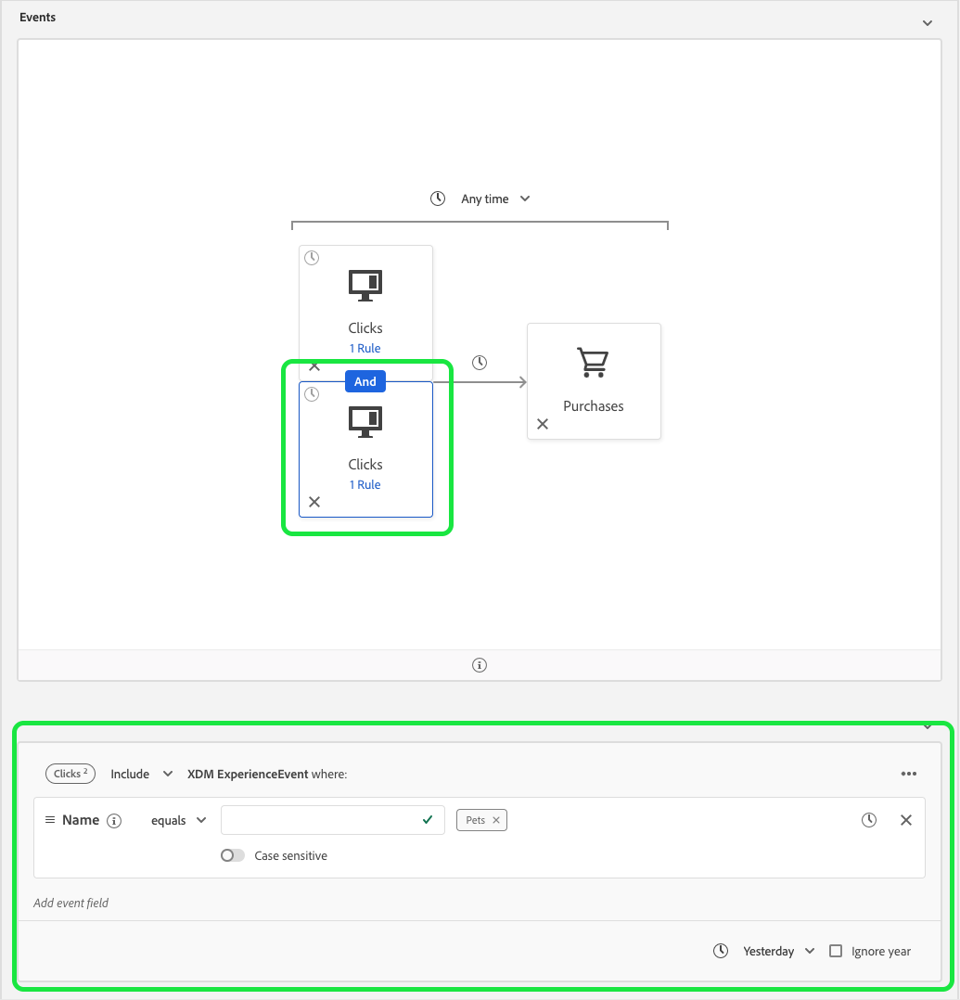

# Time constraints refactorization

The October 2020 release for Adobe Experience Platform has introduced performance changes to Adobe Experience Platform Segmentation Service that add new restrictions to the use of the OR and AND logical operators. These changes will affect newly created or edited segments made using the Segment Builder UI. This guide explains how to mitigate these changes.

Prior to the October 2020 release, all rule-level, group-level, and event-level time constraints were redundantly referring to the same timestamp. In order to clarify time constraint usage, rule-level and group-level time constraints have been removed. To accommodate this change, all time constraints must be rewritten as event-level time constraints.

Previously, an individual event could have multiple time constraint rules attached to it. 

As you can see, this segment has two constraints on the rule-level: One for "[!UICONTROL Today]" and the other for "[!UICONTROL Yesterday]".

The previous segment is equivalent to the following segment — both of the event-level time constraints have been connected using an AND operator. The first event-level time constraint references a click event whose name equals "Training" and is happening today, while the second event-level time constraint references a click event whose name equals "Pets" and happened yesterday.

 

This refactoring of time constraints also affects time constraints that are connected using an OR operator.
