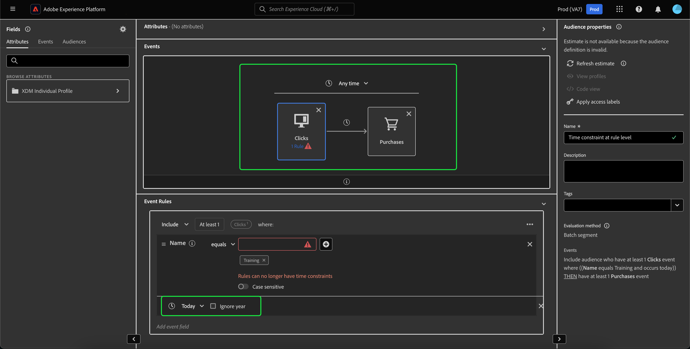
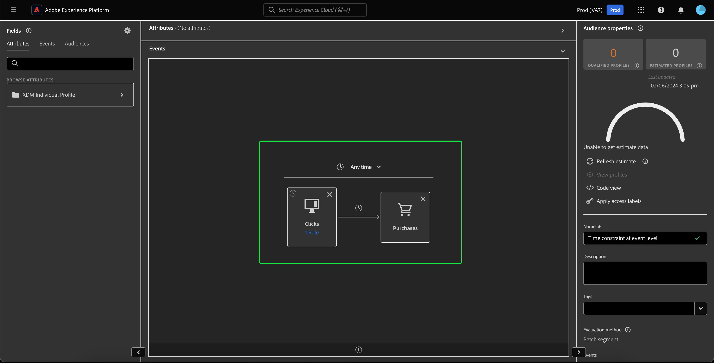
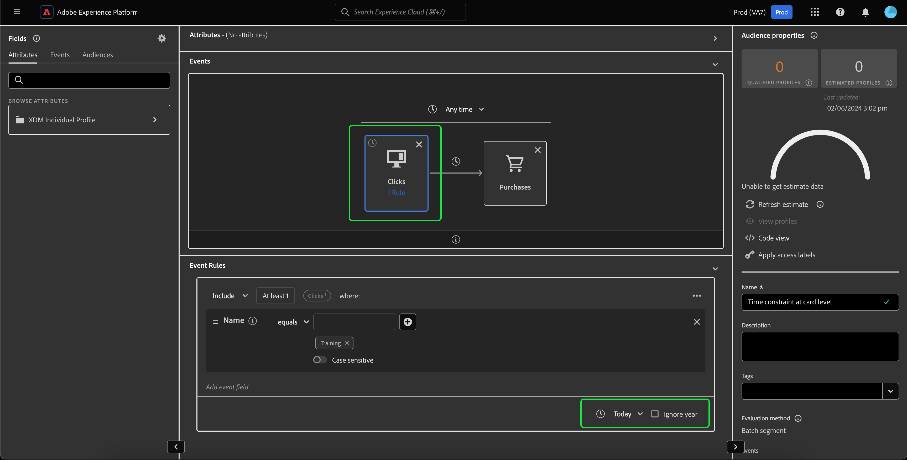

# Time constraints refactorization {#refactorization}

>[!CONTEXTUALHELP]
>id="platform_audiences_segmentBuilder_constraints"
>title="Time constraints refactorization"
>abstract="Rule-level and group-level time constraints have been removed in order to clarify time constraint usage. Please re-write your constraint as a canvas-level or card-level time constraint."

The January 2024 release for Adobe Experience Platform has introduced changes to Adobe Experience Platform Segmentation Service that add new restrictions to where time constraints can be defined. These changes affect newly created or edited segments made using the Segment Builder UI. This guide explains how to mitigate these changes.

Prior to the January 2024 release, all rule-level, group-level, and canvas-level time constraints were redundantly referring to the same timestamp. In order to clarify time constraint usage, rule-level and group-level time constraints have been removed. To accommodate this change, all time constraints **must** be rewritten as **canvas-level** or **card-level** time constraints.

Previously, an individual event could have multiple time constraint rules attached to it. With this recent update, attempting to add a time constraint to a rule will now result in an **error**.

Time constraints can now only be applied at the canvas-level or the card level. 

When applying a time constraint on the canvas-level, you can still select all the available time constraints.

>[!NOTE]
>
>If there is only **one** card on the canvas, applying the time constraint to the card is **equivalent** to applying the time constraint on the canvas-level.
>
>If there are **multiple** cards on the canvas, applying the time constraint to the canvas-level will apply that time constraint to **all** cards on the canvas. 

To apply a time constraint at the card level, select the specific card you want to apply the time constraint to. The **[!UICONTROL Event Rules]** container appears. You can now select the time constraint you wish to apply to the card.

