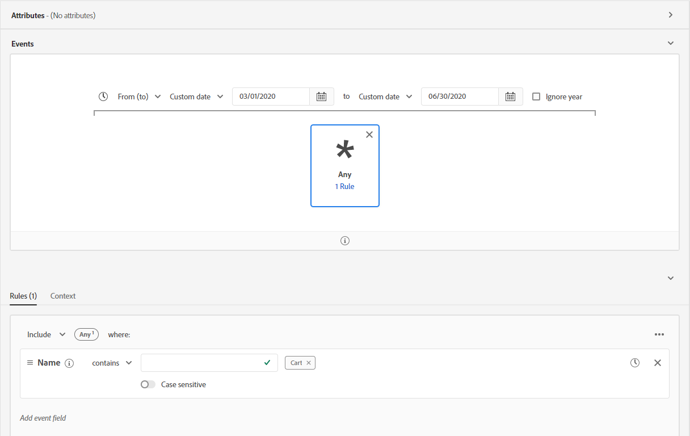
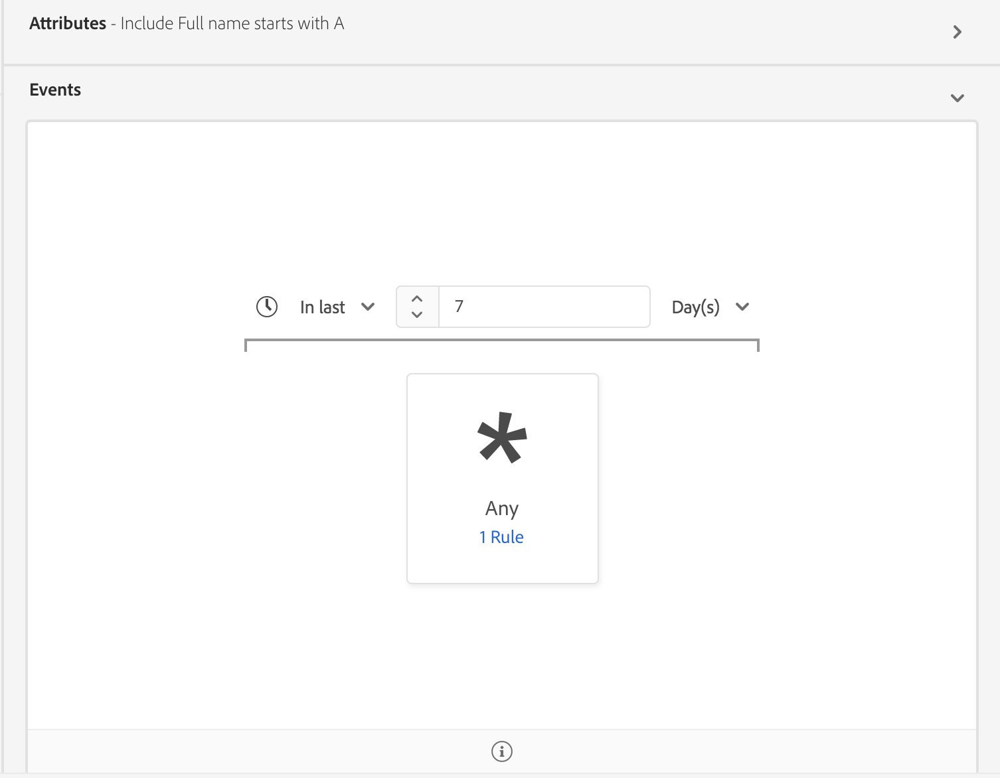
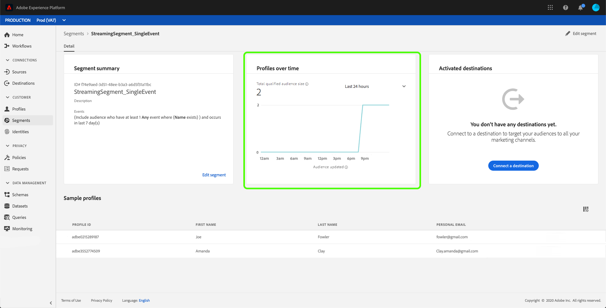
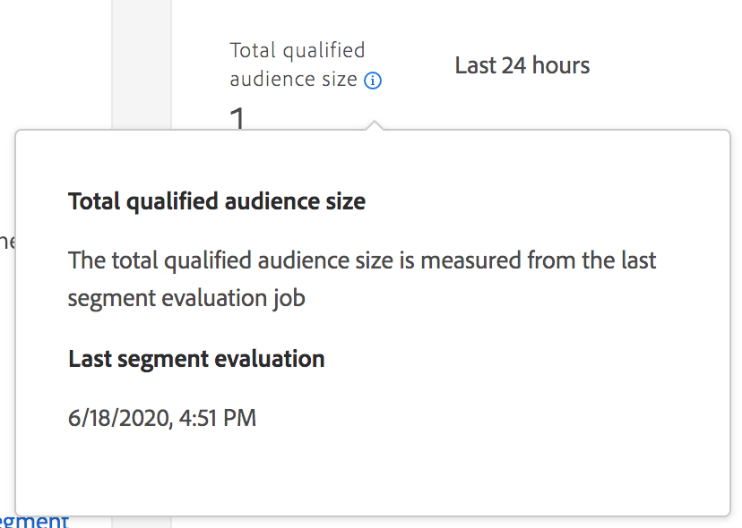

# Streaming segmentation

>[!NOTE]
>
>The following document states how to use streaming segmentation using the UI. For information on using streaming segmentation using the API, please read the [streaming segmentation API guide](../api/streaming-segmentation.md).

Streaming segmentation on [!DNL Adobe Experience Platform] allows customers to do segmentation in near real-time while focusing on data richness. With streaming segmentation, segment qualification now happens as streaming data lands into [!DNL Platform], alleviating the need to schedule and run segmentation jobs. With this capability, most segment rules can now be evaluated as the data is passed into [!DNL Platform], meaning segment membership will be kept up-to-date without running scheduled segmentation jobs.

>[!NOTE]
>
>Streaming segmentation works on all data that was ingested using a streaming source. Data ingested using a batch-based source will be evaluated nightly, even if it qualifies for streaming segmentation.
>
>Additionally, segments evaluated with streaming segmentation may drift between ideal and actual membership if the segment definition is based off of another segment definition that is evaluated using batch segmentation. For example, if Segment A is based off of Segment B, and Segment B is evaluated using batch segmentation, since Segment B only updates every 24 hours, Segment A will move further away from the actual data until it re-syncs with the Segment B update.

## Streaming segmentation query types {#query-types}

>[!NOTE]
>
>In order for streaming segmentation to work, you will need to enable scheduled segmentation for the organization. For details on enabling scheduled segmentation, please refer to [the streaming segmentation section in the Segmentation user guide](./overview.md#scheduled-segmentation).

A query will be automatically evaluated with streaming segmentation if it meets any of the following criteria:

| Query type | Details | Example |
| ---------- | ------- | ------- |
| Single event | Any segment definition that refers to a single incoming event with no time restriction. |  |
| Single event within a relative time window | Any segment definition that refers to a single incoming event. |  |
| Single event with a time window | Any segment definition that refers to a single incoming event with a time window. |  |
| Profile only | Any segment definition that refers to only a profile attribute. | |
| Single event with a profile attribute within a relative time window of less than 24 hours | Any segment definition that refers to a single incoming event, with one or more profile attributes, and occurs within a relative time window of less than 24 hours. |  |
| Segment of segments | Any segment definition that contains one or more batch or streaming segments. **Note:** If a segment of segments is used, profile disqualification will happen **every 24 hours**. |  |
| Multiple events with a profile attribute | Any segment definition that refers to multiple events **within the last 24 hours** and (optionally) has one or more profile attributes. |  |

A segment definition will **not** be enabled for streaming segmentation in the following scenarios:

- The segment definition includes Adobe Audience Manager (AAM) segments or traits.
- The segment definition includes multiple entities (multi-entity queries).
- The segment definition includes a combination of a single event and an `inSegment` event.
  - However, if the segment definition contained in the `inSegment` event is profile only, the segment definition **will** be enabled for streaming segmentation.

Please note the following guidelines apply when doing streaming segmentation:

| Query type | Guideline |
| ---------- | -------- |
| Single event query | There are no limits to the lookback window. |
| Query with event history | <ul><li>The lookback window is limited to **one day**.</li><li>A strict time-ordering condition **must** exist between the events.</li><li>Queries with at least one negated event are supported. However, the entire event **cannot** be a negation.</li></ul>|

If a segment definition is modified so it no longer meets the criteria for streaming segmentation, the segment definition will automatically switch from "Streaming" to "Batch".

Additionally, segment unqualification, similarly to segment qualification, happens in real-time. As a result, if an audience no longer qualifies for a segment, it will be immediately unqualified. For example, if the segment definition asks for "All users who bought red shoes in the last three hours", after three hours, all the profiles that initially qualified for the segment definition will be unqualified.

## Streaming segmentation segment definition details

After creating a streaming-enabled segment, you can view details of that segment. 

Specifically, the **[!UICONTROL Total qualified]** metric is displayed, which shows the total number of qualified audiences, based on batch and streaming evaluations for this segment.

Underneath is a line graph that shows the number of new audiences that were updated in the last 24 hours using the streaming evaluation method. The dropdown can be adjusted to show the last 24 hours, last week, or last 30 days. The **[!UICONTROL New audience updated]** metric is based on the change in audience size during the selected time range, as evaluated by streaming segmentation. This metric does not include the total qualified audience from the daily segment batch evaluation.

>[!NOTE]
>
>A segment definition is considered qualified if it goes from having no status to realized or if it goes from exited to realized. A segment definition is considered unqualified if it goes from realized to exited.
>
>More information about these statuses can be found in the status table within the [segmentation overview](./overview.md#browse).

Additional information about the last segment evaluation can be found by selecting the information bubble next to **[!UICONTROL Total qualified]**.

For more information about segment definitions, please read the previous section on [segment definition details](#segment-details).

## Next steps

This user guide explains how streaming-enabled segment definitions work on Adobe Experience Platform and how to monitor streaming-enabled segments. 

To learn more about using the Adobe Experience Platform user interface, please read the [Segmentation user guide](./overview.md).

## Appendix

The following section lists frequently asked questions regarding streaming segmentation:

### Does streaming segmentation "unqualification" also happen in real time?

For most instances, streaming segmentation unqualification happens in real-time. However, streaming segments that use segments of segments do **not** unqualify in real-time, instead unqualifying after 24 hours.

### What data does streaming segmentation work on?

Streaming segmentation works on all data that was ingested using a streaming source. Segments ingested using a batch-based source will be evaluated nightly, even if it qualifies for streaming segmentation. Events streamed into the system with a timestamp older than 24 hours will be processed in the subsequent batch job.

### How are segments defined as batch or streaming segmentation?

A segment definition is defined as batch, streaming, or edge segmentation based on a combination of query type and event history duration. A list of which segments will be evaluated as a streaming segment definition can be found in the [streaming segmentation query types section](#query-types).

Please note that if a segment definition contains **both** an `inSegment` expression and a direct single-event chain, it cannot qualify for streaming segmentation. If you want to have this segment definition qualify for streaming segmentation, you should make the direct single-event chain its own segment.

### Why does the number of "total qualified" segments keep increasing while the number under "Last X days" remains at zero within the segment definition details section?

The number of total qualified segments is drawn from the daily segmentation job, which includes audiences that qualify for both batch and streaming segments. This value is shown for both batch and streaming segments.

The number under the "Last X days" **only** includes audiences that are qualified in streaming segmentation, and **only** increases if you have streamed data into the system and it counts toward that streaming definition. This value is **only** shown for streaming segments. As a result, this value **may** display as 0 for batch segments.

As a result, if you see that the number under "Last X days" is zero, and the line graph is also reporting zero, you have **not** streamed any profiles into the system that would qualify for that segment.

### How long does it take for a segment definition to be available?

It takes up to one hour for a segment definition to be available.

### Are there any limitations to the data being streamed in?

In order for streamed data to be used in streaming segmentation, there **must** be spacing between the events streamed in. If too many events are streamed in within the same second, Platform will treat these events as bot-generated data, and they will be discarded. As best practice, you should have **at least** five seconds between event data in order to ensure the data is properly used.
