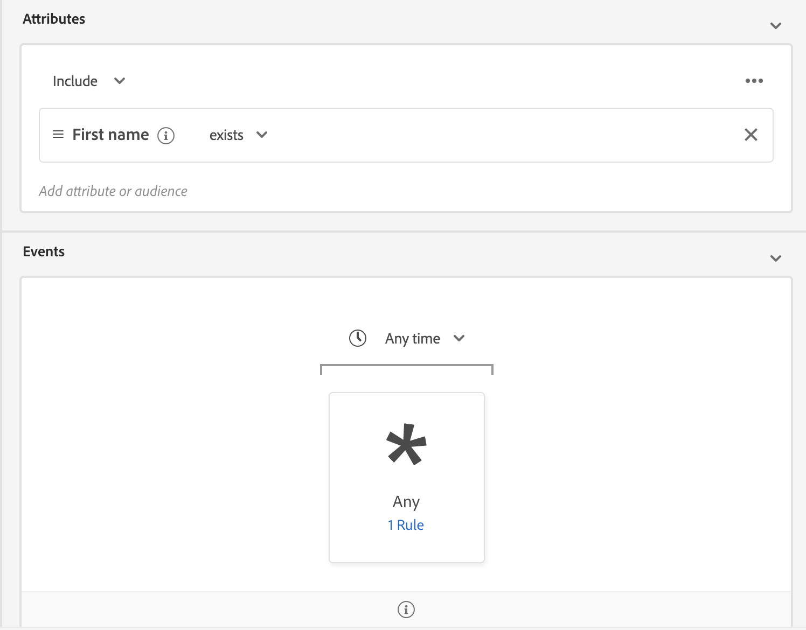

# Streaming segmentation

>[!NOTE]
>
>The following document states how to use streaming segmentation using the UI. For information on using streaming segmentation using the API, please read the [streaming segmentation API guide](../api/streaming-segmentation.md).

Streaming segmentation on [!DNL Adobe Experience Platform] allows customers to do segmentation in near real-time while focusing on data richness. With streaming segmentation, segment qualification now happens as streaming data lands into [!DNL Platform], alleviating the need to schedule and run segmentation jobs. With this capability, most segment rules can now be evaluated as the data is passed into [!DNL Platform], meaning segment membership will be kept up-to-date without running scheduled segmentation jobs.

>[!NOTE]
>
>Streaming segmentation can only be used to evaluate data that is streamed into Platform. In other words, data ingested through batch ingestion will not be evaluated through streaming segmentation, and will be evaluated along with the nightly scheduled segment job.
>
>Additionally, segments evaluated with streaming segmentation may drift between ideal and actual membership if the segment is based off of another segment that is evaluated using batch segmentation. For example, if Segment A is based off of Segment B, and Segment B is evaluated using batch segmentation, since Segment B only updates every 24 hours, Segment A will move further away from the actual data until it re-syncs with the Segment B update.

## Streaming segmentation query types

>[!NOTE]
>
>In order for streaming segmentation to work, you will need to enable scheduled segmentation for the organization. For details on enabling scheduled segmentation, please refer to [the streaming segmentation section in the Segmentation user guide](./overview.md#scheduled-segmentation).

A query will be automatically evaluated with streaming segmentation if it meets any of the following criteria:

| Query type | Details | Example |
| ---------- | ------- | ------- |
| Incoming hit | Any segment definition that refers to a single incoming event with no time restriction. |  |
| Incoming hit within a relative time window | Any segment definition that refers to a single incoming event. |  |
| Incoming hit with a time window | Any segment definition that refers to a single incoming event with a time window. |  |
| Profile only | Any segment definition that refers to only a profile attribute. | |
| Incoming hit that refers to a profile | Any segment definition that refers to a single incoming event, with no time restriction, and one or more profile attributes. |  |
| Incoming hit that refers to a profile within a relative time window | Any segment definition that refers to a single incoming event and one or more profile attributes. |  |
| Segment of segments | Any segment definition that contains one or more batch or streaming segments. **Note:** If a segment of segments is used, profile disqualification will happen **every 24 hours**. |  |
| Multiple events that refer to a profile | Any segment definition that refers to multiple events **within the last 24 hours** and (optionally) has one or more profile attributes. |  |

A segment definition will **not** be enabled for streaming segmentation in the following scenarios:

- The segment definition includes Adobe Audience Manager (AAM) segments or traits.
- The segment definition includes multiple entities (multi-entity queries).

Additionally, some guidelines apply when doing streaming segmentation:

| Query type | Guideline |
| ---------- | -------- |
| Single event query | There are no limits to the lookback window. |
| Query with event history | <ul><li>The lookback window is limited to **one day**.</li><li>A strict time-ordering condition **must** exist between the events.</li><li>Queries with at least one negated event are supported. However, the entire event **cannot** be a negation.</li></ul>|

If a segment definition is modified so it no longer meets the criteria for streaming segmentation, the segment definition will automatically switch from "Streaming" to "Batch".

## Streaming segmentation segment details

After creating a streaming-enabled segment, you can view details of that segment. 

Specifically, details about the **[!UICONTROL total qualified audience size]** are shown. The **[!UICONTROL Total qualified audience size]** shows the total number of qualified audiences from the last completed segment job run. If a segment job wasn't completed within the last 24 hours, the number of audiences will be taken from an estimate instead.

Underneath is a line graph that shows the number of segments that were qualified and disqualified in the last 24 hours. The dropdown can be adjusted to show the last 24 hours, last week, or last 30 days.

Additional information about the last segment evaluation can be found by selecting the information bubble.

For more information about segment definitions, please read the previous section on [segment definition details](#segment-details).

## Next steps

This user guide explains how streaming-enabled segment definitions work on Adobe Experience Platform and how to monitor streaming-enabled segments. 

To learn more about using the Adobe Experience Platform user interface, please read the [Segmentation user guide](./overview.md).
