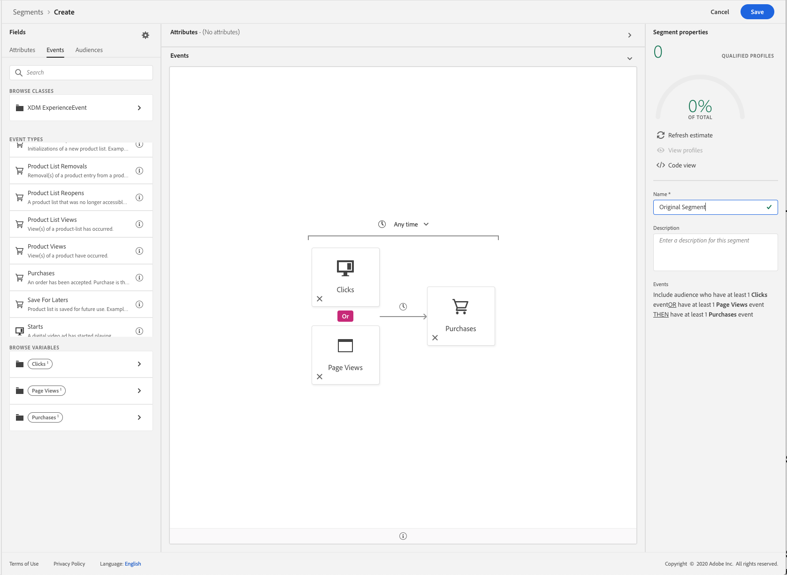
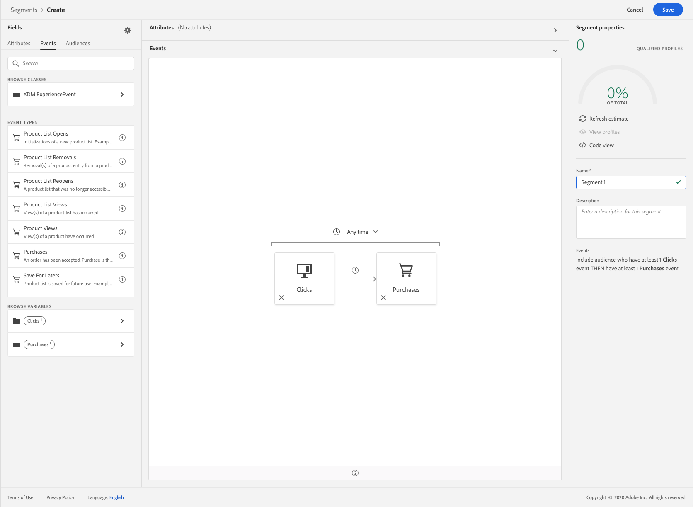
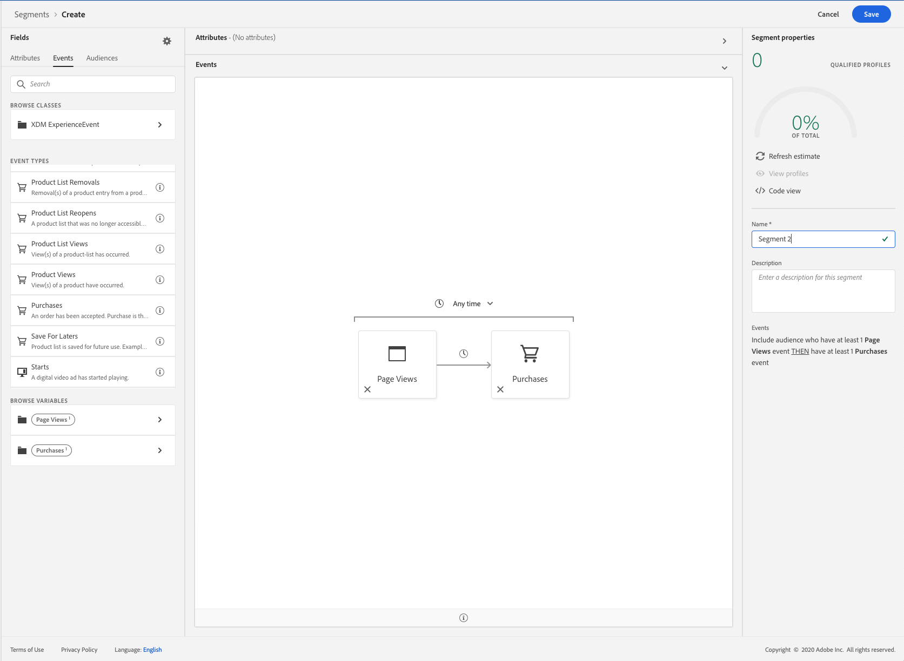
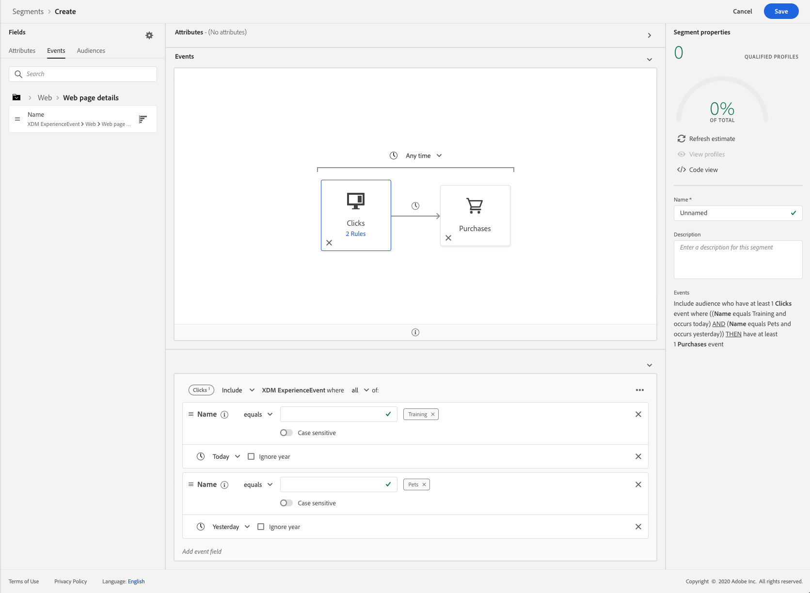
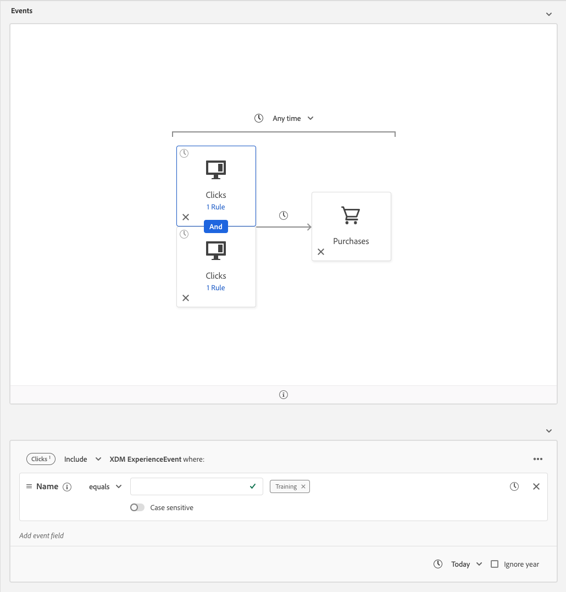
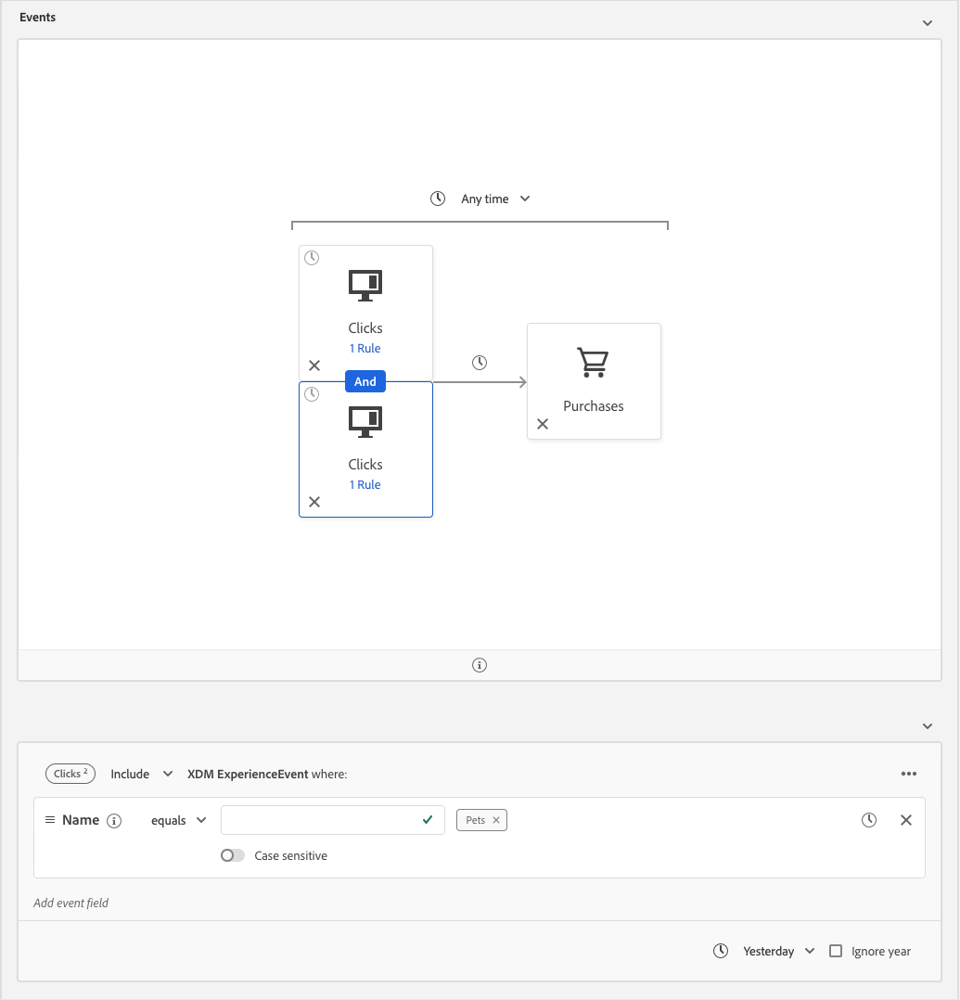

# Breaking changes guide (?)

Two breaking changes have been made with the September 2020 release for Adobe Experience Platform. This guide explains how to mitigate these breaking changes that have been made.

## Factorization of ORs in events {#or-factorization}

Previously, segments could use an OR between events in the same column. For example, a segment could be "A click event OR a view event followed by a purchase event".

This segment can now be re-stated by using the following steps.

### Factorize the segment

The previous example segment, "A click event OR a view event followed by a purchase event", can be re-defined in the following manner:

"A click event followed by a purchase event" 
OR 
"A view event followed by a purchase event"

By redefining the segment this way, you can see that, effectively, two segments have been created. This process of factorization can be repeated for any number of ORs between events.

### Create a child segment

After factorizing the segments, you can create the two different segments, and save them separately.

The "A click event followed by a purchase event" will be labelled as Segment 1.

While the "A view event followed by a purchase event" will be labelled as Segment 2.

### Combine the segments

Now that both child segments have been created, you can combine them to make a new segment which retains the original logic.

## Time constraints refactorization

Due to the fact that rule-level, group-level, and event-level time constraints were redundantly referring to the same timestamp, rule-level and group-level time constraints were removed. However, all these time constraints can be rewritten as an event-level time constraint.

Previously, an individual event would have multiple time constraint rules attached to it.

The previous segment is equivalent to the following segment:

This refactoring of time constraints also applies for time constraints that connected together with an OR - however, that segment will need to be further redefined with the [previous factorization steps](#or-factorization).