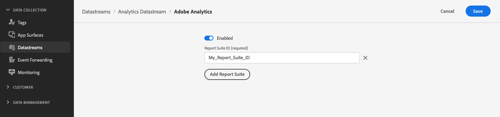

# Interacting with Adobe Analytics

## Overview {#overview}

Adobe Analytics data collection works by translating XDM data into a format that Adobe Analytics can understand. Several XDM fields are [automatically mapped](https://experienceleague.adobe.com/docs/analytics/implementation/aep-edge/variable-mapping.html) to Analytics variables. You can also manually map XDM values to legacy Analytics variables.

To enable Adobe Analytics to receive data from Server API, you need to [configure your datastream](../datastreams/overview.md#adobe-analytics-settings) to forward events to Adobe Analytics, by entering the report suite ID in the datastream configuration page.



## Interacting with Adobe Analytics {#interacting-analytics}

### API format {#format}

```http
POST /ee/v2/interact?dataStreamId={DATASTREAM_ID}
```

### Request {#request}

The sample below includes several automatically mapped values from the `_experience.analytics` field group. It also includes JSON-based data layers. While these data layers cannot be mapped automatically, it is possible to use [Data Prep for Data Collection](../datastreams/data-prep.md) to map these values to a schema that contains field groups referenced above.

All values that users map to those fields will automatically map to the appropriate Analytics values, as if they were included in the API request.

```shell
curl -X POST "https://server.adobedc.net/ee/v2/interact?dataStreamId={DATASTREAM_ID}" \
-H "Authorization: Bearer {TOKEN}" 
-H "x-gw-ims-org-id: {ORG_ID}" 
-H "x-api-key: {API_KEY}" 
-H "Content-Type: application/json" \
-d '{
   "event": {
      "xdm": {
         "eventType": "web.webpagedetails.pageViews",
         "web": {
            "webPageDetails": {
               "URL": "https://alloystore.dev",
               "name": "Home Page"
            },
            "webReferrer": {
               "URL": ""
            }
         },
         "device": {
            "screenHeight": 1440,
            "screenWidth": 3440,
            "screenOrientation": "landscape"
         },
         "environment": {
            "type": "browser",
            "browserDetails": {
               "viewportWidth": 3440,
               "viewportHeight": 1440
            }
         },
         "placeContext": {
            "localTime": "2022-03-22T22:45:21.193-06:00",
            "localTimezoneOffset": 360
         },
         "timestamp": "2022-03-23T04:45:21.193Z",
         "implementationDetails": {
            "name": "https://ns.adobe.com/experience/alloy/reactor",
            "version": "2.8.0+2.9.0",
            "environment": "browser"
         },
         "_experience": {
            "analytics": {
               "customDimensions": {
                  "eVars": {
                     "eVar14": "eVar14"
                  }
               },
               "event1to100": {
                  "event13": {
                     "value": 1
                  },
                  "event14": {
                     "value": 2
                  }
               }
            }
         }
      }
   },
   "data": {
      "page": {
         "pageInfo": {
            "pageName": "Promotions",
            "siteSection": "Home"
         },
         "promos": {
            "heroPromos": "purse,shoes,sunglasses"
         },
         "customVariables": {
            "testGroup": "orange/black theme"
         },
         "events": {
            "homePage": true
         },
         "products": [
            {
               "productSKU": "abc123",
               "productName": "shirt"
            }
         ]
      }
   }
}'
```

### Reponse {#response}

```json
{
   "requestId": "d2ad6364-5675-4a86-ba41-50e7a4c4a299",
   "handle": []
}
```
