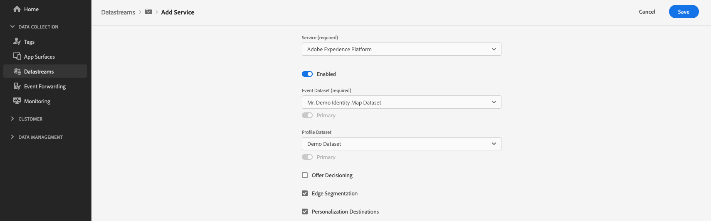

# Interacting with Adobe Experience Platform

## Overview {#overview}

To enable Experience Platform data collection, you must first [configure your datastream](../edge/fundamentals/datastreams.md) to forward events into Experience Platform datasets.

