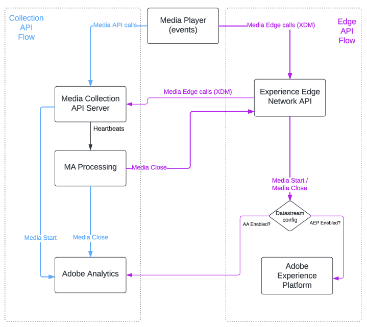

# Media Edge API overview

Media Edge APIs are built on the Adobe Experience Platform to provide media event tracking data within the framework of [XDM schemas](https://experienceleague.adobe.com/docs/experience-platform/xdm/home.html#:~:text=Experience%20Data%20Model%20(XDM)%2C,the%20power%20of%20digital%20experiences). For Media Analytics customers, this makes the following features available:

* With [Adobe Customer Journey Analytics](https://experienceleague.adobe.com/docs/analytics-platform/using/cja-overview/cja-overview.html), customers can get near real-time, granular details of duration, starts, and stops to evaluate and combine for media metrics. Customers migrating from Adobe Analytics have all reporting metrics available in Adobe Customer Journey Analytics.

* With [Adobe Real-Time Customer Data Platform](https://experienceleague.adobe.com/docs/experience-platform/rtcdp/overview.html), customers can enrich their real-time profiles with media consumption data.

* With [Adobe Journey Optimizer](https://experienceleague.adobe.com/docs/journey-optimizer/using/get-started/get-started.html), customers can optimize omnichannel campaigns and automate journeys with media consumption signals.

## Optimizing media tracking data flows

Both [Media Collection APIs](https://experienceleague.adobe.com/docs/media-analytics/using/implementation/streaming-media-apis/mc-api-overview.html#media-tracking-data-flows) and Media Edge APIs provide media tracking data as RESTful services. But using the Media Edge service has the following advantages:

* It is the easiest way to incorporate XDM schemas into your data flow. 

* Calls are directed from a media player directly to the [Experience Platform Edge Network](https://experienceleague.adobe.com/docs/experience-platform/edge-network-server-api/overview.html).

* It tracks media events efficiently with a minimum of cross-server calls. 

The following table shows a possible Adobe API service for various media analytics cases:

| Use case | API service |
| -------- | ----------- |
| Adobe Experience Platform solution | Media Edge |
| Real-Time CDP + Customer Journey Analytics | Media Edge |
| Adobe Analytics + Adobe Experience Platform solution | Media Edge |
| Adobe Analytics only (already tracking) | Media Collection |

>[!NOTE]
>
> The Media Collection API service for Analtyics still receives XDM data, but is not optimized for it to the extent that Media Edge service is. Depending on the data sent from the Media Player, some Analytics-only data can also be routed through the Media Edge API service. 

The following graphic shows the data flows for the two API services:

## Next steps

* For more information on using Media Edge APIs, see the [Getting started documentation](getting-started.md). 

* For more information on working with Platform Edge, see [Installing Media Analytics with Experience Platform Edge](https://experienceleague.adobe.com/docs/media-analytics/using/implementation/implementation-edge.html).
