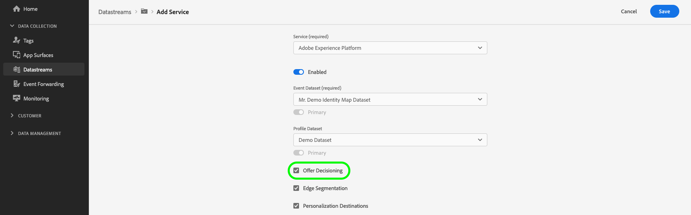

# Personalization via Offer Decisioning

## Overview {#overview}

The Edge Network Server API can deliver personalized experiences managed in [Offer Decisioning](https://experienceleague.adobe.com/docs/journey-optimizer/using/offer-decisioniong/get-started-decision/starting-offer-decisioning.html) to the web channel.

[!DNL Offer Decisioning] supports a non-visual interface to create, activate, and deliver your activities and personalization experiences.

## Prerequisites {#prerequisites}

Personalization via [!DNL Offer Decisioning] requires that you have access to [Adobe Journey Optimizer](https://experienceleague.adobe.com/docs/journey-optimizer/using/ajo-home.html) before you configure your integration.

## Configure your datastream {#configure-your-datastream}

Before you can use the Server API in conjunction with Offer Decisioning, you must enable Adobe Experience Platform personalization on your datastream configuration, and enable the **[!UICONTROL Offer Decisioning]** option.

See the [guide on adding services to a datastream](../datastreams/overview.md#adobe-experience-platform-settings), for detailed information on how to enable Offer Decisioning.



## Audience creation {#audience-creation}

[!DNL Offer Decisioning] relies on the Adobe Experience Platform Segmentation Service for audience creation. You can find the documentation for the [!DNL Segmentation Service] [here](../segmentation/home.md).

## Defining decision scopes {#creating-decision-scopes}

The [!DNL Offer Decision Engine] uses Adobe Experience Platform data and [Real-Time Customer profiles](../profile/home.md), along with the [!DNL Offer Library], to deliver offers to the right customers and channels at the right time.

To learn more about the [!DNL Offer Decisioning Engine], see the dedicated [documentation](https://experienceleague.adobe.com/docs/journey-optimizer/using/offer-decisioniong/get-started-decision/starting-offer-decisioning.html).

After [configuring your datastream](#configure-your-datastream), you must define the decision scopes to be used in your personalization campaign.

[Decision scopes](https://experienceleague.adobe.com/docs/journey-optimizer/using/offer-decisioniong/create-manage-activities/create-offer-activities.html#add-decision-scopes) are the Base64-encoded JSON strings containing the activity and placement IDs that you want the [!DNL Offer Decisioning Service] to use when proposing offers.

**Decision scope JSON**

```json
{
   "activityId":"xcore:offer-activity:11cfb1fa93381aca",
   "placementId":"xcore:offer-placement:1175009612b0100c"
}
```

**Decision scope Base64-encoded string**

```shell
"eyJhY3Rpdml0eUlkIjoieGNvcmU6b2ZmZXItYWN0aXZpdHk6MTFjZmIxZmE5MzM4MWFjYSIsInBsYWNlbWVudElkIjoieGNvcmU6b2ZmZXItcGxhY2VtZW50OjExNzUwMDk2MTJiMDEwMGMifQ=="
```

After you have created your offers and collections, you need to define a [decision scope](https://experienceleague.adobe.com/docs/journey-optimizer/using/offer-decisioniong/create-manage-activities/create-offer-activities.html#add-decision-scopes).

Copy the Base64-encoded decision scope. You will use it in the `query` object of the Server API request. 


```json
"query":{
   "personalization":{
      "decisionScopes":[
         "eyJ4ZG06YWN0aXZpdHlJZCI6Inhjb3JlOm9mZmVyLWFjdGl2aXR5OjE0ZWZjYTg5NDE4OTUxODEiLCJ4ZG06cGxhY2VtZW50SWQiOiJ4Y29yZTpvZmZlci1wbGFjZW1lbnQ6MTJkNTQ0YWU1NGU3ZTdkYiJ9"
      ]
   }
}
```

## API call example {#api-example}

**API format**

```http
POST /ee/v2/interact
```

### Request {#request}

A full request that includes a complete XDM object, data object and an Offer Decisioning query is outlined below.

>[!NOTE]
>
>The `xdm` and `data` objects are optional and are only required for Offer Decisioning if you have created segments with conditions that use fields in either of those objects.

```shell
curl -X POST 'https://server.adobedc.net/ee/v2/interact?dataStreamId={DATASTREAM_ID}' \
--header 'x-api-key: {API_KEY}' \
--header 'x-gw-ims-org: {ORG_ID}' \
--header 'Authorization: Bearer {TOKEN}' \
--header 'Content-Type: application/json' \
--data-raw '{
    "event": {
        "xdm": {
            "eventType": "web.webpagedetails.pageViews",
            "identityMap": {
                "ECID": [
                    {
                        "id": "05907638112924484241029082405297151763",
                        "authenticatedState": "ambiguous",
                        "primary": true
                    }
                ]
            },
            "web": {
                "webPageDetails": {
                    "URL": "https://alloystore.dev",
                    "name": "Home Page"
                },
                "webReferrer": {
                    "URL": ""
                }
            },
            "device": {
                "screenHeight": 1440,
                "screenWidth": 3440,
                "screenOrientation": "landscape"
            },
            "environment": {
                "type": "browser",
                "browserDetails": {
                    "viewportWidth": 3440,
                    "viewportHeight": 1440
                }
            },
            "placeContext": {
                "localTime": "2022-03-22T22:45:21.193-06:00",
                "localTimezoneOffset": 360
            },
            "timestamp": "2022-03-23T04:45:21.193Z",
            "implementationDetails": {
                "name": "https://ns.adobe.com/experience/alloy/reactor",
                "version": "1.0",
                "environment": "serverapi"
            }
        },
        "data": {
            "page": {
                "pageInfo": {
                    "pageName": "Promotions",
                    "siteSection": "Home"
                },
                "promos": {
                    "heroPromos": "purse,shoes,sunglasses"
                },
                "customVariables": {
                    "testGroup": "orange/black theme"
                },
                "events": {
                    "homePage": true
                },
                "products": [
                    {
                        "productSKU": "abc123",
                        "productName": "shirt"
                    }
                ]
            },
            "__adobe.target": {
                "profile.eyeColor": "brown",
                "profile.hairColor": "brown"
            }
        }
    },
    "query": {
        "personalization": {
            "decisionScopes": [
                "eyJ4ZG06YWN0aXZpdHlJZCI6Inhjb3JlOm9mZmVyLWFjdGl2aXR5OjE0ZWZjYTg5NDE4OTUxODEiLCJ4ZG06cGxhY2VtZW50SWQiOiJ4Y29yZTpvZmZlci1wbGFjZW1lbnQ6MTJkNTQ0YWU1NGU3ZTdkYiJ9"
            ]
        }
    }
}'
```

### Response {#response}

The Edge Network will return a response similar to the one below.

```json
{
   "requestId":"b375077d-7e1d-4c18-b7d3-e4da0fb4fbc5",
   "handle":[
      {
         "payload":[
            
         ],
         "type":"personalization:decisions",
         "eventIndex":0
      },
      {
         "payload":[
            {
               "id":"120d5db7-181c-42c5-8653-88b3cd3e1e69",
               "scope":"eyJ4ZG06YWN0aXZpdHlJZCI6Inhjb3JlOm9mZmVyLWFjdGl2aXR5OjE0ZWZjYTg5NDE4OTUxODEiLCJ4ZG06cGxhY2VtZW50SWQiOiJ4Y29yZTpvZmZlci1wbGFjZW1lbnQ6MTJkNTQ0YWU1NGU3ZTdkYiJ9",
               "activity":{
                  "id":"xcore:offer-activity:14efca8941895181",
                  "etag":"1"
               },
               "placement":{
                  "id":"xcore:offer-placement:12d544ae54e7e7db",
                  "etag":"1"
               },
               "items":[
                  {
                     "id":"xcore:personalized-offer:14efc848a3577d92",
                     "etag":"2",
                     "schema":"https://ns.adobe.com/experience/offer-management/content-component-json",
                     "data":{
                        "id":"xcore:personalized-offer:14efc848a3577d92",
                        "format":"application/json",
                        "language":[
                           "en-us"
                        ],
                        "content":"{\n\t\"ODEFirstTest\" : \"Personalizaton Content\"\n}",
                        "characteristics":{
                           "reporting":"testRequest"
                        }
                     }
                  }
               ]
            }
         ],
         "type":"personalization:decisions",
         "eventIndex":0
      },
      {
         "payload":[
            {
               "key":"kndctr_53A16ACB5CC1D3760A495C99_AdobeOrg_identity",
               "value":"CiYwNTkwNzYzODExMjkyNDQ4NDI0MTAyOTA4MjQwNTI5NzE1MTc2M1IOCLr6xb39LxgBKgNPUjLwAbr6xb39Lw==",
               "maxAge":34128000
            }
         ],
         "type":"state:store"
      }
   ]
}
```

If the visitor qualifies for a personalization activity based on data sent to [!DNL Offer Decisioning], the relevant activity content will be found under the `handle` object, where the type is `personalization:decisions`.

Other content will be returned under the `handle` object as well. Other content types are not relevant to [!DNL Offer Decisioning] personalization. If the visitor qualifies for multiple activities, they will be contained in an array. 

The table below explains the key elements of that portion of the response.

|Property | Description |Example |
|---|---|---|
|`scope`| The decision scope associated with the proposed offers that were returned. | `"scope": "eyJhY3Rpdml0eUlkIjoieGNvcmU6b2ZmZXItYWN0aXZpdHk6MTFjZmIxZmE5MzM4MWFjYSIsInBsYWNlbWVudElkIjoieGNvcmU6b2ZmZXItcGxhY2VtZW50OjExNzUwMDk2MTJiMDEwMGMifQ=="`|
|`activity.id`| The unique ID of the offer activity.| `"id": "xcore:offer-activity:11cfb1fa93381aca"` |
|`placement.id`| The unique ID of the offer placement.| `"id": "xcore:offer-placement:1175009612b0100c"`|
|`items.id`| The unique ID of the proposed offer.| `"id": "xcore:personalized-offer:124cc332095cfa74"`|
|`schema`| The schema of the content associated with the proposed offer. | `"schema": "https://ns.adobe.com/experience/offer-management/content-component-html"`|
|`data.id`| The unique ID of the proposed offer. | `"id": "xcore:personalized-offer:124cc332095cfa74"`|
|`format`| The format of the content associated with the proposed offer. | `"format": "text/html"`|
|`language`| An array of languages associated with the content from the proposed offer.| `"language": [ "en-US" ]`|
|`content`| Content associated with the proposed offer in the format of a string. | `"content": "<p style="color:red;">20% Off on shipping</p>"`|
|`deliveryUrl`| Image content associated with the proposed offer in the format of a URL. | `"deliveryURL": "https://image.jpeg"`|
|`characteristics`| JSON object containing the characteristics associated with the proposed offer. | `"characteristics": { "foo": "bar", "foo1": "bar1" }`|
