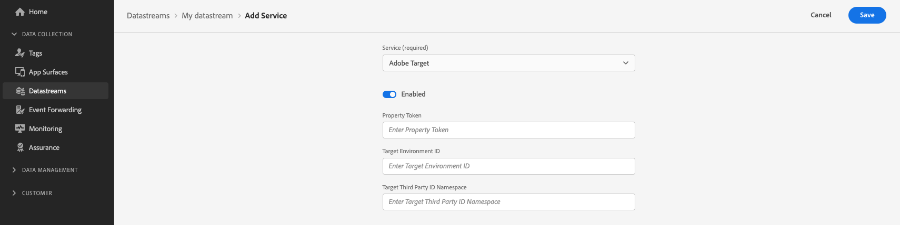

# Personalization via Adobe Target

## Overview {#overview}

The Edge Network Server API can deliver and render personalized experiences created in Adobe Target, with the help of the [Form-Based Experience Composer](https://experienceleague.adobe.com/docs/target/using/experiences/form-experience-composer.html).

>[!IMPORTANT]
>
>Personalization experiences created through the [Target Visual Experience Composer (VEC)](https://experienceleague.adobe.com/docs/target/using/experiences/vec/visual-experience-composer.html) are not fully supported by the Server API. The Server API can **retrieve** activities created by VEC, but Server API cannot **render** activities created by VEC. If you want to render activities created by VEC, please implement [hybrid personalization](../web-sdk/personalization/hybrid-personalization.md) using the Web SDK and the Edge Network Server API.

## Configure your datastream {#configure-your-datastream}

Before you can use the Server API in conjunction with Adobe Target, you must enable Adobe Target personalization on your datastream configuration.

See the [guide on adding services to a datastream](../datastreams/overview.md#adobe-target-settings), for detailed information on how to enable Adobe Target.

When configuring your datastream, you can (optionally) provide values for [!DNL Property Token], [!DNL Target Environment ID], and [!DNL Target Third Party ID Namespace].



## Custom parameters {#custom-parameters}

Most fields in the [!DNL XDM] portion of each request are serialized into dot notation and then sent to Target as custom or [!DNL mbox] parameters.


### Example {#custom-parameters-example}

Given the following XDM sample: 

```json
"xdm":{
   "marketing":{
      "campaignGroup":"winter22",
      "campaignName":"homeOwnerPromo22",
      "trackingCode":"hop22"
   }
}
```

When creating audiences in Target, the following values will be available as custom parameters:

* `marketing.campaignGroup`
* `marketing.campaignName`
* `marketing.trackingCode`

## Target profile updates {#profile-update}

The [!DNL Server API] allows for updates to the Target profile. To update a Target profile, ensure that the profile data is passed in the `data` portion of the request in the following format:

```json
"data":  {
    "__adobe.target": {
        "profile.eyeColor": "brown",
        "profile.hairColor": "brown"
    }
}
```

## Querying Target activities {#querying-target-activities}

### Schemas {#schemas}

The query portion of the request determines what content is returned by Target. Under the `personalization` object, `schemas` determines the type of content to be returned by Target.

In situations where you are unsure of what sort of offers you'll be retrieving, you should include all four of the schemas in your personalization query to the Edge Network:

* **HTML-based offers:**
https://ns.adobe.com/personalization/html-content-item
* **JSON-based offers:**
https://ns.adobe.com/personalization/json-content-item
* **Target Redirect offers**
https://ns.adobe.com/personalization/redirect-item
* **Target DOM Manipulation offers**
https://ns.adobe.com/personalization/dom-action

### Decision scopes {#decision-scopes}

Adobe Target [!DNL mbox] names should be included in the `decisionScopes` array to return the appropriate content.

#### Example {#decision-scopes-example}

In the example below, all four offer types are requested along with a Target activity called `serverapimbox`.

```json
"query":{
   "personalization":{
      "schemas":[
         "https://ns.adobe.com/personalization/html-content-item",
         "https://ns.adobe.com/personalization/json-content-item",
         "https://ns.adobe.com/personalization/redirect-item",
         "https://ns.adobe.com/personalization/dom-action"
      ],
      "decisionScopes":[
         "serverapimbox"
      ]
   }
}
```

## API call example {#api-example}

**API format**

```http
POST /ee/v2/interact
```

### Request {#request}

A full request that includes a complete XDM object, profile paramters, along with the appropriate Target query is outlined below.

```shell
curl -X POST 'https://server.adobedc.net/ee/v2/interact?dataStreamId={DATASTREAM_ID}' \
--header 'x-api-key: {API_KEY}' \
--header 'x-gw-ims-org: {ORG_ID}' \
--header 'Authorization: Bearer {TOKEN}' \
--header 'Content-Type: application/json' \
--data-raw '{
    "event": {
        "xdm": {
            "eventType": "web.webpagedetails.pageViews",
            "identityMap": {
                "ECID": [
                    {
                        "id": "05907638112924484241029082405297151763",
                        "authenticatedState": "ambiguous",
                        "primary": true
                    }
                ]
            },
            "web": {
                "webPageDetails": {
                    "URL": "https://alloystore.dev",
                    "name": "Home Page"
                },
                "webReferrer": {
                    "URL": ""
                }
            },
            "device": {
                "screenHeight": 1440,
                "screenWidth": 3440,
                "screenOrientation": "landscape"
            },
            "environment": {
                "type": "browser",
                "browserDetails": {
                    "viewportWidth": 3440,
                    "viewportHeight": 1440
                }
            },
            "placeContext": {
                "localTime": "2022-03-22T22:45:21.193-06:00",
                "localTimezoneOffset": 360
            },
            "timestamp": "2022-03-23T04:45:21.193Z",
            "implementationDetails": {
                "name": "https://ns.adobe.com/experience/alloy/reactor",
                "version": "1.0",
                "environment": "serverapi"
            },
            "data": {
                "__adobe": {
                    "target": {
                        "profile.eyeColor": "brown",
                        "profile.hairColor": "brown",
                        "profile.shoeColor": "black"
                    }
                }
            }
        }
    },
    "query": {
        "personalization": {
            "schemas": [
                "https://ns.adobe.com/personalization/html-content-item",
                "https://ns.adobe.com/personalization/json-content-item",
                "https://ns.adobe.com/personalization/redirect-item",
                "https://ns.adobe.com/personalization/dom-action"
            ],
            "decisionScopes": [
                "serverapimbox"
            ]
        }
    }
}'
```

### Response {#response}

The Edge Network will return a response similar to the one below.

```json
{
   "requestId":"10959bbf-f83d-40e1-9521-d9145f19cdc5",
   "handle":[
      {
         "payload":[
            {
               "id":"AT:eyJhY3Rpdml0eUlkIjoiMTQwMjgxIiwiZXhwZXJpZW5jZUlkIjoiMCJ9",
               "scope":"serverapimbox",
               "scopeDetails":{
                  "decisionProvider":"TGT",
                  "activity":{
                     "id":"140281"
                  },
                  "experience":{
                     "id":"0"
                  },
                  "strategies":[
                     {
                        "algorithmID":"0",
                        "trafficType":"0"
                     }
                  ],
                  "characteristics":{
                     "eventToken":"xycjBJlZhwVV5MN0kMkmoGqipfsIHvVzTQxHolz2IpTMromRrB5ztP5VMxjHbs7c6qPG9UF4rvQTJZniWgqbOw=="
                  }
               },
               "items":[
                  {
                     "id":"282484",
                     "schema":"https://ns.adobe.com/personalization/json-content-item",
                     "meta":{
                        "offer.name":"/server_apiform/experiences/0/pages/0/zones/0/1648103551041",
                        "experience.id":"0",
                        "activity.name":"Server API Form",
                        "activity.id":"140281",
                        "experience.name":"Experience A",
                        "option.id":"2",
                        "offer.id":"282484"
                     },
                     "data":{
                        "id":"282484",
                        "format":"application/json",
                        "content":{
                           "value":"a/b json experience a",
                           "platform":"server"
                        }
                     }
                  }
               ]
            }
         ],
         "type":"personalization:decisions",
         "eventIndex":0
      },
      {
         "payload":[
            {
               "key":"kndctr_53A16ACB5CC1D3760A495C99_AdobeOrg_identity",
               "value":"CiYwNTkwNzYzODExMjkyNDQ4NDI0MTAyOTA4MjQwNTI5NzE1MTc2M1IOCL-pwpv9LxgBKgNPUjLwAb-pwpv9Lw==",
               "maxAge":34128000
            }
         ],
         "type":"state:store"
      }
   ]
}
```

If the visitor qualifies for a personalization activity based on the data sent to Adobe Target, the relevant activity content will be found under the `handle` object, where the type is `personalization:decisions`.

Other content will sometimes be returned under `handle` as well. Other content types are not relevant to the Target personalization. If the visitor qualifies for multiple activities, each activity will be a separate `personalization` object in the array.

The table below explains the key elements of that portion of the response. 

|Property | Description   | Example  |
|---|---|---|
| `scope`  |  The Target mbox name that resulted in the proposed offers.  | `"scope": "serverapimbox"`   |
| `items[].schema` | The schema of the content associated with the proposed offer. This will be related to the activity type you selected when creating the personalization activity. | `"schema": "https://ns.adobe.com/personalization/json-content-item",` | 
| `items[].meta.activity.id`| The unique ID of the offer activity. Typically a 6-digit number. | `"activity.id": "140281"` |
| `items[].meta.activity.name` | The name of the user-specified offer activity. This is provided during the activity creation step. | `"activity.name": "Server API Form"`|
| `items[].meta.experience.id` | The unique ID of the personalization experience. | `"experience.id": "0"` | 
| `items[].meta.experience.name` | The unique name of the personalization experience. | `"experience.name": "Experience A"` | 
| `items[].data.id` | The ID of the proposed offer. | `"id": "282484"`  |
| `items[].data.format` | The format of the content associated with the proposed offer. | `"format: "application/json`| 
| `items[].data.content` | Content associated with the proposed offer. This will be used for personalization of content of the calling application. | `"content": "<CONTENT CONFIGURED IN TARGET>"` |
