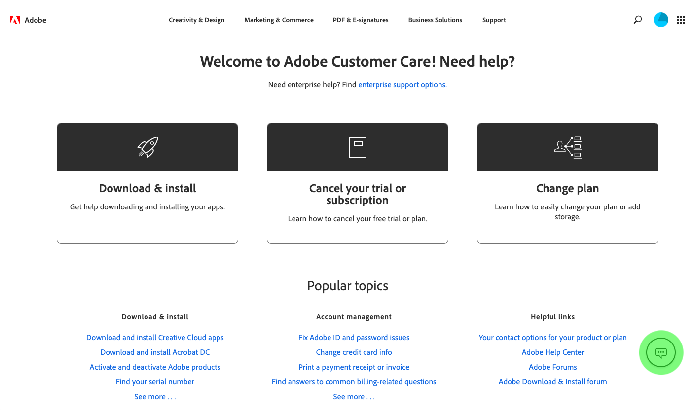

# Troubleshooting guide

This document provides answers to frequently asked questions about data connectors for Adobe Experience Platform, as well as a troubleshooting guide for common API errors encountered while setting up a connector and the steps to resolve them.

## FAQ

The following is a list of answers to frequently asked questions about data connectors within Adobe Experience Platform.

## How do I turn Adobe Solution data on or off in Adobe Experience Platform?

In order to turn data on or off for most Adobe Solutions, such as **Adobe Analytics**, **Adobe Audience Manager**, **Adobe Advertising Cloud**, and **Adobe Target**, you will be required to contact Adobe Customer Care. Please follow the steps below for [contacting Adobe Customer Care](https://helpx.adobe.com/contact.html) and please have your IMS Organization information available.

> Note: **Adobe Target** data is automatically turned on after set up and will require you to contact Adobe Customer Care in order to have it turned off.

> Note: When calling Adobe Customer Care regarding **Adobe Analytics**, please have the following information available in addition to your IMS Organization:
> - Report Suite ID
> - Login Company
> - Backfill Period

For **Adobe Campaign** data, you can use the Adobe Campaign UI to turn on or off any data collected by Campaign on Platform. Please see the [Adobe Campaign documentation](https://docs.adobe.com/content/help/en/campaign-standard/using/campaign-standard-home.html) for more information.

### Contact Adobe Customer Care

*Prerequisite:* A valid Adobe account.

- Open [Adobe Customer Care](https://helpx.adobe.com/contact.html) in your web browser.
- Click the icon in the bottom right corner of the screen to open a Customer Care chat window.

- If you have not already done so, sign in using your Adobe account email address and password. Customer Care will connect you to the correct team for your account.
- Inform Customer Care that you want to enable or disable solution data for a product on Adobe Experience Platform. Provide them with the following information:
  - Your IMS Organization
  - The product or service for which you want to enable or disable solution data.
  - Any additional information required based on the product or service for which you are turning on or off solution data.

## Errors and troubleshooting

## REST API errors

| HTTP Status Code | Description | Possible Cause |
| --- | --- | --- |
| 400 | Bad request | Malformed or illegal query. |
| 401 | Authentication failed | Invalid authorization token. |
| 403 | Forbidden | Missing or invalid headers. |
| 500 | Internal Server Error | Internal system failure. |
| 504 | Gateway Timeout | Hang in connection, servers are currently busy. |  

## Header errors and troubleshooting

The following are examples of 4XX error messages that you may encounter when working with Connector APIs.

- [Missing Header](#missing-header)
- [Oauth token is not valid](#oauth-token-is-not-valid)
- [API Key is required or invalid](#api-key-is-required-or-invalid)

### Missing Header

```json
{

  "error_code": "400003",
  "message": "Missing Header"
}
```

This *400 - Bad Request* error message displays when your API call is missing a header. For example, you may be missing the `x-gw-ims-org-id`. You may want to check that you have included all required headers with the correct values. Please see the [Connector Service API Resource](https://www.adobe.io/apis/experienceplatform/home/api-reference.html#!acpdr/swagger-specs/partner-connectors-api.yaml) for more information on the structure.

### Oauth token is not valid

```json
{
  "error_code": "401013",
  "message": "Oauth token is not valid"
}
```

This _401 - Unauthorized_ error message displays when the provided access token in the `Authorization` header is not valid. First, check that the token has been entered correctly. If the error still persists, [generate a new token](../tutorials/authentication.md) in the Adobe I/O Console.

### API Key is required or invalid

```json
{

  "error_code": "403000",
  "message": "Api Key is required"
}
```

This *403 - Forbidden* error message displays when you are missing an API key header (`x-api-key`). Similar error messages will appear if you are missing other required headers for your API calls. A similar error message is displayed if you provide an invalid ID for the required header.

```json
{
    "error_code": "403003",
    "message": "Api Key is invalid"
}
```

In this example, the provided `x-api-key` value is invalid. Ensure that the have entered the correct key before trying again. This applies to missing Oauth tokens and invalid profiles (wrong `x-gw-ims-org-id` header) as well.

## 5XX error messages

500-level errors indicate that an error or unresolvable request occurred on the server side. To resolve your issue, try resending your API request again after a few minutes have passed. If you are still receiving a 5XX error r

## Additional common API errors

Below is a list of additional API errors that can appear:

<table >
<tr>
<td >Error Message</th>
</tr>

<tr>
<td ><strong>Post Account</strong></td>
</tr>

<tr>
<td ><strong>400 - Bad Request</strong></td>
</tr>

<tr>
<td >
<pre class="JSON language-JSON hljs">
{
    "code": "bad_request",
    "error": "Connector-type not supported. Please specify correct Connector Type"
}
</pre>
</td>
</tr>

<tr>
<td >
<pre class="JSON language-JSON hljs">
{
    "code": "bad_request",
    "error": "Invalid secret identifier, requires non-empty value"
}
</pre>
</td>
</tr>

<tr>
<td >
<pre class="JSON language-JSON hljs">
{
    "code": "bad_request",
    "error": "Invalid secret identifier"
}
</pre>
</td>
</tr>

<tr>
<td >
<pre class="JSON language-JSON hljs">
{
    "code": "bad_request",
    "error": "Wrong salesforce service URL"
}
</pre>
</td>
</tr>

<tr>
<td ><strong>401 - Unauthorized</strong></td>
</tr>

<tr>
<td >
<pre class="JSON language-JSON hljs">
{
    "code": "401",
    "error": "Error while connecting to Amazon S3. Please check your credentials"
}
</pre>
<p>In this example we are connecting to the Amazon S3 connector. A similar error message is displayed when connecting to other connectors, such as Azure Blob, Dynamics, and Salesforce.</p>
</td>
</tr>

<tr>
<td ><strong>Schedule Connection</strong></td>
</tr>

<tr>
<td ><strong>400 - Bad Request</strong></td>
</tr>

<tr>
<td >
<pre class="JSON language-JSON hljs">
{
    "code": "bad_request",
    "error": "Ingest Frequency cannot be null. For blank frequency use frequency : {}"
}
</pre>
</td>
</tr>

<tr>
<td >
<pre class="JSON language-JSON hljs">
{
    "code": "bad_request",
    "error": "Set all frequency parameters"
}
</pre>
</td>
</tr>

<tr>
<td >
<pre class="JSON language-JSON hljs">
{
    "code": "bad_request",
    "error": "IngestStart can be either current or future time"
}
</pre>
</td>
</tr>

<tr>
<td >
<pre class="JSON language-JSON hljs">
{
    "code": "bad_request",
    "error": "Invalid Payload. Please check request body payload."
}
</pre>
</td>
</tr>

<tr>
<td >
<pre class="JSON language-JSON hljs">
{
    "code": "bad_request",
    "error": "Invalid contract label. Please provide correct Dule labels."
}
</pre>
<p>This error can also occur for other invalid Dule labels including: identity label, loginState label, and sensitive label.</p>
</td>
</tr>

<tr>
<td >
<pre class="JSON language-JSON hljs">
{
    "code": "bad_request",
    "error": "Frequency parameter values can only be a '*' or number."
}
</pre>
</td>
</tr>

<tr>
<td >
<pre class="JSON language-JSON hljs">
{
    "code": "bad_request",
    "error": "Minutes frequency can bve 15, 30, or 60"
}
</pre>
</td>
</tr>

<tr>
<td >
<pre class="JSON language-JSON hljs">
{
    "code": "bad_request",
    "error": "Frequency param 'minutes' invalid."
}
</pre>
</td>
</tr>

<tr>
<td ><strong>500 - Internal Server Error</strong></td>
</tr>

<tr>
<td >
<pre class="JSON language-JSON hljs">
{
    "code": "500",
    "error": "Error updating connection details."
}
</pre>
</td>
</tr>

<tr>
<td ><strong>Post Custom Schema</strong></td>
</tr>

<tr>
<td ><strong>400 - Bad Request</strong></td>
</tr>

<tr>
<td >
<pre class="JSON language-JSON hljs">
{
    "code": "bad_request",
    "error": "API unsupported for connector= amazon-s3."
}
</pre>
</td>
</tr>

<tr>
<td >
<pre class="JSON language-JSON hljs">
{
    "code": "bad_request",
    "error": "Neither Fields nor objectName defined in schemaRequest."
}
</pre>
</td>
</tr>

<tr>
<td ><strong>404 - Not Found</strong></td>
</tr>

<tr>
<td >
<pre class="JSON language-JSON hljs">
{
    "code": "Not Found",
    "error": "Schema does not exist"
}
</pre>
</td>
</tr>

<tr>
<td ><strong>Post Dataset</strong></td>
</tr>

<tr>
<td ><strong>400 - Bad Request</strong></td>
</tr>

<tr>
<td >
<pre class="JSON language-JSON hljs">
{
    "code": "bad_request",
    "error": "Specify either fields, schema or schemaRef in dataSet"
}
</pre>
</td>
</tr>

<tr>
<td >
<pre class="JSON language-JSON hljs">
{
    "code": "bad_request",
    "error": "Schema cannot be set as empty. Please provide valid Schema."
}
</pre>
</td>
</tr>

<tr>
<td >
<pre class="JSON language-JSON hljs">
{
    "code": "bad_request",
    "error": "Invalid resource path: []"
}
</pre>
</td>
</tr>

<tr>
<td >
<pre class="JSON language-JSON hljs">
{
    "code": "bad_request",
    "error": "Dataset Tags not provided. Please specify valid Tags"
}
</pre>
</td>
</tr>

<tr>
<td >
<pre class="JSON language-JSON hljs">
{
    "code": "bad_request",
    "error": "Dataset List not provided. Please provide valid dataSet information in dataSet body."
}
</pre>
</td>
</tr>

<tr>
<td >
<pre class="JSON language-JSON hljs">
{
    "code": "bad_request",
    "error": "DataSet Params not provided. Please provide valid dataSet information in params body."
}
</pre>
</td>
</tr>

<tr>
<td >
<pre class="JSON language-JSON hljs">
{
    "code": "bad_request",
    "error": "Regex is not supported if connection has Minutely schedule."
}
</pre>
</td>
</tr>

<tr>
<td >
<pre class="JSON language-JSON hljs">
{
    "code": "bad_request",
    "error": "Regex is not supported if connection has Weekly schedule."
}
</pre>
</td>
</tr>

<tr>
<td >
<pre class="JSON language-JSON hljs">
{
    "code": "bad_request",
    "error": "Invalid Frequency or Date Time Regex provided."
}
</pre>
</td>
</tr>

<tr>
<td >
<pre class="JSON language-JSON hljs">
{
    "code": "bad_request",
    "error": "Frequency set in connection and Regex should match.<br> Daily Frequency should also have Regex containing Date, Month, and Year formats."
}
</pre>
</td>
</tr>

<tr>
<td >
<pre class="JSON language-JSON hljs">
{
    "code": "bad_request",
    "error": "Frequency set in connection and Regex should match. <br>Monthly Frequency should have Regex containing Month and Year formats."
}
</pre>
</td>
</tr>

<tr>
<td >
<pre class="JSON language-JSON hljs">
{
    "code": "bad_request",
    "error": "Frequency set in connection and Regex should match. <br>Yearly Frequency should have Regex containing Year formats."
}
</pre>
</td>
</tr>

<tr>
<td ><strong>500 - Internal Server Error</strong></td>
</tr>

<tr>
<td >
<pre class="JSON language-JSON hljs">
{
    "code": "500",
    "error": "Error in deleting dataSets"
}
</pre>
</td>
</tr>

<tr>
<td >
<pre class="JSON language-JSON hljs">
{
    "code": "500",
    "error": "Error in posting dataSets"
}
</pre>
</td>
</tr>

<tr>
<td >
<pre class="JSON language-JSON hljs">
{
    "code": "500",
    "error": "Error in posting dataSetViews"
}
</pre>
</td>
</tr>

<tr>
<td ><strong>Get Objects</strong></td>
</tr>

<tr>
<td ><strong>400 - Bad Request</strong></td>
</tr>

<tr>
<td >
<pre class="JSON language-JSON hljs">
{
    "code": "bad_request",
    "error": "Invalid key6 'object'. BucketName cannot be empty"
}
</pre>
</td>
</tr>

<tr>
<td ><strong>404 - Not Found</strong></td>
</tr>

<tr>
<td >
<pre class="JSON language-JSON hljs">
{
    "code": "Not Found",
    "error": "Connection does not exist"
}
</pre>
</td>
</tr>

<tr>
<td ><strong>504 - Gateway Timeout</strong></td>
</tr>

<tr>
<td >
<pre class="JSON language-JSON hljs">
{
    "code": "Gateway Timeout",
    "error": "Error retrieving connection"
}
</pre>
</td>
</tr>

<tr>
<td ><strong>Get Schema</strong></td>
</tr>

<tr>
<td ><strong>400 - Bad Request</strong></td>
</tr>

<tr>
<td >
<pre class="JSON language-JSON hljs">
{
    "code": "Bad Request",
    "error": "Invalid key 'delimiter'=:. Please provide a valid file delimiter.<br> Supported file delimiters are ',' , '\t'"
}
</pre>
<p>In this example, the delimiter being used is a colon `:` which is not supported. Check to make sure that you are using one of the supported file delimiters: `,` and `\t`.</p>
</td>
</tr>

<tr>
<td >
<pre class="JSON language-JSON hljs">
{
    "code": "Bad Request",
    "error": "Unknown fileType. Please provide a valid fileType."
}
</pre>
</td>
</tr>

<tr>
<td >
<pre class="JSON language-JSON hljs">
{
    "code": "Bad Request",
    "error": "Invalid key 'object'. Please provide a valid path."
}
</pre>
</td>
</tr>

<tr>
<td >
<pre class="JSON language-JSON hljs">
{
    "code": "Bad Request",
    "error": "Invalid key 'object'. FileName cannot be empty."
}
</pre>
</td>
</tr>

<tr>
<td >
<pre class="JSON language-JSON hljs">
{
    "code": "Bad Request",
    "error": "Invalid key 'fileType'. Please provide a valid file type. <br>Supported file types are delimited, parquet, and json."
}
</pre>
</td>
</tr>

<tr>
<td >
<pre class="JSON language-JSON hljs">
{
    "code": "Bad Request",
    "error": "Invalid key 'object'. Please provide a valid object path."
}
</pre>
</td>
</tr>

<tr>
<td >
<pre class="JSON language-JSON hljs">
{
    "code": "Bad Request",
    "error": "Invalid entityName. Please provide a valid entity name."
}
</pre>
</td>
</tr>

<tr>
<td ><strong>500 - Internal Server Error</strong></td>
</tr>

<tr>
<td >
<pre class="JSON language-JSON hljs">
{
    "code": "500",
    "error": "Exception in instantiating parquet reader."
}
</pre>
</td>
</tr>

<tr>
<td >
<pre class="JSON language-JSON hljs">
{
    "code": "500",
    "error": "Error occurred when deserializing source JSON data. <br>Please check if the data is in valid JSON object format."
}
</pre>
</td>
</tr>

<tr>
<td >
<pre class="JSON language-JSON hljs">
{
    "code": "500",
    "error": "Error found when processing 'Csv/Tsv Format Text' source 'sampleProfile.parquet' <br>with row number 14: found more columns than expected column count: 2"
}
</pre>
</td>
</tr>

<tr>
<td >
<pre class="JSON language-JSON hljs">
{
    "code": "500",
    "error": "Error while fetching preview data for type: azure-blob-inbound"
}
</pre>
<p>This error can also occur when fetching preview data for other connectors. For example, "Error while fetching preview data for type: S3"</p>
</td>
</tr>

<tr>
<td ><strong>Put Account</strong></td>
</tr>

<tr>
<td ><strong>500 - Internal Server Error</strong></td>
</tr>

<tr>
<td >
<pre class="JSON language-JSON hljs">
{
    "code": "500",
    "error": "Error updating Account."
}
</pre>
</td>
</tr>

<tr>
<td >
<pre class="JSON language-JSON hljs">
{
    "code": "500",
    "error": "Error retrieving account."
}
</pre>
</td>
</tr>
</table>