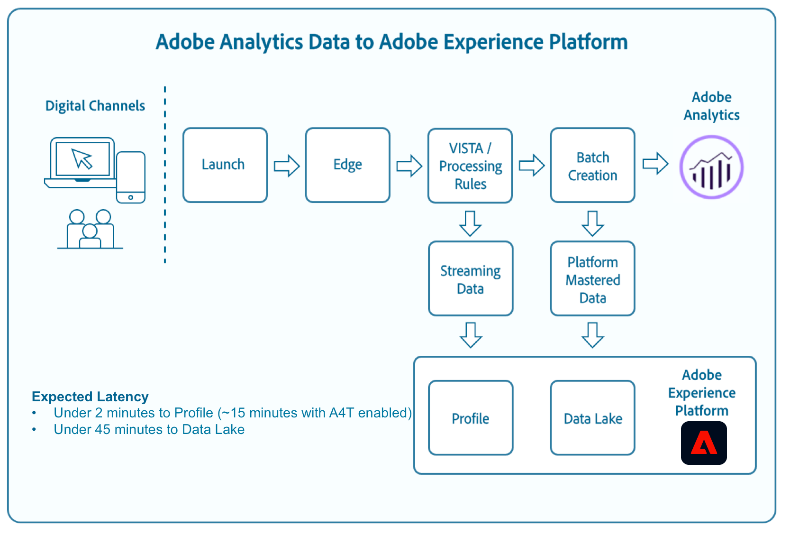

# Adobe Analytics source connector for report-suite data

Adobe Experience Platform allows you to ingest Adobe Analytics data through the Analytics source connector. The [!DNL Analytics] source connector streams data collected by [!DNL Analytics] to Platform in real-time, converting SCDS-formatted [!DNL Analytics] data into [!DNL Experience Data Model] (XDM) fields for consumption by Platform.

This document provides an overview of [!DNL Analytics] and describes the use-cases for [!DNL Analytics] data.

## Adobe Analytics and Analytics data

[!DNL Analytics] is a powerful engine that helps you learn more about your customers, how they interact with your web properties, see where your digital marketing spend is effective, and identify areas of improvement. [!DNL Analytics] handles trillions of web-transactions per year and the [!DNL Analytics] source connector allows you to easily tap into this rich behavioral data and enrich the [!DNL Real-time Customer Profile] in a matter of minutes.

At a high level, [!DNL Analytics] collects data from various digital channels and multiple data centers around the world. Once the data is collected, Visitor Identification, Segmentation and Transformation Architecture (VISTA) rules, and processing rules are applied to shape the incoming data. After raw data has gone through this lightweight processing, it is then considered ready for consumption by [!DNL Real-time Customer Profile]. In a process parallel to the aforementioned, the same processed data is micro-batched and ingested into Platform datasets for consumption by [!DNL Data Science Workspace], [!DNL Query Service], and other data-discovery applications.

See the [processing rules overview](https://experienceleague.adobe.com/docs/analytics/admin/admin-tools/processing-rules/processing-rules.html) for more information on processing rules.

## Experience Data Model (XDM)

XDM is a publicly documented specification that provides common structures and definitions for an application to use to communicate with services on Experience Platform.

Adhering to XDM standards allows data to be uniformly incorporated, making it easier to deliver data and gather information.

To learn more about XDM, please see the [XDM System overview](../../../xdm/home.md).

## How are fields mapped from Adobe Analytics to XDM?

When a source connection is established for bringing [!DNL Analytics] data into Experience Platform using the Platform user interface, data fields are automatically mapped and ingested into [!DNL Real-time Customer Profile] within minutes. For instructions on creating a source connection with [!DNL Analytics] using the Platform UI, see the [Analytics source connector tutorial](../../tutorials/ui/create/adobe-applications/analytics.md).

For detailed information on the field mapping that occurs between [!DNL Analytics] and Experience Platform, see the [Adobe Analytics field mapping](./mapping/analytics.md) guide.

## What is the expected latency for Analytics Data on Platform?

The expected latency for Analytics Data on Platform is outlined in the table below. Latency will vary depending on customer configuration, data volumes, and consumer applications. For example, if the Analytics implementation is configured with `A4T` the latency to Pipeline will increase to 5-10 minutes.

| Analytics Data | Expected Latency |
| -------------- | ---------------- |
| New data to [!DNL Real-time Customer Profile] (A4T **not** enabled) | < 2 minutes |
| New data to [!DNL Real-time Customer Profile] (A4T **is** enabled) | < 15 minutes |
| New data to Data Lake | < 90 minutes |
| Backfill data of less than 10 Billion events | < 4 weeks |

Analytics backfills are always 13 months, with no limits on the number of events. The limit of 10 billion events mentioned in the table above is strictly with respect to expected latency.

>[!NOTE]
>
>Analytics backfill data is not ingested into [!DNL Profile] and thus is not accounted for in license profiles.

## Primary identifiers in [!DNL Analytics] data

Every hit from the [!DNL Analytics] source connector contains a primary identifier that is dependant on whether an ECID or an AAID exists. If there is an ECID, the ECID is designated as the primary identifier. If there is an AAID, then the AAID is designated as the primary.

The following table provides more information on identity fields in your [!DNL Analytics] data.

| Identity field | Description |
| --- | --- |
| AAID | The AAID is the primary device identifier in Adobe Analytics and is guaranteed to exist on every event that is passed through the [!DNL Analytics] source. The AAID is sometimes referred to as the *Legacy Analytics ID* or as the `s_vi` cookie ID. Despite this, an AAID is created even if the `s_vi` cookie is not present. The  AAID is represented by the `post_visid_high` and `post_visid_low` columns in [[!DNL Analytics] data feeds](https://experienceleague.adobe.com/docs/analytics/export/analytics-data-feed/data-feed-contents/datafeeds-reference.html). On any given event, the AAID field contains a single identity which may be one of the several different types described in the [order of operations for [!DNL Analytics] IDs](https://experienceleague.adobe.com/docs/id-service/using/reference/analytics-reference/analytics-order-of-operations.html). **Note**: Within an entire report suite, an AAID may contain a mix of types across events.|
| ECID | The ECID (Experience Cloud ID) is a separate device identifier field, which is populated in Adobe Analytics when [!DNL Analytics] is implemented using the Experience Cloud Identity Service. The ECID is sometimes also referred to as MCID (Marketing Cloud ID). If an ECID exists on an event, the AAID may be based on ECID depending on whether the Analytics [grace period](https://experienceleague.adobe.com/docs/id-service/using/reference/analytics-reference/grace-period.html) is configured. The ECID is represented by the `mcvisid` in Analytics data feeds. For more information on ECID, see the [ECID overview](../../../identity-service/ecid.md). For information on how ECID works with [!DNL Analytics], see the document on [Analytics and Experience Cloud ID Requests](https://experienceleague.adobe.com/docs/id-service/using/reference/analytics-reference/legacy-analytics.html?lang=en). |
| AACUSTOMID | The AACUSTOMID is a separate identifier field which is populated in Adobe Analytics based on  the use of the `s.VisitorID` variable in the [!DNL Analytics] implementation. The AACUSTOMID is represented by the `cust_visid` column in [[!DNL Analytics] data feeds](https://experienceleague.adobe.com/docs/analytics/export/analytics-data-feed/data-feed-contents/datafeeds-reference.html). If the AACUSTOMID is present, then the AAID will be based on the AACUSTOMID because the AACUSTOMID trumps all other identifiers as defined by the [order of operations for [!DNL Analytics] IDs](https://experienceleague.adobe.com/docs/id-service/using/reference/analytics-reference/analytics-order-of-operations.html). |

### How the [!DNL Analytics] source treats identities

The [!DNL Analytics] source passes these identities to Experience Platform in XDM form as:

* `endUserIDs._experience.aaid.id`
* `endUserIDs._experience.mcid.id`
* `endUserIDs._experience.aacustomid.id`

These fields are not marked as identities. Instead, the same identities are copied into XDM’s `identityMap` as key-value pairs:

* `{ “key”: “AAID”, “value”: [ { “id”: “<identity>”, “primary”: <true or false> } ] }`
* `{ “key”: “ECID”, “value”: [ { “id”: “<identity>”, “primary”: <true or false> } ] }`
* `{ “key”: “AACUSTOMID”, “value”: [ { “id”: “<identity>”, “primary”: false } ] }`

In the identity map, if ECID is present, it is marked as the primary identity for the event. In this case, AAID may be based on ECID due to the [Identity Service grace period](https://experienceleague.adobe.com/docs/id-service/using/reference/analytics-reference/grace-period.html). Otherwise, AAID is marked as the primary identity for the event. AACUSTOMID is never marked as the Primary ID for the event. However, if AACUSTOMID is present, then AAID is based on AACUSTOMID due to the Experience Cloud order of operations.