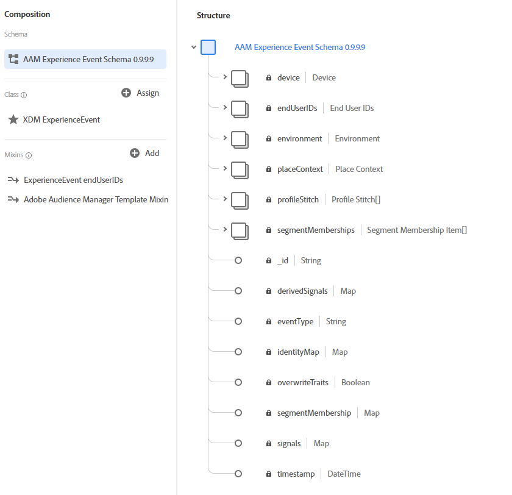
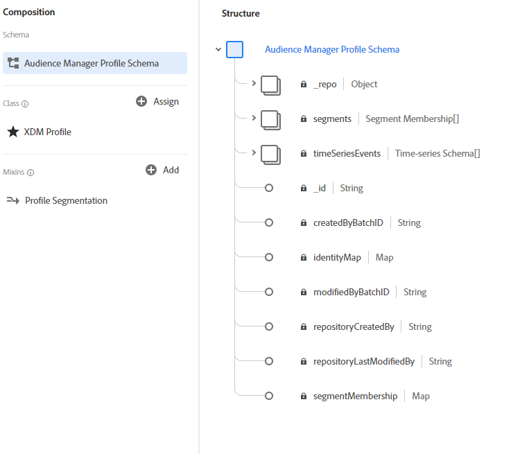

# Audience Manager source

The Adobe Audience Manager source streams first-party data collected in Adobe Audience Manager for activation in Adobe Experience Platform. The Audience Manager source ingests two types of data to Platform:

- **Real-time data:** Data captured in real time on Audience Manager's data collection server. This data is used in Audience Manager to populate rule-based traits and will surface in Platform in the shortest latency time.
- **Profile data:** Audience Manager uses real-time and onboarded data to derive customer profiles. These profiles are used to populate identity graphs and traits on segment realizations.

The Audience Manager source maps these data types to an Experience Data Model (XDM) schema and then sends them to Platform. Real-time data is sent as XDM ExperienceEvent data, while Profile data are sent as XDM Individual Profile data.

For more information, read the guide on [creating an Audience Manager source connection in the UI](../../tutorials/ui/create/adobe-applications/audience-manager.md).

## What is Experience Data Model (XDM)?

XDM is a publicly documented specification that provides a standardized framework by which Platform organizes customer experience data.

Adhering to XDM standards allows customer experience data to be uniformly incorporated, making it easier to deliver data and gather information.

For more information about how XDM is used in Experience Platform, read the [XDM System overview](../../../xdm/home.md). To learn more about how XDM schemas are structured between profiles and events are structured, read the [basics of schema composition](../../../xdm/schema/composition.md).

## XDM schemas examples

Below are examples of the Audience Manager structure mapped to XDM ExperienceEvent and XDM Individual Profile in Platform.

### ExperienceEvent - for real-time data and onboarded data

### XDM Individual Profile - for profile data

For information on how fields are mapped from Audience Manager to XDM, read the documentation on [Audience Manager mapping fields](./mapping/audience-manager.md).

## Data management on Platform

### Datasets

A dataset is a storage and management construct for a collection of data, typically a table, that contains a schema (columns) and fields (rows) and is made available by a data connection. Audience Manager data consists of real-time data, inbound data, and Profile data. To locate your Audience Manager datasets, use the search function in the UI with the provided naming conventions for each type of data.

Audience Manager datasets are disabled for Profile by default and users have the ability to enable or disable datasets based on their use cases. It is not recommended to disable datasets that will be used for segment membership in Profile.

>[!NOTE]
>
>AAM Real-time is the only dataset that goes to the data lake. All of the other Audience Manager datasets go to [!DNL Profile], if they are enabled for [!DNL Profile]. If they are not enabled for [!DNL Profile], then they don't receive any data and they will show as empty.

| Dataset Name | Description | Class |
| --- | --- | --- |
| AAM Real-time | This dataset contains data collected by direct hits on Audience Manager DCS endpoints and identity maps for Audience Manager Profiles. Keep this dataset enabled for Profile ingestion. | Experience event |
| AAM Real-time Profile Updates | This dataset enables real-time targeting of Audience Manager traits and segments. It includes information for Edge regional routing, trait, and segment membership. Keep this dataset enabled for Profile ingestion. Data is not visible as batches in the dataset. You can enable the **[!UICONTROL Profile]** toggle, to directly ingest the data to Profile. | Record |
| AAM Devices Data | Device data with ECIDs and corresponding segment realizations aggregated in Audience Manager. Data is not visible as batches in the dataset. You can enable the **[!UICONTROL Profile]** toggle, to directly ingest the data to Profile.  | Record |
| AAM Device Profile Data | Used for Audience Manager connector diagnostics. Data is not visible as batches in the dataset. You can enable the **[!UICONTROL Profile]** toggle, to directly ingest the data to Profile.  | Record |
| AAM Authenticated Profiles | This dataset contains Audience Manager authenticated profiles. Data is not visible as batches in the dataset. You can enable the **[!UICONTROL Profile]** toggle, to directly ingest the data to Profile. | Record |
| AAM Authenticated Profiles Meta Data | Used for Audience Manager Connector diagnostics. Data is not visible as batches in the dataset. You can enable the **[!UICONTROL Profile]** toggle, to directly ingest the data to Profile. | Record |
| AAM Devices Data Backfill | Dataset from bringing in past devices data. This contains ECIDs and corresponding segment realizations aggregated in Audience Manager. Data is not visible as batches in the dataset. You can enable the **[!UICONTROL Profile]** toggle to directly ingest the data to Profile. | Record |
| AAM Authenticated Profiles Backfill | Dataset from bringing in past authenticated data. This contains Audience Manager authenticated profiles. Data is not visible as batches in the dataset. You can enable the **[!UICONTROL Profile]** toggle to directly ingest the data to Profile. | Record |

### Connections

Adobe Audience Manager creates one connection in Catalog: Audience Manager Connection. Catalog is the system of the records for data location and lineage within Adobe Experience Platform. A connection is a Catalog object that is a customer-specific instance of connectors. Please read the [Catalog Service overview](../../../catalog/home.md) for more information on Catalog, connections, and connectors.

### Segment population to Profile impact

Segment population sizes have a direct impact on Profile numbers when you first send an Audience Manager segment to Platform. This means that selecting all segments can potentially cause Profile overages that exceeds your license usage entitlement. Platform also distinguishes new data from historical data for Profile ingestion. A segment with 100 first-party based identities will create 100 profiles. However, if the population of that same segment was raised to 150 and was ingested to Platform, the number of profiles will only increase by 50, as there are only 50 new profiles.

You can also check the profile usage your account has available through the [License Usage Dashboard](../../../dashboards/guides/license-usage.md).

## What is the expected latency for Audience Manager Data on Platform?

| Audience Manager Data | Type | Latency | Notes |
| --- | --- | --- | --- |
| Real-time data | Events | <25 minutes | Time from being captured at Audience Manager Edge node to appearing in data lake. |
| Real-time data | Profile updates | <10 minutes | Time to land in Real-time Customer Profile. |
| Real-time and onboarded data | Profile updates | 24 to 36 hours | Time from being captured via DCS/PCS Edge data and onboarded data, being processed to a user profile, to then appearing in Real-time Customer Profile. Currently, this data does not land in the data lake directly. Profile toggle can be enabled for Audience Manager Profile datasets to ingest this data directly into Real-time Customer Profile. |
