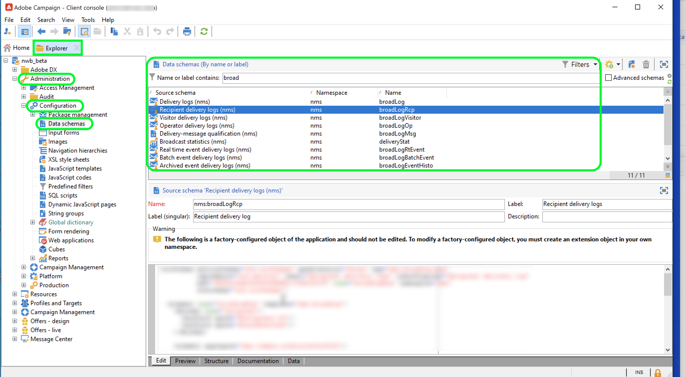
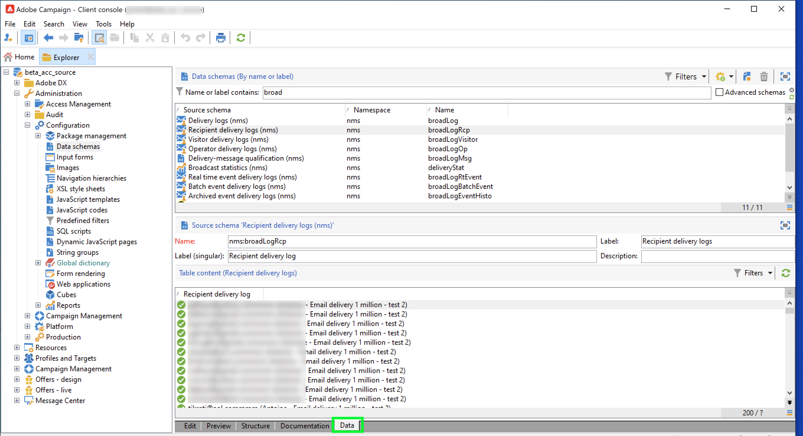
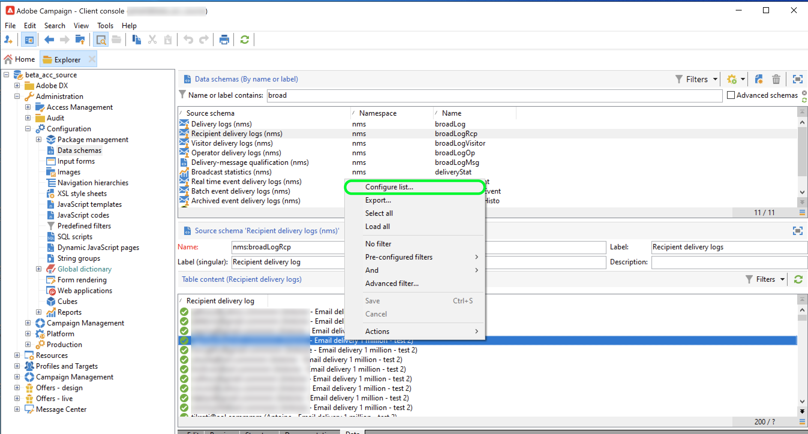
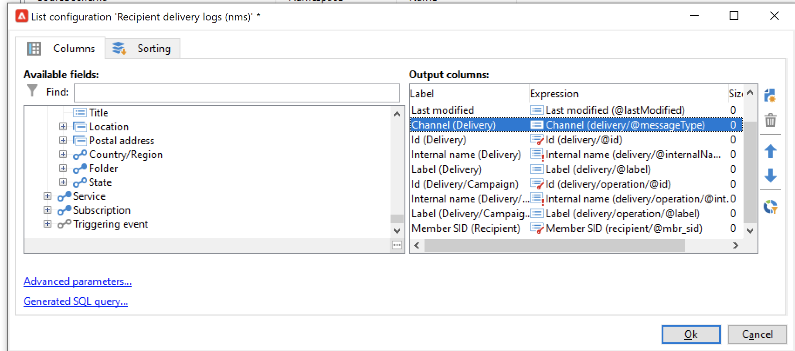
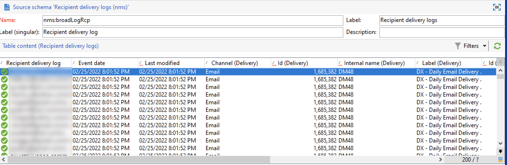

# Adobe Campaign Managed Cloud Services

Adobe Experience Platform allows data to be ingested from external sources while providing you with the ability to structure, label, and enhance incoming data using Platform services. You can ingest data from a variety of sources such as Adobe applications, cloud-based storage, databases, and many others.

Adobe Campaign Managed Cloud Services provides a Managed Services platform for designing cross-channel customer experiences and provides an environment for visual campaign orchestration, real time interaction management, and cross-channel execution. Visit the [Adobe Campaign v8 documentation](https://experienceleague.adobe.com/docs/campaign/campaign-v8/campaign-home.html?lang=en) for more information.

The Adobe Campaign Managed Cloud Services source allows you to bring Adobe Campaign v8 delivery logs and tracking logs data to Adobe Experience Platform.

## Prerequisites 

Before you can create a source connection to bring your Campaign v8 to Experience Platform, you must first complete the following prerequisites:

* [Set up your event log import using the Adobe Campaign client console](#view-delivery-and-tracking-log-data)
* [Create an XDM ExperienceEvent schema](#create-a-schema)
* [Create a dataset](#create-a-dataset)

### View delivery and tracking log data {#view-delivery-and-tracking-log-data}

>[!IMPORTANT]
>
>You must have access to the Adobe Campaign v8 Client Console in order to view your log data in Campaign. Visit the [Campaign v8 documentation](https://experienceleague.adobe.com/docs/campaign/campaign-v8/deploy/connect.html?lang=en) for information on how to download and install the client console.

Log in to your Campaign v8 instance through the Client Console. Under the [!DNL Explorer] tab, select [!DNL Administration] and then select [!DNL Configuration]. Next, select [!DNL Data schemas] and then apply the `broadLog` filter for name or label. In the list that appears, select the recipient delivery logs source schema with the name `broadLogRcp`.

Next, select the **Data** tab.

Right-click/keystroke in the data panel to open the contextual menu. From here, select **Configure list...**

The list configuration window appears, providing you with an interface where you can add any desired fields to the pre-existing list to view the data in the data panel. 

Now you can view your recipient delivery logs, including the configuration fields added in the previous step.

>[!TIP]
>
>You can repeat the same steps, but filter for `tracking` to view your tracking log data.

### Create a schema {#create-a-schema}

Next, create an XDM ExperienceEvent schema for both delivery logs and tracking logs. You must apply the Campaign Delivery Logs field group to your delivery logs schema and the Campaign Tracking Logs field group to your tracking logs schema. You must also define the `externalID` field as the primary identity of your schema.

>[!NOTE]
>
>Your XDM ExperienceEvent schema must be Profile-enabled in order to ingest your Campaign data to [!DNL Real-time Customer Profile].

For detailed instructions on how to create a schema, read the guide on [creating an XDM schema in the UI](../../../xdm/tutorials/create-schema-ui.md).

### Create a dataset {#create-a-dataset}

Finally, you must create a dataset for your schemas. For detailed instructions on how to create a dataset, read the guide on [creating a dataset in the UI](../../../catalog/datasets/user-guide.md).

## Create an Adobe Campaign Managed Cloud Services source connection using the Platform UI

Now that you have accessed your data logs in the Campaign client console, created a schema, and a dataset, you can now proceed to create a source connection to bring your Campaign Managed Services data to Platform.

For detailed instructions on how to bring your Campaign v8 delivery logs and tracking logs data to Experience Platfrom, read the guide on [creating a Campaigned Managed Services source connection in the UI](../../tutorials/ui/create/adobe-applications/campaign.md).