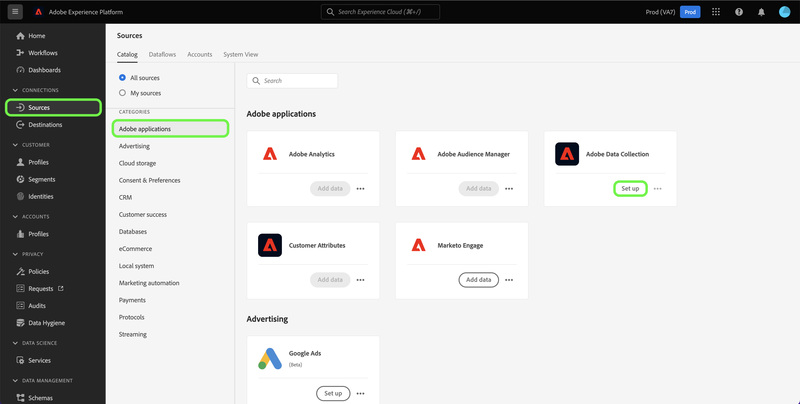
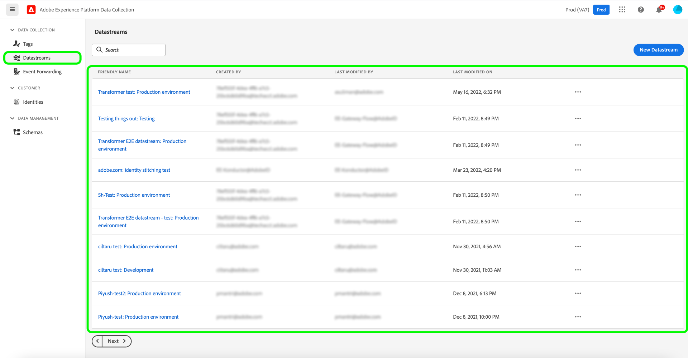

# Adobe Data Collection

Adobe Experience Platform provides a suite of technologies that allow you to collect customer experience data from client-side sources, and send it to the Adobe Experience Platform Edge Network where it can be enriched, transformed, and distributed to Adobe or non-Adobe destinations in seconds.

The sources integration of Adobe Experience Platform Data Collection allows you to access your data on the Edge Network, including Data Prep for Data Collection, as well as improved support for warnings, through the sources catalog.

## Use the sources workspace to access Data Collection

In the Platform UI, select **[!UICONTROL Sources]** from the left navigation bar to access the [!UICONTROL Sources] workspace. The [!UICONTROL Catalog] screen displays a variety of sources with which you can create an account.

You can select the appropriate category from the catalog on the left-hand side of your screen. Alternatively, you can find the specific source you wish to work with using the search option.

Under the [!UICONTROL Adobe applications] category, select **[!UICONTROL Adobe Data Collection]**, and then select **[!UICONTROL Set up]**.

The Data Collection UI appears on the **[!UICONTROL Datastreams]** tab. 

A datastream is a configuration that tells the Edge Network where you want your data to be sent. Specifically, a datastream specifies which Experience Cloud products you want to send the data to, and how you want the data to be handled and stored in each product.

For comprehensive steps on how to configure data collection in the UI, see the [data collection end-to-end overview](../../../collection/e2e.md).

## Next steps

By reading this document, you have learned how to access the Data Collection UI using the sources workspace. For more information on Data Collection, see the [Data Collection overview](../../../collection/e2e.md).
