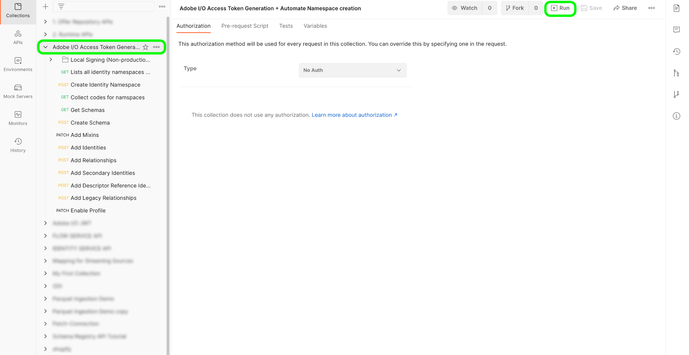

# B2B namespaces and schemas

>[!NOTE]
>
>You can use templates in the Adobe Experience Platform UI to expedite your asset creation for B2B and B2C data. For more information, read the guide on [using templates in Platform UI](../../../tutorials/ui/templates.md).

This document provides information on the underlying set up for the namespaces and schemas to be used with B2B sources. This document also provides details around setting up your Postman automation utility required for generating B2B namespaces and schemas.

>[!IMPORTANT]
>
>You must have access to [Adobe Real-Time Customer Data Platform B2B Edition](../../../../rtcdp/b2b-overview.md) in order for B2B schemas to participate in [Real-Time Customer Profile](../../../../profile/home.md).

## Set up B2B namespaces and schema auto-generation utility

The first step in using the B2B namespace and schema auto-generation utility is to set up your Platform developer console and [!DNL Postman] environment.

- You can download the namespace and schema auto-generation utility collection and environment from this [GitHub repository](https://github.com/adobe/experience-platform-postman-samples/tree/master/Postman%20Collections/CDP%20Namespaces%20and%20Schemas%20Utility).
- For information on using Platform APIs including details on how to gather values for required headers and read sample API calls, see the guide on [getting started with Platform APIs](../../../../landing/api-guide.md).
- For information on how to generate your credentials for Platform APIs, see the tutorial on [authenticating and accessing Experience Platform APIs](../../../../landing/api-authentication.md).
- For information on how to set up [!DNL Postman] for Platform APIs, see the tutorial on [setting up developer console and [!DNL Postman]](../../../../landing/postman.md).

With a Platform developer console and [!DNL Postman] set up, you can now start applying the appropriate environment values to your [!DNL Postman] environment.

The following table contains example values as well as additional information on populating your [!DNL Postman] environment:

| Variable | Description | Example |
| --- | --- | --- |
| `CLIENT_SECRET` | A unique identifier used to generate your `{ACCESS_TOKEN}`. See the tutorial on [authenticating and accessing Experience Platform APIs](../../../../landing/api-authentication.md) for information on how to retrieve your `{CLIENT_SECRET}`. | `{CLIENT_SECRET}` |
| `JWT_TOKEN` | The JSON Web Token (JWT) is an authentication credential used to generate your {ACCESS_TOKEN}. See the tutorial on [authenticating and accessing Experience Platform APIs](../../../../landing/api-authentication.md) for information on how to generate your `{JWT_TOKEN}`. | `{JWT_TOKEN}` |
| `API_KEY` | A unique identifier used to authenticate calls to Experience Platform APIs. See the tutorial on [authenticating and accessing Experience Platform APIs](../../../../landing/api-authentication.md) for information on how to retrieve your `{API_KEY}`. | `c8d9a2f5c1e03789bd22e8efdd1bdc1b` |
| `ACCESS_TOKEN` | The authorization token required to complete calls to Experience Platform APIs. See the tutorial on [authenticating and accessing Experience Platform APIs](../../../../landing/api-authentication.md) for information on how to retrieve your `{ACCESS_TOKEN}`. | `Bearer {ACCESS_TOKEN}` |
| `META_SCOPE` | With regards to [!DNL Marketo], this value is fixed and is alway set to: `ent_dataservices_sdk`. | `ent_dataservices_sdk` |
| `CONTAINER_ID` | The `global` container holds all standard Adobe and Experience Platform partner provided classes, schema field groups, data types, and schemas. With regards to [!DNL Marketo], this value is fixed and is always set to `global`. | `global` |
| `PRIVATE_KEY` | A credential used to authenticate your [!DNL Postman] instance to Experience Platform APIs. See the tutorial on setting up developer console and [setting up developer console and [!DNL Postman]](../../../../landing/postman.md) for instructions on how to retrieve your {PRIVATE_KEY}. | `{PRIVATE_KEY}` |
| `TECHNICAL_ACCOUNT_ID` | A credential used to integrate to Adobe I/O. | `D42AEVJZTTJC6LZADUBVPA15@techacct.adobe.com` |
| `IMS` | The Identity Management System (IMS) provides the framework for authentication to Adobe services. With regards to [!DNL Marketo], this value is fixed and is always set to: `ims-na1.adobelogin.com`. | `ims-na1.adobelogin.com` |
| `IMS_ORG` | A corporate entity that can own or license products and services and allow access to its members. See the tutorial on [setting up developer console and [!DNL Postman]](../../../../landing/postman.md) for instructions on how to retrieve your `{ORG_ID}` information. | `ABCEH0D9KX6A7WA7ATQE0TE@adobeOrg` |
| `SANDBOX_NAME` | The name of the virtual sandbox partition that you are using. | `prod` |
| `TENANT_ID` | An ID used to ensure that the resources you create are namespaced properly and are contained within your organization. | `b2bcdpproductiontest` |
| `PLATFORM_URL` | The URL endpoint that you are making API calls to. This value is fixed and is always set to: `http://platform.adobe.io/`. | `http://platform.adobe.io/` |

{style="table-layout:auto"}

### Running the scripts

With your [!DNL Postman] collection and environment set up, you can now run the script through the [!DNL Postman] interface.

In the [!DNL Postman] interface, select the root folder of the auto-generator utility and then select **[!DNL Run]** from the top header.

The [!DNL Runner] interface appears. From here, ensure that all the checkboxes are selected and then select **[!DNL Run Namespaces and Schemas Autogeneration Utility]**.

A successful request creates the namespaces and schemas required for B2B.

## B2B namespaces

Identity namespaces are a component of [[!DNL Identity Service]](../../../../identity-service/home.md) that serve to distinguish the context or type of an identity. A fully qualified identity includes an ID value and a namespace. See the [namespaces overview](../../../../identity-service/features/namespaces.md) for more information.

B2B namespaces are used in the primary identity of the entity.

The following table contains information on the underlying set up for B2B namespaces.

>[!NOTE]
>
>Please scroll left/right to view the full contents of the table.

| Display Name | Identity Symbol | Identity Type |
| --- | --- | --- |
| B2B Person | `b2b_person` | `CROSS_DEVICE` |
| B2B Account | `b2b_account` | `B2B_ACCOUNT` |
| B2B Opportunity | `b2b_opportunity` | `B2B_OPPORTUNITY` |
| B2B Opportunity Person Relation | `b2b_opportunity_person_relation` | `B2B_OPPORTUNITY_PERSON` |
| B2B Campaign | `b2b_campaign` | `B2B_CAMPAIGN` |
| B2B Campaign Member | `b2b_campaign_member` | `B2B_CAMPAIGN_MEMBER` |
| B2B Marketing List | `b2b_marketing_list` | `B2B_MARKETING_LIST` |
| B2B Marketing List Member | `b2b_marketing_list_member` | `B2B_MARKETING_LIST_MEMBER` |
| B2B Account Person Relation | `b2b_account_person_relation` | `B2B_ACCOUNT_PERSON` |

{style="table-layout:auto"}

## B2B schemas

Experience Platform uses schemas to describe the structure of data in a consistent and reusable way. By defining data consistently across systems, it becomes easier to retain meaning and therefore gain value from data.

Before data can be ingested into Platform, a schema must be composed to describe the data's structure and provide constraints to the type of data that can be contained within each field. Schemas consist of a base class and zero or more schema field groups.

For more information on the schema composition model, including design principles and best practices, see the [basics of schema composition](../../../../xdm/schema/composition.md).

The following table contains information on the underlying setup of B2B schemas.

>[!NOTE]
>
>Please scroll left/right to view the full contents of the table.

| Schema name | Base class | Field groups | [!DNL Profile] in Schema | Primary identity | Primary identity namespace | Secondary identity | Secondary identity namespace | Relationship | Notes |
| --- | --- | --- | --- | --- | --- | --- | --- | --- | --- |
| B2B Account | [XDM Business Account](../../../../xdm/classes/b2b/business-account.md) | XDM Business Account Details | Enabled |  `accountKey.sourceKey` in the base class | B2B Account | `extSourceSystemAudit.externalKey.sourceKey` in the base class | B2B Account | <ul><li>`accountParentKey.sourceKey` in XDM Business Account Details field group</li><li>Destination property: `/accountKey/sourceKey`</li><li>Type: one-to-one</li><li>Reference schema: B2B Account</li><li>Namespace: B2B Account</li></ul> |
| B2B Person | [XDM Individual Profile](../../../../xdm/classes/individual-profile.md) | <ul><li>XDM Business Person Details</li><li>XDM Business Person Components</li><li>IdentityMap</li><li>Consent and Preference Details</li></ul> | Enabled | `b2b.personKey.sourceKey` in the XDM Business Person Details Field Group  | B2B Person | <ol><li>`extSourceSystemAudit.externalKey.sourceKey` of XDM Business Person Details field group</li><li>`workEmail.address` of XDM Business Person Details field group</ol></li> | <ol><li>B2B Person</li><li>Email</li></ol> | <ul><li>`personComponents.sourceAccountKey.sourceKey` of XDM Business Person Components field group</li><li>Type: Many-to-one</li><li>Reference Schema: B2B Account</li><li>Namespace: B2B Account</li><li>Destination property: accountKey.sourceKey</li><li>Relationship name from current schema: Account</li><li>Relationship name from reference schema: People</li></ul> |
| B2B Opportunity | [XDM Business Opportunity](../../../../xdm/classes/b2b/business-opportunity.md) | XDM Business Opportunity Details | Enabled | `opportunityKey.sourceKey` in the base class | B2B Opportunity | `extSourceSystemAudit.externalKey.sourceKey` in the base class | B2B Opportunity | <ul><li>`accountKey.sourceKey` in the base class</li><li>Type: Many-to-one</li><li>Reference Schema: B2B Account</li><li>Namespace: B2B Account</li><li>Destination property: `accountKey.sourceKey`</li><li>Relationship name from current schema: Account</li><li>Relationship name from reference schema: Opportunities</li></ul> |
| B2B Opportunity Person Relation | [XDM Business Opportunity Person Relation](../../../../xdm/classes/b2b/business-opportunity-person-relation.md) | None | Enabled | `opportunityPersonKey.sourceKey` in the base class | B2B Opportunity Person Relation | `extSourceSystemAudit.externalKey.sourceKey` in the base class | B2B Opportunity Person Relation | **First relationship**<ul><li>`personKey.sourceKey` in the base class</li><li>Type: Many-to-one</li><li>Reference Schema: B2B Person</li><li>Namespace: B2B Person</li><li>Destination property: b2b.personKey.sourceKey</li><li>Relationship name from current schema: Person</li><li>Relationship name from reference schema: Opportunities</li></ul>**Second relationship**<ul><li>`opportunityKey.sourceKey` in the base class</li><li>Type: Many-to-one</li><li>Reference Schema: B2B Opportunity </li><li>Namespace: B2B Opportunity </li><li>Destination property: `opportunityKey.sourceKey`</li><li>Relationship name from current schema: Opportunity</li><li>Relationship name from reference schema: People</li></ul> |
| B2B Campaign | [XDM Business Campaign](../../../../xdm/classes/b2b/business-campaign.md) | XDM Business Campaign Details | Enabled | `campaignKey.sourceKey` in the base class | B2B Campaign | `extSourceSystemAudit.externalKey.sourceKey` in the base class | B2B Campaign |
| B2B Campaign Member | [XDM Business Campaign Members](../../../../xdm/classes/b2b/business-campaign-members.md) | XDM Business Campaign Member Details | Enabled | `ccampaignMemberKey.sourceKey` in the base class | B2B Campaign Member | `extSourceSystemAudit.externalKey.sourceKey` in the base class | B2B Campaign Member | **First relationship**<ul><li>`personKey.sourceKey` in the base class</li><li>Type: Many-to-one</li><li>Reference Schema: B2B Person</li><li>Namespace: B2B Person</li><li>Destination property: `b2b.personKey.sourceKey`</li><li>Relationship name from current schema: Person</li><li>Relationship name from reference schema: Campaigns</li></ul>**Second relationship**<ul><li>`campaignKey.sourceKey` in the base class</li><li>Type: Many-to-one</li><li>Reference Schema: B2B Campaign</li><li>Namespace: B2B Campaign</li><li>Destination property: `campaignKey.sourceKey`</li><li>Relationship name from current schema: Campaign</li><li>Relationship name from reference schema: People</li></ul> |
| B2B Marketing List | [XDM Business Marketing List](../../../../xdm/classes/b2b/business-marketing-list.md) | None | Enabled | `marketingListKey.sourceKey` in the base class | B2B Marketing List | None | None | None | Static List is not synced from [!DNL Salesforce] and therefore does not have a secondary identity. |
| B2B Marketing List Member | [XDM Business Marketing List Members](../../../../xdm/classes/b2b/business-marketing-list-members.md) | None | Enabled | `marketingListMemberKey.sourceKey` in the base class | B2B Marketing List Member | None | None | **First relationship**<ul><li>`PersonKey.sourceKey` in the base class</li><li>Type: Many-to-one</li><li>Reference Schema: B2B Person</li><li>Namespace: B2B Person</li><li>Destination property: `b2b.personKey.sourceKey`</li><li>Relationship name from current schema: Person</li><li>Relationship name from reference schema: Marketing Lists</li></ul>**Second relationship**<ul><li>`marketingListKey.sourceKey` in the base class</li><li>Type: Many-to-one</li><li>Reference Schema: B2B Marketing List</li><li>Namespace: B2B Marketing List</li><li>Destination property: `marketingListKey.sourceKey`</li><li>Relationship name from current schema: Marketing List</li><li>Relationship name from reference schema: People</li></ul> | Static list member is not synced from [!DNL Salesforce] and therefore does not have a secondary identity. |
| B2B Activity | [XDM ExperienceEvent](../../../../xdm/classes/experienceevent.md) | <ul><li>Visit WebPage</li><li>New Lead</li><li>Convert Lead</li><li>Add To List</li><li>Remove From List</li><li>Add To Opportunity</li><li>Remove From Opportunity</li><li>Form Filled Out</li><li>Link Clicks</li><li>Email Delivered</li><li>Email Opened</li><li>Email Clicked</li><li>Email Bounced</li><li>Email Bounced Soft</li><li>Email Unsubscribed</li><li>Score Changed</li><li>Opportunity Updated</li><li>Status in Campaign Progression Changed</li><li>Person Identifier</li><li>Marketo Web URL</li><li>Interesting Moment</li><li>Call Webhook</li><li>Change Campaign Cadence</li><li>Revenue Stage Changed</li><li>Merge Leads</li><li>Email Sent</li><li>Change Campaign Stream</li><li>Add to Campaign</li></ul> | Enabled | `personKey.sourceKey` of Person Identifier field group | B2B Person | None | None | **First relationship**<ul><li>`listOperations.listKey.sourceKey` field</li><li>Type: one-to-one</li><li>Reference Schema: B2B Marketing List</li><li>Namespace: B2B Marketing List</li></ul>**Second relationship**<ul><li>`opportunityEvent.opportunityKey.sourceKey` field</li><li>Type: one-to-one</li><li>Reference Schema: B2B Opportunity</li><li>Namespace: B2B Opportunity</li></ul>**Third relationship**<ul><li>`leadOperation.campaignProgression.campaignKey.sourceKey` field</li><li>Type: one-to-one</li><li>Reference Schema: B2B Campaign</li><li>Namespace: B2B Campaign</li></ul> | `ExperienceEvent` is different from entities. The identity of experience event is the person who did the activity. |
| B2B Account Person Relation | [XDM Business Account Person Relation](../../../../xdm/classes/b2b/business-account-person-relation.md) | Identity Map | Enabled | `accountPersonKey.sourceKey` in the base class | B2B Account Person Relation | None | None | **First relationship**<ul><li>`personKey.sourceKey` in the base class</li><li>Type: Many-to-one</li><li>Reference Schema: B2B Person</li><li>Namespace: B2B Person</li><li>Destination property: `b2b.personKey.SourceKey`</li><li>Relationship name from current schema: People</li><li>Relationship name from reference schema: Account</li></ul>**Second relationship**<ul><li>`accountKey.sourceKey` in the base class</li><li>Type: Many-to-one</li><li>Reference Schema: B2B Account</li><li>Namespace: B2B Account</li><li>Destination property: `accountKey.sourceKey`</li><li>Relationship name from current schema: Account</li><li>Relationship name from reference schema: People</li></ul> |

{style="table-layout:auto"}

## Next steps

To learn how to connect your [!DNL Marketo] data to Platform, see the tutorial on [creating a Marketo source connector in the UI](../../../tutorials/ui/create/adobe-applications/marketo.md).
