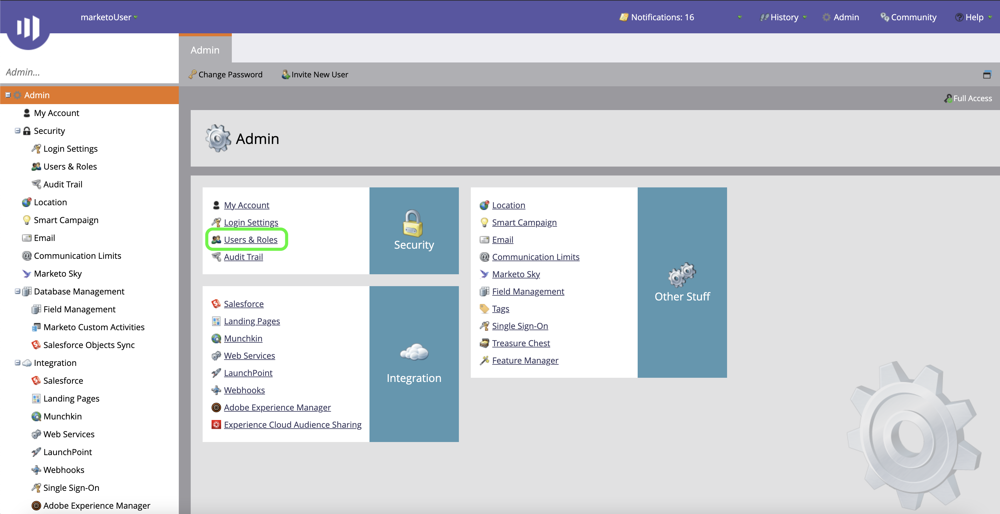

# Authenticate your Marketo source connector

Before you can create a Marketo Engage (hereinafter referred to as "Marketo") source connector, you must first set up a custom service through the Marketo interface, as well as retrieve values for your Munchkin ID, client ID, and client secret.

The documentation below provides steps on how to acquire authentication credentials in order to create a Marketo source connector.

## Set up a new user

The first step in acquiring your authentication credentials is to set up a new user through the [Marketo](https://app-sjint.marketo.com/#MM0A1) interface.

Log in to Marketo and select **Admin** from the top navigation bar.

You can access several features of your Marketo instance from the admin page. To set up a new user, select **Users & Roles** from the *Security* panel.

The *Users* page provides a list of active users currently provisioned in Marketo. Select **Invite New User** to provision a new user.

A popover dialog menu appears. Provide the appropriate information for your email, first name, last name, and reason. During this step, you can also establish an expiry date for the access of the new user account you are inviting. When finished, select **Next**.

>[!IMPORTANT]
>
>When setting up a new user, you must assign access to a user that is dedicated strictly to the custom service you are creating.

Select the appropriate fields in the *Permissions* step and then select the **API Only** checkbox to provide an API role to the new user. Select **Next** to proceed.

To complete the process, select **Send**.

## Set up a custom service

Once you have established a new user, you can set up a custom service to retrieve your new credentials. From the admin page, select **LaunchPoint**.

The *Installed services* page contains a list of existing services, to create a new custom service, select **New** and then select **New Service**.

Provide your new service with a descriptive display name and then select **Custom** from the *Service* dropdown menu. Provide an appropriate description and then select the user you want to provision from the **API Only User** dropdown menu. Once you have filled in the necessary details, select **Create** to create your new custom service.

## Get your client ID and client secret

With a new custom service created, you can now retrieve values for your client ID and client secret. From the *Installed Services* menu, locate the custom service you want to access and then select **View Details**.

A dialog box appears, containing your client ID and client secret.

## Get your Munchkin ID

The final step you must complete in order to authenticate your Marketo source connector is to retrieve your Munchkin ID. From the admin page, select **Munchkin** under the *Integration* panel.

The *Munchkin* page appears, with your unique Munchkin ID listed at the top of the panel.

Combined with your client ID and client secret, you can use your Munchkin ID to configure a new account and [create a new Marketo source connection](../../tutorials/ui/create/adobe-applications/marketo.md) on Experience Platform.