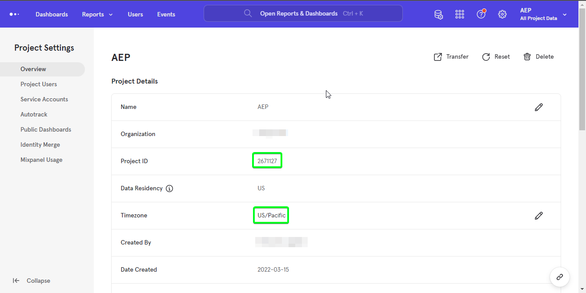
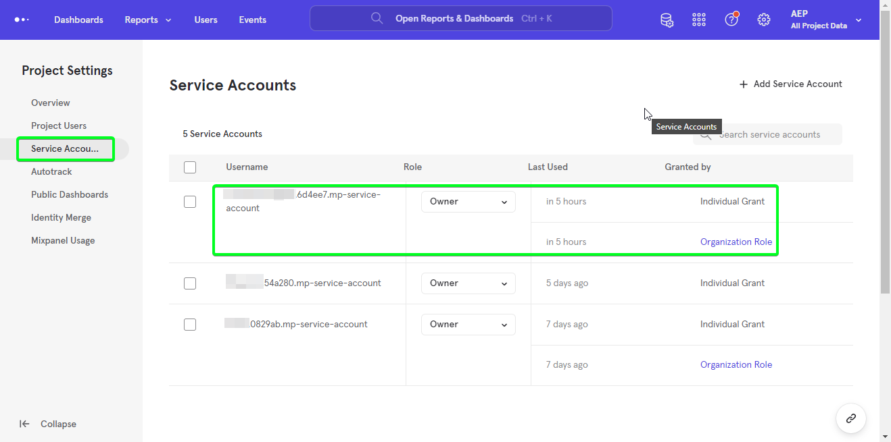
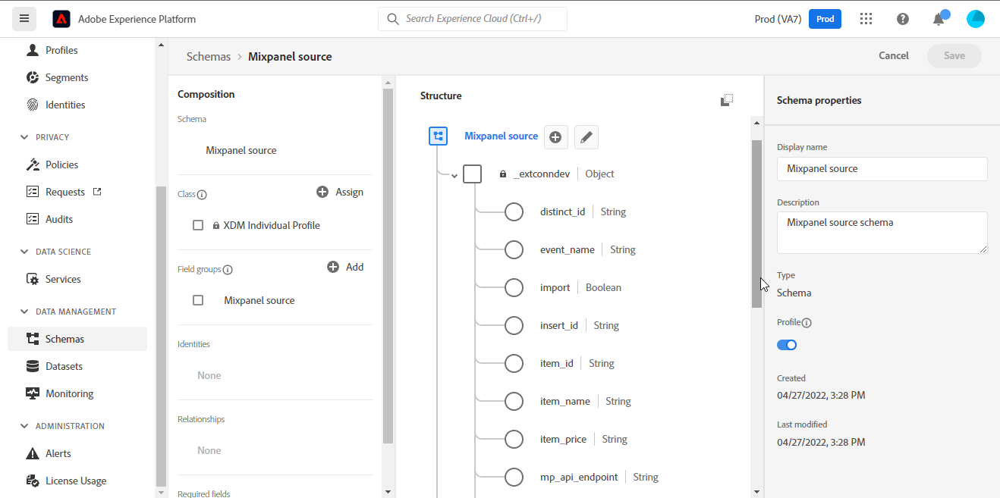

# (Beta) [!DNL Mixpanel]

>[!NOTE]
>
>The [!DNL Mixpanel] source is in beta. See the [sources overview](../../home.md#terms-and-conditions) for more information on using beta-labeled sources.

Adobe Experience Platform allows data to be ingested from external sources while providing you with the ability to structure, label, and enhance incoming data using Platform services. You can ingest data from a variety of sources such as Adobe applications, cloud-based storage, databases, and many others.

Experience Platform provides support for ingesting data from a third-party analytics application. Support for analytics providers include [!DNL Mixpanel].

[[!DNL Mixpanel]](https://www.mixpanel.com) is a product analytics tool that enables you to capture data on how users interact with a digital product. Mixpanel allows you to analyze this product data with simple, interactive reports that let you query and visualize the data with just a few clicks.

Sources leverages the [Mixpanel Event Export API > Download](https://developer.mixpanel.com/reference/raw-event-export) to download your event data as it is received and stored within [!DNL Mixpanel], along with all event properties (including `distinct_id`) and the exact timestamp the event was sent into Experience Platform. Mixpanel uses bearer tokens as an authentication mechanism to communicate with the Mixpanel Event Export API.

## IP address allow list

A list of IP addresses must be added to an allow list prior to working with source connectors. Failing to add your region-specific IP addresses to your allow list may lead to errors or non-performance when using sources. See the [IP address allow list](../../ip-address-allow-list.md) page for more information.

## Authenticate your [!DNL Mixpanel] account

This section outlines prerequisite steps to complete in order to authenticate your account and bring your [!DNL Mixpanel] data to Platform.

In order to create a [!DNL Mixpanel] source connection and dataflow, you must first have a valid [!DNL Mixpanel] account. If you do not have a valid [!DNL Mixpanel] account, see the [Mixpanel register](https://mixpanel.com/register/) page to create your account.

Once you have successfully created a [!DNL Mixpanel] account, navigate to the [!DNL Project Details] tab in the [!DNL Project Seettings] page of the [!DNL Mixpanel] UI to retrieve your project ID and configure your timezone.

Next, navigate to the [!DNL Service Accounts] tab in the [!DNL Project Settings] page in the [!DNL Mixpanel] UI to retrieve your service account credentials.

>[!TIP]
>
>For best practice, select a service account that [does not expire](https://developer.mixpanel.com/reference/service-accounts#service-account-expiration).

Finally, create a Platform [schema](../../../xdm/schema/composition.md) required for the [!DNL Mixpanel Event Export API]. For more information on the mappings required for your schema, see the guide on [creating a [!DNL Mixpanel] source connection in the UI](../../tutorials/ui/create/analytics/mixpanel.md#additional-resources).

## Connect [!DNL Mixpanel] to Platform using APIs

The documentation below provides information on how to connect [!DNL Mixpanel] to Platform using APIs or the user interface:

* [Create a source connection and a dataflow for [!DNL Mixpanel] using the Flow Service API](../../tutorials/api/create/analytics/mixpanel.md)

## Connect [!DNL Mixpanel] to Platform using the UI

* [Create a [!DNL Mixpanel] source connection in the UI](../../tutorials/ui/create/analytics/mixpanel.md)
* [Create a dataflow for a customer success source connection in the UI](../../tutorials/ui/dataflow/analytics.md)
