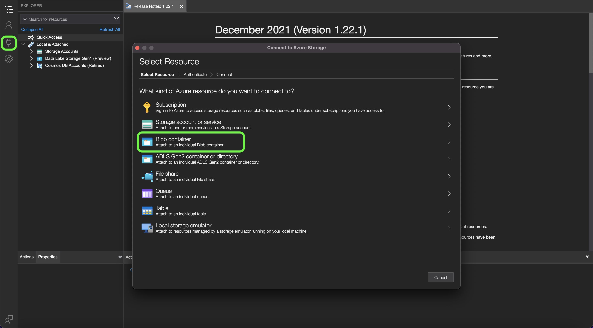
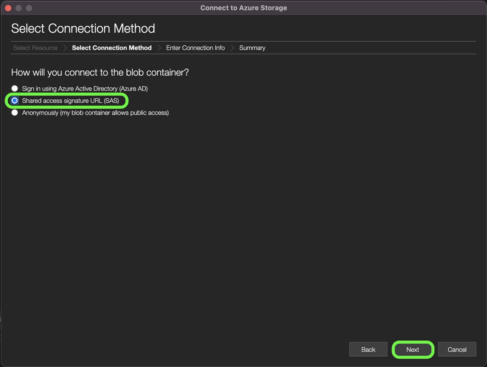
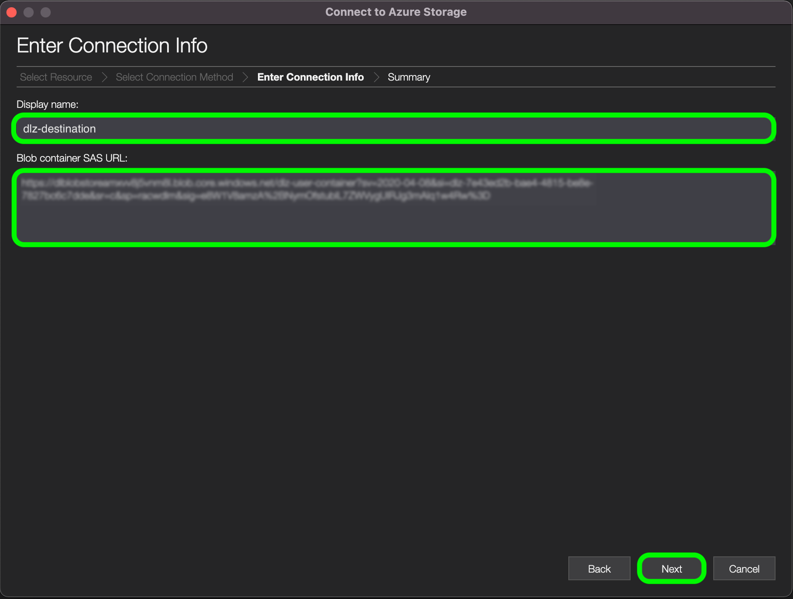
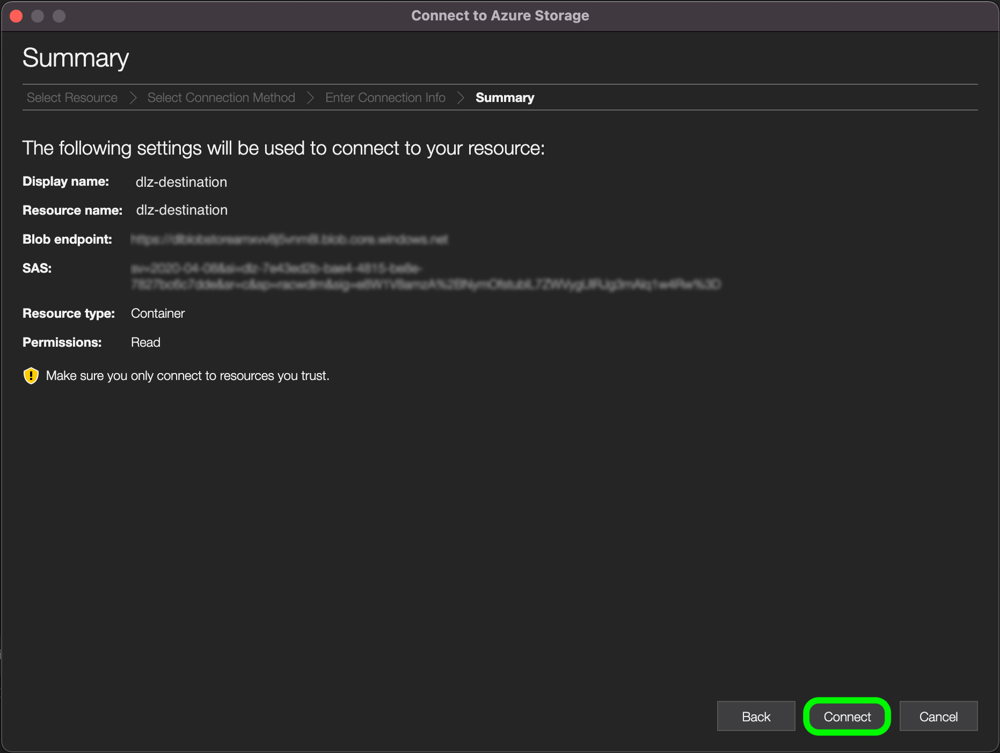
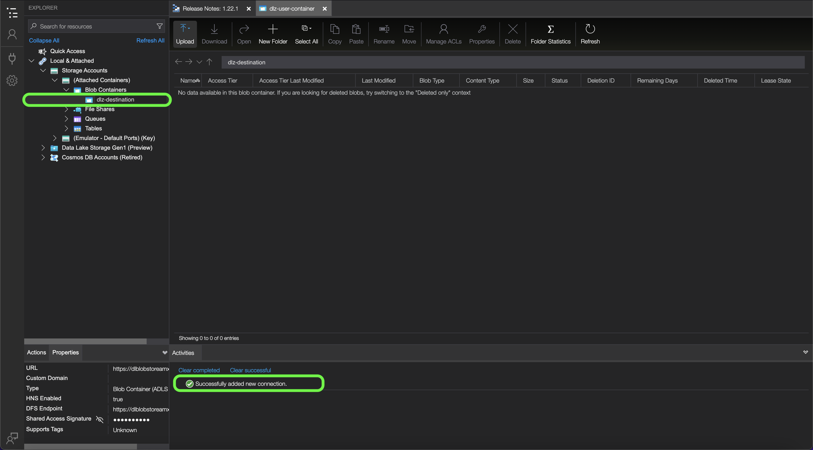
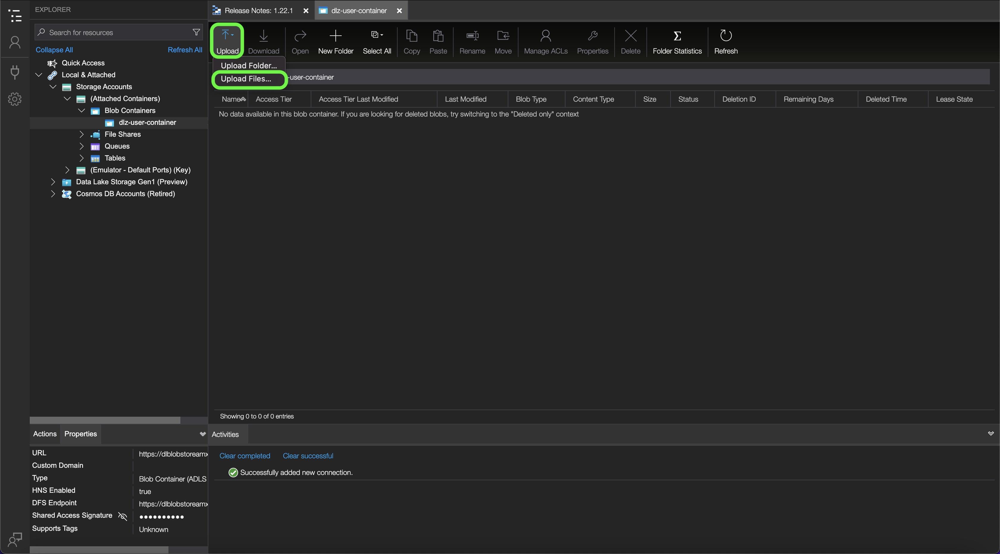
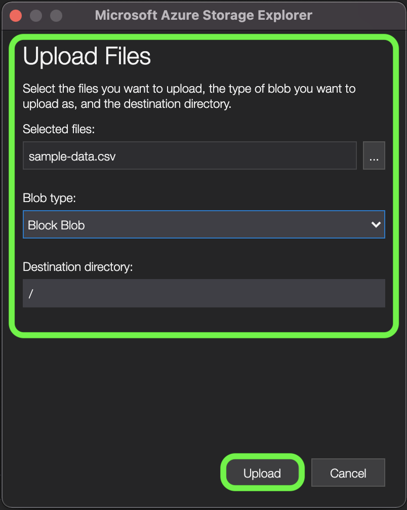

# [!DNL Data Landing Zone]

[!DNL Data Landing Zone] is an [!DNL Azure Blob] storage interface provisioned by Adobe Experience Platform, granting you to access a secure, cloud-based file storage facility to bring files into Platform. You have access to one [!DNL Data Landing Zone] container per sandbox, and the total data volume across all containers is limited to the total data provided with your Platform Products and Services license. All customers of Platform and its application services such as [!DNL Customer Journey Analytics], [!DNL Journey Orchestration], [!DNL Intelligent Services], and [!DNL Real-time Customer Data Platform] are provisioned with one [!DNL Data Landing Zone] container per sandbox. You can read and write file(s) to your container through [!DNL Azure Storage Explorer] or your command-line interface.

[!DNL Data Landing Zone] supports SAS-based authentication and its data is protected with standard [!DNL Azure Blob] storage security mechanisms at rest and in transit. SAS-based authentication allows you to securely access your [!DNL Data Landing Zone] container through a public internet connection. There are no network changes required for you to access your [!DNL Data Landing Zone] container, which means you do not need to configure any allow lists or cross-region setups for your network. Platform enforces a strict seven-day time-to-live (TTL) on all files uploaded to a [!DNL Data Landing Zone] container. All files are deleted after seven days.

## Naming constraints for files and directories

The following is a list of constraints that you must account for when naming your cloud storage files or directories.

- Directory and file component names cannot exceed 255 characters.
- Directory and file names cannot end with a forward slash (`/`). If provided, it will be automatically removed.
- The following reserved URL characters must be properly escaped: `! ' ( ) ; @ & = + $ , % # [ ]`
- The following characters are not allowed: `" \ / : | < > * ?`.
- Illegal URL path characters not allowed. Code points like `\uE000`, while valid in NTFS filenames, are not valid Unicode characters. In addition, some ASCII or Unicode characters, like control characters (such as `0x00` to `0x1F`, `\u0081`, and so on), are also not allowed. For rules governing Unicode strings in HTTP/1.1 see [RFC 2616, Section 2.2: Basic Rules](https://www.ietf.org/rfc/rfc2616.txt) and [RFC 3987](https://www.ietf.org/rfc/rfc3987.txt).
- The following file names are not allowed: LPT1, LPT2, LPT3, LPT4, LPT5, LPT6, LPT7, LPT8, LPT9, COM1, COM2, COM3, COM4, COM5, COM6, COM7, COM8, COM9, PRN, AUX, NUL, CON, CLOCK$, dot character (.), and two dot characters (..).

## Manage the contents of your [!DNL Data Landing Zone]

You can use [[!DNL Azure Storage Explorer]](https://azure.microsoft.com/en-us/features/storage-explorer/) to manage the contents of your [!DNL Data Landing Zone] container. 

In the [!DNL Azure Storage Explorer] UI, select the connection icon in the left-navigation. The **Select Resource** window appears, providing you with options to connect to. Select **[!DNL Blob container]** to connect to [!DNL Data Landing Zone].

Next, select **Shared access signature URL (SAS)** as your connection method, and then select **Next**.

After selecting your connection method, you must next provide a **display name** and the **[!DNL Blob] container SAS URL** that corresponds with your [!DNL Data Landing Zone] container.

>[!TIP]
>
>You can retrieve your [!DNL Data Landing Zone] credentials from the sources catalog in the Platform UI.

Provide your [!DNL Data Landing Zone] SAS URL and then select **Next**

The **Summary** window appears, providing you with an overview of your settings, including information on your [!DNL Blob] endpoint and permissions. When ready, select **Connect**.

A successful connection updates your [!DNL Azure Storage Explorer] UI with your [!DNL Data Landing Zone] container.

With your [!DNL Data Landing Zone] container connected to [!DNL Azure Storage Explorer], you can now start uploading files to your [!DNL Data Landing Zone] container. To upload, select **Upload** and then select **Upload Files**.

Once you have selected the file you want to upload, you must then identify the [!DNL Blob] type that you want to upload it as and your desired destination directory. When finished, select **Upload**.

| [!DNL Blob] types | Description |
| --- | --- |
| Block [!DNL Blob] |
| Append [!DNL Blob] |

## Connect [!DNL Data Landing Zone] to [!DNL Platform]

The documentation below provides information on how to bring data from your [!DNL Data Landing Zone] container to Adobe Experience Platform using APIs or the user interface.

### Using APIs

- [Create a [!DNL Data Landing Zone] source connection using the Flow Service API](../../tutorials/api/create/cloud-storage/data-landing-zone.md)
- [Create a dataflow for a cloud storage source using the Flow Service API](../../tutorials/api/collect/cloud-storage.md)

### Using the UI

- [Connect [!DNL Data Landing Zone] to Platform using the UI](../../tutorials/ui/create/cloud-storage/data-landing-zone.md)
- [Create a dataflow for a cloud storage connection in the UI](../../tutorials/ui/dataflow/batch/cloud-storage.md)
