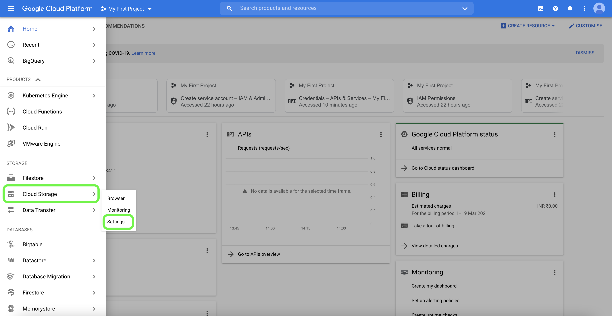
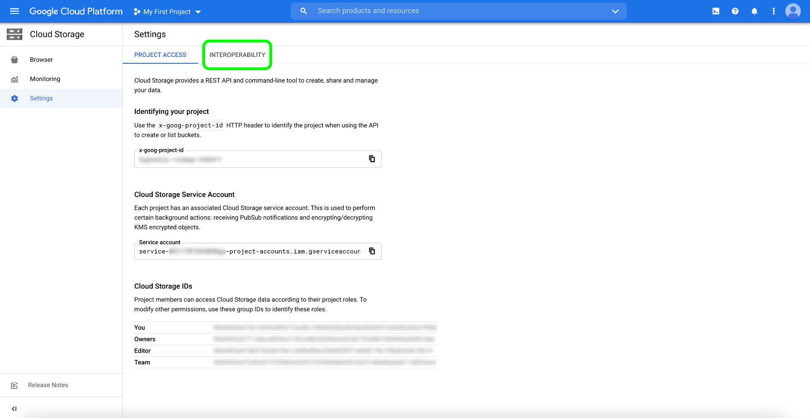
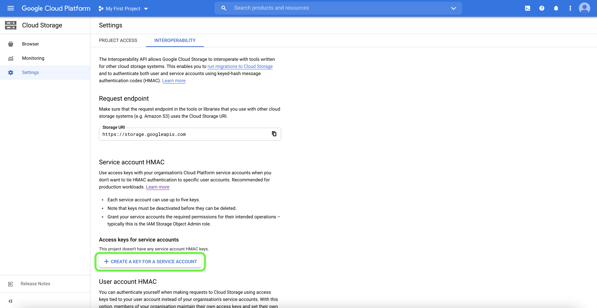

# Google Cloud Storage connector

Adobe Experience Platform provides native connectivity for cloud providers like AWS, [!DNL Google Cloud Platform], and [!DNL Azure], allowing you to bring your data from these systems.

Cloud storage sources can bring your own data into Platform without the need to download, format, or upload. Ingested data can be formatted as JSON or Parquet that is compliant with Experience Data Model (XDM), or in a delimited format. Every step of the process is integrated into the sources workflow. Platform allows you to bring in data from [!DNL Google Cloud Storage] through batches.

## IP address allow list

A list of IP addresses must be added to an allow list prior to working with source connectors. Failing to add your region-specific IP addresses to your allow list may lead to errors or non-performance when using sources. See the [IP address allow list](../../ip-address-allow-list.md) page for more information.

## Prerequisite setup for connecting your [!DNL Google Cloud Storage] account

In order to connect to Platform, you must first enable interoperability for your [!DNL Google Cloud Storage] account. To access the interoperability setting, open [!DNL Google Cloud Platform] and select **[!UICONTROL Settings]** from the **[!UICONTROL Cloud Storage]** option in the navigation panel.

The **[!UICONTROL Settings]** page appears. From here, you can see information regarding your [!DNL Google] project ID and details about your [!DNL Google Cloud Storage] account. To access interoperability settings, select **[!UICONTROL Interoperability]** from the top header.

The **[!UICONTROL Interoperability]** page contains information on authentication, access keys, and the default project associated with your service account. To generate a new access key ID and a secret access key for your service account, select **[!UICONTROL Create a Key for a Service Account]**.

You can use your newly generated access key ID and secret access key to connect your [!DNL Google Cloud Storage] account to Platform.

## Naming constraints for files and directories

The following is a list of constraints you must account for when naming your cloud storage file or directory.

- Directory and file component names cannot exceed 255 characters.
- Directory and file names cannot end with a forward slash (`/`). If provided, it will be automatically removed.
- The following reserved URL characters must be properly escaped: `! ' ( ) ; @ & = + $ , % # [ ]`
- The following characters are not allowed: `" \ / : | < > * ?`.
- Illegal URL path characters not allowed. Code points like `\uE000`, while valid in NTFS filenames, are not valid Unicode characters. In addition, some ASCII or Unicode characters, like control characters (0x00 to 0x1F, \u0081, etc.), are also not allowed. For rules governing Unicode strings in HTTP/1.1 see [RFC 2616, Section 2.2: Basic Rules](https://www.ietf.org/rfc/rfc2616.txt) and [RFC 3987](https://www.ietf.org/rfc/rfc3987.txt).
- The following file names are not allowed: LPT1, LPT2, LPT3, LPT4, LPT5, LPT6, LPT7, LPT8, LPT9, COM1, COM2, COM3, COM4, COM5, COM6, COM7, COM8, COM9, PRN, AUX, NUL, CON, CLOCK$, dot character (.), and two dot characters (..).

## Connect [!DNL Google Cloud Storage] to Platform

The documentation below provides information on how to connect [!DNL Google Cloud Storage] to Platform using APIs or the user interface:

### Using APIs

- [Create a Google Cloud Storage base connection using the Flow Service API](../../tutorials/api/create/cloud-storage/google.md)
- [Explore the data structure and contents of a cloud storage source using the Flow Service API](../../tutorials/api/explore/cloud-storage.md)
- [Create a dataflow for a cloud storage source using the Flow Service API](../../tutorials/api/collect/cloud-storage.md)

### Using the UI

- [Create a Google Cloud Storage source connection in the UI](../../tutorials/ui/create/cloud-storage/google-cloud-storage.md)
- [Create a dataflow for a cloud storage connection in the UI](../../tutorials/ui/dataflow/batch/cloud-storage.md)
