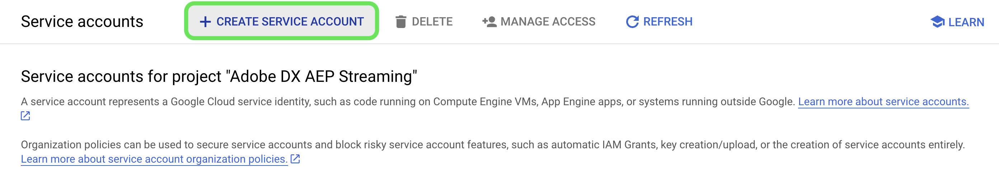
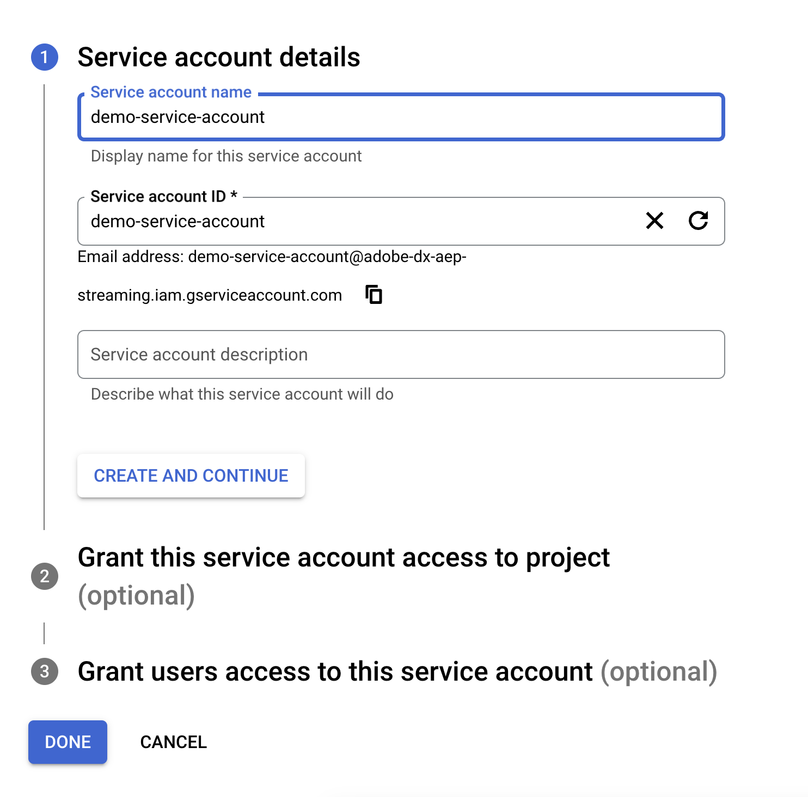
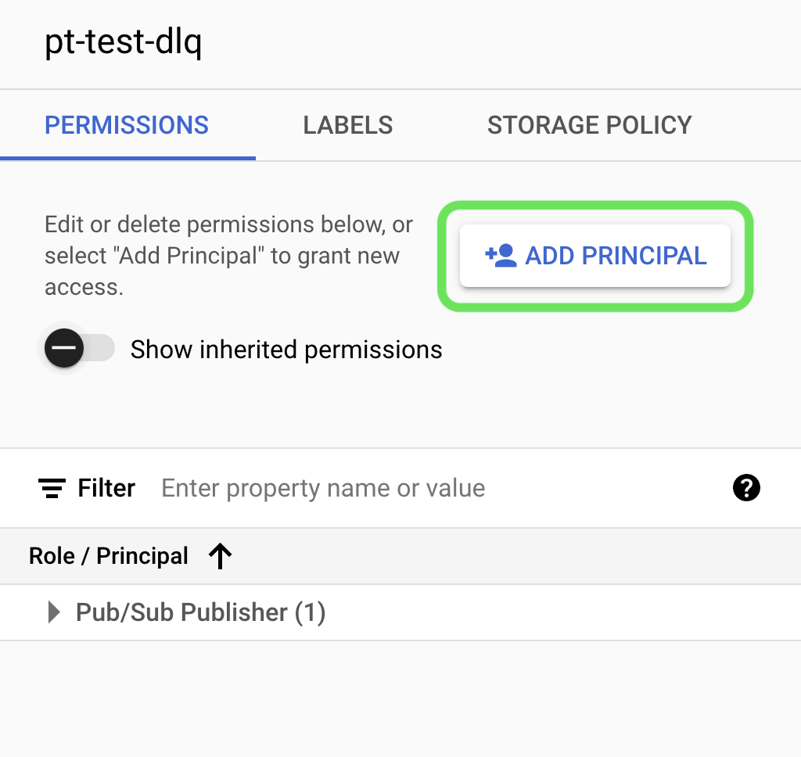
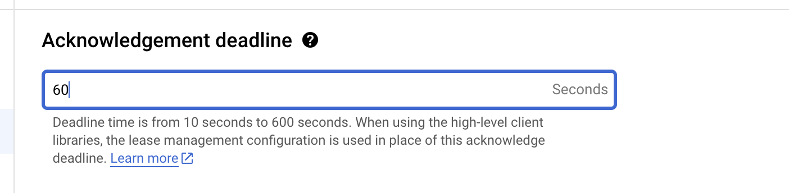
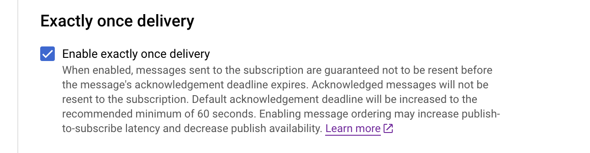
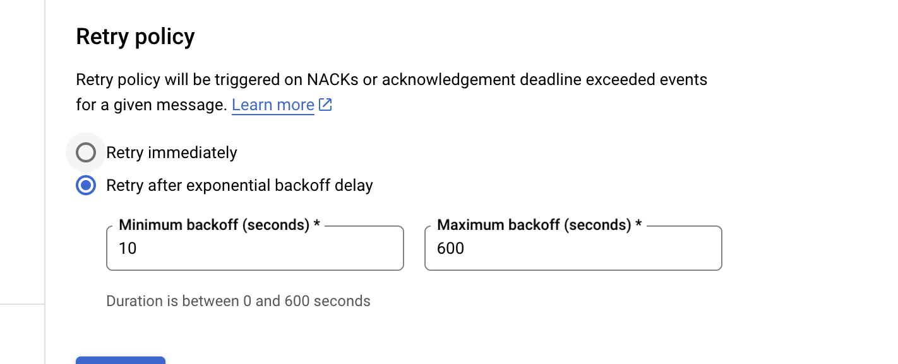

# [!DNL Google PubSub] source

>[!IMPORTANT]
>
>The [!DNL Google PubSub] source is available in the sources catalog to users who have purchased Real-Time CDP Ultimate.

Adobe Experience Platform provides native connectivity for cloud providers like [!DNL AWS], [!DNL Google Cloud Platform], and [!DNL Azure], allowing you to bring data from these systems into Platform for use in downstream services and destinations.

Cloud storage sources can bring your data into Platform without the need to download, format, or upload. Ingested data can be formatted as XDM JSON, XDM Parquet, or delimited. Every step of the process is integrated into the sources workflow. Platform allows you to bring in data from [!DNL Google PubSub] in real time.

## Prerequisites {#prerequisites}

This section outlines prerequisite set up that you must complete before connecting your [!DNL Google PubSub] account to Experience Platform.

### Create service account {#create-service-account}

A **service account** is a type of account often used by an application or compute workload, rather than a person. A service account is identified by its email address, which is unique to the account.

* On one hand, service accounts are **principals** - you can grant service accounts access to [!DNL Google Cloud] resources. For example, you could grant a service account the Compute Admin role `(roles/compute.admin)` on a given project. This then allows  the service account to be able to manage Compute Engine resources in that particular project.
* On the other hand, service accounts are also resources - you can give other principals permission to access the service account. For example, you could grant a user the Service Account User role `(roles/iam.serviceAccountUser)` on a service account to let the user attach that service account to resources. Alternatively, you can grant a user the Service Account Admin role `(roles/iam.serviceAccountAdmin)` to let the user complete tasks such as view, edit, disable, and delete the service account.

For more information on determining the right authentication type for your use case, read the [[!DNL Google] guide on authentication methods](https://cloud.google.com/docs/authentication).

Follow the steps outlined below to create a service account:

First, navigate to the [!DNL IAM] page of the [!DNL Google Developer Console] and then select **[!DNL Create Service Account]**.

Next, enter a a display name and an ID for your service account, and then select **[!DNL Create and Continue]**.

### Generate service account keys {#generate-service-account-keys}

To generate keys for your service account, select the keys header in the service accounts page. From there, select **[!DNL Add key]** and then select **[!DNL Create new key]** from the dropdown menu. You can also use this panel to upload an existing key. 

When successful, you will receive a message indicating that the private key has been saved your computer and that a file will be downloaded. You can then use the content of this file as credentials, when creating your [!DNL Google PubSub] account on Experience Platform.

### Grant permissions at topic and subscription level {#grant-permissions}

To grant permissions at the topic and subscription level, navigate to the topic console page and then select **[!DNL Show info panel]**. Next, under the [!DNL Permissions] tab, select [!DNL Add Principal] and then add the service account principal along with the permissions.

## Configurations for optimal [!DNL Google PubSub usage] {#optimal-configurations}

This section outlines configurations you are recommended to make to optimize your usage of the [!DNL Google PubSub] source on Experience Platform.

### Subscription properties {#subscription-properties}

Use the [!DNL Google Developer Console] to **increase your acknowledgement deadline**. This allows the [!DNL Google Publisher] to wait according to the time that you configure before sending the message again. This delay helps in the reduction of unnecessary load at the subscriber level.

Enable **[!DNL exactly one delivery]**. This configuration informs the [!DNL Google Publisher] to guarantee that messages sent to the subscription do not get resent before the acknowledgement deadline expires. You can use this setting to ensure that acknowledgement messages do not get resent to the subscription.

You can enable **[!DNL Retry after exponential backoff delay]** to reduce the risk of further overwhelming the server. You can enable this configuration in the [!DNL Google Developer Console] to better mitigate transient failures (temporary errors that typically resolve themselves), by providing the system with more time to recover before attempting another connection.

You must **set your subscription message retention duration to be 24 hours or more** to ensure that unacknowledged data does not get lost during peak loads. Additionally, **enable a dead letter topic** to ensure that data loss does not happen even during rare edge cases.

>[!IMPORTANT]
>
>You can only create one source dataflow per [!DNL Google PubSub] subscription. Reusing a subscription, even across sandboxes, leads to loss of data.

## Connect [!DNL Google PubSub] to Experience Platform

The documentation below provides information on how to connect [!DNL Google PubSub] to Platform using APIs or the user interface:

### Using APIs

* [Create a Google PubSub source connection using the Flow Service API](../../tutorials/api/create/cloud-storage/google-pubsub.md)
* [Collect streaming data using the Flow Service API](../../tutorials/api/collect/streaming.md)

### Using the UI

* [Create a Google PubSub source connection in the UI](../../tutorials/ui/create/cloud-storage/google-pubsub.md)
* [Configure a dataflow for a cloud storage connection in the UI](../../tutorials/ui/dataflow/streaming/cloud-storage-streaming.md)
