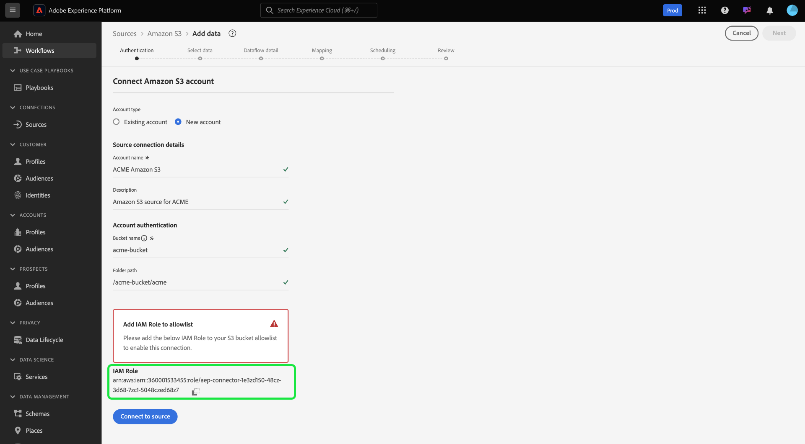

# [!DNL Amazon S3] source

>[!IMPORTANT]
>
>You can now use the [!DNL Amazon S3] source when running Adobe Experience Platform on Amazon Web Services (AWS). Experience Platform running on AWS is currently available to a limited number of customers. To learn more about the supported Experience Platform infrastructure, see the [Experience Platform multi-cloud overview](../../../landing/multi-cloud.md).

Adobe Experience Platform provides native connectivity for cloud providers like AWS, [!DNL Google Cloud Platform], and [!DNL Azure]. You can bring your data from these systems into Experience Platform.

Cloud storage sources can bring your own data into Experience Platform without the need to download, format, or upload. Ingested data can be formatted as XDM JSON, XDM Parquet, or delimited. Every step of the process is integrated into the Sources workflow. Experience Platform allows you to bring in data from S3 through batches.

## Set up your [!DNL Amazon S3] source for Experience Platform on Azure {#azure}

Follow the steps below to learn how you can set up your [!DNL Amazon S3] account for Experience Platform on Azure.

### IP address allowlist for connection on Azure

You must add region-specific IP addresses to your allowlist prior to connecting your sources to Experience Platform on Azure. For more information, read the guide on [allowlisting IP addresses to connect to Experience Platform on Azure](../../ip-address-allow-list.md) for more information.

### Naming constraints for files and directories

The following is a list of constraints you must account for when naming your cloud storage file or directory.

- Directory and file component names cannot exceed 255 characters.
- Directory and file names cannot end with a forward slash (`/`). If provided, it will be automatically removed.
- The following reserved URL characters must be properly escaped: `! ' ( ) ; @ & = + $ , % # [ ]`
- The following characters are not allowed: `" \ / : | < > * ?`.
- Illegal URL path characters not allowed. Code points like `\uE000`, while valid in NTFS filenames, are not valid Unicode characters. In addition, some ASCII or Unicode characters, like control characters (0x00 to 0x1F, \u0081, etc.), are also not allowed. For rules governing Unicode strings in HTTP/1.1 see [RFC 2616, Section 2.2: Basic Rules](https://www.ietf.org/rfc/rfc2616.txt) and [RFC 3987](https://www.ietf.org/rfc/rfc3987.txt).
- The following file names are not allowed: LPT1, LPT2, LPT3, LPT4, LPT5, LPT6, LPT7, LPT8, LPT9, COM1, COM2, COM3, COM4, COM5, COM6, COM7, COM8, COM9, PRN, AUX, NUL, CON, CLOCK$, dot character (.), and two dot characters (..).

### Configure permissions on [!DNL Amazon S3]

To ingest a single directory with S3, you must create an [!DNL Identity and Access Management] (IAM) user for Platform in the S3 console and assign permissions for the following actions:

- `s3:GetObject`
- `s3:GetObjectVersion`

The following permissions are also required for exploring and testing connectivity:

- `s3:ListAllMyBuckets`
- `s3:ListBucket`
- `s3:GetBucketLocation`

A file path like `myBucket/folder/subfolder/subsubfolder/abc.csv` may lead you to only access `subsubfolder/abc.csv`. If you want to access the subfolder, you can specify the `bucket` parameter in your S3 console as `myBucket` and the `folderPath` as `folder/subfolder` to ensure that file exploration starts at `subfolder` as opposed to `subsubfolder/abc.csv`.

### Use temporary security credentials to connect [!DNL Amazon S3]

You can connect [!DNL Amazon S3] with temporary security credentials using the `s3SessionToken`. This allows you to connect [!DNL Amazon S3] to Platform without having to create permanent IAM credentials with [!DNL Amazon Web Services], or provide access to your [!DNL Amazon S3] bucket to users in untrusted environments.

Temporary security credentials work similarly to regular, long-term access key credentials, except you can configure a shorter expiry date for your temporary credentials. Expirations can be set to a few minutes after activation or up to several hours. Temporary credentials are also not contained with the user. This means that you must request for a new set of temporary credentials, when they expire.

For steps on how to generate your temporary session token, see this [[!DNL AWS] document on temporary session tokens](https://docs.aws.amazon.com/IAM/latest/UserGuide/id_credentials_temp_request.html#api_getsessiontoken).

## Set up your [!DNL Amazon S3] source for Experience Platform on Amazon Web Services {#aws}

>[!AVAILABILITY]
>
>This section applies to implementations of Experience Platform running on Amazon Web Services (AWS). Experience Platform running on AWS is currently available to a limited number of customers. To learn more about the supported Experience Platform infrastructure, see the [Experience Platform multi-cloud overview](../../../landing/multi-cloud.md).

Follow the steps below to learn how you can set up your [!DNL Amazon S3] account for Experience Platform on Amazon Web Services (AWS).

### Prerequisites

To connect your [!DNL Amazon S3] account to Experience Platform on AWS, you must have the following:

- An AWS account with access to the [!DNL Amazon S3] bucket or folder that you want to connect.
- The necessary IAM permissions that allow `s3:GetObject` and `s3:ListBucket` actions.

### IP address allowlist for connection on AWS

You must add region-specific IP addresses to your allowlist prior to connecting your sources to Experience Platform on AWS. For more information, read the guide on [allowlisting IP addresses to connect to Experience Platform on AWS](../../ip-address-allow-list.md) for more information.

### Access the [!DNL Amazon S3] source in the UI

- Navigate to the sources catalog in the Experience Platform UI.
- Select [!DNL Amazon S3] and then select **[!UICONTROL New account]**.
- Copy the **IAM Role** listed under [!UICONTROL Add IAM Role to allowlist]. You will later use this IAM role to set up permissions for your [!DNL Amazon S3] bucket.



### Set up permissions

You must configure the necessary permissions in your [!DNL Amazon S3] bucket to successfully ingest data from an AWS region. The policy of the bucket that you want to access must be associated with the credentials that you are using. 

Follow the steps below to update your [!DNL Amazon S3] bucket:

- Log in to your account in the [AWS Management Console](https://aws.amazon.com/).
- Navigate to your [!DNL Amazon S3] bucket and then select **[!DNL Permissions]**.
- Edit the bucket policy and add the following permissions:

>[!TIP]
>
>Ensure that you update the value for `AWS` with your IAM role and the value for `Resource` with your [!DNL Amazon S3] bucket or folder.

```json
{
    "Version": "2012-10-17",
    "Statement": [
        {
            "Sid": "AEP Get Object Related Policy Prod",
            "Effect": "Allow",
            "Principal": {
                "AWS": "{IAM_ROLE_TO_ALLOW_LIST}"
            },
            "Action": "s3:Get*",
            "Resource": "arn:aws:s3:::{YOUR_BUCKET_NAME}/{YOUR_FOLDER_NAME}"
        },
        {
            "Sid": "AEP List Bucket Prod",
            "Effect": "Allow",
            "Principal": {
                "AWS": "{IAM_ROLE_TO_ALLOW_LIST}"
            },
            "Action": "s3:ListBucket",
            "Resource": "arn:aws:s3:::{YOUR_BUCKET_NAME}"
        }
    ]
}  

```

### Provide your [!DNL Amazon S3] connection details and validate and finalize the connection

Once you have set up your permissions, return to the sources catalog in the Experience Platform UI and navigate to the [!DNL Amazon S3] source set up page. Provide the name of the [!DNL Amazon S3] bucket that you want to connect to and if applicable, provide the path to the specific folder within the bucket. To verify your set up, select **[!UICONTROL Test connection]**. If successful, you can then proceed and [create a dataflow to ingest cloud storage data to Experience Platform](../../tutorials/ui/dataflow/batch/cloud-storage.md).

## Next steps

The documentation below provides information on how to connect [!DNL Amazon S3] to Experience Platform using APIs or the user interface:

### Connect [!DNL Amazon S3] to Experience Platform using the API

- [Connect Amazon S3 to Experience Platform using the Flow Service API](../../tutorials/api/create/cloud-storage/s3.md)
- [Explore the data structure and contents of a cloud storage source using the Flow Service API](../../tutorials/api/explore/cloud-storage.md)
- [Create a dataflow for a cloud storage source using the Flow Service API](../../tutorials/api/collect/cloud-storage.md)

### Connect [!DNL Amazon S3] to Experience Platform using the UI

- [Create an Amazon S3 source connection in the UI](../../tutorials/ui/create/cloud-storage/s3.md)
- [Create a dataflow for a cloud storage connection in the UI](../../tutorials/ui/dataflow/batch/cloud-storage.md)