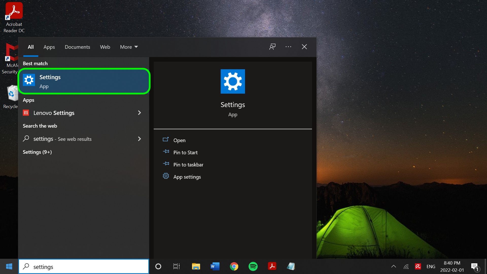
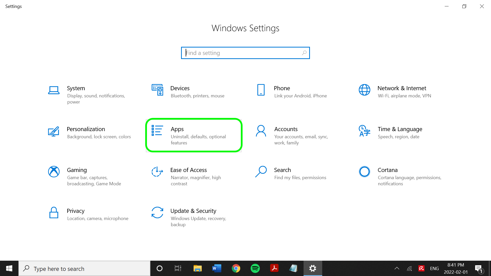
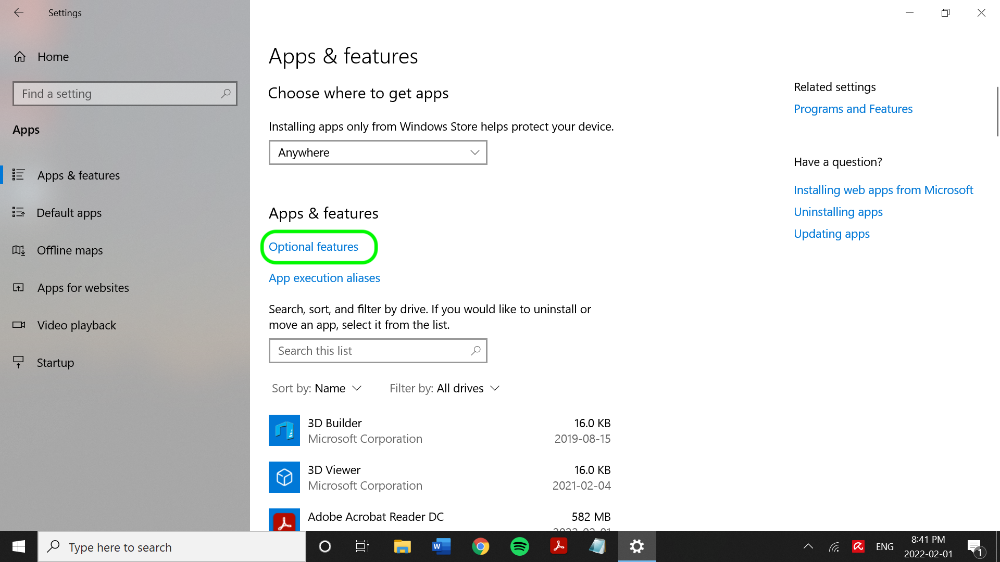
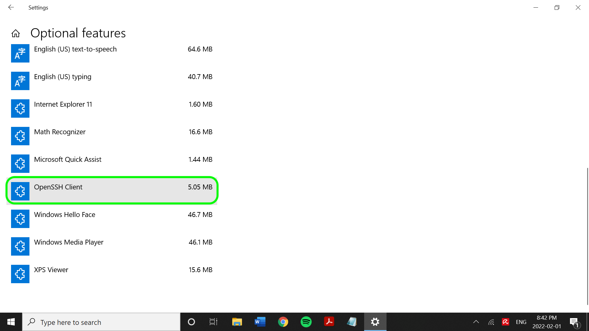

# SFTP connector

>[!IMPORTANT]
>
>The [!DNL SFTP] server that Adobe Experience Platform connects to must be able to support chunking, which means multiple connections to a single file. If your [!DNL SFTP] server does not support chunking, then you may receive an error preventing file ingestion.

Adobe Experience Platform provides native connectivity for cloud providers like AWS, [!DNL Google Cloud Platform], and [!DNL Azure], allowing you to bring your data from these systems.

Cloud storage sources can bring your own data into [!DNL Platform] without the need to download, format, or upload. Ingested data can be formatted as XDM JSON, XDM Parquet, or delimited. Every step of the process is integrated into the Sources workflow. [!DNL Platform] allows you to bring in data from an FTP or an SFTP server through batches.

## IP address allow list

A list of IP addresses must be added to an allow list prior to working with source connectors. Failing to add your region-specific IP addresses to your allow list may lead to errors or non-performance when using sources. See the [IP address allow list](../../ip-address-allow-list.md) page for more information.

## Naming constraints for files and directories

The following is a list of constraints you must account for when naming your cloud storage file or directory.

- Directory and file component names cannot exceed 255 characters.
- Directory and file names cannot end with a forward slash (`/`). If provided, it will be automatically removed.
- The following reserved URL characters must be properly escaped: `! ' ( ) ; @ & = + $ , % # [ ]`
- The following characters are not allowed: `" \ / : | < > * ?`.
- Illegal URL path characters not allowed. Code points like `\uE000`, while valid in NTFS filenames, are not valid Unicode characters. In addition, some ASCII or Unicode characters, like control characters (0x00 to 0x1F, \u0081, etc.), are also not allowed. For rules governing Unicode strings in HTTP/1.1 see [RFC 2616, Section 2.2: Basic Rules](https://www.ietf.org/rfc/rfc2616.txt) and [RFC 3987](https://www.ietf.org/rfc/rfc3987.txt).
- The following file names are not allowed: LPT1, LPT2, LPT3, LPT4, LPT5, LPT6, LPT7, LPT8, LPT9, COM1, COM2, COM3, COM4, COM5, COM6, COM7, COM8, COM9, PRN, AUX, NUL, CON, CLOCK$, dot character (.), and two dot characters (..).

## Set up a Base64-encoded OpenSSH private key for [!DNL SFTP]

The [!DNL SFTP] source supports authentication using [!DNL Base64]-encoded OpenSSH private key. See the steps below for information on how to generate your Base64-encoded OpenSSH private key and connect [!DNL SFTP] to Platform.

### [!DNL Windows] users

If you are using a [!DNL Windows] machine, open up the **Start** menu and then select **Settings**.



From the **Settings** menu that appears, select **Apps**.



Next, select **Optional features**.



A list of optional features appears. If **OpenSSH Client** is already pre-installed in your machine, then it will be included in the **Installed features** list under **Optional features**.



If not installed, select **Install** and then open **[!DNL Powershell]** and run the following command to generate your private key:

```shell
PS C:\Users\lucy> ssh-keygen -t rsa -m pem
Generating public/private rsa key pair.
Enter file in which to save the key (C:\Users\lucy/.ssh/id_rsa):
Enter passphrase (empty for no passphrase):
Enter same passphrase again:
Your identification has been saved in C:\Users\lucy/.ssh/id_rsa.
Your public key has been saved in C:\Users\lucy/.ssh/id_rsa.pub.
The key fingerprint is:
SHA256:osJ6Lg0TqK8nekNQyZGMoYwfyxNc+Wh0hYBtBylXuGk lucy@LAPTOP-FUJT1JEC
The key's randomart image is:
+---[RSA 3072]----+
|.=.*+B.o.        |
|=.O.O +          |
|+o+= B           |
|+o +E .          |
|.o=o  . S        |
|+... . .         |
| *o .            |
|o.B.             |
|=O..             |
+----[SHA256]-----+
```

Next, run the following command while providing the file path of the private key, to encode your private key in [!DNL Base64]:

```shell
C:\Users\lucy> [convert]::ToBase64String((Get-Content -path "C:\Users\lucy\.ssh\id_rsa" -Encoding byte)) > C:\Users\lucy\.ssh\id_rsa_base64
```

The above command saves the [!DNL Base64]-encoded private key in the file path you designated. You can then use that private key to authenticate to [!DNL SFTP] and connect to Platform.

### [!DNL Mac] users

If you are using a [!DNL Mac], open **Terminal** and run the following command to generate the private key (in this case, the private key will be saved in `/Documents/id_rsa`):

```shell
ssh-keygen -t rsa -m pem -f ~/Documents/id_rsa
Generating public/private rsa key pair.
Enter passphrase (empty for no passphrase):
Enter same passphrase again:
Your identification has been saved in /Users/vrana/Documents/id_rsa.
Your public key has been saved in /Users/vrana/Documents/id_rsa.pub.
The key fingerprint is:
SHA256:s49PCaO4a0Ee8I7OOeSyhQAGc+pSUQnRii9+5S7pp1M vrana@vrana-macOS
The key's randomart image is:
+---[RSA 2048]----+
|o ==..           |
|.+..o            |
|oo.+             |
|=.. +            |
|oo = .  S        |
|+.+ +E . = .     |
|o*..*.. . o      |
|.o*=.+   +       |
|.oo=Oo  ..o      |
+----[SHA256]-----+
```

Next, run the following command to encode the private key in [!DNL Base64]:

```shell
base64 ~/Documents/id_rsa > ~/Documents/id_rsa_base64
 
 
# Print Content of base64 encoded file
cat ~/Documents/id_rsa_base64
LS0tLS1CRUdJTiBPUEVOU1NIIFBSSVZBVEUgS0VZLS0tLS0KYjNCbGJuTnphQzFyWlhrdGRqRUFBQUFBQkc1dmJtVUFBQUFFYm05dVpRQUFBQUFBQUFBQkFBQUJGd0FBQUFkemMyZ3RjbgpOaEFBQUFBd0VBQVFBQUFRRUF0cWFYczlXOUF1ZmtWazUwSXpwNXNLTDlOMU9VYklaYXVxbVM0Q0ZaenI1NjNxUGFuN244CmFxZWdvQTlCZnVnWDJsTVpGSFl5elEzbnp6NXdXMkdZa1hkdjFjakd0elVyNyt1NnBUeWRneGxrOGRXZWZsSzBpUlpYWW4KVFRwS0E5c2xXaHhjTXg3R2x5ejdGeDhWSzI3MmdNSzNqY1d1Q0VIU3lLSFR5SFFwekw0MEVKbGZJY1RGR1h1dW1LQjI5SwpEakhwT1grSDdGcG5Gd1pabTA4Uzc2UHJveTVaMndFalcyd1lYcTlyUDFhL0E4ejFoM1ZLdllzcG53c2tCcHFQSkQ1V3haCjczZ3M2OG9sVllIdnhWajNjS3ZsRlFqQlVFNWRNUnB2M0I5QWZ0SWlrYmNJeUNDaXV3UnJmbHk5eVNPQ2VlSEc0Z2tUcGwKL3V4YXNOT0h1d0FBQThqNnF6R1YrcXN4bFFBQUFBZHpjMmd0Y25OaEFBQUJBUUMycHBlejFiMEM1K1JXVG5Rak9ubXdvdgowM1U1UnNobHE2cVpMZ0lWbk92bnJlbzlxZnVmeHFwNkNnRDBGKzZCZmFVeGtVZGpMTkRlZlBQbkJiWVppUmQyL1Z5TWEzCk5TdnY2N3FsUEoyREdXVHgxWjUrVXJTSkZsZGlkTk9rb0QyeVZhSEZ3ekhzYVhMUHNYSHhVcmJ2YUF3cmVOeGE0SVFkTEkKb2RQSWRDbk12alFRbVY4aHhNVVplNjZZb0hiMG9PTWVrNWY0ZnNXbWNYQmxtYlR4THZvK3VqTGxuYkFTTmJiQmhlcjJzLwpWcjhEelBXSGRVcTlpeW1mQ3lRR21vOGtQbGJGbnZlQ3pyeWlWVmdlL0ZXUGR3cStVVkNNRlFUbDB4R20vY0gwQiswaUtSCnR3aklJS0s3Qkd0K1hMM0pJNEo1NGNiaUNST21YKzdGcXcwNGU3QUFBQUF3RUFBUUFBQVFBcGs0WllzMENSRnNRTk9WS0sKYWxjazlCVDdzUlRLRjFNenhrSGVydmpJYk9kL0lvRXpkcHlVa28rbm41RmpGK1hHRnNCUXZnOFdTaUlJTk1oU3BNYWI1agpvWXlka2gvd0ovWElOaDlZaE5QVXlURi9NNkFnMkNYd21KS2RxN1VKWjZyNjloV3V0VVN6U05QbkVYWTZLc29GeVUwTEFvCko0OHJMT1pMZldtMHFhWDBLNUgzNmJPaHFXSWJwMDNoZk94eno5M0MrSDM5MFJkRkp4bzJVZ0FVY3UvdHREb0REVldBdmEKVkVyMWEzak9LenVHbThrK21WeXpPZERjVFY4ckZIT0pwRnRBU3l6Q24yVld1MjV0TWtrcGRPRjNKcVdMZHdOY3loeG1URApXZGVDNWh4V0Fiano0WDZ5WXpHcFcwTmptVkFoWUVVZGNBSVlXWWM3OGEvQkFBQUFnRm8wakl4aGhwZkJ6QjF6b09FMDJBClpjTC9hcUNuYysrdmJ1a2V0aFg5Zzhlb0xQMTQyeUgzdlpLczl3c1RtbVVsZ0prZURaN2hUcklwOGY2eEwzdDRlMXByY1kKb2ZLd0gwckNGOTFyaldPbGZOUmxEempoR1NTTEVMczZoNlNzMEdBQXE2Z0ZQTVF2dTB4TDlQUTlGQ21YZVVKazJpRm1MWgpEWWJGc0NyVUxEQUFBQWdRRGF0a1pMamJaSTBFM0ZuY2dTOVF5Y3lVWmtkZ1dVNjBQcG9ud3BMQXdUdHRpOG1EQXE5cHYwClEvUlk1WE9UeGF3VXNHa0tYMjNtV1BYR0grdUlBSzhrelVVM2dGM1dRWGVkTWw4NHVCVFZCTEtUdStvVVAvZmIvMEE0dE0KSE9BSythbXZPMkZuYzFiSmVwd05USTE2cjZXWk9sZWV2ZklJQVpXcEgxVVpIdkVRQUFBSUVBMWNwcStDNUVXSFJwbnVPZQpiNHE4T0tKTlJhSUxIRUN6U0twWlFpZDFhRmJYWlVKUXpIQU85YzhINVZMcjBNUjFkcW1ORkNja2ZsZzI2Y3BEUEl3TjBYCm5HMFBxcmhKbXp0U3ZQZ3NGdkNPallncXF6U0RYUjkxd1JQTEN5cU8zcGMyM2kzZnp2WkhtMGhIdWdoNVJqV0loUlFZVkwKZUpDWHRqM08vY3p1SWdzQUFBQVJkbkpoYm1GQWRuSmhibUV0YldGalQxTUJBZz09Ci0tLS0tRU5EIE9QRU5TU0ggUFJJVkFURSBLRVktLS0tLQo=
```

Once your [!DNL Base64]-encoded private key is saved in the folder you designated, you must then add the contents of your public key file to a new line in the [!DNL SFTP] host authorized keys. Run the following command on the command line:

```shell
cat ~/id_rsa.pub >> ~/.ssh/authorized_keys
```

To confirm whether your public key was added properly, you can run following on the command line:

```shell
more ~/.ssh/authorized_keys
```

## Connect SFTP to [!DNL Platform]

>[!IMPORTANT]
>
>Users are required to disable Keyboard Interactive Authentication in the SFTP server configuration prior to connecting. Disabling the setting will allow passwords to be entered manually, as opposed to inputting through a service or a program. See the [Component Pro document](https://doc.componentpro.com/ComponentPro-Sftp/authenticating-with-a-keyboard-interactive-authentication) for more information on Keyboard Interactive Authentication.

The documentation below provides information on how to connect an an SFTP server to [!DNL Platform] using APIs or the user interface:

### Using the APIs

- [Create an SFTP base connection using the Flow Service API](../../tutorials/api/create/cloud-storage/sftp.md)
- [Explore the data structure and contents of a cloud storage source using the Flow Service API](../../tutorials/api/explore/cloud-storage.md)
- [Create a dataflow for a cloud storage source using the Flow Service API](../../tutorials/api/collect/cloud-storage.md)

### Using the UI

- [Create an SFTP source connection in the UI](../../tutorials/ui/create/cloud-storage/sftp.md)
- [Create a dataflow for a cloud storage connection in the UI](../../tutorials/ui/dataflow/batch/cloud-storage.md)
