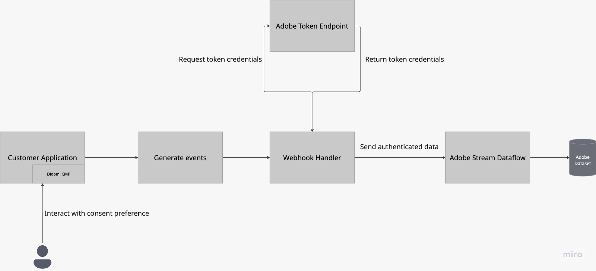
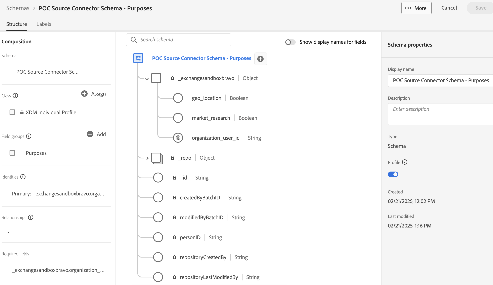
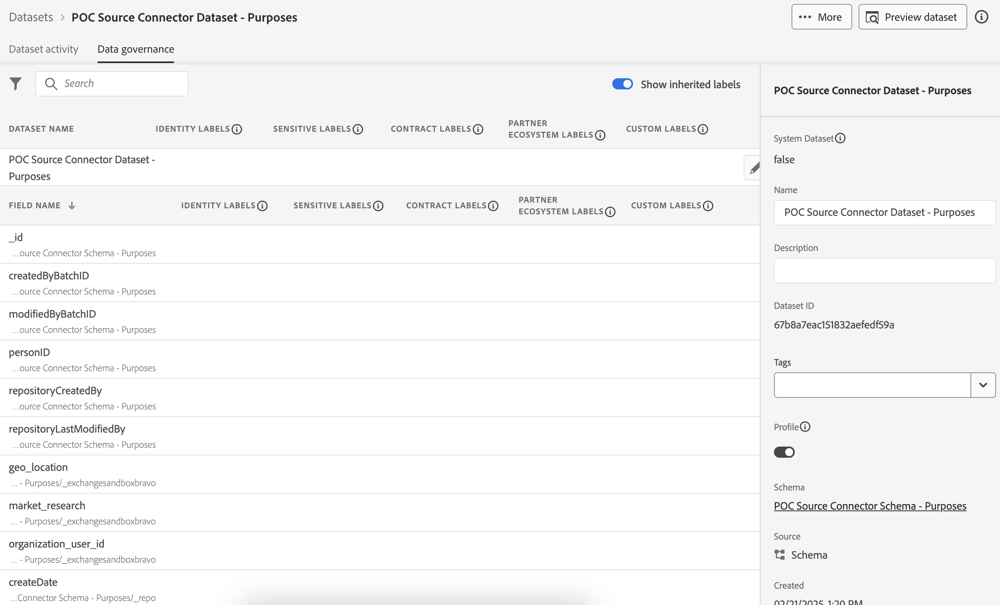
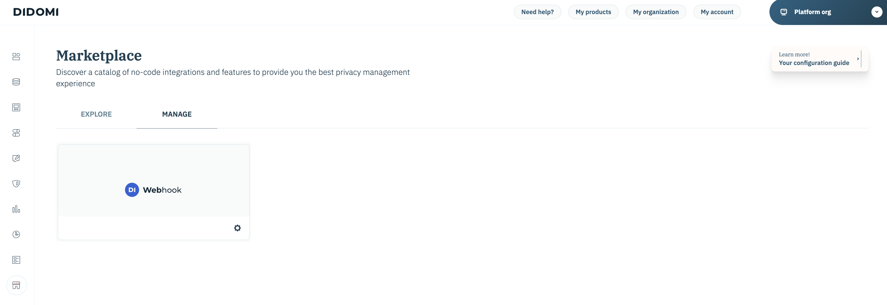

# [!DNL Didomi]

[!DNL Didomi] is a consent and preference management platform that helps organizations collect, manage, and enforce user choices regarding personal data across websites, apps, and internal tools.

Adobe Experience Platform supports ingesting data from a wide range of external systems including cloud storage, databases, and applications like [!DNL Didomi] through a system of source connectors. Use sources to authenticate external systems, manage data flow into Experience Platform, and ensure consistent and structured ingestion of your customer data.

Use the [!DNL Didomi] source to stream real-time user consent and preferences data from the [!DNL Didomi] consent and preference management platform into Experience Platform. Through the [!DNL Didomi] source, you can centralize and act on consent data in Experience Platform, thereby keeping your customer profiles and downstream workflows compliant and up to date.

## Prerequisites 

Complete the prerequisite steps outlined below to successfully connect your [!DNL Didomi] account to Experience Platform.

### IP address allowlist 

You must add region-specific IP addresses to your allowlist prior to connecting your sources to Experience Platform. For more information, read the guide on [allowlisting IP addresses to connect to Experience Platform](../../ip-address-allow-list.md) for more information.

### Configure permissions on Experience Platform

You must have both **[!UICONTROL View Sources]** and **[!UICONTROL Manage Sources]** permissions enabled for your account in order to connect your [!DNL Didomi] account to Experience Platform. Contact your product administrator to obtain the necessary permissions. For more information, read the [access control UI guide](../../../access-control/ui/overview.md).

### Gather Adobe API Credentials

To securely connect [!DNL Didomi] to Experience Platform, you must authenticate using your Adobe API credentials. These credentials are essential for setting up the webhook and configuring data ingestion.

Read the guide on [getting started with Experience Platform APIs](../../../landing/api-authentication.md) for information on how to successfully make calls to Experience Platform APIs.

### Create an Experience Platform schema

>[!TIP]
>
>You may skip this step if you already have an existing XDM schema.

An **Experience Data Model (XDM) schema** defines the structure of the data you'll be sending from [!DNL Didomi] (e.g., user IDs, consent purposes) to Experience Platform.

To create a schema, select [!UICONTROL Schemas] in the left-navigation of the Experience Platform UI and select **[!UICONTROL Create schema]**. Next, select **[!UICONTROL Standard]** as your schema type and then select **[!UICONTROL Manual]** to manually create your fields. Select a base class for your schema and provide a name for your schema.

Once created, update the schema by adding any of your required fields. Ensure that at least one field is an [!UICONTROL Identity] field to inform Experience Platform about your primary identity values. Finally, ensure that you enable the [!UICONTROL Profile] toggle in order to successfully store your data.

For more information, read the guide on [creating schemas in the UI](../../../xdm/tutorials/create-schema-ui.md).

### Create a dataset

>[!TIP]
>
>You may skip this step if you already have an existing dataset.

A **dataset** in Experience Platform is used to store incoming data based on the schema that you define.

To create a dataset, select [!UICONTROL Datasets] in the left-navigation of the Experience Platform UI and then select **[!UICONTROL Create dataset]**. Next, select **[!UICONTROL Create dataset from schema]** and then select your schema to associate with your new dataset.

## Configure the HTTP Webhook on the [!DNL Didomi] console

[!DNL Webhooks] allow you to subscribe to events triggered on the [!DNL Didomi] platform when users interact with their consent preferences. When a relevant event occurs — for example, when a user gives or withdraws consent — [!DNL Didomi] sends a real-time HTTP POST request containing a JSON payload to your configured [!DNL webhook] endpoint.

To ensure compatibility with Experience Platform, your webhook must meet the following requirements.

| Field | Description | Example |
| --- | --- | --- | 
| Client secret | The secret key associated with your Adobe API credentials. | `d8f3b2e1-4c9a-4a7f-9b2e-8f1c3d2a1b6e` |
| API key | The public API key used to authenticate requests to Adobe services. |
| Grant type | The method by which an application obtains an access token from the authorization server. Set this value to `client_credentials`. | `client_credentials` |
| Scope | The authorization scopes define the specific permissions or access levels that an application is requesting from the API provider. | `openid,AdobeID,read_organizations,additional_info.projectedProductContext,session` |
| Authentication header | The additional headers required for the Adobe token request.  | `{"Content-type": "application/x-www-form-urlencoded"}` |
| Token URL | Your Adobe token endpoint. | `https://ims-na1.adobelogin.com/ims/token/v3` |
| Endpoint URL | The final Adobe connector URL (provided at the end of the setup). | `https://dcs.adobedc.net/collection/your-adobe-endpoint-id`  |

{style="table-layout:auto"}

Next, configure the following options for your [!DNL webhook].

| Field | Description | Value  |
| ---| --- | --- | 
| Request Headers | The custom headers for the [!DNL webhook]. Ensure that you include the `x-adobe-flow-id`. You can retrieve this value after your [dataflow is created](../../tutorials/ui/create/consent-and-preferences/didomi.md#retrieve-the-streaming-endpoint-url).  | `{"Content-Type": "application/json", "Cache-Control": "no-cache", "x-adobe-flow-id": "{DATAFLOW_ID}"}` |
| Flatten   | This property must be checked as it ensures that the [!DNL webhook] data is sent as a flat object. | Enabled  |
| Event Types  | Select the specific group of [!DNL Didomi] events (`event.*` or `user.*`) that should trigger the [!DNL webhook]. Use `event.*` to track consent or preference changes, and use `user.*` to track user profile updates. This selection is required to ensure that only compatible events are sent to Adobe. Adobe supports only one schema per dataflow, so selecting both event types can cause ingestion errors. | The list of supported event types are: <ul><li>`Event.created`</li><li>`Event.updated`</li><li>`Event.deleted`</li><li>`User.created`</li><li>`User.updated`</li><li>`User.deleted`</li></ul> |

### Download the sample payload file {#download-the-sample-payload-file}

Based on your selected event group, download the appropriate **sample payload file** directly from the [!DNL Didomi] Console. This file represents the structure of the data and will be used during the schema and mapping steps in Adobe.

| **Event Group** | **Sample File to Download** | **Filtering Option**|
| --- | ---| --- |
| `event.*`| Download a sample for `event.created` | Filter only for `event.*` events |
| `user.*` | Download a sample for `user.created`  | Filter only for `user.*` events  |

## Connect your [!DNL Didomi] account to Experience Platform

Read the guide on [connecting [!DNL Didomi] to Experience Platform](../../tutorials/ui/create/consent-and-preferences/didomi.md) to learn how to create a source connection and ingest consent and preferences data from [!DNL Didomi] into Experience Platform.
