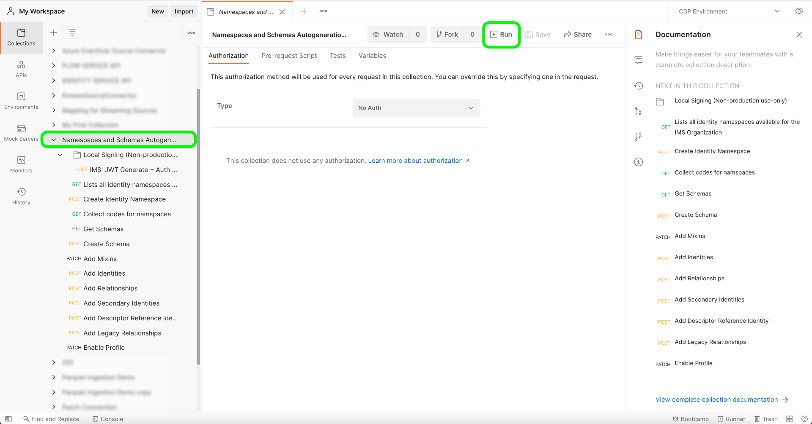

# [!DNL Salesforce]

Adobe Experience Platform allows data to be ingested from external sources while providing you with the ability to structure, label, and enhance incoming data using Platform services. You can ingest data from a variety of sources such as Adobe applications, cloud-based storage, databases, and many others.

Experience Platform provides support for ingesting data from a third-party CRM system. Support for CRM providers include [!DNL Salesforce].

## IP address allow list

A list of IP addresses must be added to an allow list prior to working with source connectors. Failing to add your region-specific IP addresses to your allow list may lead to errors or non-performance when using sources. See the [IP address allow list](../../ip-address-allow-list.md) page for more information.

## Field mapping from [!DNL Salesforce] to XDM

To establish a source connection between [!DNL Salesforce] and Platform, the [!DNL Salesforce] source data fields must be mapped to their appropriate target XDM fields prior to being ingested into Platform.

See the following for detailed information on the field mapping rules between [!DNL Salesforce] datasets and Platform:

- [Contacts](../adobe-applications/mapping/salesforce.md#contact)
- [Leads](../adobe-applications/mapping/salesforce.md#lead)
- [Accounts](../adobe-applications/mapping/salesforce.md#account)
- [Opportunities](../adobe-applications/mapping/salesforce.md#opportunity)
- [Opportunity contact roles](../adobe-applications/mapping/salesforce.md#opportunity-contact-role)
- [Campaigns](../adobe-applications/mapping/salesforce.md#campaign)
- [Campaign members](../adobe-applications/mapping/salesforce.md#campaign-member)
- [Account contact relation](../adobe-applications/mapping/salesforce.md#account-contact-relation)

## Set up the [!DNL Salesforce] namespace and schema auto-generation utility

To use the [!DNL Salesforce] source as part of [!DNL B2B-CDP], you must first set up a [!DNL Postman] utility to auto-generate your [!DNL Salesforce] namespaces and schemas. The following documentation provides additional information on setting up the [!DNL Postman] utility:

- You can download the namespace and schema auto-generation utility collection and environment from this [GitHub repository](https://github.com/adobe/experience-platform-postman-samples/tree/master/Postman%20Collections/CDP%20Namespaces%20and%20Schemas%20Utility).
- For information on using Platform APIs including details on how to gather values for required headers and read sample API calls, see the guide on [getting started with Platform APIs](../../../landing/api-guide.md).
- For information on how to generate your credentials for Platform APIs, see the tutorial on [authenticating and accessing Experience Platform APIs](../../../landing/api-authentication.md).
- For information on how to set up [!DNL Postman] for Platform APIs, see the tutorial on [setting up developer console and [!DNL Postman]](../../../landing/postman.md).

With a Platform developer console and [!DNL Postman] set up, you can now start applying the appropriate environment values to your [!DNL Postman] environment.

The following table contains example values as well as additional information on populating your [!DNL Postman] environment:

| Variable | Description | Example |
| --- | --- | --- |
| `CLIENT_SECRET` | A unique identifier used to generate your `{ACCESS_TOKEN}`. See the tutorial on [authenticating and accessing Experience Platform APIs](../../../landing/api-authentication.md) for information on how to retrieve your `{CLIENT_SECRET}`. | `{CLIENT_SECRET}` |
| `JWT_TOKEN` | The JSON Web Token (JWT) is an authentication credential used to generate your {ACCESS_TOKEN}. See the tutorial on [authenticating and accessing Experience Platform APIs](../../../landing/api-authentication.md) for information on how to generate your `{JWT_TOKEN}`. | `{JWT_TOKEN}` |
| `API_KEY` | A unique identifier used to authenticate calls to Experience Platform APIs. See the tutorial on [authenticating and accessing Experience Platform APIs](../../../landing/api-authentication.md) for information on how to retrieve your `{API_KEY}`. | `c8d9a2f5c1e03789bd22e8efdd1bdc1b` |
| `ACCESS_TOKEN` | The authorization token required to complete calls to Experience Platform APIs. See the tutorial on [authenticating and accessing Experience Platform APIs](../../../landing/api-authentication.md) for information on how to retrieve your `{ACCESS_TOKEN}`. | `Bearer {ACCESS_TOKEN}` |
| `META_SCOPE` | With regards to [!DNL Marketo], this value is fixed and is alway set to: `ent_dataservices_sdk`. | `ent_dataservices_sdk` |
| `CONTAINER_ID` | The `global` container holds all standard Adobe and Experience Platform partner provided classes, schema field groups, data types, and schemas. With regards to [!DNL Marketo], this value is fixed and is always set to `global`. | `global` |
| `PRIVATE_KEY` | A credential used to authenticate your [!DNL Postman] instance to Experience Platform APIs. See the tutorial on setting up developer console and [setting up developer console and [!DNL Postman]](../../../landing/postman.md) for instructions on how to retrieve your {PRIVATE_KEY}. | `{PRIVATE_KEY}` |
| `TECHNICAL_ACCOUNT_ID` | A credential used to integrate to Adobe I/O. | `D42AEVJZTTJC6LZADUBVPA15@techacct.adobe.com` |
| `IMS` | The Identity Management System (IMS) provides the framework for authentication to Adobe services. With regards to [!DNL Marketo], this value is fixed and is always set to: `ims-na1.adobelogin.com`. | `ims-na1.adobelogin.com` |
| `IMS_ORG` | A corporate entity that can own or license products and services and allow access to its members. See the tutorial on [setting up developer console and [!DNL Postman]](../../../landing/postman.md) for instructions on how to retrieve your `{ORG_ID}` information. | `ABCEH0D9KX6A7WA7ATQE0TE@adobeOrg` |
| `SANDBOX_NAME` | The name of the virtual sandbox partition that you are using. | `prod` |
| `TENANT_ID` | An ID used to ensure that the resources you create are namespaced properly and are contained within your organization. | `b2bcdpproductiontest` |
| `PLATFORM_URL` | The URL endpoint that you are making API calls to. This value is fixed and is always set to: `http://platform.adobe.io/`. | `http://platform.adobe.io/` |
| `munchkinId` | The unique ID for your [!DNL Marketo] account. See the tutorial on [authenticating your [!DNL Marketo] instance](../adobe-applications/marketo/marketo-auth.md) for information on how to retrieve your `munchkinId`. | `123-ABC-456` |
| `sfdc_org_id` | The organization ID for your [!DNL Salesforce] account. See the following [[!DNL Salesforce] guide](https://help.salesforce.com/articleView?id=000325251&type=1&mode=1) for more information on acquiring your [!DNL Salesforce] organization ID. | `00D4W000000FgYJUA0` |
| `has_abm` | A boolean value that indicates if you are subscribed to [!DNL Marketo Account-Based Marketing]. | `false` |
| `has_msi` | A boolean value that indicates if you are subcscribed to [!DNL Marketo Sales Insight]. | `false` |

{style="table-layout:auto"}

### Running the scripts

With your [!DNL Postman] collection and environment set up, you can now run the script through the [!DNL Postman] interface.

In the [!DNL Postman] interface, select the root folder of the auto-generator utility and then select **[!DNL Run]** from the top header.

The [!DNL Runner] interface appears. From here, ensure that all the checkboxes are selected and then select **[!DNL Run Namespaces and Schemas Autogeneration Utility]**.

A successful request creates the B2B namespaces and schemas according to beta specifications.

## Connect [!DNL Salesforce] to Platform using APIs

The documentation below provides information on how to connect [!DNL Salesforce] to Platform using APIs or the user interface:

- [Create a Salesforce base connection using the Flow Service API](../../tutorials/api/create/crm/salesforce.md)
- [Explore data tables using the Flow Service API](../../tutorials/api/explore/tabular.md)
- [Create a dataflow for a CRM source using the Flow Service API](../../tutorials/api/collect/crm.md)

## Connect [!DNL Salesforce] to Platform using the UI

- [Create a Salesforce source connection in the UI](../../tutorials/ui/create/crm/salesforce.md)
- [Create a dataflow for a CRM connection in the UI](../../tutorials/ui/dataflow/crm.md)
